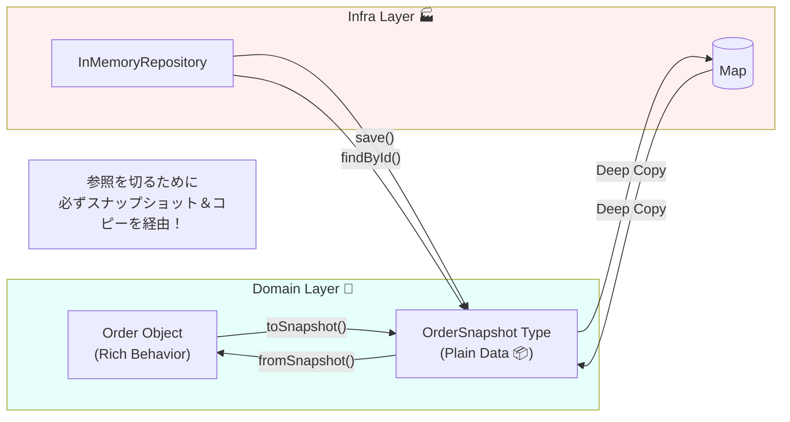

# 第72章：InMemory Repositoryで先に進む🧪📦

## 1) この章でできるようになること🎯✨

* DBがまだ無くても、**PlaceOrder / PayOrder / FulfillOrder / GetOrder** をちゃんと回せるようにする🎬☕💳
* 「Repositoryはinterfaceがドメイン、実装がインフラ」を**コードで体感**する📚🧠
* InMemory特有の事故（共有状態、参照漏れ、テストが不安定…）を**先に潰す**🧯😵‍💫

---

## 2) InMemory Repositoryってなに？なんで便利？🤔💡

**Map（メモリ上の辞書）に保存するRepository**です🗂️✨
ポイントはこれ👇

* ✅ **速い**（DB待ちゼロ）🚀
* ✅ **実装が軽い**（MapでOK）🪶
* ✅ **ユースケースの配線が先に完成する**（ここが超大事！）🎉
* ✅ 後でDB版Repositoryに差し替えても、アプリ層がほぼ変わらない🔁

つまり「DDDの形を守ったまま、先に前進できる道具」って感じです🛼🌈

---

## 3) DDD的に“置き場所”が超重要📦🧭

ここ、守れると一気にDDDっぽくなります🥳

* 🏠 **domain**：Repositoryの「約束（interface）」だけ置く
* 🏭 **infra**：その約束を満たす「実装」を置く（InMemory / DB / API…）

こうしておくと、保存先が変わってもドメインは平和です🕊️✨

---

## 4) 先に結論：InMemoryでやりがちな事故トップ3😂⚠️

### 事故①：テスト間でデータが残って壊れる🧨

* 原因：Repositoryを使い回してる（共有状態）
* 対策：**テストごとにnewする** or clearする🧼

### 事故②：Repositoryが返したOrderを外から弄れてしまう🧟‍♀️

* 原因：Mapに「Orderオブジェクトそのもの」を保存して、その参照を返してる
* 対策：**スナップショット（プリミティブ）で保存**して、取り出す時に復元する📸✨

### 事故③：後でDB版に差し替えるとasyncの差で死ぬ😇

* 原因：InMemoryだけ同期で作ってしまった
* 対策：**最初からPromiseに合わせる**（save/findはasync）⏳✅

---

## 5) 実装方針：スナップショット方式が最強📸🛡️

Mapの中には **Orderそのもの** じゃなくて、こういう「JSONにできる形」を入れます👇

* ✅ 参照漏れ（外部から勝手に変更）を防げる
* ✅ 将来DBに保存する形に近い


* ✅ テストが安定する

---

## 6) コード：domain側（interfaceとスナップショット）📚🧊

### OrderRepository（domain）

```ts
// src/domain/order/OrderRepository.ts
import { Order } from "./Order";
import { OrderId } from "./OrderId";

export interface OrderRepository {
  save(order: Order): Promise<void>;
  findById(id: OrderId): Promise<Order | null>;
}
```

### OrderSnapshot（domain寄りでOK）

「復元できる最低限の形」だけにします📦✨

```ts
// src/domain/order/OrderSnapshot.ts
export type OrderStatus = "Draft" | "Confirmed" | "Paid" | "Fulfilled" | "Canceled";

export type OrderLineSnapshot = {
  menuItemId: string;
  quantity: number;
  unitPriceYen: number;
};

export type OrderSnapshot = {
  id: string;
  status: OrderStatus;
  lines: OrderLineSnapshot[];
  createdAtIso: string;
};
```

### Order側：toSnapshot / fromSnapshot（復元の入口）🚪✨

Factoryは第74章で本格的にやるけど、ここでは「復元の静的メソッド」で十分です🙆‍♀️💖

```ts
// src/domain/order/Order.ts
import { OrderId } from "./OrderId";
import { OrderSnapshot, OrderStatus } from "./OrderSnapshot";

export class Order {
  private constructor(
    private readonly _id: OrderId,
    private _status: OrderStatus,
    private _lines: ReadonlyArray<{ menuItemId: string; quantity: number; unitPriceYen: number }>,
    private readonly _createdAtIso: string,
  ) {}

  get id(): OrderId {
    return this._id;
  }

  get status(): OrderStatus {
    return this._status;
  }

  // 例：とりあえずスナップショットに落とす
  toSnapshot(): OrderSnapshot {
    return {
      id: this._id.value,
      status: this._status,
      lines: this._lines.map((x) => ({ ...x })),
      createdAtIso: this._createdAtIso,
    };
  }

  static fromSnapshot(s: OrderSnapshot): Order {
    return new Order(
      OrderId.fromString(s.id),
      s.status,
      s.lines.map((x) => ({ ...x })),
      s.createdAtIso,
    );
  }

  // 例：最小の生成（本格的な生成ルールは別章で強化）
  static createNew(id: OrderId, nowIso: string): Order {
    return new Order(id, "Draft", [], nowIso);
  }
}
```

（補足）TypeScriptは最近、Node向けの挙動を安定させるためのオプションを拡充していて、モジュール解決の「安定点」を選びやすくなってます。([typescriptlang.org][1])

---

## 7) コード：infra側（InMemory実装）🏭🗺️

Mapの中には **OrderSnapshot** を保存します📸✨

```ts
// src/infra/order/InMemoryOrderRepository.ts
import { OrderRepository } from "../../domain/order/OrderRepository";
import { Order } from "../../domain/order/Order";
import { OrderId } from "../../domain/order/OrderId";
import { OrderSnapshot } from "../../domain/order/OrderSnapshot";

export class InMemoryOrderRepository implements OrderRepository {
  private readonly store = new Map<string, OrderSnapshot>();

  async save(order: Order): Promise<void> {
    const snapshot = order.toSnapshot();
    // 安全のために「コピーして保存」しておく（参照事故をさらに減らす）
    this.store.set(snapshot.id, {
      ...snapshot,
      lines: snapshot.lines.map((x) => ({ ...x })),
    });
  }

  async findById(id: OrderId): Promise<Order | null> {
    const snapshot = this.store.get(id.value);
    if (!snapshot) return null;

    // 取り出しもコピーして復元（外部からstoreを汚さない）
    const cloned: OrderSnapshot = {
      ...snapshot,
      lines: snapshot.lines.map((x) => ({ ...x })),
    };
    return Order.fromSnapshot(cloned);
  }

  // テスト用（domainのinterfaceには入れない）
  clearForTest(): void {
    this.store.clear();
  }
}
```

---

## 8) ユースケースに差すとこうなる🎬🔌

「保存先がInMemoryかどうか」をユースケースが知らないのが理想です💖

```ts
// src/app/order/GetOrderService.ts
import { OrderRepository } from "../../domain/order/OrderRepository";
import { OrderId } from "../../domain/order/OrderId";

export type GetOrderResult = {
  id: string;
  status: string;
  lineCount: number;
};

export class GetOrderService {
  constructor(private readonly orderRepo: OrderRepository) {}

  async execute(orderId: string): Promise<GetOrderResult | null> {
    const order = await this.orderRepo.findById(OrderId.fromString(orderId));
    if (!order) return null;

    const snap = order.toSnapshot();
    return {
      id: snap.id,
      status: snap.status,
      lineCount: snap.lines.length,
    };
  }
}
```

---

## 9) テスト：Vitestで“速い安心”を作る🧪💨

Vitestは4系が出ていて（2025年後半に4.0告知）、直近だと4.1のベータも動いてます。([vitest.dev][2])
（テストが速いと、DDD学習がほんと捗ります🏃‍♀️✨）

```ts
// src/infra/order/InMemoryOrderRepository.test.ts
import { describe, it, expect, beforeEach } from "vitest";
import { InMemoryOrderRepository } from "./InMemoryOrderRepository";
import { Order } from "../../domain/order/Order";
import { OrderId } from "../../domain/order/OrderId";

describe("InMemoryOrderRepository", () => {
  let repo: InMemoryOrderRepository;

  beforeEach(() => {
    repo = new InMemoryOrderRepository(); // ✅ テストごとにnew（共有状態を潰す）
  });

  it("saveしたOrderをfindByIdで取れる😊", async () => {
    const id = OrderId.newId();
    const order = Order.createNew(id, new Date().toISOString());

    await repo.save(order);
    const loaded = await repo.findById(id);

    expect(loaded).not.toBeNull();
    expect(loaded!.id.value).toBe(id.value);
    expect(loaded!.status).toBe("Draft");
  });

  it("取り出したOrderを外で変更しても、内部ストアが汚れない🛡️", async () => {
    const id = OrderId.newId();
    const order = Order.createNew(id, new Date().toISOString());

    await repo.save(order);

    const loaded1 = await repo.findById(id);
    const loaded2 = await repo.findById(id);

    // 参照が同じオブジェクトになってないこと（最低限の安全）
    expect(loaded1).not.toBe(loaded2);
    expect(loaded1!.toSnapshot()).toEqual(loaded2!.toSnapshot());
  });
});
```

---

## 10) Node/TSの“いま”をちょい押さえ（地味に効く）🧠🪄

* Nodeは「Current」と「Active LTS」が並行で進むので、安定運用寄りならLTSが選ばれがちです📌([nodejs.org][3])
* 最近のNodeリリース状況（Current/LTSの更新）も公式にまとまってます📣([nodejs.org][4])
* TypeScript側もNode向けオプションが整理されてきて、挙動の“固定点”が作りやすくなってます🧷([typescriptlang.org][1])

このへんを軽く意識しておくと、後で「モジュール解決が環境で違う…😭」みたいな事故が減ります✨

---

## 11) ありがちなNG例（やらないで〜！）🙅‍♀️💦

### NG：OrderオブジェクトをそのままMapに入れる

```ts
// これ、外から勝手に書き換えられて事故ります😭
this.store.set(order.id.value, order);
return this.store.get(id.value) ?? null;
```

✅ さっきの「スナップショット保存→復元」が安全でしたね📸🛡️

---

## 12) AIの使いどころ（この章は相性よすぎ）🤖💞

コピペで使えるプロンプト置いとくね🧁✨

* 🧠 **設計レビュー用**

  * 「InMemory Repositoryの実装で、参照漏れ・共有状態・テスト不安定化の可能性をチェックして。危険箇所と改善案を出して。」

* 🧰 **コード骨格生成（中身は自分で確認）**

  * 「OrderRepository（save/findById）と、OrderSnapshot保存方式のInMemory実装の雛形をTypeScriptで。storeはMap、戻りはOrder.fromSnapshotで。」

* 🧪 **テスト観点追加**

  * 「InMemory Repositoryのテスト観点を“失敗しやすい順”に10個。特に参照漏れとテスト間の状態混入を厚めに。」

---

## 13) ミニ演習（5〜15分）🎮🍬

### 演習A：GetOrderの表示項目を増やす📄✨

* lineCountだけじゃなく、statusや合計金額（あれば）もDTOに入れてみよう💪

### 演習B：clearForTestを使わずに安定させる🧼

* beforeEachでrepoをnewする方式に統一して、「共有状態ゼロ」にしよう🙌

### 演習C：存在しないIDの挙動を固める👻

* findByIdがnullを返すのはOK？例外にする？
  → チーム方針っぽく文章で決めてみよう✍️✨

---

## 14) まとめ🎀✨

* InMemory Repositoryは「**DBが無い時期の最強ブースター**」🚀
* ただし事故りやすいので、**スナップショット保存方式**が超おすすめ📸🛡️
* interface（domain）と実装（infra）を分けると、差し替えが気持ちいい🔁🎉

次は第73章で「Repositoryの粒度＝集約単位」をさらにカチッと決めて、太りすぎを防ぎます📦✨

[1]: https://www.typescriptlang.org/docs/handbook/release-notes/typescript-5-8.html?utm_source=chatgpt.com "Documentation - TypeScript 5.8"
[2]: https://vitest.dev/blog/vitest-4?utm_source=chatgpt.com "Vitest 4.0 is out!"
[3]: https://nodejs.org/en/about/previous-releases?utm_source=chatgpt.com "Node.js Releases"
[4]: https://nodejs.org/en/blog/release?utm_source=chatgpt.com "nodejs releases blog"
