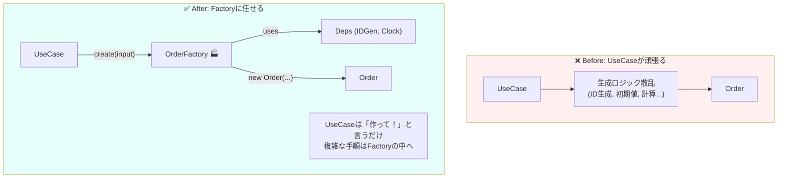

# 第74章：Factory入門：生成が複雑なら任せる🏭

まず、2026年2月時点の軽い近況メモだけ📌
npmの `typescript` パッケージ上での最新は **5.9.3** です（この時点の安定版の目安として見てOK）([NPM][1])
それとは別に、**TypeScript 6.0（ブリッジ）→ TypeScript 7.0（ネイティブ系の新ツールチェーン）**へ進む流れが公式ブログで語られています([Microsoft for Developers][2])
なので「今ふつうに書くTS」は引き続き安定しつつ、裏では速度やツールチェーンが大きく進化中…って感じです🚀

---

## この章でやること🎯🏭


Factoryを一言でいうと、

> 「**ドメインの“生成（はじまり）”を担当する専門家**」🏭✨

です。

注文（Order）みたいな大きめのドメインオブジェクトは、作る瞬間にやることが増えがち👇

* IDを作る🆔
* 初期状態を決める🚦（Draft？Confirmed？）
* 明細（Line）をVOで作る🧾
* 合計金額を整合させる💴
* 作成時刻を入れる⏰
* 「空注文は禁止」などのルールを守る🔒

これを **アプリ層（UseCase）にベタ書き**すると、すぐに太って事故ります😵‍💫

---

## 生成がつらくなる “あるある” 😇⚠️

次のどれかが出てきたら、Factoryの出番です🏭✨

* `new Order(...)` に渡す引数が多い（5個超えたら黄色信号🚥）
* UseCaseで「ID生成」「初期値セット」「合計計算」などが散ってる
* 生成パターンが増えてきた（通常注文 / 事前注文 / 無料注文…）
* テストで「注文を作るだけで疲れる」🧪💦
* 生成手順がコピペされ始めた📋

---

## 悪い例：UseCaseが“生成の手順書”になってる😵‍💫🧾


「PlaceOrder」の中で、生成に必要なことを全部やってるパターン👇
（※雰囲気の例。こうなりがちって話！）

```ts
// app/placeOrder.ts（イメージ）
const id = crypto.randomUUID();
const status = "Confirmed";
const lines = input.items.map(i => ({
  menuItemId: i.menuItemId,
  quantity: i.quantity,
  unitPrice: i.unitPrice,
  subtotal: i.quantity * i.unitPrice,
}));
const total = lines.reduce((sum, x) => sum + x.subtotal, 0);

const order = new Order({
  id,
  status,
  lines,
  total,
  createdAt: new Date(),
});

await orderRepo.save(order);
```

問題点はこれ👇😵‍💫

* **ルールが散らばる**（空注文禁止とか、合計計算の正しさとか）
* **型が弱い**（menuItemId/quantity/price が全部ただの number/string）
* 生成の“正しい形”が **どこにも固定されない**🔧

---

## 正しい方向：Factoryに「生成の責務」を集める🏭✨


Factoryがやることはシンプル👇

✅ **生成の複雑さを1か所に集める**
✅ **初期状態・初期値・生成ルールを守る**
✅ UseCaseは「やりたいことの流れ」だけを書く🎬



---

## 実装例：OrderFactoryを作る🏭☕🧾

### 1) ドメイン側：最低限の土台（例）🧱✨

#### ドメイン例外（ルール違反はここで止める）🧯

```ts
// domain/shared/domainError.ts
export class DomainError extends Error {
  constructor(message: string) {
    super(message);
    this.name = "DomainError";
  }
}
```

#### OrderStatus（typo防止に `satisfies` も使えるよ🧠）

`... satisfies ...` は「型を変えずに、型制約だけチェックできる」演算子です([typescriptlang.org][3])

```ts
// domain/order/orderStatus.ts
export type OrderStatus = "Draft" | "Confirmed" | "Paid" | "Fulfilled" | "Cancelled";

export const OrderStatuses = {
  Draft: "Draft",
  Confirmed: "Confirmed",
  Paid: "Paid",
  Fulfilled: "Fulfilled",
  Cancelled: "Cancelled",
} as const satisfies Record<string, OrderStatus>;
```

#### Value Objectたち（最小だけ）💎

```ts
// domain/order/orderId.ts
import { DomainError } from "../shared/domainError";

export class OrderId {
  private constructor(public readonly value: string) {}

  static fromString(value: string): OrderId {
    if (value.trim().length === 0) throw new DomainError("OrderId is empty");
    return new OrderId(value);
  }
}
```

```ts
// domain/order/quantity.ts
import { DomainError } from "../shared/domainError";

export class Quantity {
  private constructor(public readonly value: number) {}

  static of(value: number): Quantity {
    if (!Number.isInteger(value)) throw new DomainError("Quantity must be integer");
    if (value <= 0) throw new DomainError("Quantity must be >= 1");
    return new Quantity(value);
  }
}
```

```ts
// domain/order/money.ts
import { DomainError } from "../shared/domainError";

export class Money {
  private constructor(public readonly yen: number) {}

  static yenOf(value: number): Money {
    if (!Number.isInteger(value)) throw new DomainError("Money must be integer yen");
    if (value < 0) throw new DomainError("Money must be >= 0");
    return new Money(value);
  }

  add(other: Money): Money {
    return new Money(this.yen + other.yen);
  }

  multiply(n: number): Money {
    return new Money(this.yen * n);
  }
}
```

#### 注文明細（OrderLine）🧾

```ts
// domain/order/orderLine.ts
import { Money } from "./money";
import { Quantity } from "./quantity";
import { DomainError } from "../shared/domainError";

export class OrderLine {
  private constructor(
    public readonly menuItemId: string,
    public readonly quantity: Quantity,
    public readonly unitPrice: Money,
  ) {}

  static create(params: { menuItemId: string; quantity: Quantity; unitPrice: Money }): OrderLine {
    if (params.menuItemId.trim().length === 0) throw new DomainError("menuItemId is empty");
    return new OrderLine(params.menuItemId, params.quantity, params.unitPrice);
  }

  subtotal(): Money {
    return this.unitPrice.multiply(this.quantity.value);
  }
}
```

#### Order集約（生成は “正しい初期状態” を守る）🏯🛡️

```ts
// domain/order/order.ts
import { DomainError } from "../shared/domainError";
import { Money } from "./money";
import { OrderId } from "./orderId";
import { OrderLine } from "./orderLine";
import { OrderStatus, OrderStatuses } from "./orderStatus";

type OrderProps = {
  id: OrderId;
  status: OrderStatus;
  lines: readonly OrderLine[];
  total: Money;
  createdAt: Date;
};

export class Order {
  private constructor(private readonly props: OrderProps) {}

  // ✅ Factoryから呼ぶ「新規注文の生成口」
  static createConfirmed(params: { id: OrderId; lines: readonly OrderLine[]; now: Date }): Order {
    if (params.lines.length === 0) throw new DomainError("Order must have at least 1 line");

    const total = params.lines
      .map(l => l.subtotal())
      .reduce((acc, x) => acc.add(x), Money.yenOf(0));

    return new Order({
      id: params.id,
      status: OrderStatuses.Confirmed,
      lines: [...params.lines], // 外から渡された配列をそのまま持たない✨
      total,
      createdAt: params.now,
    });
  }

  // 参照だけ（外に安全に出す）
  get id(): OrderId { return this.props.id; }
  get status(): OrderStatus { return this.props.status; }
  get total(): Money { return this.props.total; }
  get createdAt(): Date { return this.props.createdAt; }
  get lines(): readonly OrderLine[] { return this.props.lines; }
}
```

---

### 2) Factory本体：生成手順をここに集める🏭✨

ここがこの章の主役だよ〜！🎉

```ts
// domain/order/orderFactory.ts
import { Order } from "./order";
import { OrderId } from "./orderId";
import { OrderLine } from "./orderLine";
import { Money } from "./money";
import { Quantity } from "./quantity";

export interface OrderIdGenerator {
  next(): OrderId;
}

export interface Clock {
  now(): Date;
}

// UseCaseから渡されやすい形（プリミティブ）で受けて、ドメインに変換する🏭
export type PlaceOrderInput = {
  items: Array<{
    menuItemId: string;
    quantity: number;
    unitPriceYen: number;
  }>;
};

export class OrderFactory {
  constructor(
    private readonly idGen: OrderIdGenerator,
    private readonly clock: Clock,
  ) {}

  createConfirmedOrder(input: PlaceOrderInput): Order {
    const id = this.idGen.next();
    const now = this.clock.now();

    const lines = input.items.map(i =>
      OrderLine.create({
        menuItemId: i.menuItemId,
        quantity: Quantity.of(i.quantity),
        unitPrice: Money.yenOf(i.unitPriceYen),
      })
    );

    return Order.createConfirmed({ id, lines, now });
  }
}
```

✅ これで「生成の正しい手順」が **OrderFactoryに固定**されました🏭✨
UseCaseは **“やることの流れ”** だけに戻せます🎬

---

### 3) infra側：ID生成（例：UUID）🆔✨

Node.jsの `crypto.randomUUID()` は RFC 4122 v4 のUUIDを生成します([nodejs.org][4])

```ts
// infra/order/cryptoOrderIdGenerator.ts
import { randomUUID } from "node:crypto";
import { OrderId } from "../../domain/order/orderId";
import { OrderIdGenerator } from "../../domain/order/orderFactory";

export class CryptoOrderIdGenerator implements OrderIdGenerator {
  next(): OrderId {
    return OrderId.fromString(randomUUID());
  }
}
```

---

### 4) UseCase：スッキリ版🎬✨

```ts
// app/placeOrder.ts
import { OrderFactory, PlaceOrderInput } from "../domain/order/orderFactory";

export class PlaceOrder {
  constructor(
    private readonly orderFactory: OrderFactory,
    private readonly orderRepo: { save(order: unknown): Promise<void> },
  ) {}

  async execute(input: PlaceOrderInput): Promise<void> {
    const order = this.orderFactory.createConfirmedOrder(input);
    await this.orderRepo.save(order);
  }
}
```

UseCaseが「手順書」じゃなくて「物語」になった〜！🎉📖✨

---

## テスト：Factoryはめっちゃテストしやすい🧪💖


「ID」と「現在時刻」を差し替えできるから、テストが安定します✨

```ts
// test/orderFactory.test.ts
import { describe, it, expect } from "vitest";
import { OrderFactory } from "../src/domain/order/orderFactory";
import { OrderId } from "../src/domain/order/orderId";

describe("OrderFactory", () => {
  it("注文をConfirmedで生成し、合計を正しく計算する💴", () => {
    const factory = new OrderFactory(
      { next: () => OrderId.fromString("order-001") },
      { now: () => new Date("2026-02-07T10:00:00Z") },
    );

    const order = factory.createConfirmedOrder({
      items: [
        { menuItemId: "latte", quantity: 2, unitPriceYen: 500 }, // 1000
        { menuItemId: "cookie", quantity: 1, unitPriceYen: 300 }, // 300
      ],
    });

    expect(order.id.value).toBe("order-001");
    expect(order.status).toBe("Confirmed");
    expect(order.total.yen).toBe(1300);
  });

  it("空の注文は作れない🚫", () => {
    const factory = new OrderFactory(
      { next: () => OrderId.fromString("order-002") },
      { now: () => new Date("2026-02-07T10:00:00Z") },
    );

    expect(() => factory.createConfirmedOrder({ items: [] })).toThrow();
  });
});
```

---

## よくある落とし穴まとめ😂⚠️

* **Factoryが何でも屋になる**
  → 「生成だけ」に集中！保存（Repository）は混ぜない🙅‍♀️
* **UseCaseがFactoryを使わず、直接newし始める**
  → 「生成口」をFactoryに寄せる🏭✨
* **配列やオブジェクトをそのまま保持して外から書き換えられる**
  → `lines: [...lines]` みたいにコピーして守る🛡️
* **VOにしないで number/string のまま突っ込む**
  → FactoryでVO化して、ルールを閉じ込める💎

---

## AIに手伝ってもらうなら（使えるプロンプト集）🤖💬✨

* 「PlaceOrderのUseCaseが太いので、**生成に関する処理だけ**をFactoryに抽出して。`生成手順 / 依存 / テスト観点` も出して」
* 「このOrder生成で、**守るべき不変条件**をリスト化して。どこで守るべきかも提案して」
* 「OrderFactoryが肥大化しないための**責務境界チェックリスト**を10個作って」

---

## まとめ🎁✨


* Factoryは「**生成が複雑になった時の避難先**」じゃなくて、
  「**生成こそ仕様**」だから最初から置く価値がある🏭✨
* UseCaseは“流れ”、Factoryは“生成”、ドメインは“ルール”💖
* IDや時刻みたいな「ゆらぐもの」は差し替えできる形にするとテストが強くなる🧪🛡️

次の章（第75章）で、このFactoryを **static factory** と **Factory class** でどう使い分けるか、もっと気持ちよく整理していこ〜！⚖️✨

[1]: https://www.npmjs.com/package/typescript?utm_source=chatgpt.com "typescript"
[2]: https://devblogs.microsoft.com/typescript/progress-on-typescript-7-december-2025/ "Progress on TypeScript 7 - December 2025 - TypeScript"
[3]: https://www.typescriptlang.org/docs/handbook/release-notes/typescript-4-9.html?utm_source=chatgpt.com "Documentation - TypeScript 4.9"
[4]: https://nodejs.org/api/crypto.html "Crypto | Node.js v25.6.0 Documentation"
