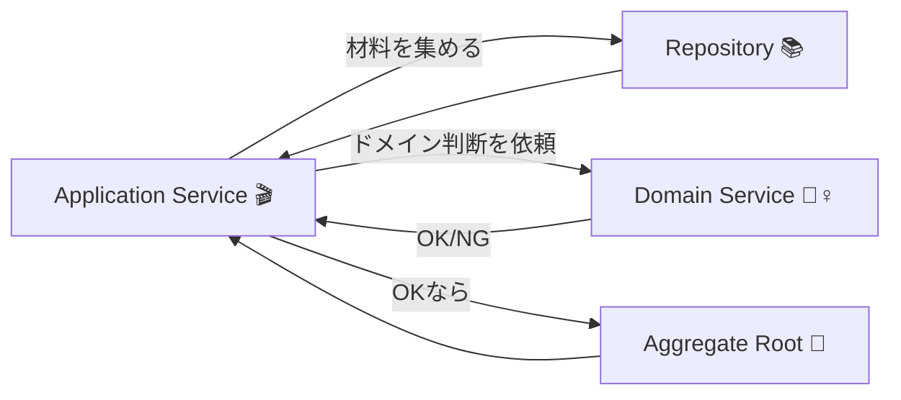

# 第76章：Domain Service入門：どこにも属さないルール🧙‍♀️✨

## この章のゴール🎯💖

* ✅ **Domain Serviceって何？**を一言で説明できる
* ✅ 「このルール、Entity/VOに入れるべき？Service？」を判断できる
* ✅ **小さくて良いDomain Service** をTypeScriptで書ける
* ✅ “サービス地獄😇”にならないコツが分かる

---

## 0) まず結論：Domain Serviceってなに？👀✨


**「ドメインのルールなんだけど、特定の1つのEntity/VOに“自然に”置けないやつを置く場所」**だよ〜🧙‍♀️📦

* Entity / VO：だいたい **名詞**（Order / Money / Email…）🧾💎
* Domain Service：だいたい **動詞**（判定する・計算する・成立するかチェックする…）🏃‍♀️💨

---

## 1) いつDomain Serviceが必要？（判断チェック）✅🔍


### ✅ Domain Serviceにしやすいパターン（よくある！）

1. **複数のものをまたぐルール**
   例）注文(Order)とメニュー(Menu)の関係で決まる、みたいなやつ🍔☕
2. **「誰の責務？」が決めにくい**
   Orderに入れると変、Menuに入れるともっと変…😵‍💫
3. **1つのEntityが太ってきた**（ifだらけ・知りすぎ）🐘💦

### 🚫 逆に、Serviceにしない方がいい（最重要！）

* **Orderだけで完結するルール**をServiceに逃がす
  → “振る舞いが空っぽのEntity”になりやすい😢
* 「とりあえずService」
  → Serviceが巨大化して **手続きの山** になる😇🔥

> 第75章で「ドメインの中にI/O（DBやAPI）を入れない」がポイントって言ってたよね🧼✨
> Domain Serviceも同じで、**原則：純粋なドメイン判断**に寄せるのが扱いやすいよ〜 

---

## 2) Domain Serviceの“ちょうどいい形”🧙‍♀️📐


### 基本の型（おすすめ）✨

* **状態を持たない（stateless）**
* **引数でもらって、判断して返す**
* できれば **副作用なし**（DB保存とかしない）

**イメージ図🗺️**



---

## 3) 例題：注文を確定していい？（Order × Menu）☕🧾🍩


ここ、ありがち〜！
「注文を確定(confirm)するとき、**注文に入ってる商品がまだ販売中か**チェックしたい」みたいなやつ🍩✅

でもさ…OrderがMenuを取りに行くためにRepository呼び始めると、ドメインがI/Oで汚れやすいんだよね🧼💦（第75章の注意点と同じ）

だからこのルールを **Domain Serviceに切り出す** のが気持ちいい✨

---

### 3-1) ドメイン側：必要な最小の“材料”だけ定義する🍳

#### Menuの「販売中か」だけ欲しい（全部いらない）

```ts
// domain/menu/MenuItemSnapshot.ts
export type MenuItemId = string;

export type MenuItemSnapshot = Readonly<{
  id: MenuItemId;
  isOnSale: boolean;
}>;
```

#### OrderLineは「何を注文したか」だけ

```ts
// domain/order/OrderLine.ts
import type { MenuItemId } from "../menu/MenuItemSnapshot";

export class OrderLine {
  constructor(public readonly menuItemId: MenuItemId) {}
}
```

#### Orderは “自分の中だけ” の不変条件は自分で守る🏯

```ts
// domain/order/Order.ts
import { OrderLine } from "./OrderLine";

export type OrderStatus = "Draft" | "Confirmed";

export class Order {
  private constructor(
    public readonly id: string,
    private readonly lines: readonly OrderLine[],
    public readonly status: OrderStatus
  ) {}

  static create(args: { id: string; lines: readonly OrderLine[] }): Order {
    if (args.lines.length === 0) throw new Error("注文は1品以上が必要です");
    return new Order(args.id, args.lines, "Draft");
  }

  confirm(): Order {
    if (this.status !== "Draft") throw new Error("下書き状態の注文だけ確定できます");
    return new Order(this.id, this.lines, "Confirmed");
  }

  getLines(): readonly OrderLine[] {
    return this.lines;
  }
}
```

ここ大事〜！📌
**Orderは「自分の状態遷移」は自分で守る**。
でも「メニューが販売中か」は **Orderだけじゃ決められない**。だからServiceへ🧙‍♀️✨

---

### 3-2) Domain Service：確定できるかチェックする🧙‍♀️🔍

```ts
// domain/order/OrderConfirmationService.ts
import { Order } from "./Order";
import type { MenuItemSnapshot } from "../menu/MenuItemSnapshot";

export class OrderConfirmationService {
  ensureAllItemsOnSale(args: {
    order: Order;
    menuItems: readonly MenuItemSnapshot[];
  }): void {
    const onSaleMap = new Map(args.menuItems.map((m) => [m.id, m.isOnSale] as const));

    for (const line of args.order.getLines()) {
      const isOnSale = onSaleMap.get(line.menuItemId);
      if (isOnSale !== true) {
        throw new Error(`販売終了の商品が含まれています: ${line.menuItemId}`);
      }
    }
  }
}
```

✅ これがDomain Serviceっぽい理由

* OrderとMenuの関係を見る（複数またぐ）🔗
* DBとかAPIは触らない（材料は引数で受け取る）🧼
* 1つの責務だけ（“確定していい？”）🎯

---

### 3-3) Application Service側：材料集めを担当する🎬📚

（すでに第61〜70章を通ってきた前提で、雰囲気だけね✨）

```ts
// app/ConfirmOrderUseCase.ts (イメージ)
import { OrderConfirmationService } from "../domain/order/OrderConfirmationService";

export class ConfirmOrderUseCase {
  constructor(
    private readonly orderRepo: { findById(id: string): Promise<any>; save(order: any): Promise<void> },
    private readonly menuRepo: { findSnapshots(ids: readonly string[]): Promise<any[]> },
    private readonly confirmationService: OrderConfirmationService
  ) {}

  async execute(orderId: string): Promise<void> {
    const order = await this.orderRepo.findById(orderId);

    const ids = order.getLines().map((l: any) => l.menuItemId);
    const menuItems = await this.menuRepo.findSnapshots(ids);

    this.confirmationService.ensureAllItemsOnSale({ order, menuItems });

    const confirmed = order.confirm();
    await this.orderRepo.save(confirmed);
  }
}
```

ポイントはこれだよ〜👇✨

* **集めるのはアプリ層**（Repositoryで）🎬📚
* **判断はドメイン**（Domain Service + Aggregate）🏯🧙‍♀️

---

## 4) よくあるアンチパターン集😂⚠️（ここだけは避けて！）

### 🚫 なんでもServiceにする（Entityが空っぽ）


* Orderがただのデータ袋📦
* ルール全部 `OrderService` に…😇
  👉 対策：**「Orderだけで決まるならOrderに」**を合言葉にしよ💪✨

### 🚫 Serviceが巨大化（神サービス👼）


* `DiscountAndTaxAndCampaignAnd...Service` みたいになる
  👉 対策：**動詞を1つに絞る**（check/compute/decideのどれ？）🎯

### 🚫 ServiceがI/O直呼び（infra依存）

* Domain Serviceの中でHTTP呼ぶ、DB読む…
  👉 対策：**材料は引数で受け取る**（or domain interfaceだけ）🧼✨
  （第75章の「ドメインにI/O入れない」路線だよ〜）

---

## 5) ミニ演習🎮✨（手を動かすと一気に分かる！）

### 演習A：Domain Serviceを1つ作ってみる🧙‍♀️

**お題：注文確定時に「同じ商品を3つ以上入れちゃダメ」ルールを追加**🚫🍩🍩🍩

* 入力：Order（lines）
* 出力：OKなら何もしない / NGならError
* ヒント：`Map<MenuItemId, number>` で数える

### 演習B：テストを書く🧪💕（Vitest想定）

* ✅ 2個までOK
* ✅ 3個で失敗
* ✅ “別の商品ならOK”

（テストはDomain Serviceが**引数で完結**するから書きやすいよ〜✨）

---

## 6) Copilot / Codex向け：プロンプト例🤖⚡（そのまま使ってOK）

### ✅ 「Serviceにするべき？」壁打ち

* 「このルールはOrderに入れるべき？Domain Serviceに分けるべき？
  ルール内容：〇〇。関係する概念：Order / MenuItem。
  “責務の自然さ”と“将来の変更”の観点で判断して」

### ✅ 骨格だけ生成（ロジックは自分で）

* 「OrderConfirmationServiceの雛形をTypeScriptで作って。
  statelessで、引数でorderとmenuItemsを受け取って検証するだけにして」

### ✅ テスト観点を増やす

* 「このDomain Serviceのテスト観点を漏れなく列挙して。境界値も入れて」

---

## まとめ🌸✨

* Domain Serviceは **「どのEntity/VOにも自然に置けないルール」**の置き場🧙‍♀️
* ただし乱用すると **サービス地獄**😇になるから注意！
* コツは

  * **Orderだけで決まるならOrderへ**🏯
  * **複数またぐ・責務が決まらないならServiceへ**🧙‍♀️
  * **I/Oはアプリ層で集めて、ドメインへ渡す**🧼✨（第75章と同じ流れ）

次の第77章で「割引計算はどこに置く？」っていう、まさにDomain Serviceが活躍する悩みをやるよ〜🏷️✨
