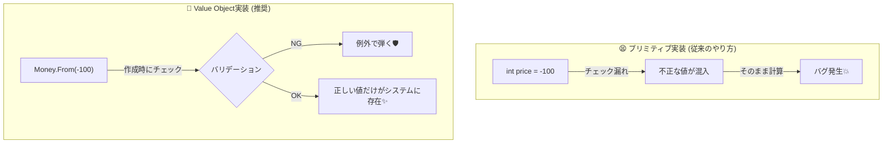

# 第01章：まず全体像！Entity/VOって何が嬉しいの？🤔🌟

### 🎯 この章のゴール

読み終わったら、次の2つを**自分の言葉で**言えるようになろう〜！😆✨

1. **Entity（エンティティ）**って何？🆔
2. **Value Object（値オブジェクト / VO）**って何？💎
   そして…
3. **なんで分けると嬉しいの？（バグ減る理由）**🛡️✨

---

## 1) まず結論だけ先に！🧠✨

### 🆔 Entity（エンティティ）

* ひとことで言うと：**「IDで追いかける“本人”」**
* 中身（状態）が変わっても、**同じ人（同じ注文）として扱う**よ！
* 例：注文 `Order` は、内容が変わっても「その注文」でしょ？🧾🔁

### 💎 Value Object（値オブジェクト / VO）

* ひとことで言うと：**「値そのものが主役」**
* **値が同じなら同じ扱い（等価性）**
* 例：`Money(500円)` は、誰が作っても「500円」は「500円」だよね💰✨

※ちなみに今のC#は **C# 14 が最新**で、.NET 10 でサポートされてるよ〜！🧁✨ ([Microsoft Learn][1])
（この教材のコード例も、その流れに沿っていくね）

---

## 2) どうして混乱するの？「同じ」の意味が2種類あるから😵‍💫➡️😆✨


「同じ」って言葉、実は2種類あるの👇

### 🆔 同一性（Identity）＝“本人が同じ”

* 注文A：今日作った注文（ID=123）
* 注文A：あとで内容変えても（ラテ→カプチーノ）
  ➡️ **ID=123 のままなら、同じ注文！**

### 💎 等価性（Equality）＝“値が同じ”

* `Money(500円)` と `Money(500円)`
  ➡️ **値が同じなら同じ！**

この「同じ」の種類が違うのに、アプリでごちゃ混ぜにすると…
バグが生まれる確率がグーンと上がるよ😱💥

---

## 3) カフェ注文アプリで「Entityっぽい」「VOっぽい」を並べてみよ☕️🧾✨

### 🧾 Entity になりやすいもの（IDで追う“本人”系）

* `Order`（注文）🧾
* `Customer`（お客さん）🙋‍♀️
* `Product`（商品）🥐
* `Coupon`（クーポン）🎟️（※運用次第でEntity寄りになりやすい）

### 💎 Value Object になりやすいもの（値そのもの系）

* `Money`（金額）💰
* `Email`（メール）📧
* `Quantity`（数量）🧮
* `DateRange`（期間）📅
* `OrderId`（注文ID）🆔（※「ID自体は値」だからVOにするのが超あるある！）

---

## 4) 「分けると嬉しい」って、具体的に何が起きるの？🛡️✨




### ✅ 嬉しいこと①：**変な状態を作れなくなる**（最強）🔒💎

たとえば「金額」って、マイナスになったら困るよね？😅

* `decimal price = -100;` ← うっかり入っちゃう😱
* `Money` VOなら…

  * 作るときに「マイナス禁止！」ってチェックできる✅
  * **作れた時点で正しい**状態になる✨

これ、バグの“発生源”を入口で止められるからめっちゃ強いよ🛡️💕

### ✅ 嬉しいこと②：**型で事故を防げる**🚧

「金額」と「数量」と「割引率」って、全部 `int` や `decimal` にしがちでしょ？
でもそれ、混ぜたら終わる…😇

例：

* 数量なのに金額を入れる
* 割引率なのに金額を入れる
* 円なのにドルを足す

VOにすると「そもそも代入できない」＝事故が減る💪✨

### ✅ 嬉しいこと③：**ルールの置き場所が決まってスッキリ**🏠✨

* 金額のルール（端数、通貨、加算）→ `Money` に集める💰
* 注文のルール（確定後は変更不可、キャンセル条件）→ `Order` に集める🧾

ルールが散らからないから、あとで直すのが怖くなくなるよ〜！😆🛠️

---

## 5) 超ミニ例で空気をつかも！🌬️✨（“プリミティブ地獄”の入口）

「とりあえず string / int / decimal」で作ると、こうなりがち👇😵‍💫

```csharp
// ありがち（でも事故りやすい）
public class Order
{
    public string Id { get; set; }          // 本当は OrderId っぽい
    public decimal TotalPrice { get; set; } // 本当は Money っぽい
    public int Quantity { get; set; }       // Quantity っぽい
}
```

これを「役割」で分けると、世界が急にわかりやすくなるよ💡✨

* `Order`：IDで追う本人（Entity）🧾🆔
* `OrderId` / `Money` / `Quantity`：値として正しさを守る（VO）💎🔒

（実装は次章以降でゆっくりやるから、今は空気だけでOKだよ〜☺️🍀）

---

## 6) 🧪 ミニ演習：カフェアプリに出てくる「モノ」を10個書き出そ✍️☕️

### 📝 Step1：10個書く（分類しなくてOK）

例：注文、商品、金額、クーポン、学籍番号、支払い方法、受け取り時間…などなど！

### 📝 Step2：それぞれに印をつける

* 🆔 これって「IDで追う本人」？
* 💎 これって「値が同じなら同じ」？
* 🤔 迷う！ ← これは最高に学びポイント✨（迷うのが普通！）

### ✅ 自己採点のコツ（やさしめ）

* 「後から中身が変わっても同じ扱い？」→ 🆔寄り
* 「値が同じなら同じ扱い？」→ 💎寄り

---

## 7) 🤖 AI活用：今日からできる！“言語化の練習”🧠✨

### ✅ 依頼①：超やさしく説明してもらう

* 「Entity と Value Object の違いを、高校生にもわかるように説明して」
* 「カフェ注文アプリの例で、Entity/VO を5個ずつ出して。理由も一言で！」

### ✅ 依頼②：あなたの“10個リスト”を判定してもらう

* 「この10個を Entity/VO に分類して。迷うものは“迷う理由”も書いて」
* 「“同一性”と“等価性”の観点で説明して」

### ✅ 依頼③：ツッコミ役をやってもらう（これ超おすすめ😆）

* 「この分類、間違えやすいポイントを3つ指摘して」
* 「VOにすべきなのにプリミティブで持つと起きるバグ例を3つ」

AIの答えは便利だけど、**最後に決めるのはあなた**だよ〜🤝✨
（判断が育つほど、設計が気持ちよくなる！）

---

## 8) まとめ（1分）⏱️✨

* 🆔 Entity：**IDで追う“本人”**（状態が変わっても同一）
* 💎 VO：**値そのもの**（値が同じなら同じ＝等価性）
* 🛡️ 分けると：

  * 変な状態を作れなくなる（バグ減）🔒
  * 型で事故が防げる🚧
  * ルールの置き場所が決まって読みやすい🏠

そして今の最新の流れとしては **C# 14 が最新で .NET 10 上でサポート**、.NET 10 は **LTS** だよ〜！🧁✨ ([Microsoft Learn][1])

---

## 次章の予告👀✨

次は「学習用プロジェクトを迷わず動かせる状態」にして、`Domain` と `Tests` を分けていくよ📁🧪✨
ここまでの「🆔/💎の見分け」が、あとで実装するときの土台になるよ〜！☕️💕

必要なら、あなたが書いた「10個リスト」を貼ってくれたら、**一緒に🆔/💎で仕分け**して、迷うポイントを“学びポイント化”するよ〜！😆✨

[1]: https://learn.microsoft.com/en-us/dotnet/csharp/whats-new/csharp-14?utm_source=chatgpt.com "What's new in C# 14"
