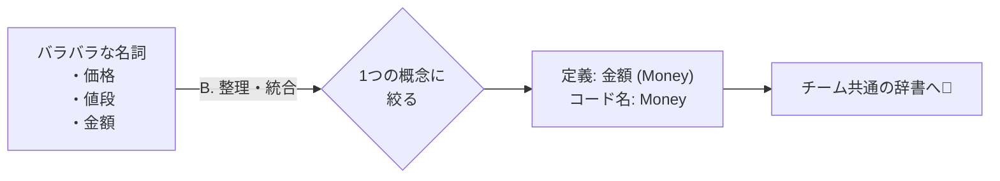

# 第03章：題材を決めて“言葉”を揃える（超かんたんユビキタス言語）🗣️☕️

この章はね、「コードを書く前に、みんなの頭の中の“用語辞書”を同じにする回」だよ〜📚💖
ここが揃うと、後の **Entity/VO の切り分け**がめちゃくちゃラクになるの…！😆✨

---

## 1) この章でできるようになること 🎯✨

* 「注文」「明細」「金額」みたいな言葉の **意味ブレ**を減らせる🧯
* チーム内（未来の自分含む）で **同じ単語＝同じ意味**にできる📌
* そのまま **クラス名・メソッド名**に落とせる🧩

「曖昧な言葉」はソフトウェアが一番苦手なんだよね…🥹
だから、DDDでは“共通言語（ユビキタス言語）”を育てよう！って考えるよ〜🗣️🌱 ([martinfowler.com][1])

---

## 2) まずは“カフェ注文アプリ”の世界を1分で想像 ☕️🧾


学内カフェでありがちな流れ👇✨

1. メニューを見る👀
2. 商品を選ぶ（サイズ・トッピングなど）🥤🍰
3. カートに入れる🧺
4. 注文確定✅
5. 支払い（現金/学内決済/カード等の想定でOK）💳
6. 受け取り番号で呼ばれる📣

ここから「登場人物（概念）」を拾っていくよ〜🕵️‍♀️✨

---

## 3) 用語がズレると何が困るの？（超あるある）😇💥


たとえば「金額」って言っても…

* **商品単価**（Price）💰
* **明細の小計**（LineSubtotal）🧾
* **注文合計**（OrderTotal）🧮
* **支払い金額**（AmountToPay）💳
* **税込/税抜**（TaxIncluded/Excluded）🍥

同じ「金額」でも意味が違うのに、変数名が `amount` だけだと…
あとで自分が見ても「どれ？」ってなるやつ😱🌀

DDDで“共通で厳密な言葉”を作ろうっていうのは、まさにこれを防ぐためだよ〜🛡️✨ ([martinfowler.com][1])

---

## 4) 手順A：名詞を“ざざっ”と書き出す（5〜10分）✍️✨


紙でもメモでもOK！まずは雑に名詞を出すよ〜😆

例（カフェアプリ）👇☕️

* 注文（Order）🧾
* 注文明細（OrderLine）📄
* メニュー項目（MenuItem）📋
* 商品（Product）🍩
* 金額（Money）💰
* 数量（Quantity）🔢
* 割引（Discount）🏷️
* 税（Tax）🧾
* 支払い（Payment）💳
* 受け取り番号（PickupNumber）📣
* 注文状態（OrderStatus）🚦
* 学籍番号（StudentId）🎓

ここはまだ“仮”でOKだよ〜🙆‍♀️✨

---

## 5) 手順B：「似た言葉」を整理して“1概念1単語”にする 🧹✨

ここが本番っ💪💖
「同じ意味の言葉が複数ある」状態を減らすよ〜！

### よくある“混ざりがち”セット 😵‍💫


* 商品 / メニュー / アイテム
* 注文 / オーダー / 購入
* 価格 / 金額 / 合計
* 明細 / 行 / アイテム（OrderLineのこと？）

### 決め方（迷ったらこれ）🧭✨

* **画面に表示される言葉**に寄せる（ユーザーが理解しやすい）👀
* **コードに落としやすい**英語名にする（クラス名にできる）🧩
* “似てるけど別物”なら、ちゃんと別の名前にする（例：Price と Total）🛡️

---

## 6) 手順C：用語集（ミニ辞書）を作る 📓✨（10語でOK）





この章の成果物はこれ！
ファイルで残すのがコツだよ〜（例：`docs/ubiquitous-language.md`）🗂️✨

### 用語集テンプレ（この形が最強）💪📘

* 日本語名
* 英語名（コード名）
* 意味（1〜2行で）
* 例（どこで使う？）
* 似てる言葉との違い（重要！）

### サンプル用語集（10個）☕️🧾✨

| 日本語    | 英語（コード名）       | 意味（超短く）   | 例               | 注意                     |
| ------ | -------------- | --------- | --------------- | ---------------------- |
| 注文     | `Order`        | 1回の購入まとまり | 注文確定で作成         | 「カート」と混同しない            |
| 注文明細   | `OrderLine`    | 注文内の1行    | ラテ×2 の行         | `MenuItem`とは別          |
| メニュー項目 | `MenuItem`     | 販売中の選択肢   | 抹茶ラテ（L）         | “商品マスタ”寄り              |
| 金額     | `Money`        | 通貨つきの値    | 480円            | `decimal`直は避けたい（後でVO化） |
| 単価     | `UnitPrice`    | 1個あたりの価格  | 480円/杯          | `Total`と別              |
| 数量     | `Quantity`     | いくつ買うか    | 2               | 0はOK？1以上？を決める          |
| 小計     | `LineSubtotal` | 明細の合計     | 480×2=960       | 税は含む？別？                |
| 注文合計   | `OrderTotal`   | 注文全体の合計   | 小計の合計           | 割引・税の順序注意              |
| 割引     | `Discount`     | 値引きルール    | 学割-10%          | “クーポン”と別にする？           |
| 注文状態   | `OrderStatus`  | 進行状況      | Draft/Confirmed | 状態遷移は後の章で！             |

この表だけで、未来の自分が救われる率めちゃ高いよ…🥹✨

---

## 7) 手順D：動詞（ユースケース）も“最低限”揃える 🏃‍♀️💨


名詞だけじゃなくて、**操作（動詞）**も揃えると強いよ〜！

例👇✨

* `CreateOrder`（注文を作る）🧾
* `AddLine`（明細追加）➕
* `ChangeQuantity`（数量変更）🔁
* `Confirm`（注文確定）✅
* `Cancel`（キャンセル）❌
* `CalculateTotal`（合計計算）🧮

> ここで決めた動詞が、そのまま Entity のメソッド名候補になるよ〜🆔✨

---

## 8) “用語をコードに映す”ミニ例 🧩✨（まだ中身は空でOK）


「名前を揃える」のが目的なので、実装は薄くてOK🙆‍♀️
先に“器”だけ作っちゃおう✨

```csharp
public class Order
{
    // まだChapter3なので、実装は薄くてOK！
    // 目的は「用語がコードに乗る」こと✨

    public void AddLine(MenuItem menuItem, Quantity quantity, UnitPrice unitPrice)
    {
        // TODO: 次の章以降で育てる🌱
    }

    public void Confirm()
    {
        // TODO
    }
}

public class OrderLine { }
public class MenuItem { }

// ここも後の章でVOとして育てる予定🌱
public readonly record struct Money(decimal Amount, string Currency);
public readonly record struct Quantity(int Value);
public readonly record struct UnitPrice(decimal Amount, string Currency);
```

ポイントはこれ👇💖

* “Order” が何か、クラス名だけで分かる
* “Amount” じゃなくて “UnitPrice / OrderTotal” みたいに意味が出る
* これが後で **Entity/VO** の判断に効いてくるよ〜💎🆔✨

---

## 9) AI活用（この章は“候補出し”に使うのが安全）🤖✨

AIはここで超便利〜！😆
ただし **最終決定はあなた（人間）** がやるのが大事だよ🫶

### 使える頼み方（コピペでOK）📝✨

* 「学内カフェ注文アプリの用語集候補を20個。日本語/英語/定義/混同注意も」
* 「“金額”に該当する概念を分解して。Price/Total/Subtotal…みたいに」
* 「Order / Cart / Checkout の違いを、アプリの流れに沿って定義して」

AIの提案を、そのまま採用じゃなくて
「採用✅／不採用❌／保留🟡」で仕分けしよう✂️✨

---

## 10) ミニ演習（10〜15分）🧪✨

### 演習1：用語集を10個作る📓☕️

* 上の表みたいに10行でOK！

### 演習2：「金額」を3種類に分ける💰🧠

* `UnitPrice`（単価）
* `LineSubtotal`（明細小計）
* `OrderTotal`（注文合計）
  …みたいに、**意味で分ける**✨

### 演習3：言い換え禁止リストを作る🚫🗣️

例：「注文＝Order」「明細＝OrderLine」みたいに
“同じものを別名で呼ばない”ルールを1行ずつ📌

---

## 11) まとめ（1分）⏱️✨

* **言葉が揃うと、設計が揃う**🧠✨
* まずは **名詞→似た言葉整理→用語集** の順が最強📓
* 用語はそのまま **クラス名/メソッド名**に落とす🧩
* AIは **候補出し**に使って、人間が採用判断✅🤖

---

## おまけ：2026年初の“いまの最新”メモ 🧷✨

* .NET は **.NET 10（LTS）** が現行で、2025-11-11 リリース＆2026-01-13時点で 10.0.2 までパッチが出てるよ〜📦✨ ([Microsoft][2])
* C# は **C# 14 が最新**で、.NET 10 上でサポートされてるよ🧠✨ ([Microsoft Learn][3])
* Visual Studio 側も AI（Copilot）統合がどんどん強化されてる流れだよ🤖✨ ([Visual Studio][4])

---

次の第4章は「“同じ”の意味（同一性 vs 等価性）」に入るよ〜🆔💎✨
この章で揃えた用語が、そこでめちゃ効いてくるからね😆📘✨

[1]: https://martinfowler.com/bliki/UbiquitousLanguage.html?utm_source=chatgpt.com "Ubiquitous Language"
[2]: https://dotnet.microsoft.com/en-us/platform/support/policy/dotnet-core ".NET and .NET Core official support policy | .NET"
[3]: https://learn.microsoft.com/en-us/dotnet/csharp/whats-new/csharp-14 "What's new in C# 14 | Microsoft Learn"
[4]: https://visualstudio.microsoft.com/vs/ "
	Visual Studio IDE - AI for coding debugging and testing"
