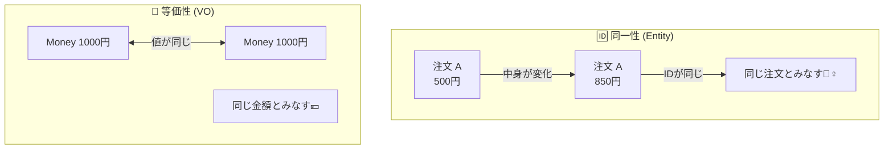

# 第04章：「同じ」の意味を分けよう（同一性 vs 等価性）🧠🔍

## 🎯 この章のゴール

* 「同じ注文」と「同じ金額」が**“別の同じ”**だって説明できるようになる🙆‍♀️✨
* Entity（エンティティ）と Value Object（値オブジェクト）の**第一分岐**＝「同一性 / 等価性」を体に入れる💪
* C#で「同じ判定」がどう動くか（地味に重要）をつかむ🧩

> ちなみに今のC#は **C# 14**、.NETは **.NET 10** が最新系列だよ〜🆕✨（.NET 10.0.2 / C# 14.0） ([Microsoft][1])
> Visual Studio も **Visual Studio 2026** が現行の最新版ライン🛠️✨ ([Microsoft Learn][2])

---

## 🧠 まず結論：この2つを分けるだけで世界が変わる✨

### 🆔 同一性（Identity）

「**IDで追いかける“同じ”**」

* 状態（中身）が変わっても「同じ本人」
* 例：**Order（注文）**は、合計金額や明細が変わっても「同じ注文」だよね🧾🔁

### 💎 等価性（Value Equality）

「**値が同じなら“同じ”**」

* IDは関係ない（基本いらない）
* 例：**Money（1000円）**は、別インスタンスでも「1000円」なら同じ💰✨

---

## ☕️ カフェ注文アプリで超わかりやすい例！


### 例1：Order（注文）は Entity 🆔

* 注文ID：`A123` の注文があるとする
* 途中で明細が増えた（ラテ追加☕️➕）
* 合計が変わった（500円→850円）

👉 それでも **注文IDが同じなら「同じ注文」** 🧾🆔✨
（中身が変わるのが普通＝ライフサイクルがある）

### 例2：Money（金額）は Value Object 💎

* 1000円のMoneyを2回作った
* 片方はレジ計算、片方はクーポン計算で生まれた

👉 由来が違っても **「1000円」なら同じ** 💰=💰✨
（中身が変わらないのが基本＝不変が嬉しい）

---

---

## 🤯 C#の「同じ判定」ってどうなってるの？（超重要ポイント）




ここ、知らないとバグりやすい〜😇💥

### ✅ class（普通のクラス）は基本「参照が同じ」＝同じ

つまり **別々に new したら、値が同じでも“別物”** になりやすい😱

```csharp
var a = new MoneyClass(1000, "JPY");
var b = new MoneyClass(1000, "JPY");

Console.WriteLine(a == b);         // False（参照が違う）
Console.WriteLine(a.Equals(b));    // False（未実装なら参照比較）
```

### ✅ record（record class / record struct）は基本「値で同じ」＝同じ

VO向きで、**等価性が最初から強い**のが嬉しい💎✨

```csharp
public readonly record struct Money(decimal Amount, string Currency);

var a = new Money(1000, "JPY");
var b = new Money(1000, "JPY");

Console.WriteLine(a == b);       // True（値で比較）
Console.WriteLine(a.Equals(b));  // True
```

> record まわりの最新の言語バージョンの整理は、C#のバージョン履歴にまとまってるよ📚（今はC# 14が最新） ([Microsoft Learn][3])

---

## 🧩 この章のメイン：Order と Money の「同じ判定条件」を書いてみよう✍️✨

## 1) Entity：Order は「IDが同じなら同じ」🆔

学習用に、まずは素直に「IDだけで同一性」ってやってみよう〜😊

```csharp
public sealed class Order : IEquatable<Order>
{
    public Guid Id { get; }
    public Money Total { get; private set; }

    public Order(Guid id, Money total)
    {
        Id = id;
        Total = total;
    }

    public void ChangeTotal(Money newTotal) => Total = newTotal;

    public bool Equals(Order? other)
        => other is not null && Id == other.Id;

    public override bool Equals(object? obj)
        => obj is Order other && Equals(other);

    public override int GetHashCode()
        => Id.GetHashCode();
}
```

💡ポイント😊

* `Total` が変わっても、`Id` が同じなら同じ注文🧾
* `GetHashCode()` も **IDベース**に揃える（Dictionary/HashSetで大事）📦✨

---

## 2) Value Object：Money は「値が同じなら同じ」💎

record structでいくとスッキリ〜💰✨

```csharp
public readonly record struct Money(decimal Amount, string Currency)
{
    public static Money Jpy(decimal amount) => new(amount, "JPY");
}
```

---

## 🧪 ミニ演習：テストで「同じ」を確かめよう！🧪✨

xUnit想定でいくね〜😊

```csharp
using Xunit;

public class EqualityTests
{
    [Fact]
    public void Order_is_same_if_id_is_same()
    {
        var id = Guid.NewGuid();

        var a = new Order(id, Money.Jpy(500));
        var b = new Order(id, Money.Jpy(850)); // 合計が違っても…

        Assert.Equal(a, b); // IDが同じなら「同じ注文」
    }

    [Fact]
    public void Money_is_same_if_values_are_same()
    {
        var a = Money.Jpy(1000);
        var b = Money.Jpy(1000);

        Assert.Equal(a, b); // 値が同じなら「同じ金額」
    }

    [Fact]
    public void Money_works_in_hashset()
    {
        var set = new HashSet<Money>();
        set.Add(Money.Jpy(1000));
        set.Add(Money.Jpy(1000));

        Assert.Single(set); // ちゃんと「同じ」と判定されて1個になる✨
    }
}
```

---

## 😇 よくある落とし穴（この章で潰しておくと強い）💥

### ❶ 「VOをclassで作って Equals 未実装」問題 😱

* 値が同じでも別物扱い → 重複が消えない、検索できない、HashSetが増える📦💥
  👉 **VOは record/struct か、Equals/GetHashCodeを必ず揃える** 💎

### ❷ 「Entityを値で比較しちゃう」問題 😵‍💫

* 合計金額が同じだから同じ注文…ではないよね？🧾💦
  👉 Entityは **ID** で追う🆔✨

### ❸ 「ID未確定のEntityの比較」問題 🤔

* DB保存前などで `Id` が未採番だとややこしい
  👉 学習段階では **生成時にIdを作る（Guid）** がラク！🆔✨
  （実務では状況で設計いろいろあるけど、まずはここでOK🙆‍♀️）

---

## 🤖 AI活用コーナー（めっちゃ効くやつ）✨

そのままコピペで聞けるプロンプト例だよ〜📌💕

* **概念を噛み砕く**

  * 「同一性と等価性の違いを、カフェ注文アプリの例で女子大生向けに説明して。短い例もつけて😊」

* **テスト観点を増やす**

  * 「Order（Entity）と Money（VO）の等価性テストケースを追加で10個出して。境界値も混ぜて🧪✨」

* **バグ再現コード**

  * 「Moneyをclassで実装してEquals未実装のとき、HashSetで何が起きるか再現コードを書いて😱」

---

## ✅ まとめ（1分で復習）⏱️✨

* Entityの「同じ」＝ **同一性（IDで追う）** 🆔
* VOの「同じ」＝ **等価性（値が同じなら同じ）** 💎
* C#では

  * `class` は基本「参照が同じ」
  * `record` は基本「値が同じ」
    なので、VOは record が相性よくて気持ちいい💰✨ ([Microsoft Learn][3])

---

## 🏁 小さな宿題（10分）✍️☕️

カフェアプリの用語から、**“同一性”か“等価性”か** を1行理由つきで分類してみて〜😊✨

* Order / OrderLine / Money / Quantity / ProductName / CouponCode / TableNumber

次の章（Entity入門🆔🧍‍♀️）がスルスル入るようになるよ〜🚀💕

[1]: https://dotnet.microsoft.com/en-US/download/dotnet/10.0 "Download .NET 10.0 (Linux, macOS, and Windows) | .NET"
[2]: https://learn.microsoft.com/en-us/visualstudio/releases/2026/release-notes "Visual Studio 2026 Release Notes | Microsoft Learn"
[3]: https://learn.microsoft.com/en-us/dotnet/csharp/whats-new/csharp-version-history "The history of C# | Microsoft Learn"
