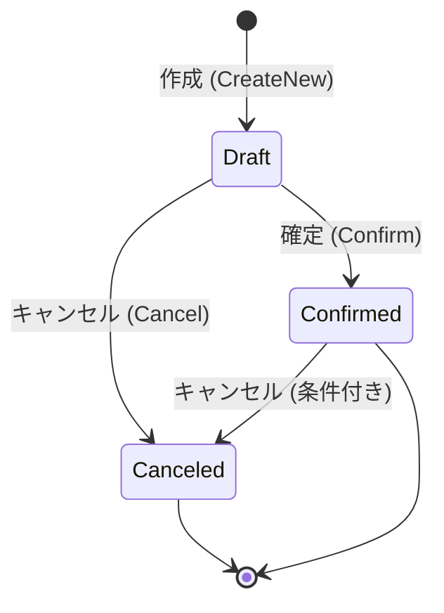

# 第05章：Entity入門（ID・更新・履歴）🆔🧍‍♀️

（題材：学内カフェ注文アプリ ☕️🧾）

---

## 1) 今日のゴール 🎯✨

この章が終わると、こんな感じになれます👇😆

* 「Entityって何？」を **自分の言葉で説明**できる 🗣️🌸
* Entityが大事にする3点セット **ID・更新・履歴** がわかる 🆔🔁📜
* 注文（Order）を **Entityとして“それっぽく”実装**できる 🧾💻✨

ちなみに今のC#は **C# 14（.NET 10対応）**が最新です 🙌✨ ([Microsoft Learn][1])
（.NET 10 SDKも2026-01-13更新が出ています📦） ([Microsoft][2])

---

## 2) Entityってなに？超ざっくり言うと… 🧠💡

Entityはね、**「IDで追いかける“本人”」**です🆔✨

* ✅ 中身（状態）が変わっても「同じ本人」
* ✅ “値が同じか”より **“同じIDか”が大事**
* ✅ だから **更新（変更）されるのが普通** 🔁

### たとえ話🌸

* あなたが髪型変えても、同じあなたですよね？💇‍♀️✨
  → それがEntityの感覚！
* 「100円」は誰が持ってても100円💰
  → これはVO（値オブジェクト）の感覚！

---

## 3) OrderをEntityとして見るとこうなる ☕️🧾🆔


「注文（Order）」って、時間とともに変わることが多いよね👇😳

* 追加：明細（OrderLine）が増える ➕🧾
* 変更：受け取り時間が変わる 🕒🔁
* 状態：下書き → 確定 → キャンセル… 🔁🟡🟢🔴
* 履歴：いつ誰が何を変えた？が欲しくなる 📜👀

こういう「変わるもの」はEntityの出番！💪✨

---

## 4) Entityの3点セット：ID・更新・履歴 🧰✨

### A. ID（同一性）🆔

Entityは **IDで追いかける**のが基本！
Orderなら例えば `Guid` でOKです（あとで型付きIDにも進化できるよ🧪）🧷✨

### B. 更新（状態が変わる）🔁

Entityは **状態が変わってOK**。
ただし大事なのは👇

* ❌ プロパティを好き放題いじらせない
* ✅ 「変更はメソッド経由」にして、ルールを守らせる 🛡️✨

例：

* `AddLine(...)`（明細追加）
* `Confirm()`（注文確定）
* `Cancel()`（キャンセル）

### C. 履歴（いつ・何が変わった？）📜

いきなり本格監査ログは大変なので、まずは学習用に👇でOK✨

* `CreatedAt`（作成日時）🕒
* `UpdatedAt`（更新日時）🕒
* `History`（簡易ログ：文字列でもOK）📝

---

## 5) 実装してみよ！Order Entity（最小で気持ちよく）💻✨

> ポイント：**recordじゃなくてclass**を使うのがおすすめ！
> recordは「値で等価」が得意だから、Entityの感覚とズレやすいの🥺💦

### 5-1) OrderStatus（注文の状態）🔁




```csharp
namespace Cafe.Domain.Orders;

public enum OrderStatus
{
    Draft = 0,      // 作成直後（下書き）
    Confirmed = 1,  // 確定
    Canceled = 2    // キャンセル
}
```

### 5-2) Order（ID・更新・履歴つき）🆔🔁📜

```csharp
namespace Cafe.Domain.Orders;

public sealed class Order
{
    public Guid Id { get; }
    public OrderStatus Status { get; private set; }

    public DateTimeOffset CreatedAt { get; }
    public DateTimeOffset UpdatedAt { get; private set; }

    // 学習用：超シンプルな履歴（本番は別のやり方もあるよ）
    private readonly List<string> _history = new();
    public IReadOnlyList<string> History => _history;

    // “削除”は物理削除じゃなく「無効化」にすることも多い（いわゆるソフトデリート）
    public bool IsActive { get; private set; } = true;

    private Order(Guid id, DateTimeOffset now)
    {
        Id = id;
        Status = OrderStatus.Draft;
        CreatedAt = now;
        UpdatedAt = now;

        AddHistory($"Order created. id={Id}");
    }

    public static Order CreateNew(DateTimeOffset now)
        => new(Guid.NewGuid(), now);

    public void Confirm(DateTimeOffset now)
    {
        EnsureActive();

        if (Status != OrderStatus.Draft)
            throw new InvalidOperationException("Only Draft order can be confirmed.");

        Status = OrderStatus.Confirmed;
        Touch(now);
        AddHistory("Order confirmed.");
    }

    public void Cancel(DateTimeOffset now, string reason)
    {
        EnsureActive();

        if (Status == OrderStatus.Canceled)
            return; // 2回目は何もしない（学習用の落とし所🙂）

        Status = OrderStatus.Canceled;
        Touch(now);
        AddHistory($"Order canceled. reason={reason}");
    }

    public void Deactivate(DateTimeOffset now, string reason)
    {
        if (!IsActive) return;

        IsActive = false;
        Touch(now);
        AddHistory($"Order deactivated. reason={reason}");
    }

    private void Touch(DateTimeOffset now)
        => UpdatedAt = now;

    private void AddHistory(string message)
        => _history.Add($"{DateTimeOffset.UtcNow:u} {message}");

    private void EnsureActive()
    {
        if (!IsActive)
            throw new InvalidOperationException("This order is inactive.");
    }
}
```

✅ これで「Entityっぽさ」が出ました！

* **IDで本人**を追う🆔
* **状態が変わる**（Status/IsActive）🔁
* **履歴を残せる**📜

---

## 6) “更新のさせ方”のコツ（超重要）🛡️✨


Entity設計でありがちな事故👇😱

* ❌ `order.Status = Confirmed;` みたいに外から直接いじれる
* ❌ 変更ルールがあちこちに散って、バグる🌀

だから基本はこれ👇

* ✅ 変更は **Entityのメソッドに集める**（`Confirm()`とか）🏠✨
* ✅ メソッド内で「今それできる？」をチェックする🔒

この癖がつくと、後半（不変条件とか状態遷移）でめっちゃ楽になります😆🧠✨

---

## 7) ミニ演習（10分）🧪☕️✨

紙でもメモでもOK！✍️💕

### お題：Orderに入る「変わる情報」を整理しよう🧾📝

次を2列で書いてみてね👇✨

* **A：変わる（更新される）** 🔁
* **B：基本変わらない（作成時に決まる）** 🔒

例：

* Status（変わる）
* CreatedAt（変わらない）
* UpdatedAt（変わる）
* Id（変わらない）

できたら最後に💡
「じゃあOrderはEntityっぽい？VOっぽい？」を一言で！🆔💎

---

## 8) テストもチラ見せ（超ミニ）🧪✨

xUnitは **v3が .NET 8+ 対応**なので、.NET 10でも問題なく使えます🙂🧪 ([xunit.net][3])

```csharp
using Cafe.Domain.Orders;
using Xunit;

public class OrderTests
{
    [Fact]
    public void SameId_means_same_entity_even_if_state_changes()
    {
        var t1 = DateTimeOffset.Parse("2026-01-22T10:00:00+09:00");
        var t2 = DateTimeOffset.Parse("2026-01-22T10:05:00+09:00");

        var order = Order.CreateNew(t1);
        var id = order.Id;

        order.Confirm(t2);

        Assert.Equal(id, order.Id);                 // IDは同じ（同一性）
        Assert.Equal(OrderStatus.Confirmed, order.Status); // 状態は変わる
    }
}
```

---

## 9) AI活用（Copilot/Codex）🤖✨：この章での“勝ちパターン”

AIは **雛形づくり**と**漏れチェック**にめちゃ強いよ💪✨

### 使えるプロンプト例🪄

* 「Order Entityの最小実装をC#で。ID/Status/CreatedAt/UpdatedAt/履歴（簡易）を含めて。更新はメソッド経由にして」
* 「Confirm/Cancelの事前条件（できる/できない）を箇条書きで提案して」
* 「このEntity、外から勝手に状態変更できない？改善点をレビューして」

👉 ただし！
最後の「ルール決定」は人間の仕事だよ🧠✨（AIは提案係📝）

---

## 10) まとめ（1分）⏱️🌸

* Entityは **IDで追う“本人”** 🆔
* Entityは **更新される前提** 🔁
* Entityには **履歴（作成/更新/変更ログ）**のニーズが出やすい 📜
* 更新は **メソッドに閉じ込める**と安全🛡️✨

---

## 次章の予告 👀💎

次は **Value Object入門（不変・自己検証・等価性）**！💎✅
「VOが強いと、Entityがめっちゃラクになる」体験をしに行こ〜😆✨

[1]: https://learn.microsoft.com/en-us/dotnet/csharp/whats-new/csharp-14?utm_source=chatgpt.com "What's new in C# 14"
[2]: https://dotnet.microsoft.com/en-us/download?utm_source=chatgpt.com "Download .NET (Linux, macOS, and Windows) | .NET"
[3]: https://xunit.net/?utm_source=chatgpt.com "xUnit.net: Home"
