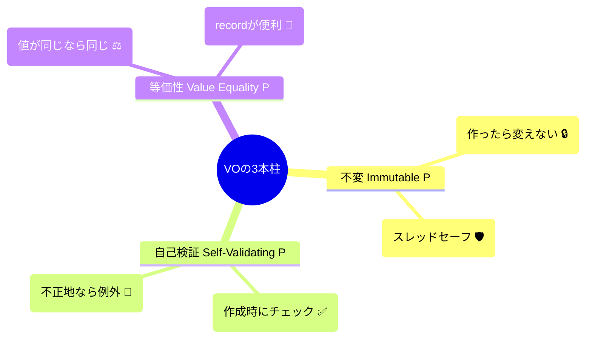

# 第06章：Value Object入門（不変・自己検証・等価性）💎✅

この章は、VO（値オブジェクト）を「**ただの便利クラス**」じゃなくて、**バグを減らす“設計パーツ”**として体に入れる回だよ〜！😆✨
（ちなみに今どきのC#では、`record` / `record struct` で VO がかなり書きやすいよ〜！📌([Microsoft Learn][1]) そして現行の最新は **C# 14（.NET 10 対応）**って明記されてるよ📚([Microsoft Learn][2])）

---

## 1) まずVOって何？（一言で）💎✨


VOはね、**「値そのものに“意味”と“ルール”を持たせたもの」**だよ〜！😊☕️

* ❌ `string email`（ただの文字）
* ✅ `Email email`（“メールアドレス”として正しいルールを持つ）

VOにすると何が嬉しいかというと…

* 🛡️ **無効な値が入りにくくなる**
* 🧠 **「この値って何だっけ？」が減る**
* 🧪 **テストしやすい**
* 🔁 **同じチェックをあちこちに書かなくて済む**

---

## 2) VOの3大特性（ここが試験範囲！）📌💎✅





第6章のゴールはこれ！🌟

### ① 不変（Immutable）🔒


作った後に **中身が変わらない** のが基本だよ〜！

* ✅ 「いったん `Money(100, "JPY")` を作ったら、それはずっと100円」
* ❌ 「あとから Amount だけ書き換えられる」←事故りやすい😱

> 不変だと「途中で勝手に変わった」系のバグが激減するよ🛡️✨

---

### ② 自己検証（Self-validating）🧪


VOは **作る瞬間にルールをチェック**するよ〜！

* ✅ Emailは `@` が必要、とか
* ✅ Moneyはマイナス不可、とか
* ✅ DateRangeは start <= end、とか

> 「作れた時点で正しい」って状態を作るのが強い💪✨

---

### ③ 等価性（Value equality）✨

VOは **IDじゃなくて“値が同じなら同じ”** で比較するよ〜！

* ✅ `Money(100, "JPY")` と `Money(100, "JPY")` は同じ
* ✅ `Email("a@b.com")` と `Email("a@b.com")` は同じ

C#の `record` は **値の等価性が標準装備**だから、VOにめっちゃ相性いい📌([Microsoft Learn][1])

---

## 3) カフェ注文アプリで「VO候補」探しゲーム🎯☕️


VOっぽいのは、だいたいこういうやつ👇

* 📧 Email（値＋ルール）
* 💰 Money（値＋通貨＋計算ルール）
* 📅 DateRange（開始日〜終了日）
* 📦 Quantity（個数：1以上、とか）
* 🏷️ ProductCode（形式固定のコード、とか）

逆に、Entityっぽいのは

* 🧾 Order（注文：状態が変わるし、追跡したい）
* 🧍‍♀️ Customer（人：同一人物を追いたい）

---

## 4) VOのおすすめ実装スタイル（C#で気持ちよく）🧩✨

VOはC#だと、まずこの2択が多いよ〜👇

* ✅ `sealed record`（参照型・扱いやすい）
* ✅ `readonly record struct`（値型・軽いけど慣れが要る）

`record` / `record struct` が「値の等価性」などを自動で面倒みてくれるのが強い📌([Microsoft Learn][1])

この章では、**わかりやすさ優先で `sealed record`** でいくね😊💕

---

## 5) 実装してみよう①：Email VO 📧✅

ポイントはこれ👇

* 🔒 作ったら変えない
* 🧪 作るときに検証
* ✨ 値で比較

```csharp
using System.Net.Mail;

public sealed record Email
{
    public string Value { get; }

    private Email(string value)
        => Value = value;

    public static Email Create(string input)
    {
        if (string.IsNullOrWhiteSpace(input))
            throw new ArgumentException("Email is required.");

        var trimmed = input.Trim();

        // 最低限の形式チェック（学習用の落とし所）
        try
        {
            _ = new MailAddress(trimmed);
        }
        catch
        {
            throw new ArgumentException("Email format is invalid.");
        }

        // 軽く正規化（学習用）：全体を小文字に
        // ※厳密なメール仕様は奥が深いので、今は“やりすぎない”が正解🙂
        return new Email(trimmed.ToLowerInvariant());
    }

    public override string ToString() => Value;
}
```

### ✅ ここで達成してること

* 🔒 `Value` は getter only → 後から変えられない
* 🧪 `Create` で弾く → 変なEmailは「そもそも存在しない」
* ✨ `record` なので等価性もOK（値で比較）

---

## 6) 実装してみよう②：Money VO 💰🧮

Moneyは「decimal 1個」より、ちゃんと意味を持たせると強いよ〜！

ルール例：

* ✅ Amount は 0以上
* ✅ Currency は `"JPY"` みたいな3文字
* ✅ 足し算は同じ通貨同士だけ

```csharp
public sealed record Money
{
    public decimal Amount { get; }
    public string Currency { get; }

    private Money(decimal amount, string currency)
    {
        Amount = amount;
        Currency = currency;
    }

    public static Money Create(decimal amount, string currency)
    {
        if (amount < 0)
            throw new ArgumentException("Money amount cannot be negative.");

        if (string.IsNullOrWhiteSpace(currency))
            throw new ArgumentException("Currency is required.");

        var c = currency.Trim().ToUpperInvariant();
        if (c.Length != 3)
            throw new ArgumentException("Currency must be a 3-letter code (e.g., JPY).");

        return new Money(amount, c);
    }

    public static Money operator +(Money a, Money b)
    {
        if (a.Currency != b.Currency)
            throw new ArgumentException("Cannot add Money with different currencies.");
        return new Money(a.Amount + b.Amount, a.Currency);
    }

    public override string ToString() => $"{Amount} {Currency}";
}
```

---

## 7) 実装してみよう③：DateRange VO 📅✅

キャンペーン期間とか、クーポン有効期限とかに便利！

ルール：

* ✅ Start <= End

```csharp
public sealed record DateRange
{
    public DateOnly Start { get; }
    public DateOnly End { get; }

    private DateRange(DateOnly start, DateOnly end)
    {
        Start = start;
        End = end;
    }

    public static DateRange Create(DateOnly start, DateOnly end)
    {
        if (end < start)
            throw new ArgumentException("End must be on or after Start.");
        return new DateRange(start, end);
    }

    public bool Contains(DateOnly date)
        => Start <= date && date <= End;

    public int DaysInclusive()
        => (End.DayNumber - Start.DayNumber) + 1;

    public override string ToString() => $"{Start}..{End}";
}
```

---

## 8) 等価性が嬉しい瞬間（VOの快感ポイント）😍✨

`record` のおかげで、比較が気持ちいい！

```csharp
var a = Money.Create(100m, "JPY");
var b = Money.Create(100m, "jpy");

Console.WriteLine(a == b); // True（同じ値なら同じ✨）
```

しかも `HashSet` / `Dictionary` みたいなコレクションでも壊れにくい（これが超重要！）📦✨
`record` は値等価性を組み込みで提供するよ📌([Microsoft Learn][1])

---

## 9) よくある事故パターン集（ここ注意〜！⚠️😱）

### ❌ 事故1：VOがミュータブル（後から変えられる）


* HashSetに入れたあと値が変わって、行方不明になるやつ…😇

### ❌ 事故2：チェックがバラバラに散らばる

* 画面Aではチェックしたけど、画面Bは忘れた…😱
  → VOで入口を統一しよ✨

### ❌ 事故3：検証をやりすぎて作れない世界になる

* EmailのRFCを完全準拠しようとして沼る🫠
  → 学習段階は「最低限＋テストで固める」が勝ち！

---

## 10) ミニ演習（10〜15分）🧪✍️✨

### 演習A：ルールを“日本語で”書く📄

次の3つについて「作れる条件」を1〜3行で書いてね！

* 📧 Email
* 💰 Money
* 📅 DateRange

（例：「Moneyは金額が0以上で、通貨が3文字で…」みたいに）

---

### 演習B：VOを1つ追加で作る📦💎

`Quantity` をVOにしてみよ〜！

* ✅ 1以上
* ✅ 上限はひとまず 1,000 でOK（学習用）

---

### 演習C：テストで守る🧪🛡️

xUnitでこんなテストを書こう！

* ✅ 正常な値は作れる
* 🚫 不正な値は作れない

例（Email）：

```csharp
using Xunit;

public class EmailTests
{
    [Fact]
    public void Create_valid_email_should_succeed()
    {
        var email = Email.Create("Test@Example.com");
        Assert.Equal("test@example.com", email.Value);
    }

    [Fact]
    public void Create_invalid_email_should_throw()
    {
        Assert.Throws<ArgumentException>(() => Email.Create("not-an-email"));
    }
}
```

---

## 11) AI活用（ここ超ラクできる🤖✨）

Copilot/Codexにこう頼むと強いよ〜！

* 🧩 **雛形生成**
  「C#で `Quantity` のValue Objectを `record` で。不変＋検証つき。xUnitテストもセットで」

* 🧪 **テストケース増やす**
  「Email VOの境界値テスト案を10個ちょうだい（空文字、空白、全角、長すぎ、など）」

* ✅ **レビュー観点チェック**
  「このVOは“不変・自己検証・等価性”を満たしてる？満たしてないなら直して」

---

## 12) まとめ（この章でできるようになったこと）🎓✨

今日できるようになったのはこれ👇

* 💎 VOの3大特性（不変・自己検証・等価性）を説明できる
* 📧💰📅 Email / Money / DateRange を「VOとして」実装できる
* 🧪 テストで「作れた時点で正しい」を守れる
* 🤖 AIで雛形＆テストを爆速にできる

---

次の章（第7章）では、C#の道具（`record`、null安全、不変に寄せる書き方）をもう少し整理して、VOをもっと「気持ちよく」量産できるようにするよ〜！🧰✨

[1]: https://learn.microsoft.com/ja-jp/dotnet/csharp/language-reference/builtin-types/record?utm_source=chatgpt.com "レコード - C# reference"
[2]: https://learn.microsoft.com/en-us/dotnet/csharp/whats-new/csharp-14 "What's new in C# 14 | Microsoft Learn"
