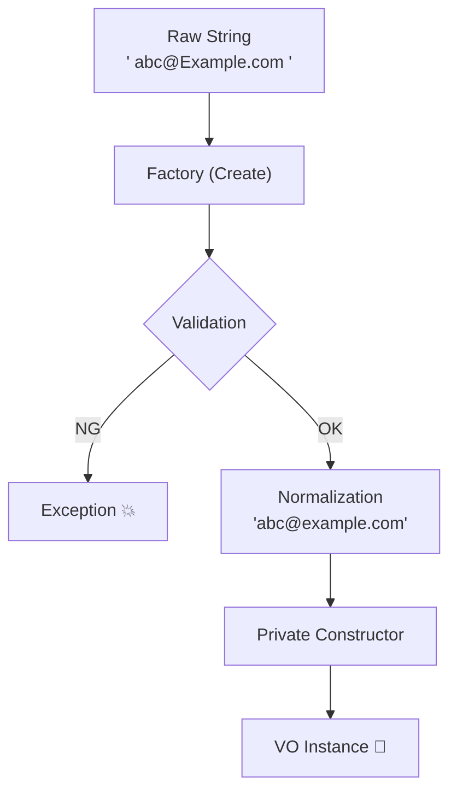

# 第07章：C#でVOを“気持ちよく”書くための道具箱🧰✨

この章のゴールはこれっ👇✨
**「VO（値オブジェクト）を、C#の言語機能で“安全＆読みやすく＆作りやすく”実装できる」**ようになることだよ〜💎🫶

---

## 1) まずVOの“理想形”を1枚で覚えよ〜💎📌

VOが気持ちいい理由は、だいたいこの3つセット👇

* **不変（基本、作ったら変えない）**🔒
* **自己検証（作れた時点で正しい）**✅
* **等価性（値が同じなら同じ）**✨

この章では、この3つをC#の道具でサクッと実現するよ〜🛠️😆

---

## 2) 道具①：record（“値っぽい型”を作る神機能）🧩✨

C#の **record** は「データ中心の型」に便利な仕組みが最初から入ってるのが強いよ💪
特にVOと相性がいいのは👇

* 値の等価性（Equals / GetHashCodeがいい感じに生成）✨
* 表示（ToStringが見やすい）👀
* “変更せずに新しい値”を作る書き方（with式）🧬

このへんは **recordの目的が“不変データモデルを支援”**だからなんだよね💎
（recordの公式説明にもそう書いてあるよ）([Microsoft Learn][1])

### record class と record struct、どっち使う？🤔

ざっくりおすすめは👇

* **最初は record class（参照型）**が安心😊
* パフォーマンス最適化したくなったら **readonly record struct** を検討🔥

理由：**record struct は “既定値（default）で作れちゃう”**から、VOの「無効状態を作れない」が崩れやすいの🥺
record struct には「各フィールドを既定値にするパラメータなしコンストラクタ」があるよ、って公式にもあるよ([Microsoft Learn][1])

---

## 3) 道具②：init-only（作成時だけセットOK）🧊✨

record（特に record class / readonly record struct）の“位置指定プロパティ”は **init-only** になって、
**作った後にプロパティを書き換えにくい**方向へ寄せられるよ🔒✨([Microsoft Learn][1])

ただし注意⚠️
「init-onlyだから完全不変！」ではなくて、**参照先（配列やListなど）は中身が変えられる**こともあるよ😅
→ VOの中にミュータブルなコレクションを入れるなら、ReadOnly化やコピーが必要になることがあるよ🧺✨([Microsoft Learn][1])

---

## 4) 道具③：Nullable参照型（null事故をコンパイルで潰す）🚧✨

VOは「作れた時点で正しい」が命💎
だから **“nullが入り得るか”を型で表現**できる Nullable参照型は、めちゃ相性いいよ〜🙌

プロジェクト全体で有効化するなら、csprojにこれ👇
（公式チュートリアルにもそのまま載ってるよ）([Microsoft Learn][2])

```xml
<PropertyGroup>
  <Nullable>enable</Nullable>
</PropertyGroup>
```

これを入れると、例えば👇みたいな事故が早めに見える👀💥

* 本当は必須の string に null が入る
* nullかもな値をそのまま使う

---

## 5) 道具④：C# 14の“ちょい足し便利機能”も知っとく✨🆕

本日時点の最新のC#は **C# 14（.NET 10）**だよ〜🆕✨
（公式の「Announcing .NET 10」や「C# 14 の新機能」に明記されてるよ）([Microsoft for Developers][3])

VOまわりで “地味に便利” なのは例えば👇

* **field backed properties**：プロパティの裏フィールドを自動で作って、`field`で触れる（ちょいカスタムに強い）([Microsoft for Developers][3])
* **null-conditional assignment（?.=）**：null安全な代入が書きやすい([Microsoft Learn][4])

※この章では深追いしないけど、「へぇ〜こういう便利なの増えたんだ〜」くらいでOKだよ😊✨

---

## 6) ここから実装！Email をVOとして作ろう📧💎（推奨：record class + Factory）




### 方針（VOとして“美味しい形”）🍰✨

* 外から勝手に new されない（＝検証なし生成を防ぐ）🔒
* 生成時に正規化＆検証（作れたら正しい）✅
* 中身は string 1つでも、**型で守る**💎

---

### ✅ 実装例：Email VO（Factoryで検証）📧✨

```csharp
using System;
using System.Net.Mail;

public sealed record Email
{
    public string Value { get; }

    private Email(string value) => Value = value;

    public static Email Create(string raw)
    {
        if (string.IsNullOrWhiteSpace(raw))
            throw new ArgumentException("メールアドレスが空だよ😢", nameof(raw));

        // よくある“余計な空白”を先に除去（入力あるある対策）
        var normalized = raw.Trim();

        // 超ざっくりだけど実用的な最低ラインの検証（学習用にまずはこれでOK）
        // MailAddressはフォーマットチェックに使える
        _ = new MailAddress(normalized);

        return new Email(normalized);
    }

    public override string ToString() => Value;
}
```

ポイント解説だよ〜🫶✨

* `private` コンストラクタ：**検証なしnew禁止**🚫
* `Create`：**入口で検証→中は安心**✅
* `record`：等価性まわりが自然に「値っぽく」なる✨([Microsoft Learn][1])

---

## 7) もっと“VOっぽく”する小ワザ集🧰✨

### (A) 正規化してから持つ（等価性が安定する）🧼✨

たとえば Email を **小文字で統一**したいなら、

* `normalized = raw.Trim().ToLowerInvariant();`

みたいに「同じ扱いにしたい形」に揃えてから保存すると、
**Equalsがブレなくなる**よ〜✨

### (B) VOは“プリミティブを晒しすぎない”🙈➡️🙉

`Value` は公開していいけど、
「どこでも string として扱える」状態に戻しすぎると、またプリミティブ地獄になりがち😇
なので、必要な操作は VO 側に寄せるのが気持ちいいよ💎

---

## 8) テストで“作れた時点で正しい”を体感🧪✨（xUnit例）

```csharp
using System;
using Xunit;

public class EmailTests
{
    [Fact]
    public void Create_valid_email_ok()
    {
        var email = Email.Create("test@example.com");
        Assert.Equal("test@example.com", email.Value);
    }

    [Theory]
    [InlineData("")]
    [InlineData("   ")]
    [InlineData("not-an-email")]
    public void Create_invalid_email_throw(string raw)
    {
        Assert.ThrowsAny<Exception>(() => Email.Create(raw));
    }

    [Fact]
    public void Equality_value_based()
    {
        var a = Email.Create("a@example.com");
        var b = Email.Create("a@example.com");
        Assert.Equal(a, b); // recordなので“値が同じなら同じ”になりやすい✨
    }
}
```

---

## 9) ミニ演習（10〜15分）🎯✍️✨

### 演習①：Emailをちょい強化しよ📧💪

* `Trim()` は必ずする
* できたら `ToLowerInvariant()` もやってみる
* テストを追加：「大文字小文字が違っても同一扱い」になるか確認✨

### 演習②：Nullableの警告を“味方”にする🚧🫶

* わざと `string? raw = null;` を渡してみて、
  どこで警告／例外になるか観察してみよ👀✨
  （null安全を“体感”するの大事！）

---

## 10) AI活用（Copilot/Codex）で爆速にする🤖💨✨

そのままコピペで使える依頼文いくよ〜📩✨

* **VO雛形を作らせる**
  「C#のrecordでEmailのValue Objectを作って。private ctor + Createで検証。xUnitテストも一緒に」

* **レビュー観点を出させる**
  「このEmail VO、VOとして不変性/等価性/入力検証の観点で問題点がないかチェックして」

* **テストケース増やす**
  「Email VOのテストケース案を境界値と異常系中心に10個出して」

AIの出力は便利だけど、最後は人間が
「このルールで合ってる？」って決めるのが一番大事だよ〜🧠✨

---

## まとめ（この章で持ち帰るやつ）🎒✨

* VOは **不変🔒 / 自己検証✅ / 等価性✨**
* C#では **record** と **Nullable参照型** が超相性いい💎
* 最初は **record class + Factory** が安全でわかりやすい🙆‍♀️
* テストで「作れた時点で正しい」を体感しよう🧪✨

---

次の第8章は、VOの等価性が **Dictionary/HashSet** でどう効いてくるか（超重要💥）をやるよ〜📦✨

[1]: https://learn.microsoft.com/ja-jp/dotnet/csharp/language-reference/builtin-types/record "レコード - C# reference | Microsoft Learn"
[2]: https://learn.microsoft.com/ja-jp/dotnet/csharp/tutorials/nullable-reference-types "null 許容参照型を使用して設計する - C# | Microsoft Learn"
[3]: https://devblogs.microsoft.com/dotnet/announcing-dotnet-10/ "Announcing .NET 10 - .NET Blog"
[4]: https://learn.microsoft.com/en-us/dotnet/csharp/whats-new/csharp-14 "What's new in C# 14 | Microsoft Learn"
