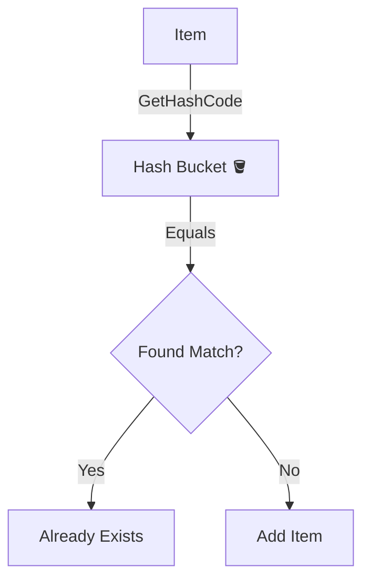

# 第08章：等価性をちゃんと理解（比較・辞書・Hashの話）🧷✨

この章はひとことで言うと…
**「VO（値オブジェクト）が、HashSetやDictionaryの中でも“壊れない”理由を、体で理解する回」**だよ〜！🧠✨

---

## 0. この章のゴール 🎯✨

ここまでで VO は「値で同じなら同じ」💎って話をしたけど、実務で効いてくるのはここから👇

* **VOをHashSetに入れたら、重複がちゃんと消える**📦✨
* **VOをDictionaryのキーにしても、ちゃんと取り出せる**🗝️✅
* **“ミュータブル（変更できる）VO”が、なぜ地雷なのか分かる**😱💥
* **Equals / GetHashCode の“守るべき約束”を言える**🧾✅

ちなみに今の最新世代（.NET 10 / C# 14）でも、この基本ルールはド本命で変わらないよ〜！🚀✨ ([Microsoft for Developers][1])

---

## 1. まず「等価性」って何？🤔💎（EntityとVOで違うよ！）


### ✅ Entity（エンティティ）

* 「同じ人か？」みたいに **ID（同一性）で追う**🆔
* 中身（状態）が変わっても「本人」は同じ

### ✅ VO（値オブジェクト）

* 「値が同じなら同じ」っていう **等価性（value equality）**💎
* 例：Money(100 JPY) と Money(100 JPY) は同じ扱いにしたい✨

C# の record / record struct は、まさにこの **“値で同じなら同じ”**を標準で助けてくれるよ〜！🧩 ([Microsoft Learn][2])

---

## 2. Equals と GetHashCode の“超だいじな約束”🧠🧾


VOをHashSetやDictionaryで安全に使うには、この約束が命…！🔥

### ✅ 約束その1：**Equals が true なら、GetHashCode も同じ値**

> 「等しいオブジェクトは、等しいハッシュコードを持つ必要がある」
> これ守らないと、HashSet/Dictionary が正しく動かないよ〜！😵‍💫 ([Microsoft Learn][3])

### ✅ 約束その2：**逆は成り立たない（同じHashでもEqualsとは限らない）**

* hash は「ざっくり振り分け番号」みたいなもの📮
* 同じ番号に“偶然”入ること（衝突）はある🙂
* だから最終的には Equals で確定するよ〜！ ([Stack Overflow][4])

---

## 3. HashSet / Dictionary が何をしてるか（イメージ）📦🗝️✨




### 🧺 HashSet（重複を入れない）

1. まず **GetHashCode** で置き場（バケツ）を決める🪣
2. 同じバケツの中だけ **Equals** で「同じ？」判定する🔍

### 🗝️ Dictionary（キーで高速に探す）


1. キーの **GetHashCode** で候補を絞る
2. **Equals** で「このキーだ！」を確定する

あと、どっちも基本は **EqualityComparer<T>.Default** を使うよ〜！
（IEquatable<T> を実装してたらそれを優先してくれる✨） ([Microsoft Learn][5])

---

## 4. 実装はどうする？いちばんラクで強いのは record 💎🧩


VOは「値の集まり」だから、基本はこれが気持ちいい👇

* **readonly record struct**（軽い・不変に寄せやすい）✨
* **record class**（参照型で扱いたい時）

record は “値ベース等価”を言語が用意してくれてるよ〜！ ([Microsoft Learn][2])

---

## 5. 実演：Money を VO にして HashSet で検証しよ〜！💰🧪✨

### 5-1. Money（VO）を作る 💎

```csharp
public readonly record struct Money(decimal Amount, string Currency)
{
    // 追加ルールは今は最小でOK（この章は等価性が主役！）
}
```

record struct なので、**Equals / GetHashCode / == / !=** が “値ベース”で自動生成されるよ〜！🪄✨ ([Microsoft Learn][2])

---

### 5-2. HashSet で「重複が消える」確認 🧺✅

```csharp
using System;
using System.Collections.Generic;

public static class Demo
{
    public static void Run()
    {
        var set = new HashSet<Money>();

        set.Add(new Money(100m, "JPY"));
        set.Add(new Money(100m, "JPY")); // 同じ値！
        set.Add(new Money(100m, "USD")); // 通貨が違うので別物

        Console.WriteLine(set.Count); // 期待：2
        Console.WriteLine(set.Contains(new Money(100m, "JPY"))); // 期待：True
    }
}
```

これが「VOがコレクションで壊れない」の基本形だよ〜！🎉
（内部では GetHashCode + Equals の約束で動いてる） ([Microsoft Learn][3])

---

## 6. ここが地獄：ミュータブルVOが危険な理由 😱💥


HashSet / Dictionary のキーにした値が **あとから変わる**と…
「置き場（hash）」が変わっちゃって、探せなくなることがあるよ〜！🫠

### 🔥 危険な例（わざとダメなVO）

```csharp
using System;
using System.Collections.Generic;

public sealed class MoneyMutable
{
    public decimal Amount { get; set; }
    public string Currency { get; set; } = "";

    public override bool Equals(object? obj)
        => obj is MoneyMutable other
           && Amount == other.Amount
           && Currency == other.Currency;

    public override int GetHashCode()
        => HashCode.Combine(Amount, Currency);
}

public static class MutableDemo
{
    public static void Run()
    {
        var set = new HashSet<MoneyMutable>();

        var m = new MoneyMutable { Amount = 100m, Currency = "JPY" };
        set.Add(m);

        // ここで値を変える（最悪）
        m.Amount = 200m;

        // えっ…入ってるのに見つからない！？😱
        Console.WriteLine(set.Contains(m)); // False になり得る
    }
}
```

ポイントはこれ👇

* HashSet は「入れたときのhash」で置き場を決める🪣
* その後に値が変わると、**“今のhash”で探しに行って見つからない**ことがある😱

だから VO は基本 **不変** が強いんだよ〜！🔒✨

（HashCode.Combine は複数値を混ぜるための公式手段のひとつだよ〜） ([Microsoft Learn][6])

---

## 7. 「同じ」の定義をカスタムしたい時（IEqualityComparer）🎛️✨


たとえば Email を「大文字小文字を無視して同じ扱いにしたい」みたいな時があるよね📧🙂
そんな時は **IEqualityComparer<T>** をHashSet/Dictionaryに渡せる！ ([Microsoft Learn][7])

### 例：通貨コードは大文字小文字無視にしたい（簡易版）💰

```csharp
using System;
using System.Collections.Generic;

public readonly record struct Money(decimal Amount, string Currency);

public sealed class MoneyComparerIgnoreCurrencyCase : IEqualityComparer<Money>
{
    public bool Equals(Money x, Money y)
        => x.Amount == y.Amount
           && string.Equals(x.Currency, y.Currency, StringComparison.OrdinalIgnoreCase);

    public int GetHashCode(Money obj)
        => HashCode.Combine(obj.Amount,
            StringComparer.OrdinalIgnoreCase.GetHashCode(obj.Currency ?? ""));
}

public static class ComparerDemo
{
    public static void Run()
    {
        var set = new HashSet<Money>(new MoneyComparerIgnoreCurrencyCase());

        set.Add(new Money(100m, "jpy"));
        set.Add(new Money(100m, "JPY"));

        Console.WriteLine(set.Count); // 期待：1
    }
}
```

これで「同じ扱い」のルールをコレクション側に注入できるよ〜！💉✨

---

## 8. ミニ演習（10〜15分）🧪⏱️✨

### 🧪 演習A：HashSetで“重複排除”を体感しよう

1. Money(100, "JPY") を2回 Add
2. Count が 1 になるのを確認✅
3. Money(100, "USD") を Add して Count が 2 になるのを確認✅

### 🧪 演習B：Dictionaryのキーにしてみよう🗝️

1. Dictionary<Money, string> を作る
2. Money(100, "JPY") → "アイスラテ" を入れる☕️
3. 同じ Money で取り出せるか確認✅
   （recordの等価性が効いてる✨） ([Microsoft Learn][8])

### 🧪 演習C（怖さ体験😱）：ミュータブル地雷

1. わざと MoneyMutable を作って HashSet に入れる
2. 値を変えて Contains が怪しくなるのを確認
3. 「だからVOは不変！」って一言でまとめる✍️🔒

---

## 9. AI活用（Copilot/Codex想定）🤖✨

### ✅ 使えるお願いの例

* 「Money を readonly record struct で作って、HashSet のテストも付けて」🧪
* 「Equals/GetHashCode の約束を破るとどう壊れるか、最小コードで見せて」💥
* 「IEqualityComparer を使った大小文字無視の比較例を作って」🎛️

### ✅ 仕上げにAIへレビュー依頼（強い）

* 「Equals が true のとき GetHashCode が必ず同じになる？確認して」🕵️‍♀️
* 「ミュータブルになってない？HashSet/Dictionaryで危険な点ある？」🔍

（Visual Studioのクイックアクションで Equals/GetHashCode を生成する機能もあるよ〜） ([Microsoft Learn][9])

---

## 10. まとめ（1分）📝✨

* VOは **値が同じなら同じ**（等価性）💎
* HashSet/Dictionary は **GetHashCode → Equals** の順で高速判定📦⚡
* 絶対ルール：**Equals が true なら hash も同じ**🧾✅ ([Microsoft Learn][3])
* ミュータブルVOは **Hash系コレクションで地雷**😱💥
* 迷ったら **record / readonly record struct** が超ラクで安全🧩✨ ([Microsoft Learn][2])

---

次の章（第9章）に行く前に、もしよければ✨
この章の Money をベースにして「Emailも同じ感じでVO化」するミニ版も一緒に作れるよ〜！📧💎😊

[1]: https://devblogs.microsoft.com/dotnet/announcing-dotnet-10/?utm_source=chatgpt.com "Announcing .NET 10"
[2]: https://learn.microsoft.com/en-us/dotnet/csharp/language-reference/builtin-types/record?utm_source=chatgpt.com "Records - C# reference"
[3]: https://learn.microsoft.com/en-us/dotnet/csharp/programming-guide/statements-expressions-operators/how-to-define-value-equality-for-a-type?utm_source=chatgpt.com "How to define value equality for a class or struct - C#"
[4]: https://stackoverflow.com/questions/4249064/using-gethashcode-to-test-equality-in-equals-override?utm_source=chatgpt.com "c# - Using GetHashCode to test equality in Equals override"
[5]: https://learn.microsoft.com/en-us/dotnet/api/system.collections.generic.equalitycomparer-1.default?view=net-10.0&utm_source=chatgpt.com "EqualityComparer<T>.Default Property"
[6]: https://learn.microsoft.com/en-us/dotnet/api/system.hashcode.combine?view=net-10.0&utm_source=chatgpt.com "HashCode.Combine Method (System)"
[7]: https://learn.microsoft.com/en-us/dotnet/api/system.collections.generic.iequalitycomparer-1?view=net-10.0&utm_source=chatgpt.com "IEqualityComparer<T> Interface (System.Collections. ..."
[8]: https://learn.microsoft.com/en-us/dotnet/api/system.collections.generic.dictionary-2?view=net-10.0&utm_source=chatgpt.com "Dictionary<TKey,TValue> Class"
[9]: https://learn.microsoft.com/en-us/visualstudio/ide/reference/generate-equals-gethashcode-methods?view=visualstudio&utm_source=chatgpt.com "Generate C# Equals and GetHashCode Method Overrides"
