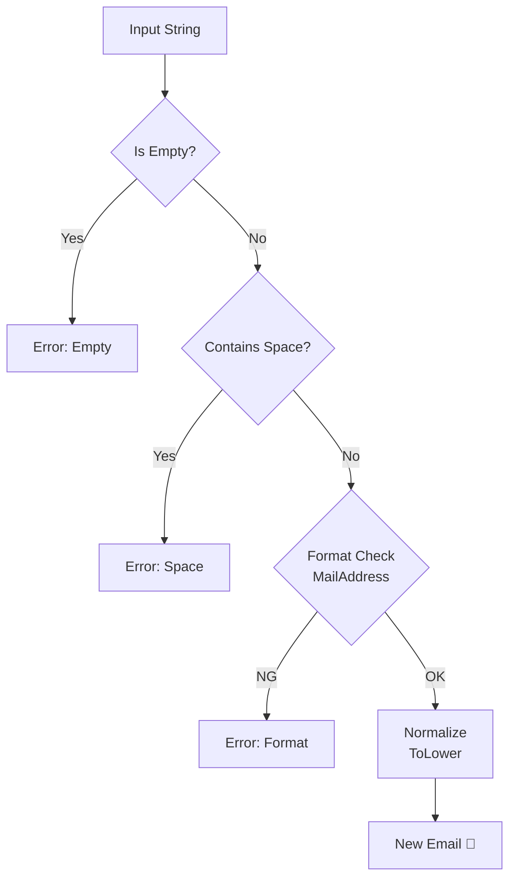

# 第09章：VO実装① Email（バリデーションの基本）📧✅

この章では「Emailは、**作れた時点で正しい**」を体で覚えます💪✨
（2026年1月時点の最新：.NET 10 LTS＋C# 14 前提だよ〜🧁） ([Microsoft][1])

---

## 1) この章のゴール🎯✨

* 入力された文字列を、**EmailというVO**に変換できる📧➡️💎
* **変なEmailは“生成できない”**ようにできる🚫
* 失敗したときに、**理由（エラーメッセージ）**も返せる🙂🧾

---

## 2) Emailの検証って、実は3段階あるの😳📮

Emailって「見た目がそれっぽい」だけじゃ足りないことがあるよ〜💦
だいたいこんな3段階👇

1. **形式チェック**（`@`がある、空白がない…など）🧼
2. **実在チェック**（DNS/MXとか、ドメインが存在するか）🌍
3. **到達チェック**（確認メールを送って、クリックしてもらう）📩✅

この章はまず **①形式チェック**だけやるよ！🙂✨
“完全なRFC準拠”を正規表現でやろうとすると沼りやすいので、**やりすぎない**のがコツ🫠（メールの形式は仕様上かなり幅が広いよ） ([datatracker.ietf.org][2])

---

## 3) 今回の「最小ライン」ルール（やりすぎない）🧁✅

学内カフェ注文アプリ☕️🧾では、まずこれで十分なことが多いよ👇

* 空じゃない（null/空文字/空白だけはNG）🚫
* 前後の空白はトリムする✂️
* 途中に空白が入ってたらNG（`"a b@c.com"`みたいなの）🚫
* 「表示名つき」みたいな文字列はNG（`"Alice <a@b.com>"`）🚫
* 形式パースは **`MailAddress.TryCreate`** を使う（例外を投げないので扱いやすい）✨ ([Microsoft Learn][3])

---

## 4) 実装：Email VO（TryCreateパターン）💎📧




ポイントはココ👇

* **コンストラクタは隠す**（勝手に作れない）🔒
* **TryCreateが入口**（ここで検証して、OKなら生成）🚪✨
* 値は **正規化（ここでは小文字化）**しておくと、比較がラク🧊

```csharp
using System;
using System.Net.Mail;

namespace Cafe.Domain;

public readonly record struct Email
{
    public string Value { get; }

    private Email(string value) => Value = value;

    public override string ToString() => Value;

    // ✅ 失敗理由も返せる TryCreate
    public static bool TryCreate(string? input, out Email email, out string error)
    {
        email = default;
        error = "";

        if (string.IsNullOrWhiteSpace(input))
        {
            error = "メールアドレスが空だよ〜🥺";
            return false;
        }

        var s = input.Trim();

        // 空白混入は事故りやすいので早めに弾く🙂
        if (s.Contains(' '))
        {
            error = "メールアドレスに空白が入ってるよ〜😵";
            return false;
        }

        // ✅ .NETのパーサで“形式として”作れるかチェック（例外なし）
        if (!MailAddress.TryCreate(s, out var parsed) || parsed is null)
        {
            error = "メールアドレスの形式が変かも…🤔";
            return false;
        }

        // 「Alice <a@b.com>」みたいな“表示名付き”は今回はNGにする
        if (!string.Equals(parsed.Address, s, StringComparison.OrdinalIgnoreCase))
        {
            error = "表示名付き（例: Alice <a@b.com>）は使えないよ〜🙅‍♀️";
            return false;
        }

        // ✨ 正規化：小文字に寄せる（学習用の割り切り）
        email = new Email(s.ToLowerInvariant());
        return true;
    }

    // ✅ “作れなかったら例外”版（ドメイン内で雑に使いたいとき用）
    public static Email Create(string input)
    {
        if (TryCreate(input, out var email, out var error))
            return email;

        throw new ArgumentException(error, nameof(input));
    }
}
```

`MailAddress.TryCreate` は「作れないときに例外を投げない」Try系なので、入力検証に向いてるよ〜✨ ([Microsoft Learn][3])

---

## 5) 使い方イメージ（注文の連絡先Email）☕️🧾📧

「画面入力→VO化→ドメインは安心」って流れを作るとスッキリするよ✨

```csharp
using Cafe.Domain;

public static class CreateOrderUseCase
{
    public static void Execute(string emailText)
    {
        if (!Email.TryCreate(emailText, out var email, out var error))
        {
            // UIに優しく返す（ここではConsoleで代用）
            Console.WriteLine(error);
            return;
        }

        // ここから先は「Emailは正しい」前提で進められる✨
        Console.WriteLine($"注文者メール: {email}");
    }
}
```

---

## 6) テスト（xUnit）🧪✨

「無効なEmailは作れない」をテストで守るのがVOの気持ちよさ💎

```csharp
using Xunit;
using Cafe.Domain;

public class EmailTests
{
    [Theory]
    [InlineData("a@b.com", "a@b.com")]
    [InlineData(" USER@Example.com ", "user@example.com")]
    [InlineData("user.name+tag@sub.example.ac.jp", "user.name+tag@sub.example.ac.jp")]
    public void TryCreate_Valid_ReturnsTrue(string input, string expected)
    {
        var ok = Email.TryCreate(input, out var email, out var error);

        Assert.True(ok, error);
        Assert.Equal(expected, email.Value);
    }

    [Theory]
    [InlineData(null)]
    [InlineData("")]
    [InlineData("   ")]
    [InlineData("a@")]
    [InlineData("@b.com")]
    [InlineData("a b@c.com")]
    [InlineData("Alice <a@b.com>")]
    public void TryCreate_Invalid_ReturnsFalse(string? input)
    {
        var ok = Email.TryCreate(input, out _, out var error);

        Assert.False(ok);
        Assert.False(string.IsNullOrWhiteSpace(error));
    }

    [Fact]
    public void Equality_IsCaseInsensitive_ByNormalization()
    {
        Email.TryCreate("USER@EXAMPLE.COM", out var e1, out _);
        Email.TryCreate("user@example.com", out var e2, out _);

        Assert.Equal(e1, e2);
    }
}
```

---

## 7) ミニ演習（10〜15分）✍️⏱️✨

1. `Email.TryCreate("a@b.com")` が成功するのを確認📧✅
2. `Email.TryCreate("Alice <a@b.com>")` が失敗するのを確認🙅‍♀️
3. NGケースを **5個追加**してテストに入れる🧪✨

   * 例：`"a@b..com"`、`"a@b,com"`、`"a@@b.com"`、`"a@b.com "`、`" a@b.com"` など🙂

---

## 8) AI活用（Copilot/Codex想定）🤖✨：最短で精度を上げるコツ

そのまま貼って使えるプロンプト例だよ👇💕

* 「C# 14で Email の Value Object を `readonly record struct` で作って。`TryCreate` でエラー文字列も返して。`MailAddress.TryCreate` を使って、`Alice <a@b.com>` は弾いて。xUnit テストも一緒に」
* 「EmailのNGテストケースを20個、現実で起きがちなやつ中心で提案して」

✅ AIの出力を見たら、ここだけは目視チェックしてね👀

* **コンストラクタがpublicになってない？**（勝手に作れて崩れる）🔒
* **正規表現ゴリゴリ**になってない？（やりすぎ）🫠
* **エラーメッセージが雑**すぎない？（UIに出すとつらい）🥺

---

## 9) よくある落とし穴😵‍💫💥（先に潰そ！）

* 「RFCに完全準拠する正規表現」を目指して時間が溶ける🫠（仕様は広いよ） ([datatracker.ietf.org][2])
* `EmailAddressAttribute` だけで“完全に安心”と思い込む（用途は主に入力注釈寄り。実装は変わることもある）📌 ([Microsoft Learn][4])
* “到達するか”まで形式チェックで保証しようとする（それは確認メールの領域）📩✅

---

## まとめ🎀✨

* Emailはまず **「作れた時点で正しい」VO**にする📧💎
* 検証は **最小ラインでOK**（やりすぎない）🙂
* `TryCreate`＋テストで、入力地獄を入口で止める🧱🧪
* 次の章（Money）でも同じ型の考え方でいけるよ〜！💰✨

必要なら、このEmail VOを **Order（注文）に組み込むところ**まで一気に“章の続き”として書くよ〜☕️🧾💪

[1]: https://dotnet.microsoft.com/en-US/download/dotnet/10.0?utm_source=chatgpt.com "Download .NET 10.0 (Linux, macOS, and Windows) | .NET"
[2]: https://datatracker.ietf.org/doc/html/rfc5322?utm_source=chatgpt.com "RFC 5322 - Internet Message Format - Datatracker - IETF"
[3]: https://learn.microsoft.com/en-us/dotnet/api/system.net.mail.mailaddress.trycreate?view=net-10.0&utm_source=chatgpt.com "MailAddress.TryCreate Method (System.Net.Mail)"
[4]: https://learn.microsoft.com/en-us/dotnet/api/system.componentmodel.dataannotations.emailaddressattribute?view=net-10.0&utm_source=chatgpt.com "EmailAddressAttribute Class (System.ComponentModel. ..."
