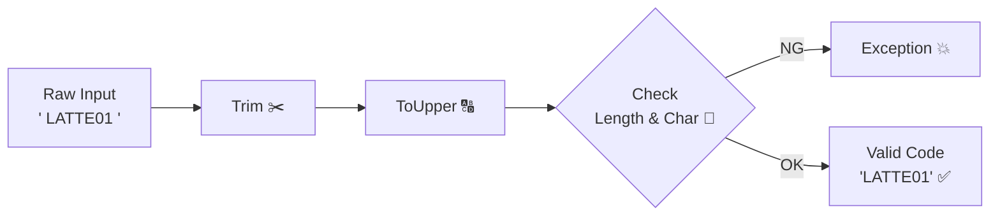

# 第11章：VO実装③ Quantity / Percentage / Code（よく出る形）📦💎

この章は「VOを量産できるようになる回」だよ〜！😆✨
`int` / `decimal` / `string` をそのまま使うと、**“どこでも誰でも好き勝手に入れられる”** から、いつか必ずバグる…🥺💥
だから **「制約つきの型」＝Value Object（VO）** にして、**安全な値だけが通れる道**を作るよ🛡️🌸

※本章のコードは **C# 13 + .NET 9** 前提で書くね（C# 13 は .NET 9 SDK で試せるよ）([Microsoft Learn][1])
※テストは xUnit（xUnit v3 は .NET 8 以降対応）でOKだよ〜🧪✨([xunit.net][2])

---

## 1) 今日のゴール 🎯✨

できるようになりたいことはこれ👇

* **Quantity（数量）**：`1以上` みたいなルールを型に閉じ込める📦✅
* **Percentage（割合）**：`0〜100` の範囲＋小数もOKにする📊✨
* **Code（コード）**：`英数字だけ` / `桁数固定` / `大文字化` みたいな“地味に大事”を守る🔤🔒
* そして何より…
  **プリミティブ地獄（int/stringだらけ）から卒業**する🏃‍♀️💨

---

## 2) まずは“VOの共通テンプレ”を作ろう🧩✨

VOを量産するコツは、毎回同じ型を作ることじゃなくて
**「同じ型の作り方（設計の型）」を持つこと**だよ🙂💡

VOの基本テンプレ（超大事3点）👇

1. **不変**：作ったら基本変えない🔒
2. **自己検証**：作るときにルール確認✅
3. **等価性**：中身（値）が同じなら同じ✨（recordが得意！）

「失敗したら例外」でもいいし、「TryCreateで安全に返す」でもOK👌
学習しやすいように、**両方**いくよ〜！😆

---

## 3) Quantity VO（数量）📦✨


### 3-1) 何が嬉しいの？😊

たとえば注文明細で数量が `0` や `-1` になったら変だよね？😅
`int` のままだと、どこからでも入っちゃう…💥
だから **Quantity型**にして「変な値はそもそも生成できない」にするよ🛡️

### 3-2) 実装（Create + TryCreate）🛠️

* 例：カフェの注文数量は **1〜99** にしてみる（上限は例だよ）☕️

```csharp
namespace Cafe.Domain;

public sealed record Quantity
{
    public int Value { get; }

    private Quantity(int value) => Value = value;

    public static Quantity Create(int value)
    {
        if (value < 1) throw new ArgumentOutOfRangeException(nameof(value), "数量は1以上だよ📦");
        if (value > 99) throw new ArgumentOutOfRangeException(nameof(value), "数量は99以下にしてね📦");
        return new Quantity(value);
    }

    public static bool TryCreate(int value, out Quantity? quantity, out string? error)
    {
        if (value < 1)
        {
            quantity = null;
            error = "数量は1以上だよ📦";
            return false;
        }

        if (value > 99)
        {
            quantity = null;
            error = "数量は99以下にしてね📦";
            return false;
        }

        quantity = new Quantity(value);
        error = null;
        return true;
    }

    public Quantity Add(Quantity other)
        => Create(checked(Value + other.Value)); // checkedでオーバーフローも検知💥

    public override string ToString() => Value.ToString();
}
```

### 3-3) テスト（xUnit）🧪✨

```csharp
using Cafe.Domain;
using Xunit;

public class QuantityTests
{
    [Fact]
    public void Create_1は作れる()
    {
        var q = Quantity.Create(1);
        Assert.Equal(1, q.Value);
    }

    [Theory]
    [InlineData(0)]
    [InlineData(-1)]
    public void Create_1未満は例外(int value)
    {
        Assert.Throws<ArgumentOutOfRangeException>(() => Quantity.Create(value));
    }

    [Fact]
    public void Add_足し算できる()
    {
        var a = Quantity.Create(2);
        var b = Quantity.Create(3);

        var c = a.Add(b);

        Assert.Equal(5, c.Value);
    }
}
```

---

## 4) Percentage VO（割合）📊✨

### 4-1) ありがち事故😱

* `150%` が入る
* `-3%` が入る
* `0.1` が「0.1%」なのか「10%」なのか曖昧になる

だから「%の型」を作って、意味を固定しちゃう😆✨

### 4-2) 実装（0〜100、decimal対応）🛠️

割引とかで小数が欲しいことあるので、`decimal` でいくよ〜💕

```csharp
namespace Cafe.Domain;

public sealed record Percentage
{
    public decimal Value { get; } // 0〜100（%）

    private Percentage(decimal value) => Value = value;

    public static Percentage Create(decimal value)
    {
        if (value < 0m) throw new ArgumentOutOfRangeException(nameof(value), "割合は0%以上だよ📊");
        if (value > 100m) throw new ArgumentOutOfRangeException(nameof(value), "割合は100%以下だよ📊");
        return new Percentage(value);
    }

    public static bool TryCreate(decimal value, out Percentage? percentage, out string? error)
    {
        if (value < 0m)
        {
            percentage = null;
            error = "割合は0%以上だよ📊";
            return false;
        }

        if (value > 100m)
        {
            percentage = null;
            error = "割合は100%以下だよ📊";
            return false;
        }

        percentage = new Percentage(value);
        error = null;
        return true;
    }

    /// <summary>
    /// 12.5% -> 0.125 (割合)
    /// </summary>
    public decimal ToRate() => Value / 100m;

    public override string ToString() => $"{Value}%";
}
```

### 4-3) テスト🧪✨

```csharp
using Cafe.Domain;
using Xunit;

public class PercentageTests
{
    [Theory]
    [InlineData(0)]
    [InlineData(12.5)]
    [InlineData(100)]
    public void Create_範囲内は作れる(decimal value)
    {
        var p = Percentage.Create(value);
        Assert.Equal(value, p.Value);
    }

    [Theory]
    [InlineData(-0.01)]
    [InlineData(100.01)]
    public void Create_範囲外は例外(decimal value)
    {
        Assert.Throws<ArgumentOutOfRangeException>(() => Percentage.Create(value));
    }

    [Fact]
    public void ToRate_割合に変換できる()
    {
        var p = Percentage.Create(12.5m);
        Assert.Equal(0.125m, p.ToRate());
    }
}
```

> 💡補足：丸め（小数点何桁まで？）は業務ルール次第だよ🙂
> たとえば「小数第2位まで」にしたいなら、Createの中で丸める、みたいに**“VOで統一”**すると超キレイ✨

---

## 5) Code VO（英数字コード）🔤🔒




### 5-1) ここが地味に強い💪

コードって `string` で済ませがちだけど、
**空白混入**とか **小文字混入**とか **桁数違い**がめちゃ多い😅💥

例：メニューコード `LATTE01`（英数字8桁）みたいに決めるとする☕️✨

* 前後の空白はトリム✂️
* 小文字は大文字に統一🔠
* 英数字以外はNG🚫

### 5-2) 実装（正規表現なし・初心者向け）🛠️

```csharp
namespace Cafe.Domain;

public sealed record MenuItemCode
{
    public string Value { get; }

    private MenuItemCode(string value) => Value = value;

    public static MenuItemCode Create(string raw)
    {
        var normalized = Normalize(raw);

        if (normalized.Length != 8)
            throw new ArgumentException("メニューコードは8文字にしてね🔤", nameof(raw));

        foreach (var ch in normalized)
        {
            if (!char.IsLetterOrDigit(ch))
                throw new ArgumentException("メニューコードは英数字だけだよ🔤", nameof(raw));
        }

        return new MenuItemCode(normalized);
    }

    public static bool TryCreate(string raw, out MenuItemCode? code, out string? error)
    {
        var normalized = Normalize(raw);

        if (normalized.Length != 8)
        {
            code = null;
            error = "メニューコードは8文字にしてね🔤";
            return false;
        }

        foreach (var ch in normalized)
        {
            if (!char.IsLetterOrDigit(ch))
            {
                code = null;
                error = "メニューコードは英数字だけだよ🔤";
                return false;
            }
        }

        code = new MenuItemCode(normalized);
        error = null;
        return true;
    }

    private static string Normalize(string raw)
        => (raw ?? string.Empty).Trim().ToUpperInvariant();

    public override string ToString() => Value;
}
```

### 5-3) テスト🧪✨

```csharp
using Cafe.Domain;
using Xunit;

public class MenuItemCodeTests
{
    [Fact]
    public void Create_空白と小文字は正規化される()
    {
        var code = MenuItemCode.Create("  latte01 ");
        Assert.Equal("LATTE01", code.Value);
    }

    [Fact]
    public void Create_8文字じゃないと例外()
    {
        Assert.Throws<ArgumentException>(() => MenuItemCode.Create("ABC"));
    }

    [Fact]
    public void Create_英数字以外が混ざると例外()
    {
        Assert.Throws<ArgumentException>(() => MenuItemCode.Create("LATTE-01"));
    }
}
```

---

## 6) 使い方イメージ（Entity側がスッキリする）😍✨

VOができると、Entityがこうなる👇
「守るべきルール」が型に寄るから、読むだけで安心感🫶

```csharp
namespace Cafe.Domain;

public sealed class OrderLine
{
    public MenuItemCode ItemCode { get; }
    public Quantity Quantity { get; private set; }

    public OrderLine(MenuItemCode itemCode, Quantity quantity)
    {
        ItemCode = itemCode;
        Quantity = quantity;
    }

    public void ChangeQuantity(Quantity newQuantity)
    {
        Quantity = newQuantity; // Quantityの時点で安全✅
    }
}
```

---

## 7) ありがちな落とし穴（先に踏み抜きポイント潰す😆）🕳️💥

* **VOに“ただの値”以上の意味があるか？**
  → Quantity/Percentage/Code は意味が強いからVO向き💎
* **構造体（struct）で作ると default 問題がある**😵
  → 慣れるまでは **record class（今の実装）**でOKだよ👌
* **正規化（trim/upper）を入口でやらないと、同じものが別扱い**になる😱
  → Code系VOは Normalize が命🔑✨
* **「%」が “0〜1” なのか “0〜100” なのかは絶対固定**📌
  → VOに閉じ込めれば迷いゼロ！

---

## 8) ミニ演習（10〜15分）🎓✨

### 演習A：Quantityの上限を「在庫次第」にしたい📦

* 例：`1〜999` に変えてテストも更新してみよう🧪

### 演習B：Percentageを「小数第2位まで」に揃える📊

* `Create` の中で `Math.Round(value, 2)` を入れてみよう🙂
* テストで `12.345 -> 12.35` を確認✨

### 演習C：Codeを「先頭は英字、残りは英数字」にする🔤

* 例：`A1234567` はOK、`11234567` はNG
* ループで1文字目だけ条件を変えればできるよ😆

---

## 9) AI（Copilot/Codex等）活用のコツ🤖✨

AIに頼むときのおすすめプロンプト例👇（そのまま投げてOK）

* 「C#でValue ObjectのQuantityをrecordで作って。制約は1〜99、Create/TryCreate、xUnitテストも」🧪✨
* 「MenuItemCodeを英数字8桁で、Trim+ToUpperで正規化。正規化込みのテストも」🔤✅
* 「Percentage(0〜100, decimal)のVOとToRate、境界値テスト」📊🧠

⚠️ ただし最後は必ず人間がチェック！
チェック観点はこれ👇

* そのVOが守るべきルールは**ちゃんと1箇所**にある？🧷
* 正規化（Normalize）で**同じものが同じになる**？🔁
* テストに **境界値（0/1/100/桁数）** が入ってる？🧪✨

---

## まとめ（この章で手に入れた武器）🗡️✨

* Quantity / Percentage / Code は **VOの量産に最適な題材**📦📊🔤
* “プリミティブをそのまま使う”より、**制約を型に閉じ込めた方が強い**🛡️
* `Create` と `TryCreate` を持つと、入口が超安定する🚪✨
* テストは境界値が命！🧪🔥

---

次の章（第12章）は、いよいよ **Factory / Parse / TryCreate パターン集**で「入力がstringでも安全にVO化」へ進むよ〜！😆🌉✨

[1]: https://learn.microsoft.com/en-us/dotnet/csharp/whats-new/csharp-13?utm_source=chatgpt.com "What's new in C# 13"
[2]: https://xunit.net/?utm_source=chatgpt.com "xUnit.net: Home"
