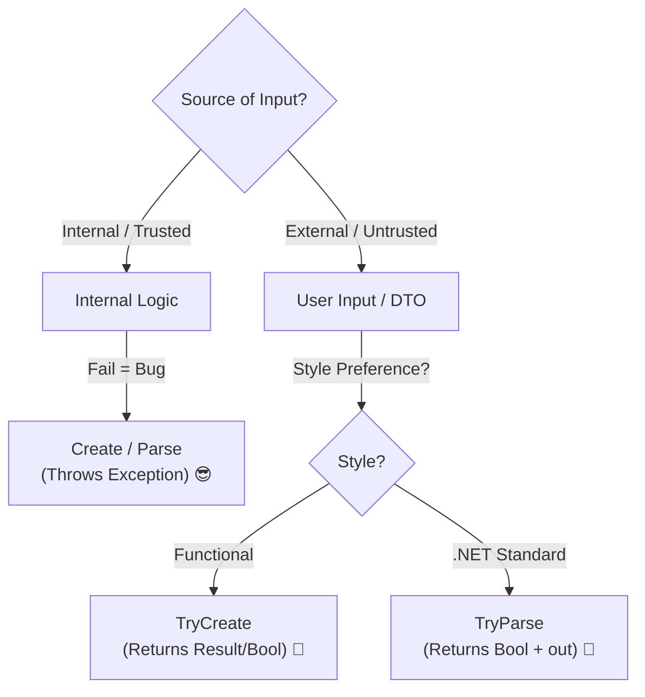

# 第12章：VOの作り方パターン集（Factory/Parse/TryCreate）🏭🧩

この章はね、ひとことで言うと👇
**「入力が string でも、ドメインの中は“ずっと安全”にする作法」**を身につける回だよ〜！😆🛡️✨

ちなみに本日時点だと、**C# 14 が最新で .NET 10 対応**だよ📌（Visual Studio 側も .NET 10 を含む前提で進めてOK） ([Microsoft Learn][1])

---

## 12.0 この章でできるようになること 🎯✨

できるようになったら勝ち！🏆

* DTOや画面入力みたいな **string地獄😵‍💫** から、ちゃんと **VOに変換**できる
* **Create / TryCreate / Parse / TryParse** を “場面で” 使い分けられる
* 「入口で検証 → 中は安心😌」の流れをコードで作れる
* 失敗したときに、**エラーを集めて返す**ところまでできる（超ミニ版）🧺✨

---

## 12.1 なんで「コンストラクタ直呼び」じゃダメなの？🤔💥

DTOってだいたいこう👇

* Email: `"komi@example.com"` ✅/❌
* Quantity: `"3"` ✅/❌
* Money: `"1200"` とか `"1,200"` とか `"１２３"` とか 🤯

もし **new Email(dto.Email)** とかできちゃうと…

* どこでも無効なEmailを作れてしまう 😱
* 「いつ壊れた？」が追えない 🔍💦
* バグが “静かに” ドメインの奥へ侵入する 🥷

だから基本方針はこれ👇

> **VOは「作れた時点で正しい」💎✅**
> そのために、**作り方（入口）を揃える**🏭✨

---

## 12.2 入口4兄弟：Create / TryCreate / Parse / TryParse 👨‍👩‍👧‍👦✨




超ざっくり表にすると👇

| 名前          | 失敗したら         | 主な用途                  | 気持ち    |
| ----------- | ------------- | --------------------- | ------ |
| `Create`    | 例外投げる💥       | 「ここで失敗したらバグ」な場所       | 強気😎   |
| `TryCreate` | false＋エラー返す🧾 | 画面入力・DTO・外部データ        | 優しい🥺  |
| `Parse`     | 例外投げる💥       | .NETっぽいAPIに寄せたい／設定値など | きっちり📏 |
| `TryParse`  | false         | パース文化（数値/日時）と同じノリにしたい | 安定🙂   |

ポイントはこれ👇
**“ユーザー入力” は失敗が普通**だから、**Try系が主役**になりやすいよ🫶✨

---

## 12.3 パターン①：Factory（Create/TryCreate）🏭✨

### ✅ ルール

* コンストラクタは **private** にして、**勝手に作れない**ようにする🔒
* `TryCreate` が本体（検証担当）🧪
* `Create` は “強制版” として `TryCreate` を呼ぶ（失敗したら例外）💥

### 例：Email VO（最小でOK版）📧✨

```csharp
using System.Text.RegularExpressions;

public sealed record Email
{
    private static readonly Regex Simple =
        new(@"^[^@\s]+@[^@\s]+\.[^@\s]+$",
            RegexOptions.Compiled | RegexOptions.CultureInvariant);

    public string Value { get; }

    private Email(string value) => Value = value;

    // 強制版：ここで失敗するなら「プログラムのバグ」扱いにしたいとき
    public static Email Create(string value)
        => TryCreate(value, out var email, out var error)
            ? email!
            : throw new ArgumentException(error, nameof(value));

    // 優しい版：入力が怪しい（DTO/画面/外部）なら基本こっち
    public static bool TryCreate(string? value, out Email? email, out string error)
    {
        email = null;

        if (string.IsNullOrWhiteSpace(value))
        {
            error = "Emailが空だよ〜🥺";
            return false;
        }

        value = value.Trim();

        if (!Simple.IsMatch(value))
        {
            error = "Emailの形が変かも…📧💦";
            return false;
        }

        email = new Email(value);
        error = "";
        return true;
    }
}
```

💡コツ

* **TryCreateの中は「短く・読みやすく」**が正義✨
* Emailの厳密なRFC地獄はやらない（学習・運用の落とし所🙂）

---

## 12.4 パターン②：Parse/TryParse（.NETの文化に寄せる）🧠📏

`.NET` には **Parse / TryParse** 文化があるよね（`int.Parse` とか）🔢✨
それに寄せると、使う人が迷いにくい👍

### 例：Quantity VO（TryParseっぽく）📦✨

```csharp
public sealed record Quantity
{
    public int Value { get; }

    private Quantity(int value) => Value = value;

    public static Quantity Parse(string s)
        => TryParse(s, out var q, out var error)
            ? q!
            : throw new FormatException(error);

    public static bool TryParse(string? s, out Quantity? quantity, out string error)
    {
        quantity = null;

        if (string.IsNullOrWhiteSpace(s))
        {
            error = "数量が空だよ〜🥺";
            return false;
        }

        if (!int.TryParse(s.Trim(), out var n))
        {
            error = "数量は数字でお願い🙏🔢";
            return false;
        }

        if (n < 1)
        {
            error = "数量は1以上だよ〜📦✨";
            return false;
        }

        quantity = new Quantity(n);
        error = "";
        return true;
    }
}
```

---

## 12.5 どれを使う？迷ったときの判断🧭✨

* DTO/画面入力/API：**TryCreate / TryParse**（失敗が普通）🙂
* アプリ内部の計算結果：**Create**（失敗したらバグとして潰したい）😎
* 設定ファイル・自分たちが管理する固定値：**Parse**（壊れてたら起動時に落として気づきたい）💥

---

## 12.6 おまけ：`IParsable<TSelf>` って何？（ちょい先取り）🎁✨

.NET には **「型がParseできるよ」**を表す `IParsable<TSelf>` があるよ📌 ([Microsoft Learn][2])
（数値型などがこれに対応して、汎用的にパースできる世界が広がったやつ！）

でもこの章では、まずは **自前の Parse/TryParse を揃える**だけで十分だよ〜🙆‍♀️✨
（必要になったら次のステップで取り入れよう！）

---

## 12.7 ミニ演習：DTO（string）→ VO化して安全にする 🧾➡️💎✨


### 🎯 お題：注文作成リクエストをVOに変換しよう☕️🧾

DTOはこんな感じ（外から来る前提）👇

```csharp
public sealed class CreateOrderRequestDto
{
    public string? CustomerEmail { get; init; }
    public string? ItemCode { get; init; }
    public string? Quantity { get; init; }
}
```

ItemCodeもVOにしちゃおう（簡易版）👇

```csharp
using System.Text.RegularExpressions;

public sealed record ItemCode
{
    private static readonly Regex Simple =
        new(@"^[A-Z0-9\-]{3,20}$", RegexOptions.Compiled);

    public string Value { get; }
    private ItemCode(string value) => Value = value;

    public static bool TryCreate(string? value, out ItemCode? code, out string error)
    {
        code = null;

        if (string.IsNullOrWhiteSpace(value))
        {
            error = "商品コードが空だよ〜🥺";
            return false;
        }

        value = value.Trim().ToUpperInvariant();

        if (!Simple.IsMatch(value))
        {
            error = "商品コードの形式が変かも…🧾💦";
            return false;
        }

        code = new ItemCode(value);
        error = "";
        return true;
    }
}
```

### ✅ 変換結果を受け取る“中間モデル”（コマンドっぽいの）🧠✨

```csharp
public sealed record CreateOrderCommand(
    Email CustomerEmail,
    ItemCode ItemCode,
    Quantity Quantity
);
```

### ✅ エラーを集めるためのミニResult（超軽量）🧺✨

```csharp
public sealed record ValidationError(string Field, string Message);

public sealed record Result<T>(bool IsSuccess, T? Value, IReadOnlyList<ValidationError> Errors)
{
    public static Result<T> Ok(T value) => new(true, value, Array.Empty<ValidationError>());
    public static Result<T> Fail(List<ValidationError> errors) => new(false, default, errors);
}
```

### ✅ DTO→Command 変換（ここが本題！）🔥✨

```csharp
public static class CreateOrderMapper
{
    public static Result<CreateOrderCommand> TryMap(CreateOrderRequestDto dto)
    {
        var errors = new List<ValidationError>();

        if (!Email.TryCreate(dto.CustomerEmail, out var email, out var e1))
            errors.Add(new ValidationError(nameof(dto.CustomerEmail), e1));

        if (!ItemCode.TryCreate(dto.ItemCode, out var itemCode, out var e2))
            errors.Add(new ValidationError(nameof(dto.ItemCode), e2));

        if (!Quantity.TryParse(dto.Quantity, out var quantity, out var e3))
            errors.Add(new ValidationError(nameof(dto.Quantity), e3));

        if (errors.Count > 0)
            return Result<CreateOrderCommand>.Fail(errors);

        // ここまで来たら「全部正しい」世界🌈✨
        return Result<CreateOrderCommand>.Ok(
            new CreateOrderCommand(email!, itemCode!, quantity!)
        );
    }
}
```

### 🧪 テスト（xUnitの雰囲気）🧪✨

```csharp
using Xunit;

public sealed class CreateOrderMapperTests
{
    [Fact]
    public void TryMap_InvalidInput_ReturnsErrors()
    {
        var dto = new CreateOrderRequestDto
        {
            CustomerEmail = "invalid",
            ItemCode = "??",
            Quantity = "0"
        };

        var result = CreateOrderMapper.TryMap(dto);

        Assert.False(result.IsSuccess);
        Assert.NotEmpty(result.Errors);
    }

    [Fact]
    public void TryMap_ValidInput_ReturnsCommand()
    {
        var dto = new CreateOrderRequestDto
        {
            CustomerEmail = "komi@example.com",
            ItemCode = "COF-001",
            Quantity = "2"
        };

        var result = CreateOrderMapper.TryMap(dto);

        Assert.True(result.IsSuccess);
        Assert.NotNull(result.Value);
        Assert.Equal("komi@example.com", result.Value!.CustomerEmail.Value);
    }
}
```

---

## 12.8 AI活用（Copilot/Codex想定）🤖✨：この章で効く使い方

### 💡 生成してもらうと速いもの

* VOの雛形（Create/TryCreate/Parse/TryParse）🏭
* テストケース案（正常・異常・境界値）🧪
* エラーメッセージの言い回し案（ユーザー向け）🫶

### 🗣️ 例プロンプト（そのまま投げてOK）✨

* 「`Quantity` VO を `TryParse` 形式で。1以上制約。xUnitテストも」🧪
* 「DTO→Command でエラーをリストに集める例を、読みやすく」🧺
* 「“例外を投げる版”と“Try版”の使い分けをコメントで説明して」📝

### ✅ AIが出したコードのチェック観点（ミニ）🔍

* 入力の `Trim()` 忘れてない？✂️
* `Try` 系で例外投げてない？（投げるなら意図がある？）💥
* 成功時だけVOを生成してる？（失敗時に中途半端に作ってない？）🧩

---

## 12.9 この章のまとめ（1分）⏱️✨

* **VOは「作れた時点で正しい」**が命💎✅
* だから入口を揃える：
  **Create（強制） / TryCreate（優しい） / Parse / TryParse** 🏭✨
* **DTO→VO** は境界の仕事🌉
  入口でVO化できたら、ドメイン中は安心して走れる🏃‍♀️💨🌈

---

次の章（第13章）では、この章でチラ見せした **「エラーをどう設計する？」（例外？Result？どこで返す？）**を、もう少し “設計として” 整えていくよ〜！⚠️🧠✨

[1]: https://learn.microsoft.com/en-us/dotnet/csharp/whats-new/csharp-14?utm_source=chatgpt.com "What's new in C# 14"
[2]: https://learn.microsoft.com/en-us/dotnet/api/system.iparsable-1?view=net-10.0&utm_source=chatgpt.com "IParsable<TSelf> Interface (System)"
