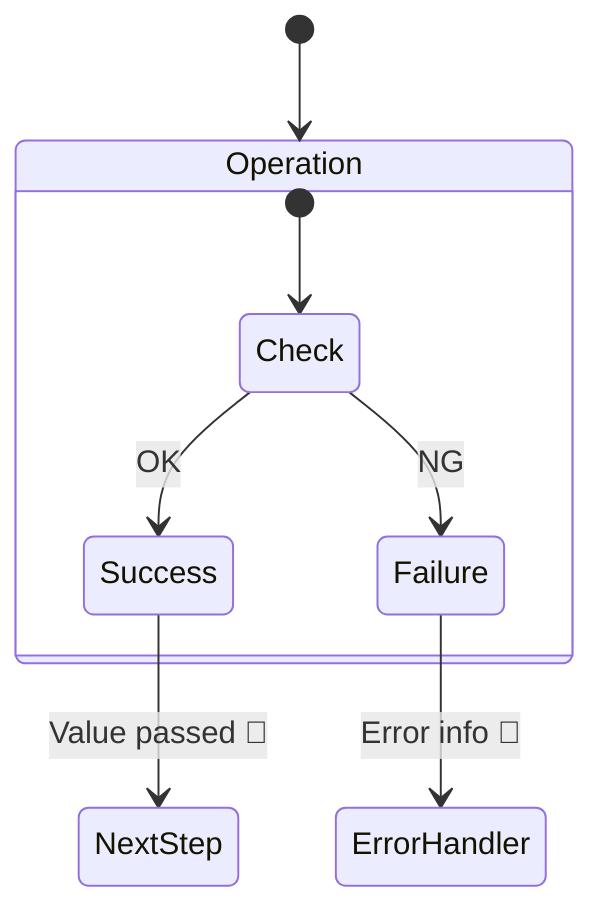

# 第13章：エラー設計の超入門（例外？Result？どこで返す？）⚠️🧠

今日は「失敗したときに、アプリがどう振る舞うべきか？」を“設計として”扱えるようになる回だよ〜！😆🍀
題材はもちろん **学内カフェ注文アプリ** ☕️🧾💕

---

## 1. 今日のゴール🎯✨

次の3つができればOK！🙆‍♀️

* 「この失敗は **例外**？それとも **Result**？」を判断できる🧠⚖️
* 「エラーは **どの層で返す**？」を決められる🧱🌉
* 「失敗理由を、ユーザーに分かる形で返す」流れを作れる🫶🖥️

---

## 2. まず“失敗”を2種類に分けよう✂️🚦


### A. 予想できる失敗（よく起きる・普通に起きる）🙂

例：入力ミス・バリデーション落ち

* メールが空だった📧🚫
* 金額がマイナスだった💰🚫
* 注文数が0だった📦🚫

👉 これは **「ユーザーに優しく説明して、直してもらう」** 失敗だよね💡
なので **Result（失敗も普通の戻り値）** が相性よし🙆‍♀️✨

### B. 予想してない失敗（基本起きてほしくない）😱

例：バグ・壊れた状態・外部トラブル

* nullが来て落ちる（想定外）💥
* DB接続が死んだ🗄️💥
* ファイルが読めない📄💥

👉 これは **「アプリ側の問題」** なので、基本は **例外（Exception）** が自然だよ〜🧯✨

---

## 3. 例外（Exception）の基本ルール🧨➡️🧯

Microsoftの設計ガイドライン的には、

* フレームワークでは **エラーは例外で報告する**（エラーコードは返さない）
* ただし **通常フローに例外を使わない**（できれば避ける）
* “事前チェック”や **TryParse系** で例外を避ける設計も推奨
* 例外は投げすぎると重い（目安として秒100回超とかは影響が出やすい）⚠️
  ([Microsoft Learn][1])

さらに、例外処理のベストプラクティスとして

* 例外が起きそうなところは `try/catch/finally`（回復できるなら）
* 「よく起きる条件」は `if` で先に避ける（例外に頼らない）
  ([Microsoft Learn][2])

---

## 4. Resultってなに？（超ざっくり）💎📦




Resultは「成功 or 失敗」を **戻り値で表す**やり方だよ〜😆✨

* ✅ 成功：値（Emailとか）を持って返す
* ❌ 失敗：エラー情報（Code / Message）を持って返す

メリット🌟

* 失敗が“想定内”として読める（try/catchまみれにならない）🙂
* UIに返すメッセージを作りやすい🫶
* テストが書きやすい🧪✨

デメリット😅

* 毎回 `IsSuccess` を見る必要がある（慣れればOK！）

---

## 5. 「どこで返す？」の結論：**境界で整理**🌉🧹✨


ここが今日の核心だよ〜！🧠🔥

### ✅ 結論（学習用の“落とし所”）🍀

* **入力→VO化**（例：Emailを作る）は **Result** で返す📧➡️💎
* **ドメインの中**は「壊れたら困る」ので、

  * 想定内の業務NGは ResultでもOK
  * “契約違反/バグ”は例外でOK
* **UI/APIの境界**で Result をメッセージに変換して表示する🖥️✨
* 予期せぬ例外は境界でまとめて捕まえて、ログ＆共通エラーにする🧯

※Web APIだと、エラーを標準形（ProblemDetails）で返すのが定番だよ〜📦
ASP.NET Core は `AddProblemDetails()` などで組み込みサポートがある👍 ([Microsoft Learn][3])

---

## 6. 実装してみよう！（ResultとError）🛠️✨


まずは「失敗理由」を入れる箱を用意するよ📦💕

```csharp
namespace Cafe.Domain;

public sealed record Error(string Code, string Message)
{
    public static readonly Error None = new("", "");
}
```

次に Result！成功・失敗の形を作るよ〜😆

```csharp
namespace Cafe.Domain;

public readonly record struct Result
{
    public bool IsSuccess { get; }
    public Error Error { get; }

    private Result(bool isSuccess, Error error)
    {
        IsSuccess = isSuccess;
        Error = error;
    }

    public static Result Success() => new(true, Error.None);
    public static Result Failure(Error error) => new(false, error);
}

public readonly record struct Result<T>
{
    public bool IsSuccess { get; }
    public Error Error { get; }
    public T? Value { get; }

    private Result(bool isSuccess, T? value, Error error)
    {
        IsSuccess = isSuccess;
        Value = value;
        Error = error;
    }

    public static Result<T> Success(T value) => new(true, value, Error.None);
    public static Result<T> Failure(Error error) => new(false, default, error);
}
```

---

## 7. ミニ演習：Email作成失敗をResultで返す📧➡️🖥️✨


「作れた時点で正しい」VOを作りつつ、**失敗理由はResultで返す**よ！

```csharp
using System.Net.Mail;

namespace Cafe.Domain;

public sealed record Email
{
    public string Value { get; }

    private Email(string value) => Value = value;

    public static Result<Email> TryCreate(string? input)
    {
        if (string.IsNullOrWhiteSpace(input))
        {
            return Result<Email>.Failure(
                new Error("email.empty", "メールアドレスを入力してね🙂📧")
            );
        }

        var trimmed = input.Trim();

        try
        {
            // “最低限の形”チェックとして MailAddress を利用（学習用の落とし所🙂）
            var addr = new MailAddress(trimmed);
            return Result<Email>.Success(new Email(addr.Address));
        }
        catch
        {
            return Result<Email>.Failure(
                new Error("email.invalid", "メールアドレスの形がちょっと変かも…🥺📧")
            );
        }
    }
}
```

### UI側（例：コンソール）でメッセージにして出す🖥️✨

```csharp
using Cafe.Domain;

Console.Write("メールアドレスを入力してね: ");
var input = Console.ReadLine();

var result = Email.TryCreate(input);

if (!result.IsSuccess)
{
    Console.WriteLine($"❌ {result.Error.Message}  (code: {result.Error.Code})");
    return;
}

Console.WriteLine($"✅ OK! Email = {result.Value!.Value} 🎉");
```

ここで大事なのはね👇
**ドメインは「失敗理由」を返すだけ**、
**どう見せるか（UI文言）は境界で調整しやすい**ってこと！🫶✨

---

## 8. 例外はどこで使うの？🧯💡


こんな感じで使い分けるとスッキリするよ〜！

* **Result向き**：入力ミス、業務ルールNG（想定内）🙂
* **例外向き**：バグっぽい、回復不能、外部I/Oの失敗😱

そして「例外を通常フローにしない」ってガイドラインがあるのも覚えておくと強い！💪
（Tester-Doer / TryParseの考え方もここにつながるよ） ([Microsoft Learn][1])

---

## 9. テストを書いて“安心”を増やす🧪✨

Resultはテストしやすいのが最高〜！😆

```csharp
using Cafe.Domain;
using Xunit;

public class EmailTests
{
    [Theory]
    [InlineData(null)]
    [InlineData("")]
    [InlineData("   ")]
    public void TryCreate_Empty_Fails(string? input)
    {
        var r = Email.TryCreate(input);

        Assert.False(r.IsSuccess);
        Assert.Equal("email.empty", r.Error.Code);
    }

    [Theory]
    [InlineData("a@b.com")]
    [InlineData("test.user+tag@example.com")]
    public void TryCreate_Valid_Succeeds(string input)
    {
        var r = Email.TryCreate(input);

        Assert.True(r.IsSuccess);
        Assert.NotNull(r.Value);
        Assert.Contains("@", r.Value!.Value);
    }
}
```

---

## 10. 判断ミニチェックリスト✅🧠✨

迷ったらこれ！🫶

* それは **“普通に起きる”失敗？** → Result🙂
* それは **“起きたらバグ/事故”レベル？** → 例外😱
* **ユーザーに直してもらう必要がある？** → Resultで理由を返す📨
* **境界（UI/API）で表示・変換する？** → そこでまとめる🌉✨

---

## 11. AI活用コーナー🤖✨（超実用）


そのまま使える依頼文いくよ〜！😆💕

* 「`Result<T>` と `Error` をC#で作って。成功/失敗のstaticメソッド付き。コメントも入れて」🧩
* 「Email.TryCreate のテストケースを10個出して（正常/異常/境界）」🧪
* 「UIに出す文言を“優しい感じ”に3案作って」🫶💬
* 「例外にすべきケースとResultにすべきケースを、このアプリの文脈で分類して」🧠⚖️

---

## まとめ🎁✨

* **失敗は2種類**：想定内（Result）／想定外（例外）🚦
* **境界で整理**すると、ドメインがキレイに保てる🌉🧹
* Resultは **UIに優しい**＆**テストしやすい**🫶🧪
* 例外は **“通常フローにしない”** のがコツ！ ([Microsoft Learn][1])
* ちなみに最新世代だと **C# 14 が最新で、.NET 10 対応**だよ〜🆕✨ ([Microsoft Learn][4])

---

次はこの流れを使って、**「ドメインエラー vs 入力エラー」をもう一段クリアにして**、Order側（状態遷移）にも広げていこう〜！☕️🧾🔥

[1]: https://learn.microsoft.com/en-us/dotnet/standard/design-guidelines/exception-throwing "Exception Throwing - Framework Design Guidelines | Microsoft Learn"
[2]: https://learn.microsoft.com/en-us/dotnet/standard/exceptions/best-practices-for-exceptions "Best practices for exceptions - .NET | Microsoft Learn"
[3]: https://learn.microsoft.com/en-us/aspnet/core/fundamentals/error-handling-api?view=aspnetcore-10.0 "Handle errors in ASP.NET Core APIs | Microsoft Learn"
[4]: https://learn.microsoft.com/en-us/dotnet/csharp/whats-new/csharp-14 "What's new in C# 14 | Microsoft Learn"
