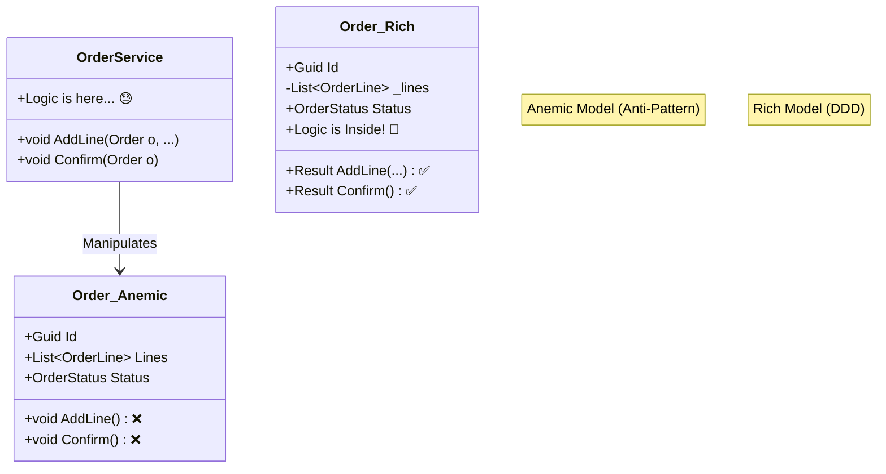

# 第14章：Entityに“ルール”を置く（貧血モデル回避）💪🧾

（題材：学内カフェ注文アプリ☕️🧁）

---

## 0. 今日のゴール🎯✨


この章が終わったら、こんな状態になってるのが理想！😆💕

* 「Order（注文）」が **ただのデータ箱** じゃなくて、**自分でルールを守れる存在**になってる✅
* 「Confirm / Cancel / AddLine」みたいな **振る舞い（メソッド）** が、Orderの中に入ってる🧠🏠
* “どこにルールを書くべき？”で迷ったときの **判断の感覚** がつく🧭✨

ちなみに今の最新版の流れとしては、**.NET 10（LTS）** が正式リリース済みで、**C# 14** が最新です✨（Visual Studio 2026 も同タイミングで更新）([Microsoft for Developers][1])

---

## 1. まず「貧血モデル」ってなに？🩸😵




**貧血モデル（Anemic Domain Model）** は一言でいうと…

> Entityが「プロパティだけ」になってて、
> ルールが全部別のクラス（サービス）に散らばってる状態😭

よくある形👇

* `Order` は `Id` と `Lines` と `Status` を持ってるだけ
* 「確定していい？」「キャンセルしていい？」みたいな判断は、全部 `OrderService` の中…😇

---

## 2. なにがツラいの？（カフェ注文で事故る）☕️💥


例：注文が **Confirmed（確定）** したあとに…

* うっかり画面側のコードが `order.Lines.Add(...)` できちゃう
* すると「確定後は変更不可」ルールが破られる😱

貧血モデルだと起きがちなこと👇

* ルールが **あちこちに散る** → 修正漏れが起きる🌀
* 同じチェックが **コピペ** される → 微妙に条件が違ってバグる😇
* テストが **書きにくい**（どこが正しいの？ってなる）🧪💦

---

## 3. ルールの置き場所は「3段階」で考える🏠📦🧠


迷ったらこの順番で考えるとラクだよ〜！😆✨

### ① 値のルール → VO（値オブジェクト）💎

* Emailの形式、Moneyが負になれない、Quantityが1以上…など
* **“その値単体で完結するルール”** は VO が最強🛡️✨

### ② そのEntityの状態・一貫性 → Entity（今回の主役）🧾💪

* 「確定後は明細追加できない」
* 「空の注文は確定できない」
* 「キャンセル済みは再確定できない」
  みたいな **“Orderの人生ルール”** は Order の中へ🏠✨

### ③ 複数Entityにまたがる → Domain Service（必要なときだけ）🧠🤝

* 「在庫」と「注文」をまたぐ
* 「会員ランク」と「割引」と「クーポン」をまたぐ
  みたいなやつはサービス側が向いてる（でも増やしすぎ注意⚠️）

---

## 4. 実装してみよう：Orderを“強くする”💪🧾✨

ここからは **Orderが自分で自分を守る** 形に変えていくよ！😆

### 4-1. まず「状態」をちゃんと持たせる🔁🟡🟢🔴


注文って、だいたい状態があるよね👇

* Draft（下書き）🟡：カート状態
* Confirmed（確定）🟢：レジに送った！
* Canceled（キャンセル）🔴：取り消し

> ルールは、この状態とセットで生まれることが多いよ〜！🧠✨

---

## 4-2. “外から勝手にいじれない”ようにする🔒🧤


超重要ポイント👇

* `public List<OrderLine> Lines { get; set; }` ← これ、危険😱
* 外部が自由に `Add/Remove` できたら、Orderのルールが崩れる💥

なので…

* 中では `List` を持つ（変更はOrderだけができる）
* 外には `IReadOnlyList` を見せる（読むだけ）

---

## 4-3. ルールをメソッドに閉じ込める🏠✨

Orderに「やっていいこと」だけを用意する感じ！

* `AddLine(...)`（明細追加）➕
* `RemoveLine(...)`（明細削除）➖
* `Confirm()`（確定）✅
* `Cancel()`（キャンセル）❌

---

## 5. コード例：Orderがルールを守る版（Resultで返す）🧾✅

> ここでは「失敗＝Resultで返す」形にしてるよ（第13章の流れに合わせやすい✨）

```csharp
using System;
using System.Collections.Generic;
using System.Linq;

public enum OrderStatus
{
    Draft,
    Confirmed,
    Canceled
}

public readonly record struct DomainError(string Code, string Message);

public readonly record struct Result(bool IsSuccess, DomainError? Error)
{
    public static Result Success() => new(true, null);
    public static Result Fail(string code, string message) => new(false, new DomainError(code, message));
}

// ここでは前の章で作ったVOがある想定：Money / Quantity など
// 例として最低限の形だけ置くよ（学習中は自分のVOに置き換えてOK✨）
public readonly record struct Quantity(int Value)
{
    public static Result TryCreate(int value, out Quantity quantity)
    {
        if (value <= 0)
        {
            quantity = default;
            return Result.Fail("Quantity.Invalid", "数量は1以上にしてね🥺");
        }
        quantity = new Quantity(value);
        return Result.Success();
    }

    public Quantity Add(Quantity other) => new(Value + other.Value);
}

public readonly record struct Money(decimal Amount)
{
    public static Result TryCreate(decimal amount, out Money money)
    {
        if (amount < 0)
        {
            money = default;
            return Result.Fail("Money.Negative", "金額がマイナスはダメだよ〜😱");
        }
        money = new Money(amount);
        return Result.Success();
    }

    public Money Multiply(int n) => new(Amount * n);
    public static Money operator +(Money a, Money b) => new(a.Amount + b.Amount);
}

public sealed class Order
{
    private readonly List<OrderLine> _lines = new();

    public Guid Id { get; }
    public OrderStatus Status { get; private set; }
    public IReadOnlyList<OrderLine> Lines => _lines.AsReadOnly();

    private Order(Guid id)
    {
        Id = id;
        Status = OrderStatus.Draft;
    }

    public static Order CreateNew() => new(Guid.NewGuid());

    public Result AddLine(Guid productId, Quantity quantity, Money unitPrice)
    {
        if (Status != OrderStatus.Draft)
            return Result.Fail("Order.NotDraft", "確定後（またはキャンセル後）は明細を変更できないよ〜🧾🔒");

        // ルール例：同じ商品は明細をまとめる（カートっぽく🛒✨）
        var existing = _lines.FirstOrDefault(x => x.ProductId == productId);
        if (existing is null)
        {
            _lines.Add(OrderLine.CreateNew(productId, quantity, unitPrice));
            return Result.Success();
        }

        existing.IncreaseQuantity(quantity);
        return Result.Success();
    }

    public Result RemoveLine(Guid lineId)
    {
        if (Status != OrderStatus.Draft)
            return Result.Fail("Order.NotDraft", "確定後（またはキャンセル後）は明細を変更できないよ〜🧾🔒");

        var target = _lines.FirstOrDefault(x => x.Id == lineId);
        if (target is null)
            return Result.Fail("OrderLine.NotFound", "その明細が見つからないよ〜🥺");

        _lines.Remove(target);
        return Result.Success();
    }

    public Money Total()
    {
        // 合計は “保存しない” で “計算する” のがまず安全✨（最初はこれでOK！）
        return _lines.Aggregate(new Money(0m), (acc, line) => acc + line.Subtotal());
    }

    public Result Confirm()
    {
        if (Status == OrderStatus.Confirmed)
            return Result.Fail("Order.AlreadyConfirmed", "もう確定済みだよ〜✅");

        if (Status == OrderStatus.Canceled)
            return Result.Fail("Order.AlreadyCanceled", "キャンセル済みは確定できないよ〜❌");

        if (_lines.Count == 0)
            return Result.Fail("Order.Empty", "明細が空の注文は確定できないよ〜🧾💦");

        Status = OrderStatus.Confirmed;
        return Result.Success();
    }

    public Result Cancel()
    {
        if (Status == OrderStatus.Canceled)
            return Result.Fail("Order.AlreadyCanceled", "もうキャンセル済みだよ〜❌");

        // ルール例：ConfirmedでもキャンセルOKにしておく（学内カフェなので柔らか運用☕️）
        Status = OrderStatus.Canceled;
        return Result.Success();
    }
}

public sealed class OrderLine
{
    public Guid Id { get; }
    public Guid ProductId { get; }
    public Quantity Quantity { get; private set; }
    public Money UnitPrice { get; }

    private OrderLine(Guid id, Guid productId, Quantity quantity, Money unitPrice)
    {
        Id = id;
        ProductId = productId;
        Quantity = quantity;
        UnitPrice = unitPrice;
    }

    public static OrderLine CreateNew(Guid productId, Quantity quantity, Money unitPrice)
        => new(Guid.NewGuid(), productId, quantity, unitPrice);

    public void IncreaseQuantity(Quantity add)
    {
        // ここは Order のルールから呼ばれる前提（外部に公開しない設計もアリ✨）
        Quantity = Quantity.Add(add);
    }

    public Money Subtotal() => UnitPrice.Multiply(Quantity.Value);
}
```

### このコードの「えらいところ」👏✨

* ルールが **Orderの中** に集まってる🏠
* `Lines` を外部が勝手に編集できない🔒
* どの操作がOKかがメソッド名で分かる（読みやすい）📖✨

---

## 6. テストで「状態遷移」を固める🧪🔁✨


“ルールを置いた”ら、次は **テストで固定** しよう！💪
（ここ、めちゃ安心感出るよ〜！😆）

```csharp
using System;
using Xunit;

public class OrderTests
{
    [Fact]
    public void Draftの空注文はConfirmできない()
    {
        var order = Order.CreateNew();

        var result = order.Confirm();

        Assert.False(result.IsSuccess);
        Assert.Equal("Order.Empty", result.Error?.Code);
    }

    [Fact]
    public void Confirm後はAddLineできない()
    {
        var order = Order.CreateNew();

        Quantity.TryCreate(1, out var qty);
        Money.TryCreate(500m, out var price);

        order.AddLine(Guid.NewGuid(), qty, price);
        order.Confirm();

        var result = order.AddLine(Guid.NewGuid(), qty, price);

        Assert.False(result.IsSuccess);
        Assert.Equal("Order.NotDraft", result.Error?.Code);
    }

    [Fact]
    public void 同じ商品は明細が増えず数量が増える()
    {
        var order = Order.CreateNew();
        var productId = Guid.NewGuid();

        Quantity.TryCreate(1, out var qty1);
        Quantity.TryCreate(2, out var qty2);
        Money.TryCreate(300m, out var price);

        order.AddLine(productId, qty1, price);
        order.AddLine(productId, qty2, price);

        Assert.Single(order.Lines);
        Assert.Equal(3, order.Lines[0].Quantity.Value);
    }
}
```

---

## 7. AI活用コーナー🤖✨（ズルじゃないよ、時短だよ😆）

AIには「雛形」や「テストの抜け」を出させるのが強い！💪✨
ただし **ルールの決定は人間の仕事** だよ〜🧠🫶

### ✅ いい頼み方（そのままコピペOK）

* 「Orderの状態遷移テストをxUnitで追加して。Draft→Confirmed→Canceledの禁止パターンも入れて」
* 「Orderのpublic setterを消して、外からLinesを変更できないようにリファクタして」
* 「Resultのエラーコード設計案を出して。Order系のエラーを一覧にして」

### ⚠️ ちょい注意

AIが作るコードは、たまに

* ルールを勝手に追加する😇
* 例外とResultが混ざる😇
* public set を復活させる😇
  …があるので、**“設計の意図”はこっちが握る** のが大事だよ〜！✊✨

---

## 8. ミニ演習（10〜15分）✍️⏱️✨

### 演習A：禁止遷移を増やしてみよう🚫🔁

次のルールを追加して、テストも書いてね🧪✨

* **Canceled の注文は AddLine / RemoveLine できない**（今はNotDraftで止まるからOKだけど、エラーコードを分けてもいい）
* **Confirmed の注文は Cancel できない**（厳しめ運用にしてみる😎）

### 演習B：Confirmに「合計0禁止」を入れる💰🚫

* 合計が 0 のときは Confirm できない
* テストで「0円の注文が弾かれる」ケースを書く

---

## 9. ありがちNG集（ここ踏むとつらい😇）


* ❌ Entityを `record` にしちゃう（同一性の扱いがブレやすい）
* ❌ `public set;` が残ってる（いつか絶対崩れる）
* ❌ `List` をそのまま公開する（外部がルール無視で編集できる）
* ❌ ルールが `OrderService` に増殖（気づくと“神サービス”になる）👼💥

---

## 10. まとめ🎁✨

* Entityは「データ」だけじゃなくて **ルールを守る担当者** 🧾💪
* 状態（Status）とメソッド（Confirm/Cancel/AddLine）をセットで持たせると、バグが減る🛡️✨
* `List` を隠して `IReadOnlyList` を見せるだけでも、世界が平和になる🔒🌏

---

## 次章へのつなぎ🧭✨（ちょい予告）

第15章では、今日コードで使った `Guid` を **型付きID（OrderIdみたいな）** にして、取り違え事故を減らすよ〜🆔🧷✨

[1]: https://devblogs.microsoft.com/dotnet/announcing-dotnet-10/?utm_source=chatgpt.com "Announcing .NET 10"
