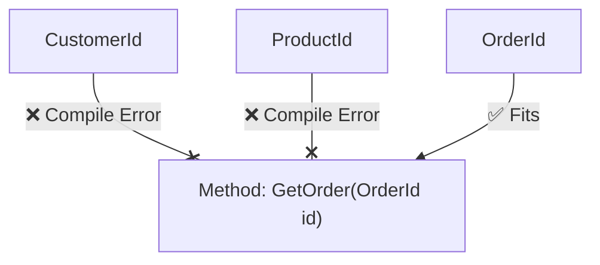

# 第15章：ID設計（GuidでOK？型付きIDって何？）🆔🧷

この章が終わる頃には…👇

* 「IDってただの数字/Guidでしょ？」から卒業できる🎓✨
* `OrderId` みたいな **型付きID** を作って、取り違え事故をコンパイルで防げる🚧💡
* EF Coreで **型付きIDをDBに保存**できるようになる🗄️✨

---

## 1) まず結論：GuidでOK？🙂


多くのアプリでは **Guidで全然OK** だよ〜！🙆‍♀️✨
しかも今の最新環境だと、.NET 10 / C# 14 で開発できるので、実装も気持ちよく書ける👍（.NET 10がリリース済み＆C# 14が最新）([Microsoft for Developers][1])

ただし！
**「Guidをそのまま裸で使う」** と、こんな事故が起きがち😱💦

* `OrderId` と `CustomerId` を間違えて渡しても **コンパイルが通る** 😇
* `Guid.Empty`（空Guid）が紛れ込んで、後から地獄😇
* 画面・API・DB・テストに `Guid` が散らばって、だんだんカオス🌀

だからこの章では、**Guidは採用しつつ、型付きIDで安全にする** 方向でいくよ〜！🛡️✨

---

## 2) IDってなに？（Entity/VOの話とつながるよ）🧠✨


* Entityは「同一性（ID）で追いかける存在」🆔
* VOは「値そのものが意味」💎

つまり、`Order` がEntityなら、**Orderの“本人確認”がID** だよね🙂
で、IDは「ただの値」でもあるから、**型付きIDはVOとして扱う** のが相性いいの✨

---

## 3) Guidの“現実的メリット”🌟

Guidがよく使われるのは理由があるよ👇

* ほぼ衝突しない（分散でも作りやすい）🌍
* DBの連番に依存しない（アプリ側で先にIDを作れる）🧾
* 推測されにくい（URLに載っても連番よりマシ）🔐

そして今の最新のVisual Studioも “2026” が出ていて、.NET 10世代が前提で進められるよ🧰✨([Microsoft Learn][2])

---

## 4) さらに一歩：Guid v7（並びやすいGuid）🧷⏱️✨


普通の `Guid.NewGuid()` はランダムっぽいから、DBによってはインデックスが散らかりやすいことがあるのね😅

そこで近年は **UUID v7（時間順に並びやすい）** が注目されてて、.NET では `Guid.CreateVersion7()` が用意されてるよ✨([Microsoft Learn][3])

イメージ：

* `NewGuid()`：ランダム🎲
* `CreateVersion7()`：時間要素入りで並びやすい⏱️✨

> ただ、DBや保存形式で“並びやすさ”の効き方が変わることもあるから、最終的には「自分のDBで計測」がおすすめだよ🧪✨（ここは上級者コース🌶️）

---

## 5) 本題：型付きID（Strongly Typed ID）って何？🚧✨




### 💥 何が嬉しいの？

`Guid` のままだとこういう事故が起きる👇

* `GetOrder(Guid id)` に `customerId` を渡しても通る😇
* テストもレビューも「それ、どのID？」ってなる😇

型付きにするとこうなる👇

* `GetOrder(OrderId id)` に `CustomerId` は渡せない🙅‍♀️✨
* 「取り違え」を **コンパイルで止められる** 🚧💕

---

## 6) 実装してみよ！OrderId を作る🆔✨（VOとして）


ここでは「Guidを包むだけ」の、いちばん分かりやすい形でいくよ🙂💕

```csharp
namespace Cafe.Domain.Orders;

public readonly record struct OrderId(Guid Value)
{
    public static OrderId New()
        => new(Guid.CreateVersion7()); // v7が使えるならこれ✨（ダメなら NewGuid に変更OK）

    public static OrderId From(Guid value)
    {
        if (value == Guid.Empty) throw new ArgumentException("OrderId cannot be empty.", nameof(value));
        return new OrderId(value);
    }

    public override string ToString() => Value.ToString();

    public static bool TryParse(string? text, out OrderId id)
    {
        id = default;
        if (string.IsNullOrWhiteSpace(text)) return false;
        if (!Guid.TryParse(text, out var g)) return false;
        if (g == Guid.Empty) return false;

        id = new OrderId(g);
        return true;
    }
}
```

ポイントだよ〜👇✨

* `record struct` だから **値の等価性** が自然に手に入る💎
* `Guid.Empty` を **禁止** して「無効状態」を作りにくくする🔒
* `New()` を用意して「IDの作り方」を一箇所に寄せる🧹✨
* `Guid.CreateVersion7()` が使える（UUID v7）([Microsoft Learn][3])

---

## 7) Order（Entity）側で使う🧾💪✨


```csharp
namespace Cafe.Domain.Orders;

public sealed class Order
{
    public OrderId Id { get; }
    public DateTimeOffset CreatedAt { get; }

    private Order(OrderId id, DateTimeOffset createdAt)
    {
        Id = id;
        CreatedAt = createdAt;
    }

    public static Order CreateNew(DateTimeOffset now)
        => new(OrderId.New(), now);
}
```

ここ、超大事🥹✨

* 「新規作成のときはアプリがIDを発行する」って決めると、設計がスッキリするよ🧠✨
* 画面入力やAPI入力に “注文ID” を入れさせない（多くのケースで不要）🙅‍♀️

---

## 8) EF CoreでDB保存できるようにする🗄️✨（ValueConverter）


型付きIDは、そのままだとEFが「どう保存していいか分からん🤔」ってなりがち。
そこで **ValueConverter** を使って、DBには `Guid` として保存するよ🙂✨([Microsoft Learn][4])

```csharp
using Cafe.Domain.Orders;
using Microsoft.EntityFrameworkCore;
using Microsoft.EntityFrameworkCore.Storage.ValueConversion;

public sealed class CafeDbContext : DbContext
{
    public DbSet<Order> Orders => Set<Order>();

    protected override void OnModelCreating(ModelBuilder modelBuilder)
    {
        var orderIdConverter = new ValueConverter<OrderId, Guid>(
            id => id.Value,
            value => OrderId.From(value));

        modelBuilder.Entity<Order>(b =>
        {
            b.HasKey(x => x.Id);

            b.Property(x => x.Id)
             .HasConversion(orderIdConverter)
             .ValueGeneratedNever(); // アプリ側でID発行する方針✨
        });
    }
}
```

これで

* ドメインは `OrderId` のまま美しく✨
* DBには `uniqueidentifier`（SQL Serverなら）的に `Guid` として保存🗄️
  が両立できるよ〜！💕

---

## 9) ミニ演習（10〜15分）🧪☕️✨

### ✅ 演習A：取り違え事故をコンパイルで止める

1. `CustomerId` も同じ形で作る🆔
2. メソッドをこう変える👇

* `FindOrder(Guid id)` → `FindOrder(OrderId id)`
* `FindCustomer(Guid id)` → `FindCustomer(CustomerId id)`

3. わざと逆のIDを渡してみて、**コンパイルエラーになる**のを確認😆🚧✨

### ✅ 演習B：Guid.Empty対策

* `OrderId.From(Guid.Empty)` が例外になるのをテストで確認🧪

---

## 10) AI（Copilot / Codex）活用プロンプト例🤖✨

そのままコピってOKだよ〜👇💕

* 「C#の `readonly record struct` で `OrderId(Guid Value)` を作って。`Guid.Empty` を禁止。`New()` と `TryParse()` も付けて。テストもxUnitで」🧪✨
* 「EF Coreで `OrderId` を `Guid` に変換して保存する `ValueConverter` と `OnModelCreating` の設定例を出して」🗄️✨
* 「`OrderId` と `CustomerId` の取り違えを防ぐ設計レビュー観点を箇条書きで」✅✨

> AIの出力は便利だけど、**“禁止したい無効状態（Emptyとか）” は自分の意思で決める** のが一番大事だよ🧠💕

---

## 11) まとめ（この章のチェックポイント）✅🆔✨

* Guid採用は現実的にぜんぜんアリ🙆‍♀️
* でも **裸Guidは取り違え事故が起きやすい** 😱
* `OrderId` みたいな **型付きID（VO）** にすると超安全🚧✨
* EF Coreは **ValueConverter** でDB保存もいける🗄️✨([Microsoft Learn][4])
* UUID v7（`Guid.CreateVersion7()`）も選択肢として覚えておくと強い⏱️✨([Microsoft Learn][3])

---

次の第16章（VOで不変条件を守る🔒💎）に行く前に、もしよければ…
「OrderLineId と ProductId も型付きにしたい！」みたいな追加のお題、こっちで用意して続きの演習にできるよ😆☕️✨

[1]: https://devblogs.microsoft.com/dotnet/announcing-dotnet-10/?utm_source=chatgpt.com "Announcing .NET 10"
[2]: https://learn.microsoft.com/en-us/visualstudio/releases/2026/release-history?utm_source=chatgpt.com "Visual Studio Release History"
[3]: https://learn.microsoft.com/en-us/dotnet/api/system.guid.createversion7?view=net-10.0 "Guid.CreateVersion7 Method (System) | Microsoft Learn"
[4]: https://learn.microsoft.com/en-us/ef/core/modeling/value-conversions?utm_source=chatgpt.com "Value Conversions - EF Core"
