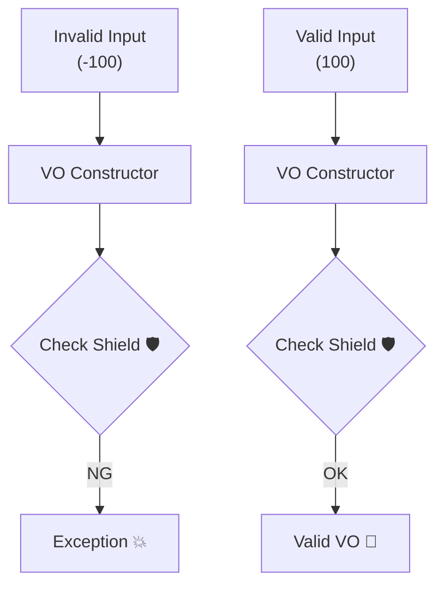

# 第16章：不変条件① VOで守る（無効状態を作れない）🔒💎

この章はひとことで言うと——
**「ヤバい値（無効な状態）を “作れない” ようにする」回**だよ〜😆✨

いまのC#まわりは **.NET 10（LTS）＋C# 14** が最新ラインで、VSも **Visual Studio 2026** が出てる（AI統合もどんどん深い）ので、その前提でいくね🤖🪄
([Microsoft][1])

---

## 0) 今日できるようになること（ゴール）🎯✨

* **不変条件（Invariant）**って何？を説明できる🧠
* **VOのコンストラクタ／Factoryでルールを強制**して、無効状態を作れないようにできる🔒
* カフェアプリの **Money が負になれない** を実装できる🚫💰
* **テストで “破れない” ことを確認**できる🧪✨

---

## 1) まずは「あるある事故」😇💥


たとえば…

* 合計金額がなぜか **-450円** になってる
* 割引の計算で符号が反転した
* 返金処理が二重に走った

こういうの、実は「計算式が間違った」より前に、
**“負の金額” という存在が作れてしまう設計**が原因だったりするの🥲

> だから、**そもそも負の金額というモノをこの世に生まれさせない**のが最強💪✨
> これが VO で不変条件を守る強さだよ〜🔒💎

---

## 2) 不変条件（Invariant）ってなに？🧷✨


**どんなタイミングでも絶対に守られててほしいルール**のことだよ✅

### Moneyの例（カフェアプリ）☕️

* 金額は **0以上**（負は禁止）🚫
* 通貨は空じゃない（"JPY" など）🪙
* （必要なら）小数点の扱いルール（丸めなど）🧮

この「絶対守る」が不変条件🔒

---

## 3) なんでVOが不変条件に強いの？💎🛡️




VOの強みはコレ👇

1. **生成時にチェックできる**（入口で弾ける）🚪🚫
2. **基本 不変（immutable）**で運用できる🔒
3. **値が同じなら同じ**として扱える（等価性）✨

つまり…
**「正しい形のものだけが存在できる世界」**を作れるんだよね🌍💎

---

## 4) 実装方針：Moneyはこう作る💰✨


今回のMoneyは、学習用にわかりやすく👇

* Money は **VO**
* 生成は `TryCreate`（失敗理由を返せる）🙂
* 変化が必要なら **新しいMoneyを返す**（Add/Subtract）➕➖
* 別通貨同士の加算は **バグなので例外**でOK（プログラムの使い方ミス）⚠️

---

## 5) 実装してみよう（Money VO）💻💎

### 5-1) Result（成功/失敗）を軽く用意する🧾✨

（もうResult方式に慣れてきた頃だと思うので、最小の形でいくね🙂）

```csharp
namespace Cafe.Domain.Shared;

public readonly record struct Result<T>(bool IsSuccess, T? Value, string? Error)
{
    public static Result<T> Success(T value) => new(true, value, null);
    public static Result<T> Failure(string error) => new(false, default, error);
}
```

---

### 5-2) Money VO 本体（不変条件：負禁止！）🚫💰

```csharp
namespace Cafe.Domain.ValueObjects;

using Cafe.Domain.Shared;

public sealed class Money : IEquatable<Money>
{
    public decimal Amount { get; }
    public string Currency { get; } // 学習用に string（"JPY" とか）

    private Money(decimal amount, string currency)
    {
        Amount = amount;
        Currency = currency;
    }

    public static Result<Money> TryCreate(decimal amount, string currency)
    {
        if (amount < 0m)
            return Result<Money>.Failure("金額は0以上である必要があります。");

        if (string.IsNullOrWhiteSpace(currency))
            return Result<Money>.Failure("通貨コードが空です。例: JPY");

        // 超シンプルに正規化（大文字、空白除去）
        var normalized = currency.Trim().ToUpperInvariant();

        return Result<Money>.Success(new Money(amount, normalized));
    }

    public Money Add(Money other)
    {
        EnsureSameCurrency(other);
        // Amountは0以上同士の加算なので、基本は負にならない👍
        return new Money(Amount + other.Amount, Currency);
    }

    public Result<Money> Subtract(Money other)
    {
        EnsureSameCurrency(other);

        var next = Amount - other.Amount;
        if (next < 0m)
            return Result<Money>.Failure("差し引き後の金額が負になります。");

        return Result<Money>.Success(new Money(next, Currency));
    }

    private void EnsureSameCurrency(Money other)
    {
        if (Currency != other.Currency)
            throw new InvalidOperationException($"通貨が違うMoney同士は計算できません: {Currency} vs {other.Currency}");
    }

    // 値で等価（VOらしさ✨）
    public bool Equals(Money? other)
        => other is not null && Amount == other.Amount && Currency == other.Currency;

    public override bool Equals(object? obj) => obj is Money m && Equals(m);
    public override int GetHashCode() => HashCode.Combine(Amount, Currency);
}
```

✅ ここがポイントだよ〜👇

* `TryCreate` が **入口で不変条件を守る**🚪🔒
* `Money` のコンストラクタは `private` だから、**外から無効Moneyを作れない**💎
* `Subtract` は負になり得るので **Resultで失敗を返す**🙂

---

## 6) Guard（チェック関数）で読みやすくする🛡️✨


チェックが増えると `if` が並びがち😅
そこで Guard を作るとスッキリするよ〜！

```csharp
namespace Cafe.Domain.Shared;

public static class Guard
{
    public static void AgainstNullOrWhiteSpace(string value, string message)
    {
        if (string.IsNullOrWhiteSpace(value))
            throw new ArgumentException(message);
    }

    public static void AgainstNegative(decimal value, string message)
    {
        if (value < 0m)
            throw new ArgumentOutOfRangeException(nameof(value), message);
    }
}
```

> ちなみに .NET 10 だと `ArgumentOutOfRangeException.ThrowIfNegative<T>` みたいな “投げる系ガード” も用意されてるよ（`INumberBase<T>` 制約）🧰✨
> ([Microsoft Learn][2])

学習では自作GuardでOK！読みやすさが正義🙂✨

---

## 7) テストで「破れない」ことを確認🧪💖


xUnit想定でいくよ〜！

```csharp
using Cafe.Domain.ValueObjects;
using Xunit;

public class MoneyTests
{
    [Fact]
    public void TryCreate_負の金額は失敗する()
    {
        var result = Money.TryCreate(-1m, "JPY");

        Assert.False(result.IsSuccess);
        Assert.NotNull(result.Error);
    }

    [Fact]
    public void TryCreate_正常なら成功する()
    {
        var result = Money.TryCreate(500m, "jpy");

        Assert.True(result.IsSuccess);
        Assert.NotNull(result.Value);
        Assert.Equal("JPY", result.Value!.Currency);
        Assert.Equal(500m, result.Value.Amount);
    }

    [Fact]
    public void Subtract_負になるなら失敗する()
    {
        var a = Money.TryCreate(100m, "JPY").Value!;
        var b = Money.TryCreate(200m, "JPY").Value!;

        var result = a.Subtract(b);

        Assert.False(result.IsSuccess);
    }

    [Fact]
    public void Add_通貨が違うと例外()
    {
        var a = Money.TryCreate(100m, "JPY").Value!;
        var b = Money.TryCreate(1m, "USD").Value!;

        Assert.Throws<InvalidOperationException>(() => a.Add(b));
    }
}
```

🧪✨ テストがあると
**「今後リファクタしても、不変条件が壊れてない」**って自信になるよ〜💪💖

---

## 8) ここ、超大事：VOの“不変条件”はどこまでやる？📏🤔


やりすぎると窮屈、やらないと事故る😇

おすすめの線引き👇

### VOで守る（強いルール）🔒

* **絶対に存在しちゃダメ**な状態
  例：負のMoney、空の通貨、範囲外のPercentage

### Entityで守る（業務のルール）🧾

* 状態や文脈に依存する
  例：注文が Confirm 済みなら明細変更できない（これは次章！）🔜✨

---

## 9) ミニ演習（10〜15分）✍️☕️✨

### 演習A：Moneyのルールを1個追加しよう🧩

次のどれかを追加してみてね👇（1つでOK！）

* 通貨は `"JPY"` / `"USD"` だけ許可🪙
* Amount は **小数点2桁まで**（通貨によっては0桁とかもあるけど学習用でOK）🧮
* `Multiply(int quantity)` を追加（0以上チェック）✖️

### 演習B：新しいVOを作ろう（Percentage）📉✨

* 0〜100 の範囲だけ許可
* `TryCreate`＋テスト2本

---

## 10) AI活用（めっちゃ効くやつ）🤖💬✨

AIには「雛形」と「テスト観点」を出させるのが強いよ〜！

### そのまま使えるプロンプト例🪄

* 「C#で Money VO を作って。不変条件は 0以上・通貨必須。TryCreateでResultを返して。テストもxUnitで4本」
* 「この Money VO の “不変条件が破れる可能性” をレビューして、穴があれば指摘して」
* 「Subtract が負になるケースのテスト観点を追加で10個出して」

VS 2026 は AI 統合が強化されてる流れなので、こういう使い方が現実的にどんどんやりやすいよ🤖✨
([Microsoft Learn][3])

---

## まとめ（1分）⏱️💖

* **不変条件**＝「いつでも絶対守りたいルール」🔒
* **VOは入口でチェックできる**から、不変条件の守りに最適💎
* Moneyは **負の値を作れない**ようにすると世界が平和になる☮️💰
* **テストで守りを固める**と、将来の変更が怖くなくなる🧪✨

---

次の第17章は、いよいよ **Entity側で不変条件を守る**（状態とルールの話）に行くよ〜🧾🔒✨
Confirm後にAddLineできない、みたいな「業務ルール」をキレイに閉じ込めようね😆👍

[1]: https://dotnet.microsoft.com/en-us/platform/support/policy "The official .NET support policy | .NET"
[2]: https://learn.microsoft.com/en-us/dotnet/api/system.argumentoutofrangeexception.throwifnegative?view=net-10.0 "ArgumentOutOfRangeException.ThrowIfNegative<T>(T, String) Method (System) | Microsoft Learn"
[3]: https://learn.microsoft.com/en-us/visualstudio/releases/2026/release-notes "Visual Studio 2026 Release Notes | Microsoft Learn"
