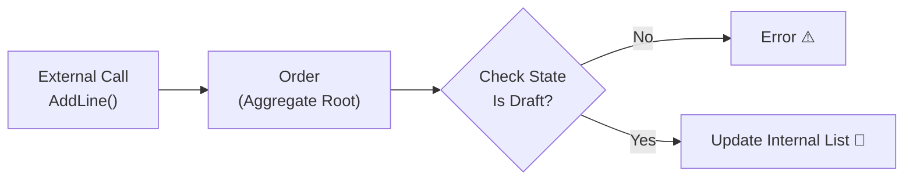

# 第17章：不変条件② Entityで守る（状態とルール）🧾🔒

## 0. この章でできるようになること 🎯✨

* 「VOで守るべきルール」と「Entityで守るべきルール」を分けられる 💎🆚🧾
* **Order（注文）**の中に業務ルールを閉じ込めて、外から壊されない設計にできる 🏠🔒
* **状態（Draft/Confirmed/Canceled）**が絡むルールを、スッキリ実装できる 🔁✅
* テストで「確定後に明細が変えられない」をちゃんと保証できる 🧪✨

※ いまの最新の開発基盤は **.NET 10（LTS）**＋**C# 14**が中心で、Visual Studio 2026 も .NET 10 を含みます。 ([Microsoft][6])

---

## 1. まず感覚をつかもう！VOとEntity、どっちが何を守るの？💡💎🧾

### VOが守るもの（値の正しさ）💎✅

* Money が **マイナスになれない** 🚫💰
* Quantity が **1以上** 📦✅
* Email が **変な形式じゃない** 🚫📧

→ これは「**その値単体**」で決まるから、VOで守るのが得意だよ〜✨

### Entityが守るもの（状態・関係・業務ルール）🧾🔒

* 注文が **確定（Confirmed）したら**、明細を追加・削除できない 🚫🧾
* 注文は **空のまま確定できない**（明細0件はダメ）🚫
* キャンセルは **キャンセル済みをもう一回キャンセル**できない 😵‍💫🚫
* （もっと現実寄りだと）支払い後はキャンセル不可、など 💳🚫

→ これは「**注文という存在（Entity）**」の状態や中身（明細）に依存するから、Entityが守るのが得意！🏠✨

---

## 2. “ルールが散る”とどうなる？😱🧯

ありがちな事故👇

* 画面Aでは「確定後は変更禁止」をチェックしてるのに…
* 画面Bやバッチ処理ではチェックし忘れて、確定後でも変更できちゃう 😇💥

**対策はシンプル：ルールはOrderの中に閉じ込める！**
外側（UI/Controller/Service）は「お願い」するだけ。
最終判断は **Orderがする** 🧾👑

---

## 3. 今日の題材ルール（学内カフェ注文）☕️🧾✨

### 状態（OrderStatus）を3つにするよ！🔁

* `Draft` 🟡：下書き（明細いじってOK）
* `Confirmed` 🟢：確定（明細変更NG）
* `Canceled` 🔴：キャンセル（操作ほぼNG）

### ルール（この章の主役）📌

1. Draft のときだけ `AddLine / RemoveLine / ChangeQuantity` ができる ✅
2. `Confirm()` は **明細が1件以上**ないと失敗 🚫
3. Confirmed になったら **明細変更は全部失敗** 🚫🧾
4. `Cancel()` は Draft/Confirmed ならOK、Canceled はNG 🚫

---

## 4. 実装：Orderに「不変条件ガード」を埋め込もう 🏠🔒✨




ここからは **“外から壊せない”** 形を作るよ〜！😆
ポイントは👇

* **プロパティの set を公開しない**（勝手に状態を書き換えられないように）🔒
* 明細リストは `List` をそのまま公開しない（外で `.Add()` されると終わる😇）🚫
* 失敗は **Resultで返す**（失敗理由も返す）⚠️➡️🧾

---

### 4-1. Result（超ミニ版）🧩✨

```csharp
namespace Cafe.Domain;

public readonly record struct DomainError(string Code, string Message);

public readonly record struct Result(bool IsSuccess, DomainError? Error)
{
    public static Result Success() => new(true, null);

    public static Result Failure(string code, string message)
        => new(false, new DomainError(code, message));
}
```

> 💡Code は「機械向け」、Message は「人間向け」って覚えると便利だよ〜🤖🫶

---

### 4-2. 状態（OrderStatus）🔁

```csharp
namespace Cafe.Domain;

public enum OrderStatus
{
    Draft,
    Confirmed,
    Canceled
}
```

---

### 4-3. OrderLine（今回は“明細はVOっぽく”シンプルに）🧾💎

※ OrderLine を Entity にするかは後半で深掘りするけど、まずは学習しやすい形でOK！🙆‍♀️✨

```csharp
namespace Cafe.Domain;

public sealed record OrderLine(
    ProductId ProductId,
    Quantity Quantity,
    Money UnitPrice
)
{
    public Money LineTotal => UnitPrice * Quantity;
}
```

（`ProductId / Quantity / Money` はVOとして既にある想定だよ💎）

---

### 4-4. Order（この章の本体）🧾👑✨

```csharp
using System.Collections.ObjectModel;

namespace Cafe.Domain;

public sealed class Order
{
    private readonly List<OrderLine> _lines = new();

    public OrderId Id { get; }
    public OrderStatus Status { get; private set; } = OrderStatus.Draft;

    // 外から List を触れないようにする！超重要🔒
    public IReadOnlyList<OrderLine> Lines => _lines.AsReadOnly();

    private Order(OrderId id)
    {
        Id = id;
    }

    public static Order CreateNew(OrderId id) => new(id);

    // --- ルール：Draft だけ編集OK ---
    public Result AddLine(OrderLine line)
    {
        var guard = EnsureDraft();
        if (!guard.IsSuccess) return guard;

        // 例：同じ商品がすでにあるなら数量を足す、みたいなルールもここに置けるよ✨
        _lines.Add(line);
        return Result.Success();
    }

    public Result RemoveLine(ProductId productId)
    {
        var guard = EnsureDraft();
        if (!guard.IsSuccess) return guard;

        var index = _lines.FindIndex(x => x.ProductId == productId);
        if (index < 0)
            return Result.Failure("Order.LineNotFound", "その商品は明細にありません🧾💦");

        _lines.RemoveAt(index);
        return Result.Success();
    }

    public Result Confirm()
    {
        if (Status == OrderStatus.Canceled)
            return Result.Failure("Order.Canceled", "キャンセル済みの注文は確定できません🔴🚫");

        if (Status == OrderStatus.Confirmed)
            return Result.Failure("Order.AlreadyConfirmed", "すでに確定済みです🟢✨");

        if (_lines.Count == 0)
            return Result.Failure("Order.Empty", "明細が0件の注文は確定できません🚫🧾");

        Status = OrderStatus.Confirmed;
        return Result.Success();
    }

    public Result Cancel()
    {
        if (Status == OrderStatus.Canceled)
            return Result.Failure("Order.AlreadyCanceled", "すでにキャンセル済みです🔴💦");

        Status = OrderStatus.Canceled;
        return Result.Success();
    }

    private Result EnsureDraft()
    {
        if (Status != OrderStatus.Draft)
            return Result.Failure("Order.NotDraft", "確定後は明細を変更できません🧾🔒");

        return Result.Success();
    }
}
```

✅ これで「確定後にAddLineできない」が **Orderの中で絶対に守られる** よ！🧾🔒✨
UI側がチェックし忘れても、Orderが止めてくれる💪😆

---

## 5. ミニ演習：Confirm後にAddLineできないようにする 🚫🧾✨（テストから！）

ここ、**テスト先に書く**のが超おすすめ！🧪💕

### 5-1. 失敗するテストを書く（最初は赤でOK❤️）

```csharp
using Cafe.Domain;
using Xunit;

public class Order_InvariantTests
{
    [Fact]
    public void Confirmed_order_cannot_add_line()
    {
        var order = Order.CreateNew(new OrderId(Guid.NewGuid()));

        // 1件入れて確定
        order.AddLine(new OrderLine(
            new ProductId("coffee"),
            Quantity.Create(1).Value,     // VOの想定
            Money.Create(300, "JPY").Value // VOの想定
        ));
        order.Confirm();

        // 確定後に追加しようとすると失敗するはず！
        var result = order.AddLine(new OrderLine(
            new ProductId("tea"),
            Quantity.Create(1).Value,
            Money.Create(250, "JPY").Value
        ));

        Assert.False(result.IsSuccess);
        Assert.Equal("Order.NotDraft", result.Error?.Code);
    }
}
```

> ※ `Quantity.Create` や `Money.Create` は前の章で作った「ResultでVO生成」想定だよ💎
> ここでは `Value` を取れてる＝生成成功してる前提でOK！

### 5-2. 実装を直してテストを緑にする💚

さっきの `EnsureDraft()` を入れると通る！✅✨
（入ってなかったら、ここで追加してね！😆）

---

## 6. ルール×状態のテストは「表」で考えると勝ち📊✨

### 状態と操作の相性をざっくり表にすると👇


* Draft：Add/Remove/Confirm/Cancel ✅
* Confirmed：Confirm（再実行）🚫、Add/Remove 🚫、Cancel ✅
* Canceled：ほぼ全部🚫（Cancelだけ再実行🚫）

この “表” をそのままテストに落とすと、抜け漏れが減るよ〜！🧠✨

---

## 7. AI活用（Copilot/Codex）で爆速にするコツ 🤖⚡️

### 7-1. テストケースを増やすプロンプト例 🧪✨

「Orderの状態遷移に対するテストを増やしたい」ってとき👇

* 「OrderStatus が Draft/Confirmed/Canceled のときに、AddLine/RemoveLine/Confirm/Cancel が成功/失敗するテストケースを列挙して。失敗時は Error.Code も提案して」🤖📝
* 「‘確定は明細1件以上’ の境界値テストを出して（0件/1件/複数件）」🎯🧪

### 7-2. AIの提案でありがちな地雷 ☠️😇

* `public set;` を付けてくる → **絶対ダメ！** 外から壊される🔓💥
* `List<OrderLine>` をそのまま返す → 外で `.Add()` されて終わる😇

**採用基準はこれ👇**

* ルールが Order のメソッド内にある？🏠
* 外から状態や明細が変えられない？🔒
* 失敗理由（Code/Message）が返せてる？🧾✨

---

## 8. よくある事故集（この章の落とし穴）🧯😵‍💫

### ❌事故1：確定後でもプロパティを書き換えられる

* `public OrderStatus Status { get; set; }` とかは即アウト🙅‍♀️
  ✅ `private set` にする！

### ❌事故2：Lines が List のまま公開されてる

* `public List<OrderLine> Lines { get; }` だと外から追加できちゃう😇
  ✅ `IReadOnlyList` ＋ `AsReadOnly()` でガード！

### ❌事故3：ルールがUI/Serviceに散ってる

* 画面Aでは守れるけど画面Bで崩壊💥
  ✅ 最終防衛線は **Entity（Order）**！

---

## 9. まとめ：Entity不変条件チェックリスト ✅🧾🔒✨

* [ ] 状態が絡むルールは **Entityのメソッド**にある？🏠
* [ ] `set` が公開されてなくて、外から壊せない？🔒
* [ ] コレクションは `IReadOnlyList` で守ってる？📦
* [ ] 失敗は Result で返して、理由（Code/Message）も持ってる？⚠️🧾
* [ ] 「状態×操作」の組み合わせをテストしてる？🧪📊

---

次の第18章は、今日やった「状態」をさらに強くするために、**状態機械（State Machine）**を表で整理して、抜け漏れを消していくよ〜！📊🔁✨

[1]: https://chatgpt.com/c/69710656-ec7c-832a-b013-2cb38823096a "エンティティにルールを持たせる"
[2]: https://chatgpt.com/c/697100aa-6b9c-8327-af44-3bf98f0ad832 "VO実装③数量・割合・コード"
[3]: https://chatgpt.com/c/6970efa5-00b0-8330-a253-e1af475daa11 "第2章 開発環境セットアップ"
[4]: https://chatgpt.com/c/6970edc0-d4d0-8327-87ad-180eae12dd2f "エンティティとVOの理解"
[5]: https://chatgpt.com/c/6971028e-8aa8-8327-9913-54d6e08b11e5 "VO作成パターン集"
[6]: https://dotnet.microsoft.com/en-us/platform/support/policy/dotnet-core?utm_source=chatgpt.com "NET and .NET Core official support policy"
