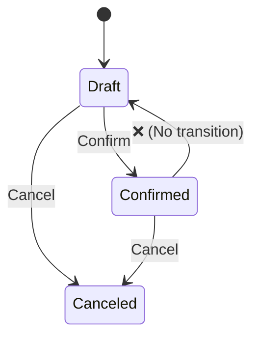

# 第18章：状態機械（State Machine）超入門：表にしてみる📊🔁

この章は「状態が増えてきて、`if` がぐちゃぐちゃになってきた…😵‍💫」って時の救世主回だよ〜！🦸‍♀️✨
**“状態”と“できること”を表にして、抜け漏れとバグを減らす**のがゴール！✅

ちなみに今の最新は **.NET 10（LTS）**で、C# は **C# 14** が最新だよ〜🆕✨ ([Microsoft][1])
（毎年11月にメジャーが出て、月1でパッチが来る流れも公式で整理されてるよ📅）([Microsoft][2])

---

## 1. 状態機械ってなに？🤔🔁


めちゃシンプルに言うと、

* **状態（State）**：いま何モード？（例：Draft/Confirmed/Canceled）🟡🟢🔴
* **イベント（Trigger）**：何をした？（例：Confirm/Cancel/AddLine）🖱️
* **遷移（Transition）**：どの状態からどの状態へ？（表で管理！）📊
* **ガード（Guard）**：条件つきの許可（例：明細0件ならConfirm禁止）🛡️
* **副作用（Action）**：遷移したときにやること（例：ConfirmedAt を入れる）🕒✨

これを **表（状態遷移表）** にすると、設計が一気に見える化するの〜！👀✨

---

## 2. まずは “ミニ版” 状態遷移表を作ろう 📊✍️

題材：学内カフェ注文アプリ ☕️🧾
ここでは Order の状態をまず3つに絞るよ（最初は小さく！🌱）

* **Draft**：カート作成中🟡
* **Confirmed**：注文確定🟢
* **Canceled**：キャンセル🔴

イベント（操作）はこれ：

* **AddLine**：明細追加➕
* **RemoveLine**：明細削除➖
* **Confirm**：注文確定✅
* **Cancel**：キャンセル❌

### ✅ 状態遷移表（ミニ版）




| 現在の状態 \ イベント | AddLine ➕ | RemoveLine ➖ | Confirm ✅     | Cancel ❌        |
| ------------ | --------- | ------------ | ------------- | --------------- |
| Draft 🟡     | Draft（OK） | Draft（OK）    | Confirmed（OK） | Canceled（OK）    |
| Confirmed 🟢 | ❌禁止       | ❌禁止          | ❌禁止           | Canceled（OK）    |
| Canceled 🔴  | ❌禁止       | ❌禁止          | ❌禁止           | （基本は何もしない or ❌） |

ポイントはここ👇✨

* 「Confirmed になったら明細いじれない」ってルールが **表に固定**される🔒
* 禁止が見えるから「抜け漏れ」が減る🧠✨
* “Canceled で Cancel が来た”みたいなケースは **冪等（同じ操作を何回してもOK）**にすることが多いよ〜🧊

---

## 3. 禁止遷移を3つ見つけよう 🔍😆（ミニ演習）

表から「やっちゃダメ」を3つ言える？✨ 例：

1. Confirmed で AddLine ➕ → ❌
2. Canceled で Confirm ✅ → ❌
3. Confirmed で Confirm ✅（2回目）→ ❌（または “何もしない” にする設計もある🙂）

こういうのを **実装で確実に止める**のが次！

---

## 4. 表をそのままコードに落とす（基本編）💻✨

### 4.1 いちばん素直：`enum` + ガード節（Guard）🛡️

```csharp
public enum OrderStatus
{
    Draft,
    Confirmed,
    Canceled
}

public sealed class DomainException : Exception
{
    public DomainException(string message) : base(message) { }
}

public sealed class Order
{
    public OrderStatus Status { get; private set; } = OrderStatus.Draft;

    private readonly List<OrderLine> _lines = new();

    public void AddLine(OrderLine line)
    {
        EnsureStatus(OrderStatus.Draft, "確定後は明細を追加できません🥲");
        _lines.Add(line);
    }

    public void RemoveLine(OrderLine line)
    {
        EnsureStatus(OrderStatus.Draft, "確定後は明細を削除できません🥲");
        _lines.Remove(line);
    }

    public void Confirm()
    {
        EnsureStatus(OrderStatus.Draft, "この注文は確定できません🥲");
        if (_lines.Count == 0)
            throw new DomainException("明細0件のまま確定はできないよ〜🧾💦");

        Status = OrderStatus.Confirmed;
    }

    public void Cancel()
    {
        // 冪等（Cancel が2回来ても安全）にしたい場合👇
        if (Status == OrderStatus.Canceled) return;

        if (Status is OrderStatus.Draft or OrderStatus.Confirmed)
        {
            Status = OrderStatus.Canceled;
            return;
        }

        throw new DomainException("この状態からはキャンセルできません🥲");
    }

    private void EnsureStatus(OrderStatus required, string message)
    {
        if (Status != required)
            throw new DomainException(message);
    }
}

public sealed class OrderLine { }
```

**ここが大事💡**

* `Status` の `set` を外から触れないようにして、**メソッド経由でしか遷移させない**🔒✨
* 表の「禁止」をそのまま `EnsureStatus` で守る🛡️

---

## 5. 表を “データ” にして実装する（管理しやすい編）🗂️✨

状態が増えると `if` が増えてしんどい…😵‍💫
そんなときは **(状態,イベント)→次状態** の辞書にしちゃうのが気持ちいいよ〜！

```csharp
public enum OrderTrigger
{
    Confirm,
    Cancel
}

public sealed class OrderStateMachine
{
    private static readonly Dictionary<(OrderStatus State, OrderTrigger Trigger), OrderStatus> _transitions = new()
    {
        {(OrderStatus.Draft,     OrderTrigger.Confirm), OrderStatus.Confirmed},
        {(OrderStatus.Draft,     OrderTrigger.Cancel),  OrderStatus.Canceled},
        {(OrderStatus.Confirmed, OrderTrigger.Cancel),  OrderStatus.Canceled},
    };

    public OrderStatus State { get; private set; } = OrderStatus.Draft;

    public void Fire(OrderTrigger trigger)
    {
        if (!_transitions.TryGetValue((State, trigger), out var next))
            throw new DomainException($"禁止遷移だよ〜🙅‍♀️：{State} -> {trigger}");

        State = next;
    }
}
```

**メリット**✅

* 表が増えても “辞書の行” が増えるだけで見通しがいい👀✨
* 遷移を **一覧でレビュー**しやすい（設計チェック向き）🧠📝

---

## 6. テストで「禁止」を固定する 🧪🔒（超重要！）

状態機械は **テストとの相性が最高**だよ〜！✨
「許可される遷移」「禁止される遷移」をテストで釘打ちすると、未来の改修がラク😆💕

```csharp
using Xunit;

public class OrderStateMachineTests
{
    [Theory]
    [InlineData(OrderStatus.Draft, OrderTrigger.Confirm, OrderStatus.Confirmed)]
    [InlineData(OrderStatus.Draft, OrderTrigger.Cancel,  OrderStatus.Canceled)]
    [InlineData(OrderStatus.Confirmed, OrderTrigger.Cancel, OrderStatus.Canceled)]
    public void Allowed_transitions_should_work(OrderStatus start, OrderTrigger trigger, OrderStatus expected)
    {
        var sm = new OrderStateMachine();

        // テスト用に初期状態を合わせる（本番は外からできない設計が多いよ🙂）
        typeof(OrderStateMachine).GetProperty(nameof(OrderStateMachine.State))!
            .SetValue(sm, start);

        sm.Fire(trigger);

        Assert.Equal(expected, sm.State);
    }

    [Theory]
    [InlineData(OrderStatus.Confirmed, OrderTrigger.Confirm)]
    [InlineData(OrderStatus.Canceled,  OrderTrigger.Cancel)]
    public void Forbidden_transitions_should_throw(OrderStatus start, OrderTrigger trigger)
    {
        var sm = new OrderStateMachine();
        typeof(OrderStateMachine).GetProperty(nameof(OrderStateMachine.State))!
            .SetValue(sm, start);

        Assert.Throws<DomainException>(() => sm.Fire(trigger));
    }
}
```

> ✅ ここは学習用にちょいズルしてるけど、実務では「状態を直接いじれない設計」にして、初期化や復元（DB→復元）で状態を入れる感じが多いよ〜🙂✨

---

## 7. 便利アイテム：ライブラリで状態機械をスッキリ書く 🤖✨

「状態がもっと増えて、入退場アクションも増えた〜！」ってなったら、
**Stateless** みたいなライブラリが便利だよ〜🧰✨（NuGetにあって、ガードや OnEntry/OnExit も対応）([nuget.org][3])

例：NuGet の案内だと `dotnet add package Stateless --version 5.20.0` みたいに追加できるよ📦 ([nuget.org][3])

使うとこんな感じ（イメージ）👇

```csharp
using Stateless;

public sealed class OrderWithStateless
{
    public OrderStatus Status { get; private set; } = OrderStatus.Draft;

    private readonly StateMachine<OrderStatus, OrderTrigger> _sm;

    public OrderWithStateless()
    {
        _sm = new StateMachine<OrderStatus, OrderTrigger>(
            () => Status,
            s => Status = s);

        _sm.Configure(OrderStatus.Draft)
            .Permit(OrderTrigger.Confirm, OrderStatus.Confirmed)
            .Permit(OrderTrigger.Cancel,  OrderStatus.Canceled);

        _sm.Configure(OrderStatus.Confirmed)
            .Permit(OrderTrigger.Cancel,  OrderStatus.Canceled);

        // 例：入場アクションとかも書けるよ✨
        _sm.Configure(OrderStatus.Confirmed)
            .OnEntry(() => Console.WriteLine("注文確定したよ〜✅"));
    }

    public void Fire(OrderTrigger trigger) => _sm.Fire(trigger);
}
```

---

## 8. AI活用（Copilot / Codex）🤖💡：この章で“刺さる”使い方

AIは「表→コード」「表→テスト」が得意！✨
おすすめプロンプト👇（コピペOK🥳）

* 🧠 表→遷移辞書
  「この状態遷移表を C# の Dictionary<(State,Trigger),State> に変換して。禁止遷移は例外にして」

* 🧪 表→テスト（最強）
  「この遷移定義から xUnit のパラメータテストを生成して。許可/禁止を分けて」

* 🔍 抜け漏れチェック
  「この状態遷移表で、仕様として不自然なところ・抜け漏れ候補を指摘して。理由も」

最後は人間が決めるんだけど、**見落とし発見**にめっちゃ効くよ〜👀✨

---

## 9. まとめ（1分）⏱️✨

* 状態機械は「状態」「イベント」「遷移」を **表にする**のが第一歩📊
* 表があると、禁止が見えて **抜け漏れが減る**🔍✨
* 実装はまず `enum + guard` でOK、増えてきたら `(状態,イベント)→次状態` の辞書が気持ちいい🗂️
* テストで「禁止遷移」を固定すると未来がラク🧪🔒
* 規模が育ったらライブラリも選択肢（ガード/OnEntry/図出力など）🧰✨ ([nuget.org][3])

---

## 宿題（ミニ）📝💕

次の3つやってみて〜！😆✨

1. **禁止遷移を3つ**、表から言う（もうできそう！）🔍
2. Confirmed に入ったら `ConfirmedAt` を入れる（副作用）🕒✨
3. 「Cancel を2回しても安全」テストを書く（冪等）🧪🧊

次の章（第19章：集約）につなげるなら、ここで作った「状態遷移の守り」を **Order（集約ルート）だけが操作できる**ようにしていく流れがめっちゃキレイだよ〜📦🌸

[1]: https://dotnet.microsoft.com/en-us/platform/support/policy?utm_source=chatgpt.com "The official .NET support policy"
[2]: https://dotnet.microsoft.com/ja-jp/platform/support/policy?utm_source=chatgpt.com "公式の .NET サポート ポリシー | .NET"
[3]: https://www.nuget.org/packages/stateless/ "
        NuGet Gallery
        \| Stateless 5.20.0
    "
