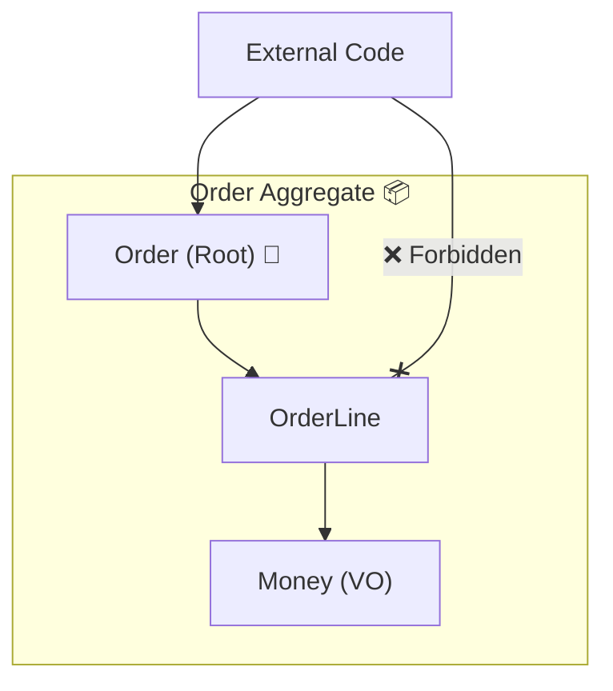

# 第19章：集約① “一緒に守る範囲”って何？（超やさしい）📦🌸

### まずは「今日できるようになること」🎯✨

* 「集約（Aggregate）」って結局なに？を **自分の言葉で説明**できる💬
* カフェ注文アプリの例で、**Orderの“守る範囲”**を決められる☕️🧾
* **集約ルート（入口）**を通さない更新を禁止する、基本の形が書ける🚪🔒

---

### 🌟いまどきの最新版メモ（教材の前提が“古くならない”ように）🧭✨

* **.NET 10 は LTS（長期サポート）**として 2025/11/11 に公開（～2028/11/10 までサポート）📌 ([Microsoft for Developers][1])
* **C# 14 は最新のC#リリース**（.NET 10 でサポート）🆕 ([Microsoft Learn][2])
* **Visual Studio 2026** は 2026/1/20 に 18.2.1 のリリースノートが出てるよ🛠️ ([Microsoft Learn][3])

（この章の本題はDDDなので、ここは“チラ見”でOKだよ〜👀✨）

---

## 1) 集約ってなに？まずはイメージから📦🍱




集約（Aggregate）は、ひとことで言うと…

**「まとめて扱う“ひとかたまり”」**だよ😊
たとえば **注文（Order）**って、単体じゃなくて **注文明細（OrderLine）** がくっついてるよね？

* 注文だけ保存して、明細は保存しない…ってできない😵‍💫
* 明細だけ増えて、注文が変な状態になる…も困る😱

だから **「注文＋明細」をセットで整合性を守る箱**として扱うのが、集約の考え方📦✨
（Martin Fowlerも、Order と Line-items をまとめて扱う例を挙げてるよ）([martinfowler.com][4])

---

## 2) 集約が必要な理由（やさしく3つ）🧠✨

### 理由①：ルール（不変条件）を“守りきる”ため🔒

「注文は確定したら明細をいじれない」みたいなルールって、Order と OrderLine にまたがるよね？
こういう **またがるルール**を守るために「ひとかたまり」を作るのが集約📦✨

### 理由②：「同じトランザクションで守る範囲」を決めるため💾⚡

集約はよく **整合性（consistency）の境界**って呼ばれるよ🌸
つまり「この箱の中は、更新が終わった瞬間に必ず正しい状態になっててね」って約束🤝
（集約ルートが不変条件を守る“入口（ゲート）”になる、という説明がMicrosoftのDDD資料にもあるよ）([Microsoft Learn][5])

### 理由③：ぐちゃぐちゃ参照を防いで、保守をラクにする🧹✨

みんなが OrderLine を勝手にいじり始めると、
「どこでルール守ってるの…？」って迷子になりがち😵‍💫
**入口を1つにして、そこからしか更新できない**ようにすると安心🍀

---

## 3) 超重要ワード3点セット📌💡

### ✅ 集約（Aggregate）

* まとめて **整合性を守る**オブジェクトの集合📦

### ✅ 集約ルート（Aggregate Root）

* 集約の代表（入口）🚪✨
* **外部から触っていいのは基本これだけ**（中の子に直接触らせない）

### ✅ 境界（Boundary）

* 箱の内側と外側の線引き🧱
* **箱の外の整合性は、この箱は知らない**（必要なら連携する）

---

## 4) カフェ注文アプリで：どこを集約にする？☕️🧾

### 🎯まず結論：この章ではこう置くのが分かりやすい！

* **Order（注文）＝集約ルート**🧾🚪
* **OrderLine（注文明細）＝Orderの内側**📄
* **Money / Quantity / OrderId など＝VO**💎
* **Product / Customer は “別集約” として扱い、ID参照にする**🆔✨

### 🙅‍♀️やりがちなNG：Customerオブジェクトを丸ごとOrderに入れる

「Customerも必要だから入れちゃえ〜」ってやると…

* 注文の保存で顧客まで一緒に更新したくなる
* 顧客の住所変更が、注文の整合性に巻き込まれる
* 集約が肥大化して重くなる😵‍💫

なのでこの章では、Orderはこう持つのが安全寄り👇

* `CustomerId` とか `CustomerEmail`（必要最小限）だけ持つ🆔📧

---

## 5) いちばん大事：ルールを“言葉で”書こう✍️🌸

コードより先に、まず文章でOK！✨
（この文章が、そのまま **メソッド**や **テスト名**になるよ🧪）

たとえば Order 集約のルール案👇

1. 注文は **明細が1つ以上**ないと確定できない🧾➕
2. 注文が **Confirmed** になったら、明細の追加・変更・削除は禁止🚫
3. 金額の合計は **明細の合計**から計算される（勝手に外から設定しない）💰
4. 明細の数量は **1以上**📦
5. 通貨が違うMoneyは **足せない**💱🚫（Money側のルールでも守る）

この「1〜5」を守る箱が **Order集約**だよ📦✨

---

## 6) 実装のコツ：「入口」を1個にする🚪🔒


### ✅狙い

* 外から `Order.Lines.Add(...)` みたいに触れないようにする🙅‍♀️
* 更新は `Order.AddLine(...)` のような **意図が読めるメソッド**に寄せる📘✨

### ✅形（最小サンプル）🧩

（細部は第20章で育てるので、ここは“型”をつかむだけでOK☺️）

```csharp
public sealed class Order
{
    private readonly List<OrderLine> _lines = new();

    public OrderId Id { get; }
    public OrderStatus Status { get; private set; } = OrderStatus.Draft;

    // 外には「読めるだけ」で渡す（Listをそのまま返さない！）
    public IReadOnlyList<OrderLine> Lines => _lines;

    public Order(OrderId id)
    {
        Id = id;
    }

    public Result AddLine(ProductId productId, Quantity quantity, Money unitPrice)
    {
        if (Status != OrderStatus.Draft)
            return Result.Fail("確定後は明細を変更できません🥺");

        // 例：同じ商品はまとめたい、みたいなルールもここに置けるよ
        _lines.Add(new OrderLine(OrderLineId.New(), productId, quantity, unitPrice));
        return Result.Ok();
    }

    public Result Confirm()
    {
        if (_lines.Count == 0)
            return Result.Fail("明細が0件の注文は確定できません🥺");

        Status = OrderStatus.Confirmed;
        return Result.Ok();
    }
}

public sealed class OrderLine
{
    public OrderLineId Id { get; }
    public ProductId ProductId { get; }
    public Quantity Quantity { get; }
    public Money UnitPrice { get; }

    internal OrderLine(OrderLineId id, ProductId productId, Quantity quantity, Money unitPrice)
    {
        Id = id;
        ProductId = productId;
        Quantity = quantity;
        UnitPrice = unitPrice;
    }
}

public enum OrderStatus { Draft, Confirmed, Canceled }

public readonly record struct Result(bool IsSuccess, string? Error)
{
    public static Result Ok() => new(true, null);
    public static Result Fail(string error) => new(false, error);
}
```

### ここがポイントだよ〜💡✨

* `Lines` は **IReadOnlyList** で返す（外からAddできない）🔒
* 明細生成は `Order.AddLine()` だけに寄せる（入口が1つ）🚪
* ルールは **Orderの中で**判断する（散らさない）🧠✨

（“集約ルートがルールを守るゲートになる”という説明はMicrosoftのDDD資料でも強調されてるよ）([Microsoft Learn][5])

---

## 7) テストで「箱のルール」を固定しよう🧪🧷

集約は **テストと相性がめちゃ良い**よ✨
なぜなら「ルールが箱に集まる」から！

```csharp
using Xunit;

public class OrderTests
{
    [Fact]
    public void Confirm_without_lines_should_fail()
    {
        var order = new Order(new OrderId(Guid.NewGuid()));

        var result = order.Confirm();

        Assert.False(result.IsSuccess);
    }

    [Fact]
    public void AddLine_after_confirm_should_fail()
    {
        var order = new Order(new OrderId(Guid.NewGuid()));

        order.AddLine(new ProductId("COFFEE"), Quantity.Create(1), Money.Jpy(450));
        order.Confirm();

        var result = order.AddLine(new ProductId("TEA"), Quantity.Create(1), Money.Jpy(400));

        Assert.False(result.IsSuccess);
    }
}
```

※ `Quantity.Create` や `Money.Jpy` は、前の章で作ったVOがある想定だよ💎☕️
（無ければ “仮の簡易版” でOK！）

---

## 8) よくある事故あるある😱→こう回避しよ🛡️✨

### ❌事故①：`public List<OrderLine> Lines { get; set; }`

外から勝手に `Lines.Clear()` とかされて、ルール崩壊💥
✅ **IReadOnlyListで返す**のが安全🔒

### ❌事故②：OrderLineを外から直接更新できる

「Confirmed後に数量書き換え」みたいなのが起きる😵‍💫
✅ **変更メソッドはOrderに寄せる**（OrderLineは内部用）🚪

### ❌事故③：集約が巨大化する（全部入り弁当🍱）

Customer、Product、Inventory、Coupon…全部Orderに入れると地獄😇
✅ **本当に“同一トランザクションで絶対守りたいルール”だけ**箱に入れる📦✨

---

## 9) Copilot / Codex 活用（この章での使いどころ）🤖💞

### ✅おすすめプロンプト例（そのままコピペOK）📝✨

* 「Order集約の不変条件を5つ、日本語で箇条書きにして。カフェ注文アプリ想定☕️」
* 「OrderをAggregate Rootにして、外からOrderLineを直接変更できないC#コード例を出して」
* 「上のルールをxUnitテスト名（英語でも日本語でも）に落として」
* 「LinesをIReadOnlyListで公開しつつ、内部Listで管理する実装の注意点をレビューして」

⚠️注意：AIが作るコードは“動くけど設計が甘い”こともあるから、
**「外から変更できない？」だけは目でチェック**してね👀🔒

---

## 10) ミニ演習（10〜15分）⏱️🌸

### 演習A：境界線引きクイズ✂️🧠

次のうち、Order集約の「内側」に入れたいのはどれ？理由も一言で！✍️

* OrderLine
* Money
* Quantity
* Customer（オブジェクト丸ごと）
* CustomerId
* Product（オブジェクト丸ごと）
* ProductId

### 演習B：ルールを3つだけ文章にする📌

* 「確定後は〜できない」
* 「〜が0件なら確定できない」
* 「合計金額は〜から計算する」

### 演習C：コードを1か所だけ直して安全にする🔧

* `Lines` が `List<OrderLine>` になってたら `IReadOnlyList<OrderLine>` に変更する🔒✨

---

## まとめ（1分）🪄✨

* 集約＝ **“一緒に整合性を守る箱”**📦
* 集約ルート＝ **更新の入口（ゲート）**🚪🔒
* Order + OrderLine は、集約の例として超わかりやすい🧾✨

次の第20章では、この **Order集約を“それっぽく完成”**させていくよ〜！☕️🧾📦💖

[1]: https://devblogs.microsoft.com/dotnet/announcing-dotnet-10/?utm_source=chatgpt.com "Announcing .NET 10"
[2]: https://learn.microsoft.com/en-us/dotnet/csharp/whats-new/csharp-14?utm_source=chatgpt.com "What's new in C# 14"
[3]: https://learn.microsoft.com/en-us/visualstudio/releases/2026/release-notes?utm_source=chatgpt.com "Visual Studio 2026 Release Notes"
[4]: https://martinfowler.com/bliki/DDD_Aggregate.html?utm_source=chatgpt.com "D D D_ Aggregate"
[5]: https://learn.microsoft.com/en-us/dotnet/architecture/microservices/microservice-ddd-cqrs-patterns/ddd-oriented-microservice?utm_source=chatgpt.com "Designing a DDD-oriented microservice - .NET"
