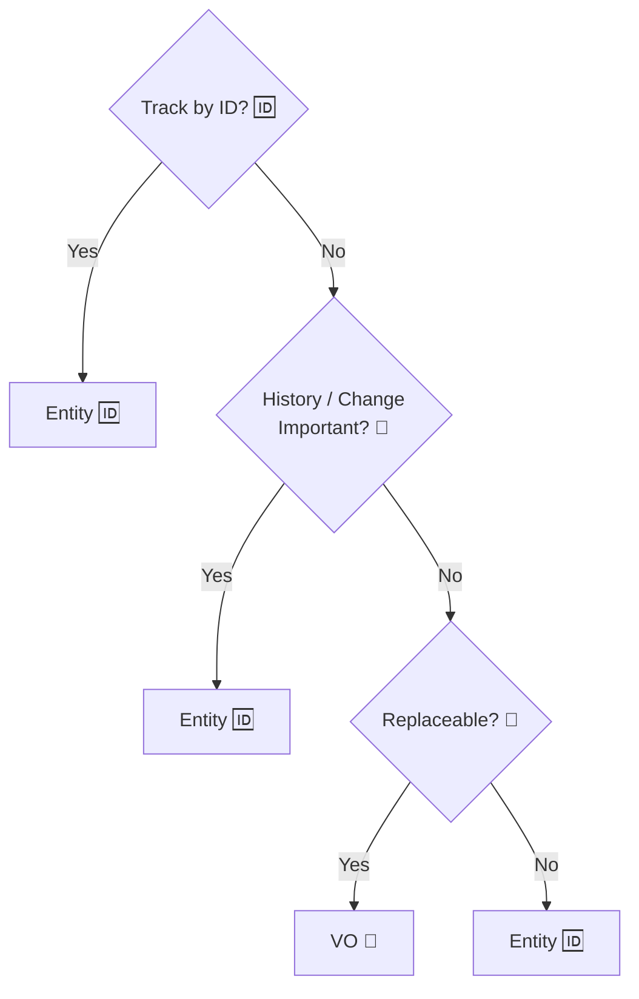

# 第21章：判断チェックリスト① “判断軸”を作る✅🧭

（学内カフェ注文アプリ ☕️🧾 でずっと統一だよ〜！）

この章はね、**「迷ったときに戻ってこれる“判断の軸”」**を作る回だよ ✅✨
Entity/VOって、慣れるまで **毎回ちょい迷う**のが普通だから大丈夫〜🙂💕

---

## 0. まず最新の前提だけ、さらっと🌱（知識の土台）

いまのC#は **C# 14** が最新で、**.NET 10** 上でサポートされてるよ〜🧠✨ ([Microsoft Learn][1])
.NET 10は **LTS**で、2026-01-13時点で **10.0.2** までパッチが出てる（＝現場でも普通に使う土台がこれ）って感じ！🧱✨ ([Microsoft][2])

---

## 1. この章のゴール 🎯✨

章が終わるころに、こんな状態になってたら勝ち🏆💕

* 「これはEntity」「これはVO」って**理由つきで言える**🗣️✨
* 迷ったら **チェックリストで“機械的に”一回判定**できる✅
* 境界っぽい子（OrderLineとか）も、**“いったんの落とし所”**が作れる🙂🧩

---

## 2. まず結論：迷ったら“VO寄り”から入るのが強い 💎✨

Entityは強いけど、**責務も増えやすい**のね😅
だから迷ったら、最初はこうすると安全：

* **値として置けるならVOで置く**💎
* 後から「IDが必要」「履歴が必要」になったら **Entityに昇格**🆙🆔

これ、設計あるあるの「あとで要件が見えてくる問題」に強いよ〜🛡️✨

---

## 3. 判断チェックリスト（本体）✅🧭

### 3-1. Entityっぽいサイン（当てはまるほどEntity）🆔🧍‍♀️

次のうち **2つ以上**当てはまったら、かなりEntity濃厚！

1. **同一性（ID）で追いかけたい** 🆔

* “同じ注文”は、金額が変わっても「同じ注文」だよね？

2. **時間とともに状態が変わる** 🔁

* Confirm/Canceled みたいな状態遷移がある

3. **履歴・監査・いつ誰が変えた** が大事 📜

* 変更ログが価値になるタイプ

4. **入れ替え不可能（差し替えると別モノ）** 🚫

* 同じ値でも「それ」は「それ」

5. **他から参照される“本人”**になってる 👀

* ほかの場所が「それを指す」感じ

---

### 3-2. VOっぽいサイン（当てはまるほどVO）💎🧊

次のうち **2つ以上**当てはまったら、VO濃厚！

1. **同一性がいらない（IDで追わない）** 💎

* 値が同じなら同じ扱いでOK

2. **不変（作ったら変えない）** 🔒

* VOは基本これ！
  MicrosoftのDDDガイドでも「VOはIDなし」「不変」が大事って整理されてるよ🧠 ([Microsoft Learn][3])

3. **自己完結で正しさを守れる** ✅

* 作成時にバリデーションして、以後は安心✨

4. **置き換え可能** 🔁

* Emailが変わったら「新しいEmailに置き換える」感覚

5. **計算・比較の“意味”がある** ⚖️

* Moneyの加算、Quantityの比較…みたいに、プリミティブより意味が濃い

---

## 4. 3ステップ判定法（迷ったらこれだけ）🧭✨

**Step 1：IDで追う？**

* YES → Entity候補 🆔
* NO → VO候補 💎

**Step 2：変化・履歴が価値？**

* YES → Entity寄り 🔁📜
* NO → VO寄り 🔒

**Step 3：置き換えできる？（同じ値なら同じ？）**

* YES → VO 💎
* NO → Entity 🆔

---

## 5. カフェ注文アプリで分類してみよ☕️🧾✨

### 5-1. これはEntity寄りだよね〜🆔

* **Order（注文）**：状態が変わる（下書き→確定→キャンセル）🔁
* **Customer（購入者）**：本人を追う🧍‍♀️🆔
* **MenuItem（メニュー品目）**：参照される“存在”🍰📌
* **Coupon（クーポン）**：

  * 「発行」「失効」「使用回数」みたいな履歴があるならEntity寄り🎟️📜

### 5-2. これはVOが気持ちいい💎

* **Money（金額）** 💰（比較・加算・通貨…意味がある）
* **Email** 📧（値が正しければOK、置き換えOK）
* **Quantity（数量）** 🔢（0以上/1以上など制約が価値）
* **OrderId / CustomerId（型付きID）** 🆔（取り違え防止のVO）
* **DateRange（期間）** 📅（開始≤終了の制約が本体）

---

## 6. “境界ケース”攻略コーナー 😵‍💫➡️🙂✨

### ケースA：OrderLine（注文明細）ってEntity？VO？🧾

どっちもありえる！だから判断はこうするのがコツ👇

**OrderLineがVOでいける条件（おすすめ寄り）💎**

* 明細にIDを付けて追わない
* 並び順や中身が変わったら「差し替え」でOK
* 個別の明細を外部から参照しない（＝Orderの中だけで完結）

**OrderLineがEntityになる条件 🆔**

* 明細単位で「返品」「取り消し」「調理状況」みたいな状態が必要
* 明細に対して個別に履歴・監査が必要
* 他から「その明細」を直接参照する要件がある

落とし所としては、最初はVO寄りで作って、必要になったらEntity化がやりやすいよ〜💡✨

---

## 7. よくある地雷（ここ踏むと事故りがち）💣😇

1. **DBテーブルがある＝Entity** と決めつける

* DB都合とドメイン都合はズレることあるよ〜😅
* 「保存の形」と「モデルの形」は別物って意識が大事🧠✨

2. **とりあえず全部Entity**

* IDだらけ＆更新経路が増えて、逆に壊れやすい😱

3. **ミュータブルVO（値が変わるVO）**

* Dictionary/HashSetに入れた瞬間、地獄の入口になりがち😇
* VOは基本“不変”が安定だよ🔒✨ ([Microsoft Learn][3])

---

## 8. ミニ演習 🧪✍️（この章のゴール！）

### 演習1：自分用チェックリストを「5行」で作ろう📝✨

下のテンプレを、あなたの言葉で埋めてみてね🙂💕

* Entityは（　　　　　　　　　）で追う🆔
* Entityは（　　　　　　　　　）が変わっても同じ🔁
* VOは（　　　　　　　　　）なら同じ💎
* VOは（　　　　　　　　　）を作れないようにする✅
* 迷ったらまず（　　　　　　　　　）から置く🧭

### 演習2：10問分類クイズ（理由を一言）🎯✨

次を Entity/VO に分類して、理由を一言で✍️

1. 学籍番号 🎓
2. 氏名（フルネーム）🪪
3. 注文番号 🧾
4. 座席番号 🪑
5. クーポンコード 🎟️
6. 決済（Payment）💳
7. 住所 📮
8. 注文の状態（Draft/Confirmed…）🟡🟢🔴
9. 商品の価格 💰
10. カート（注文前の一時保存）🛒

※「どっちもあり得る」って答えでもOK！その場合は「どんな条件なら？」を書けたら上級✨

---

## 9. AI活用（Copilot/Codex）🤖✨：この章で使うと強い頼み方

AIは“答えを当てる”より、**判断材料を並べさせる**のが相性いいよ🧠✨

### おすすめプロンプト例💬

* 「OrderLineをEntity/VOの両方で設計案を出して。どんな要件で分岐するかも列挙して」
* 「このクラス候補リストをEntity/VOに分類して、各1行で理由を書いて」
* 「境界ケース（Coupon/Seat/Cart）の判断基準をチェックリスト化して」
* 「VOにすると嬉しい“プリミティブ地獄回避”の例を、カフェ注文アプリで5つ出して」

ポイントは、**AIに決めさせないで、材料を出させてあなたが決める**ことだよ✅✨

---

## 10. まとめ（1分で復習）⏱️✨

* **Entity**：IDで追う🆔／変化する🔁／履歴が価値📜
* **VO**：IDいらない💎／不変🔒／作れた時点で正しい✅ ([Microsoft Learn][3])
* 迷ったら **VO寄りで置いて、必要になったらEntityへ昇格**が安定🧭✨
* いまの土台は **.NET 10（LTS）＋C# 14** が最新だよ🧱✨ ([Microsoft][2])

---

次の第22章は、この判断軸を**クイズで反射レベル**にしていく回だよ〜🎯🧠✨
もしよければ、さっきの「10問分類クイズ」あなたの回答を貼ってくれたら、**理由の言い方を“設計っぽく”整える添削**もできるよ🙂💕

[1]: https://learn.microsoft.com/en-us/dotnet/csharp/whats-new/csharp-14 "What's new in C# 14 | Microsoft Learn"
[2]: https://dotnet.microsoft.com/en-us/platform/support/policy/dotnet-core ".NET and .NET Core official support policy | .NET"
[3]: https://learn.microsoft.com/en-us/dotnet/architecture/microservices/microservice-ddd-cqrs-patterns/implement-value-objects "Implementing value objects - .NET | Microsoft Learn"
