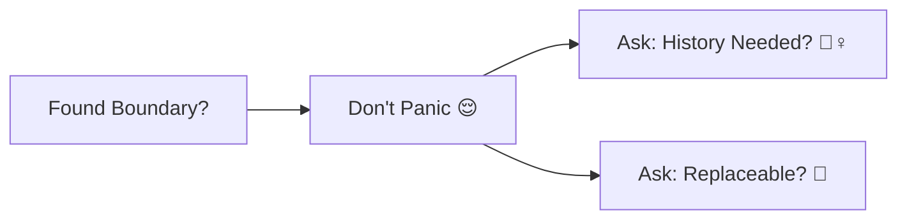

# 第22章：判断チェックリスト② 分類クイズで定着🎯🧠

（学内カフェ注文アプリ☕️🧾の世界で、判断を“反射”にしていくよ〜！）

---

## 0. まず結論：迷ったらこの3問だけでOK✅🧭

Entity / VO を迷ったときは、まずここから👇✨

1. **それが“同じ本人”として追跡される？**（IDで追う？履歴が大事？）🆔
   → **YesならEntity寄り**

2. **値が同じなら“同じもの”でいい？**（等価性でOK？）💎
   → **YesならVO寄り**

3. **変わると困るから“不変”で持ちたい？**（作ったら基本変えない）🔒
   → **YesならVO寄り**

ちなみに今は **C# 14 が最新で .NET 10 対応**だよ〜🧁✨（Visual Studio 2026 も .NET 10 SDK を含む）
([Microsoft Learn][1])

---

## 1. 今日のゴール🎯✨

* 15問をテンポよく分類して、**理由も1行で言える**ようになる✍️💖
* 「どっちでもあり得る（境界）」を見つけたら、**“判断の追加質問”**まで言えるようになる🙂🧠

---


## 2. クイズのやり方（おすすめ）📝🎮

1. まず答えを見ずに、**E（Entity）/ V（VO）/ B（境界）**で書く✍️
2. 理由は1行でOK（長文いらない）🙂
3. 答え合わせで「自分のズレの癖」を知る👀✨

---

## 3. 分類クイズ15問🎯🔥


> **E=Entity / V=Value Object / B=境界（設計次第）**


### Q1：Money（例：¥450）💰

* これは？ **E / V / B**

### Q2：Quantity（例：2杯）☕️➕

* これは？ **E / V / B**

### Q3：Email（例：[a@b.com](mailto:a@b.com)）📧

* これは？ **E / V / B**


### Q4：Order（注文そのもの）🧾

* これは？ **E / V / B**

### Q5：OrderId（注文ID）🆔

* これは？ **E / V / B**


### Q6：OrderLine（注文明細：ラテ×2 みたいな1行）📄

* これは？ **E / V / B**

### Q7：MenuItem（メニュー：カフェラテ）📋☕️

* これは？ **E / V / B**

### Q8：MenuItemCode（メニューコード：LATTE-001 みたいな）🏷️

* これは？ **E / V / B**

### Q9：CouponCode（クーポン文字列：WELCOME10）🎫

* これは？ **E / V / B**

### Q10：Coupon（“クーポンの利用状態”を持つもの：未使用/使用済/期限切れ）⏳🎫

* これは？ **E / V / B**


### Q11：Student（学生ユーザー）👩‍🎓

* これは？ **E / V / B**

### Q12：StudentId（学籍番号）🪪

* これは？ **E / V / B**


### Q13：Address（住所）🏠

* これは？ **E / V / B**

### Q14：PaymentMethod（支払い方法：現金/クレカ/電子マネー）💳

* これは？ **E / V / B**

### Q15：ReceiptNumber（領収書番号）🧾🔢

* これは？ **E / V / B**

---

## 4. 答え合わせ（理由1行つき）✅✨

> ここから下、答えだよ〜！👀💖

### A1：Money → **V** 💎

値が同じなら同じ、**不変**で扱いたい（通貨や丸めルールも一緒に持てる）

### A2：Quantity → **V** 💎

「2」は「2」。値の塊。**制約（1以上など）**を一緒に守る

### A3：Email → **V** 💎

同じ文字列なら同じ。形式チェック込みで**“作れたら正しい”**にしたい

### A4：Order → **E** 🆔

途中で状態が変わっても“同じ注文”。履歴・状態（Draft/Confirmed…）が大事

### A5：OrderId → **V**（またはVO的な専用型）🆔💎

IDそのものは値。**取り違え防止**のために型にするのが強い

### A6：OrderLine → **B（境界）**🙂

* **VO寄り**：明細を“丸ごと差し替え”で運用する（不変で扱う）
* **Entity寄り**：明細に行IDがあり、行単位で履歴や編集を追いたい
  👉「明細を個別追跡する要件がある？」が追加質問✅

### A7：MenuItem → **E（寄り）**🆔

メニューはカタログの“本人”。価格改定しても“同じ商品”として扱うことが多い

### A8：MenuItemCode → **V** 🏷️💎

コードは値。**コードの形式制約**（長さ/文字種）も一緒にできる

### A9：CouponCode → **V** 🎫💎

文字列そのものは値。コードのバリデーションも含めやすい

### A10：Coupon → **E（寄り）** 🎫🆔

「未使用→使用済」みたいに**状態が変わる同一物**として追うことが多い
（※“ただの割引ルール”ならVO/ルール扱いもあり得るけど、利用履歴を持った瞬間Entity寄り）

### A11：Student → **E** 👩‍🎓🆔

学生は“本人”。名前が変わっても同一人物だよね

### A12：StudentId → **V** 🪪💎

学籍番号は値。学生（Entity）を識別するための値（型付きにすると事故が減る）

### A13：Address → **B（境界）**🏠🙂

* **VO寄り**：住所は値の塊。変更は“新住所に差し替え”
* **Entity寄り**：住所自体にIDを付けて履歴・検証・参照を強く追う（配送先台帳など）
  👉「住所を“履歴対象の資産”として管理する？」が追加質問✅

### A14：PaymentMethod → **V** 💳💎

列挙や小さな値の組で表せることが多い（“支払い手段”は値として比較できる）

### A15：ReceiptNumber → **B（境界）**🧾🙂

* **VO寄り**：番号は値（形式・桁数を守る）
* **Entity寄り**：領収書そのもの（再発行/取消/監査）を追うならEntity
  👉「番号だけ必要？それとも領収書という“物”を追う？」が追加質問✅

---

## 5. “境界”を見つけた時の最強ムーブ💪✨




境界に出会ったら、焦って分類しないでOK🙂
代わりにこの2つを書くのが勝ち✍️💖

* **追加質問（要件）**：「これ、個別に追跡する？履歴いる？」🕵️‍♀️
* **運用方針**：「不変で差し替える？それとも更新で持つ？」🔁

これができると、設計の会話が一気にプロっぽくなるよ😆✨

---

## 6. 10分ミニ演習：自分の“判断癖”を矯正する🧪🧠

### 演習A（3分）📝

上の15問で、**B（境界）にしたもの**を全部書き出して、
「追加質問」を1個ずつ付けてみて✨

例：Address → 「配送先を履歴管理する必要ある？」✅

### 演習B（7分）🧪

**OrderLine**を「VO案」と「Entity案」で、1行ずつメリットを書く👇

* VO案：差し替え運用でシンプル、バグ少ない💎
* Entity案：行単位の編集履歴が追える🆔

---


## 7. AI（Copilot/Codex）に頼むときの“良い頼み方”🤖💬✨

Visual Studio の **Copilot Chat** はメニューから開けるよ🪟✨
([Microsoft Learn][2])

### そのまま使えるプロンプト例（コピペOK）🧁

```text
次の15項目を Entity / ValueObject / 境界(B) で分類して。
各項目の理由は「1行」で。
境界(B)にした場合は「追加質問（要件）」も1つ付けて。

（ここにQ1〜Q15を貼る）
```

### AIの答えを“採点”する観点✅

* 「IDで追跡するか？」の視点がある？🆔
* 「値が同じなら同じか？」がある？💎
* 「境界のとき追加質問が書けてる？」🙂

---

## 8. 今日のまとめ（1分）⏱️✨

* **Entity**：同一性（ID）で追う、状態や履歴が大事🆔
* **VO**：値で比較、不変、作れた時点で正しい💎🔒
* **境界**：要件で変わる。**追加質問を書けたら勝ち**🙂✅

そして今の開発環境は、**.NET 10（LTS）**が最新ラインで、2026/1/13時点の最新パッチは **10.0.2**だよ〜✨
([Microsoft][3])
（C# 14 は .NET 10 対応で最新）([Microsoft Learn][1])
（Visual Studio 2026 は 2026/1/20 に 18.2.1 の更新が出てる）([Microsoft Learn][4])

---

## 次章予告📣✨（第23章）

次は **DTO/API/画面入力 → ドメイン変換**🌉🧾
“string/int地獄😇”から **VOで救出する流れ**を作っていくよ〜！💎🚀

[1]: https://learn.microsoft.com/en-us/dotnet/csharp/whats-new/csharp-14?utm_source=chatgpt.com "What's new in C# 14"
[2]: https://learn.microsoft.com/en-us/visualstudio/ide/visual-studio-github-copilot-chat?view=visualstudio&utm_source=chatgpt.com "About GitHub Copilot Chat in Visual Studio"
[3]: https://dotnet.microsoft.com/ja-jp/platform/support/policy/dotnet-core?utm_source=chatgpt.com ".NET および .NET Core の公式サポート ポリシー"
[4]: https://learn.microsoft.com/en-us/visualstudio/releases/2026/release-notes?utm_source=chatgpt.com "Visual Studio 2026 Release Notes"
