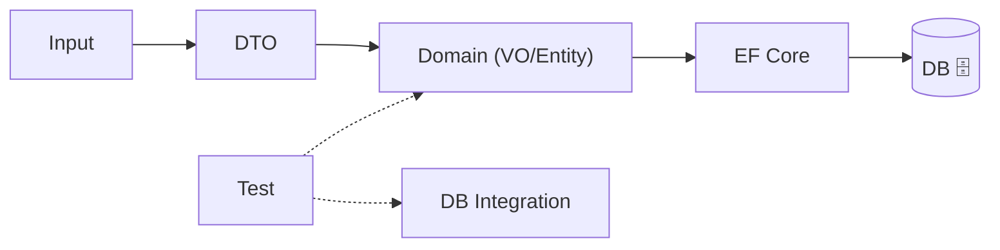

# 第24章：境界② 永続化＆テスト＆リファクタ＆AI（総仕上げ）🎓✨

ゴールはこれっ👇✨
**「ドメイン（Entity/VO）がキレイなまま、DB保存できて、テストで守れて、段階的に改善できる」**状態にするよ〜！☕️🧾🧱🧪

---

## 0) まず完成イメージを見よう 🏁✨




学内カフェ注文アプリの「注文」まわりが、こんな感じで回るようになるのが理想だよ👇

1. 画面/API入力（DTO）→ **入口でVO化して検証** 🌉💎
2. ドメイン（Orderがルールで守る）🧾🔒
3. 永続化（EF CoreでDBに保存）🗄️
4. テスト（VO/Entity/DBまで守る）🧪🛡️
5. 既存コードを**段階リファクタ**でVO化していく 🧹✨
6. AIで雛形生成→レビュー観点で人間が最終判断 🤖✅

---


## 1) 永続化の考え方：VOは「値として保存」🗄️💎

VOはDBにそのまま突っ込むというより、だいたいこのどれかで保存するよ👇✨

### パターンA：列に“展開”する（いちばん無難）🧩

例：`Money = (Amount, Currency)` → `TotalAmount`, `TotalCurrency`

* 👍 検索しやすい（合計金額でWHEREとか）🔍
* 👍 DBが普通のRDBでもOK
* 👀 列が増えやすい（でも実務ではよくある）🙂

### パターンB：JSONにまとめて保存（条件が合えば強い）🧾➡️🧊

EF Core 10では**Complex TypeをJSON列にマッピング**できるようになってるよ（例：`ComplexProperty(..., c => c.ToJson())`）✨ ([Microsoft Learn][1])
しかもJSON内部のプロパティを普通の列みたいにクエリできたり、更新できたりする方向に進んでるよ〜！ ([Microsoft Learn][1])

* 👍 まとまりが良い（複合値・入れ子に強い）
* 👍 コレクションも扱える場合がある ([Microsoft Learn][1])
* ⚠️ DB側のJSON型・機能が効いてくる（使うDB次第）🙂

### パターンC：別テーブル（子要素が多いとき）📦

例：`OrderLines` は別テーブルが自然なことが多い（件数が増える＆検索もしたい）

---


## 2) EF Core 10で“VOっぽさ”を壊さないコツ：Complex Typeが強い💎✨

EF Core 10 の “Complex Type” は、**Owned Entityの「裏でIDがある問題」を避けやすい**のがポイントだよ〜！
Owned Entityは「裏ではエンティティ（参照セマンティクス＋隠れた同一性）」として振る舞うので、**同じ値を代入しただけでエラー**になったり、比較が期待通りにならなかったりするケースがあるのが説明されてるよ。Complex Typeは値セマンティクスでそこが自然になるよ〜✨ ([Microsoft Learn][1])

---

## 3) 実装パート：最小で動く “永続化セット” を作ろう 🛠️✨

ここからは **「いままで作ってきたドメインを汚さずにDBへ」**がテーマだよ☕️🧾

### 3-1) 例：VOたち（超ミニ版）💎

* `OrderId`：Guidを包む（取り違え事故防止）🆔
* `Email`：stringを包む（作れた時点で正しい）📧
* `Money`：Amount+Currency（decimalだけにしない）💰🌍

```csharp
public readonly record struct OrderId(Guid Value);

public sealed record Email
{
    public string Value { get; }
    private Email(string value) => Value = value;

    public static bool TryCreate(string value, out Email? email)
    {
        email = null;
        if (string.IsNullOrWhiteSpace(value)) return false;
        if (!value.Contains('@')) return false; // 学習用の最小チェック🙂
        email = new Email(value.Trim());
        return true;
    }

    public override string ToString() => Value;
}

public readonly record struct Money(decimal Amount, string Currency)
{
    public static Money Jpy(decimal amount) => new(amount, "JPY");
}
```

---

### 3-2) Entity（Order / OrderLine）🧾📦

```csharp
public enum OrderStatus { Draft, Confirmed, Canceled }

public class Order
{
    public OrderId Id { get; private set; }
    public Email CustomerEmail { get; private set; } = default!;
    public OrderStatus Status { get; private set; } = OrderStatus.Draft;

    private readonly List<OrderLine> _lines = new();
    public IReadOnlyList<OrderLine> Lines => _lines;

    // 合計は例として保持（計算でもOK）🙂
    public Money Total { get; private set; } = Money.Jpy(0);

    private Order() { } // EF用

    public Order(OrderId id, Email email)
    {
        Id = id;
        CustomerEmail = email;
    }

    public void AddLine(string menuItemCode, int quantity, Money unitPrice)
    {
        if (Status != OrderStatus.Draft) throw new InvalidOperationException("確定後は変更できないよ😵");
        if (quantity <= 0) throw new ArgumentOutOfRangeException(nameof(quantity));

        _lines.Add(new OrderLine(menuItemCode, quantity, unitPrice));
        RecalcTotal();
    }

    public void Confirm()
    {
        if (Status != OrderStatus.Draft) throw new InvalidOperationException("Draftだけ確定できるよ🙂");
        if (_lines.Count == 0) throw new InvalidOperationException("明細がない注文は確定できないよ😵");
        Status = OrderStatus.Confirmed;
    }

    private void RecalcTotal()
    {
        decimal sum = 0;
        foreach (var l in _lines) sum += l.UnitPrice.Amount * l.Quantity;
        Total = new Money(sum, "JPY"); // 学習用の簡略🙂
    }
}

public class OrderLine
{
    public int Id { get; private set; } // DB上の主キー（学習用に単純化🙂）
    public string MenuItemCode { get; private set; } = default!;
    public int Quantity { get; private set; }
    public Money UnitPrice { get; private set; }

    private OrderLine() { } // EF用

    public OrderLine(string code, int qty, Money unitPrice)
    {
        MenuItemCode = code;
        Quantity = qty;
        UnitPrice = unitPrice;
    }
}
```

---


### 3-3) EF Core：ValueConverter と ComplexProperty を使い分ける 🧠✨

**ValueConverter**は「モデルの型 ⇄ DBが分かる型」を変換して保存できる仕組みだよ（読み書き時に変換）🪄 ([Microsoft Learn][2])

ここでは👇

* `OrderId`（VO）→ DBは `uniqueidentifier(Guid)` に
* `Email`（VO）→ DBは `nvarchar(string)` に
* `Money`（複合値）→ **Complex Typeで列展開**（Amount/Currency）にする例でいくよ💰✨
  （ComplexPropertyで列に展開できるのがEF Core 10の流れだよ） ([Microsoft Learn][1])

```csharp
using Microsoft.EntityFrameworkCore;
using Microsoft.EntityFrameworkCore.Metadata.Builders;

public class CafeDbContext : DbContext
{
    public DbSet<Order> Orders => Set<Order>();

    public CafeDbContext(DbContextOptions<CafeDbContext> options) : base(options) { }

    protected override void OnModelCreating(ModelBuilder modelBuilder)
    {
        modelBuilder.ApplyConfiguration(new OrderConfig());
    }
}

public class OrderConfig : IEntityTypeConfiguration<Order>
{
    public void Configure(EntityTypeBuilder<Order> b)
    {
        b.ToTable("Orders");

        // OrderId: VO -> Guid
        b.HasKey(x => x.Id);
        b.Property(x => x.Id)
            .HasConversion(
                id => id.Value,
                value => new OrderId(value));

        // Email: VO -> string
        b.Property(x => x.CustomerEmail)
            .HasConversion(
                email => email.Value,
                value => Email.TryCreate(value, out var e) ? e! : throw new InvalidOperationException("DBのEmailが不正😵"));

        // Money: Complex Typeとして列に展開
        b.ComplexProperty(x => x.Total, cb =>
        {
            cb.Property(p => p.Amount).HasColumnName("TotalAmount");
            cb.Property(p => p.Currency).HasColumnName("TotalCurrency").HasMaxLength(3);
        });

        b.Property(x => x.Status).HasConversion<string>();

        // 明細は別テーブル（わかりやすさ優先🙂）
        b.HasMany(typeof(OrderLine), "_lines")
            .WithOne()
            .OnDelete(DeleteBehavior.Cascade);
    }
}

public class OrderLineConfig : IEntityTypeConfiguration<OrderLine>
{
    public void Configure(EntityTypeBuilder<OrderLine> b)
    {
        b.ToTable("OrderLines");

        b.HasKey(x => x.Id);
        b.Property(x => x.MenuItemCode).HasMaxLength(50);

        b.ComplexProperty(x => x.UnitPrice, cb =>
        {
            cb.Property(p => p.Amount).HasColumnName("UnitPriceAmount");
            cb.Property(p => p.Currency).HasColumnName("UnitPriceCurrency").HasMaxLength(3);
        });
    }
}
```

> 💡補足：Complex Typeは「OwnedよりVOっぽく扱える」方向だよ〜。Ownedが抱えがちな挙動の違い（同一性が絡む）についても公式で注意されてるよ。 ([Microsoft Learn][1])

---


## 4) テスト戦略：3段構えが“安心”🧪🛡️


ここは超重要〜！😆✨
**「何をどこまで守るか」**を分けるとラクだよ👇

### 4-1) VOテスト（最強コスパ）💎✅

* Emailが不正なら作れない
* Moneyがマイナスになれない（章16でやったやつ）
* 等価性が崩れない

### 4-2) Entityテスト（状態遷移を守る）🧾🔁

* DraftだけConfirmできる
* Confirm後はAddLineできない

### 4-3) DB統合テスト（変換・マッピング事故を防ぐ）🗄️🧪

* SaveしてLoadしたら、VOがちゃんと戻ってくる
* Moneyが列に展開されて保存される
* ValueConverterでOrderIdが壊れない

xUnitは **v3が .NET 8+ をサポート**してるよ 🧪✨ ([xunit.net][3])

#### SQLiteインメモリで“保存→取得”テスト例 🧊🧪

```csharp
using Microsoft.Data.Sqlite;
using Microsoft.EntityFrameworkCore;
using Xunit;

public class PersistenceTests
{
    [Fact]
    public async Task Save_and_load_order_with_value_objects()
    {
        // SQLite in-memory（接続を開きっぱなしにするのがコツ🙂）
        var conn = new SqliteConnection("DataSource=:memory:");
        await conn.OpenAsync();

        var options = new DbContextOptionsBuilder<CafeDbContext>()
            .UseSqlite(conn)
            .Options;

        // スキーマ作成
        using (var setup = new CafeDbContext(options))
        {
            await setup.Database.EnsureCreatedAsync();
        }

        var ok = Email.TryCreate("alice@example.com", out var email);
        Assert.True(ok);

        var orderId = new OrderId(Guid.NewGuid());
        var order = new Order(orderId, email!);
        order.AddLine("LATTE", 2, Money.Jpy(480));
        order.Confirm();

        // 保存
        using (var save = new CafeDbContext(options))
        {
            save.Add(order);
            await save.SaveChangesAsync();
        }

        // 取得
        using (var load = new CafeDbContext(options))
        {
            var loaded = await load.Orders.SingleAsync(o => o.Id == orderId);
            Assert.Equal("alice@example.com", loaded.CustomerEmail.Value);
            Assert.Equal(OrderStatus.Confirmed, loaded.Status);
            Assert.True(loaded.Total.Amount > 0);
        }
    }
}
```

---


## 5) 段階リファクタ：プリミティブ地獄 → VO へ安全移行🧹✨

「いきなり全部VO化」は事故りやすいので、**段階でやる**のがいちばん強いよ💪✨

### ステップ1：VOを“追加”して、まだ使わない（まず置く）📦

* `Email`, `Money`, `OrderId` を作る
* テストだけ先に書く（ここが安全）🧪

### ステップ2：入口（DTO/画面入力）でVO化して検証 🌉💎

* 失敗理由はUIに返す（Result方式とか）🙂

### ステップ3：ドメイン内部のフィールドをVOへ置き換え 🔁

* 使う側（呼び出し側）を少しずつ直す

### ステップ4：EF Coreの変換を入れる（Converter / ComplexProperty）🗄️

* ここでDB保存が崩れやすいので統合テスト大事！🧪

### ステップ5：不要になったプリミティブを削除 ✂️✨

* “一時的な互換プロパティ”があれば消す

### ステップ6：名前・責務を整える（総仕上げ）🎀

* ルールはEntity/VOへ、DB都合はEF設定へ

---


## 6) AI活用：雛形は任せて、判断は人間が握る🤖👑

C# 14 は .NET 10 世代の最新言語で、Visual Studio 2026 で触れるよ✨ ([Microsoft Learn][4])
だからAI相棒（Copilot/Codex）とも相性いい〜！😆

### 6-1) 雛形生成で時短するプロンプト例 🕒✨

* EF変換（ValueConverter）

  * 「`OrderId`(Guid) の HasConversion をEF Coreで書いて。null考慮もコメントして」

* ComplexProperty（Money列展開）

  * 「`Money(Amount,Currency)` を Orders の `TotalAmount`, `TotalCurrency` に展開する `ComplexProperty` 設定を書いて」

* テスト

  * 「Orderの状態遷移（Draft→Confirm、Confirm後AddLine不可）のxUnitテストをケース網羅で出して」

### 6-2) AIレビュー用チェックリスト（これを毎回コピペでOK）✅✨

* 💎 VOは不変？（公開setがない／作れた時点で正しい）
* 💎 Equalsの意味が“値”になってる？（record/record struct等）
* 🧾 Entityのルールが外に漏れてない？（サービスに散ってない）
* 🗄️ EF設定が「DB都合」を全部受け止めてる？（ドメインに属性ベタ貼りしすぎてない）
* 🧪 変換（Converter/ComplexProperty）が統合テストで守られてる？

---


## 7) 最終課題（この章のゴール演習）🎓☕️🧾✨

**お題：**
「string/int/decimalだらけのOrder」を、段階的にVO導入して安全に改善しよう！

### やること（チェックボックス式）✅

* [ ] Email VOを追加して、入口でTryCreateする📧
* [ ] Money VOを追加して、TotalとUnitPriceを置き換える💰
* [ ] OrderId（型付きID）を導入する🆔
* [ ] EF Coreで `HasConversion`（OrderId/Email）を設定する🗄️🪄 ([Microsoft Learn][2])
* [ ] EF Coreで `ComplexProperty`（Money）を列展開する💎🧩 ([Microsoft Learn][1])
* [ ] SQLite in-memory の統合テストで「保存→取得」を通す🧪🧊
* [ ] Entityの状態遷移テストを追加する🧾🔁

---

## 1分まとめ ⏱️✨

* **VOは値として保存**（列展開 or JSON or 別テーブル）🗄️
* EF Core 10 の **Complex Type** は VOと相性が良く、Ownedの“裏ID問題”を避けやすい 💎✨ ([Microsoft Learn][1])
* **ValueConverter**で「VO⇄DB型」を安全に変換できる 🪄 ([Microsoft Learn][2])
* テストは **VO → Entity → DB統合** の3段で守る 🧪🛡️
* 移行は段階で！一気にやらない🧹✨
* AIは雛形生成に強いけど、**ルールの判断は人間が握る**🤖✅

---

次は（もし続けるなら）
**「最終成果物の“完成版”サンプル（フォルダ構成・DbContext・Migration方針・テスト一式）」**を、まるっと教材として整形した版も作れるよ〜！😆📚✨

[1]: https://learn.microsoft.com/en-us/ef/core/what-is-new/ef-core-10.0/whatsnew "What's New in EF Core 10 | Microsoft Learn"
[2]: https://learn.microsoft.com/en-us/ef/core/modeling/value-conversions "Value Conversions - EF Core | Microsoft Learn"
[3]: https://xunit.net/?utm_source=chatgpt.com "xUnit.net: Home"
[4]: https://learn.microsoft.com/en-us/dotnet/csharp/whats-new/csharp-14 "What's new in C# 14 | Microsoft Learn"
