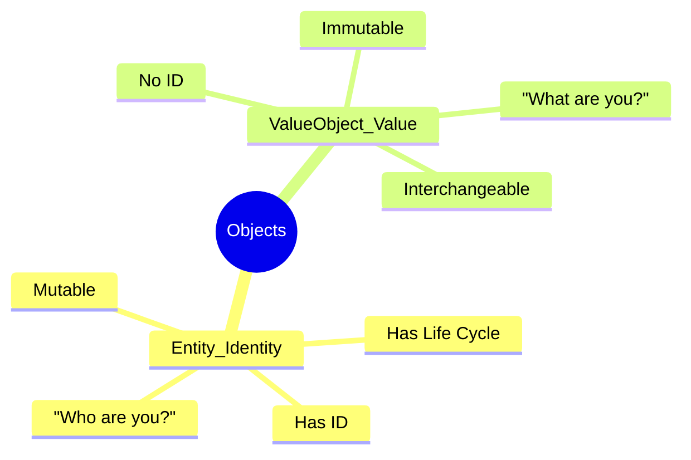
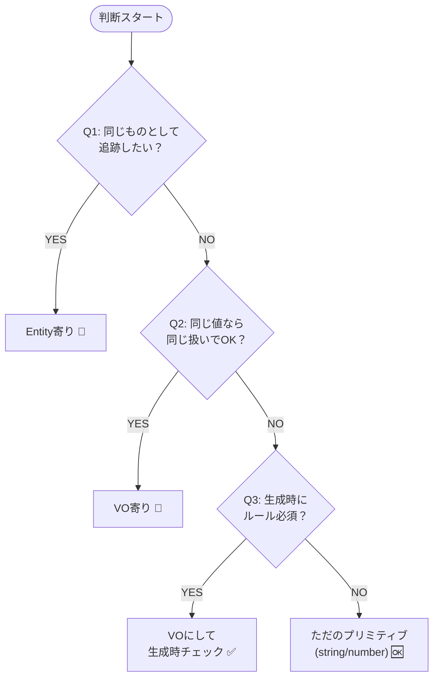

# 第01章：はじめに（この学習のゴール）🎯😊

ようこそ〜！ここからは **「エンティティ（Entity）」と「値オブジェクト（Value Object = VO）」を迷わず切り分けられる** ようになるための旅だよ〜🧳🌸
まず最初の第1章は、むずかしい実装はしないで **“判断できる頭”を作る回** です🧠✨

---

## 0. いまどきのTypeScript（2026年1月の空気感）🌍⚡

* TypeScriptの最新安定版は **5.9.3**（npmのlatest）だよ〜📦✨ ([npm][1])
* 5.9では、たとえば `import defer` みたいな新しめの仕組みも入ってきてるよ📥⏳ ([typescriptlang.org][2])
* そして今、TypeScriptは **6.0（橋渡し）→ 7.0（ネイティブ化）** っていう大きな節目に向かってるところ！7はビルドが最大10倍級に速くなる話も出てるよ🚀💨 ([Microsoft for Developers][3])

> だからこの教材は「今主流のTSでちゃんと書ける」＋「これからの流れでも崩れない考え方」を狙うよ💪✨

---

## 1. この章のゴール（今日できるようになること）✅🌟

この章を終えたら、次の3つができればOK🙆‍♀️💕

1. **Entity/VOの違いを一言で言える** 🗣️✨
2. 迷ったときに使える **判断の質問を3つ** 持てる📝🔍
3. 題材（ミニケース）を1つ選んで、**「追跡したいもの」「値っぽいもの」** を分けられる🧺💎🪪

---


## 2. EntityとVOを30秒でつかむ⌛🧸




ここは超ざっくりでOKだよ〜！

### Entity（エンティティ）🪪

* **同じものとして追いかけたい**（時間が経っても“あれ”は“あれ”）
* 途中で中身が変わっても **本人（同一性）が大事** 🧍‍♀️➡️🧍‍♀️

例：会員、注文、請求書、サークルの部員…など📛🧾

### Value Object（値オブジェクト）💎

* **値そのものが大事**（同じ値なら同じ扱い）
* 作った瞬間から **ルールを守った“良い値”として存在** してほしい✨🔒
* 基本は **不変（変えない）** にするのが気持ちいい💖

例：Email、金額、住所、期間、割合、コード類…📧💰📍📅

---


## 3. なんで切り分けが大事なの？（超リアル理由）😵‍💫➡️😌✨

切り分けができると、こうなるよ👇

* **バグが減る**：変な値（不正なEmailとか）が「そもそも存在できない」状態になる🛡️✨
* **変更に強い**：仕様変更が来ても「影響が小さい場所」だけ直せる🔧🌿
* **読みやすい**：クラス名が “もの/値” を語ってくれて、理解が速い📚💨

---


## 4. 迷ったときの「3つの質問」🧠🔍✨（本章いちばん大事！）

迷ったら、この3つだけ聞いてみてね😊💡

### Q1：それ、**同じものとして追跡したい？** 🕵️‍♀️🪪

* YES → Entity寄り
* NO → 次へ

### Q2：それ、**同じ値なら同じ扱いでOK？** 🟰💎

* YES → VO寄り
* NO → 次へ（特殊ケースかも）

### Q3：それ、**作るときにルールを満たしてないと困る？** 🚫➡️✅

* YES → VOにして「生成時チェック」したい
* NO → ただのプリミティブ（string/number）でもOKな場合あり

> この3つをメモしておくと、迷いがめっちゃ減るよ📝✨




---


## 5. 今日のミニ題材を選ぼう🛒📒（どっちでもOK）

この教材は「小さい題材」で手を動かすよ〜💞
好きな方を選んでね（後で変更してもOK🙆‍♀️）

### A案：ミニ注文（おすすめ）🛍️🍰

* Order（注文）
* Customer（お客さん）
* LineItem（明細）
* Money（価格）
* Email（連絡先）

**イメージしやすい**し、VOも作りやすいよ✨

### B案：サークル会計📒💰

* Member（部員）
* Payment（支払い）
* Fee（会費）
* Period（対象期間）
* Money（お金）

「現実っぽいルール」を入れやすいのが良いところ🌸

---

## 6. 図解イメージ（頭の中の地図）🗺️✨


「追跡したいもの（Entity）」の中に、「ちゃんとした値（VO）」を入れていく感じだよ😊

```text
[Entity] Order(注文) 🪪
  - orderId        ← 同一性のカギ
  - customerId     ← 追跡したい相手
  - total: Money 💎
  - contact: Email 💎
  - period: Period 💎（必要なら）
```

ポイントはこれ👇

* Entityは「人生（履歴）」がある感じ⏳
* VOは「完成品の値」って感じ💎✨

---


## 7. 演習①：分類してみよう（直感でOK）🎮✨

次の8個を **Entity/VO/どっちでもない（ただの値）** に分けてみてね📝💕

1. Order（注文）
2. Customer（顧客）
3. Email
4. Money
5. 住所（Address）
6. 注文ステータス（Draft / Paid など）
7. 注文番号（表示用の “ORD-2026-001” みたいなやつ）
8. 商品名（ProductName）

### こたえ例（まずはこの感覚でOK）✅✨

* Entity：1, 2
* VO：3, 4, 5, 7, 8
* 状態（6）は **「VO的に扱える」**（列挙や専用型にする）ことが多いよ🚦✨

  * 「同じ値なら同じ」だし、「変な状態は作れない」が嬉しいからね🙂

---

## 8. 演習②：あなたの題材で「候補リスト」を作る📝🌸

選んだ題材で、これを書いてね👇（所要10分くらい⏰✨）

### (1) 追跡したいもの（Entity候補）を3つ🪪

* 例：Order / Customer / Payment …

### (2) 値そのもの（VO候補）を5つ💎

* 例：Email / Money / Address / Period / Rate …

### (3) VOにしたい理由（不変条件）を1行ずつ🛡️

* 例：Email → 「@がない値は存在しちゃダメ」
* Money → 「通貨が違う足し算は事故る」など

> ここまでできたら、第1章はもう勝ち〜〜🏆🎉

---


## 9. 小テスト（5問）🧠💡

**Q1**：中身が変わっても「同じもの」として扱いたいのはどっち？
**Q2**：「同じ値なら同じ」扱いしたいのはどっち？
**Q3**：「不正な値を作れない」ようにしたいのはどっちが向いてる？
**Q4**：VOをmutable（書き換え可）にすると起きがちな事故は？
**Q5**：「注文番号（表示用）」はEntity？VO？どっち寄り？

### 解答（サクッと）✅

* A1：Entity 🪪
* A2：VO 💎
* A3：VO 💎（生成時チェックが超強い）
* A4：どこかで勝手に値が変わって「え、いつ変わった!?」ってなる😱（追跡不能バグ）
* A5：多くはVO寄り（“形式とルールがある値”）✨

---


## 10. AIプロンプト集（第1章ぶん）🤖💞

そのままコピペでOKだよ〜（軽く調整してね）✨

### ① 超やさしい説明を作ってもらう

```text
EntityとValue Objectの違いを、初心者向けに
・たとえ話3つ
・やりがちな勘違い3つ
・判断の質問3つ
で説明して
```

### ② 自分の題材から候補を抜き出す

```text
このミニ仕様から
(1) Entity候補
(2) Value Object候補
(3) それぞれの理由
を箇条書きで出して。仕様：
（ここに10行くらい貼る）
```

### ③ 「3つの質問」でレビューしてもらう

```text
この分類（Entity/VO）を
「追跡したい？」「同じ値なら同じ？」「生成時にルール必須？」
の3観点でチェックして、怪しいところだけ指摘して：
（自分の候補リスト貼る）
```

---

## まとめ（第1章の持ち帰り）🎁✨

今日の成果物はこれだよ〜😊🌸

* ✅ 判断の3質問（Q1〜Q3）
* ✅ 題材を1つ選んだ
* ✅ Entity候補3つ / VO候補5つ / ルールを1行ずつ

次の第2章では、プロジェクトを “詰まらない形” に整えて、テストまで動く状態にしていくよ🧪✨
ちなみにテストは今だと **Vitest 4系**が主流で、ちょうど大型アップデートも入ってるよ〜⚡🧫 ([vitest.dev][4])

[1]: https://www.npmjs.com/package/typescript?utm_source=chatgpt.com "typescript"
[2]: https://www.typescriptlang.org/docs/handbook/release-notes/typescript-5-9.html?utm_source=chatgpt.com "Documentation - TypeScript 5.9"
[3]: https://devblogs.microsoft.com/typescript/progress-on-typescript-7-december-2025/?utm_source=chatgpt.com "Progress on TypeScript 7 - December 2025"
[4]: https://vitest.dev/blog/vitest-4?utm_source=chatgpt.com "Vitest 4.0 is out!"
