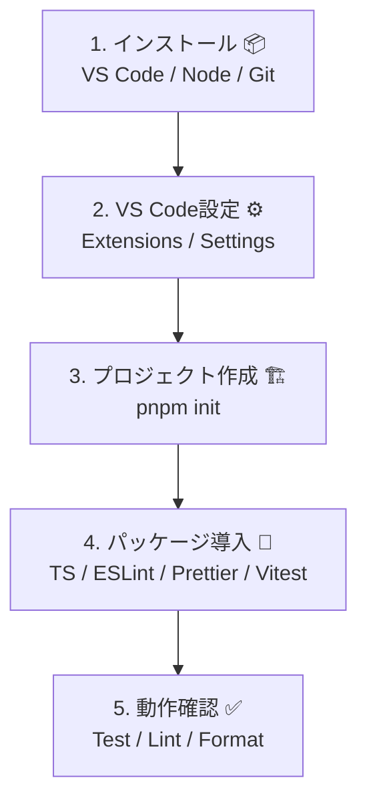

# 第02章：Windows＋VS Code＋TypeScript環境づくり💻🪟

（ここで“詰まらない土台”を作るよ〜！🎀）

---

## 0. この章のゴール🎯✨

この章が終わったら、こうなるよ👇😊

* TypeScriptのプロジェクトを**秒で作れる**🧁
* 保存したら**自動整形**される（見た目が毎回キレイ✨）
* **Lint（お作法チェック）**が走る🧹
* **テストが動く**（壊れてないって安心できる）✅
* VS Codeで**TypeScriptを“プロジェクトの版”で使える**🧠

---

## 1. まず入れるもの（最小セット）📦✨


### ✅ VS Code

最新版（例：v1.108 の更新情報あり）でOK！([code.visualstudio.com][1])

### ✅ Node.js（おすすめ：Active LTS）🟢

学習は **Active LTS（例：Node 24系）** が安定でラクだよ〜！([Node.js][2])

> ちなみに Node 25 以降は **Corepack が同梱されない**ので、pnpm/yarnをCorepackで使いたい人は “LTSが安心” って覚えとくと◎([Node.js][3])

### ✅ Git（あとで絶対助かる）🐙

（GitHub使う＆履歴が残る＝ミスっても戻れる✨）

---

## 2. いちばんカンタンなインストール方法（winget）🪄

ターミナル（PowerShell）でこれ👇（コピペOK！）

```bash
winget install Microsoft.VisualStudioCode
winget install OpenJS.NodeJS.LTS
winget install Git.Git
```

うまくいったら確認するよ✅

```bash
code -v
node -v
npm -v
git --version
```

* `node -v` が 24.x みたいに出たらOK（LTSの例）([Node.js][4])

---

## 3. VS Codeに入れておく拡張（迷ったらこれだけ）🧩✨

### 必須級🧸

* **ESLint**（お作法チェック🧹）
* **Prettier**（自動整形✨）
* **Vitest**（テストをVS Code上で回せる🧪）([Visual Studio Marketplace][5])
* **GitHub Copilot / Copilot Chat**（AI相棒🤖💬）

### あると便利🍀

* **Error Lens**（エラーが見やすい😳）
* **GitLens**（履歴が見える🔍）

---

## 4. “保存したら整う”設定を入れよう✨（超だいじ）

プロジェクト直下に `.vscode/settings.json` を作って、これ入れてね👇

```json
{
  "editor.formatOnSave": true,
  "editor.defaultFormatter": "esbenp.prettier-vscode",
  "editor.codeActionsOnSave": {
    "source.fixAll.eslint": "explicit"
  },
  "eslint.useFlatConfig": true
}
```

> これで「保存＝整形＋eslint直る（できる範囲で）」になって、未来の自分が助かるよ…🥹✨

---

## 5. “空プロジェクト＋テストが動く状態”を作る✅🧪

ここから一気に作るよ〜！🎀

### 5-1. フォルダ作って入る📁

```bash
mkdir entity-vo-lab
cd entity-vo-lab
```

### 5-2. pnpm を使えるようにする（おすすめ）🚀

pnpm は速くて気持ちいい✨（pnpm 10系が出てるよ）([GitHub][6])

**Corepack が使える場合：**

```bash
corepack enable
corepack use pnpm@latest-10
pnpm -v
```

（Corepack/pnpmの流れはpnpm公式の案内にもあるよ）([typescript-eslint.io][7])

> もし `corepack` が無いって言われたら：Node 25+ だと同梱されないことがあるよ([Node.js][3])
> その場合は、NodeをLTSにするか、Corepackを別途入れる選択になるよ〜。

---

## 6. TypeScript + Lint + Format + Test を導入🧁✨

### 6-1. 初期化

```bash
pnpm init
```

### 6-2. 開発用パッケージを入れる

* TypeScript（例：5.9が案内されてる）([prettier.io][8])
* Prettier（3.8.0リリース）([code.visualstudio.com][9])
* ESLint（v10はRCが出てる。学習は安定版でOK！）([eslint.org][10])
* typescript-eslint（TSをESLintで扱う要）([typescript-eslint.io][11])
* Vitest（v4が出てる）([Vitest][12])

```bash
pnpm add -D typescript tsx vitest eslint prettier eslint-config-prettier @eslint/js typescript-eslint
```




---

## 7. 設定ファイルを置く（コピペでOK）📄✨

### 7-1. tsconfig.json

```json
{
  "compilerOptions": {
    "target": "ES2022",
    "module": "ESNext",
    "moduleResolution": "Bundler",
    "strict": true,
    "noUncheckedIndexedAccess": true,
    "exactOptionalPropertyTypes": true,
    "skipLibCheck": true
  },
  "include": ["src", "test"]
}
```

### 7-2. ESLint（Flat Config）eslint.config.mjs

typescript-eslint の推奨セットアップに寄せた形だよ🧠([typescript-eslint.io][11])

```js
import js from "@eslint/js";
import tseslint from "typescript-eslint";
import prettier from "eslint-config-prettier";

export default tseslint.config(
  js.configs.recommended,
  ...tseslint.configs.recommended,
  prettier,
  {
    files: ["**/*.ts"],
    languageOptions: {
      parserOptions: {
        projectService: true
      }
    }
  }
);
```

### 7-3. Prettier（.prettierrc）

```json
{
  "singleQuote": false,
  "semi": true,
  "trailingComma": "all"
}
```

---

## 8. テストが動くか“最速で確認”しよう🧪✅

### 8-1. サンプルコードを作る

`src/sum.ts`

```ts
export const sum = (a: number, b: number) => a + b;
```

`src/sum.test.ts`

```ts
import { describe, expect, test } from "vitest";
import { sum } from "./sum";

describe("sum", () => {
  test("1 + 2 = 3", () => {
    expect(sum(1, 2)).toBe(3);
  });
});
```

### 8-2. package.json に scripts を追加

```json
{
  "scripts": {
    "dev": "tsx watch src/sum.ts",
    "test": "vitest",
    "test:watch": "vitest --watch",
    "lint": "eslint .",
    "fmt": "prettier . --check",
    "fmt:fix": "prettier . --write"
  }
}
```

### 8-3. 実行！🚀

```bash
pnpm test
pnpm lint
pnpm fmt
```

全部通ったら、もう勝ち🎉🎉🎉

---

## 9. VS Codeで“プロジェクトのTypeScript”を使う🧠✨

VS CodeはTS言語機能は入ってるけど、`tsc` は別途必要だよ（今入れたからOK）([code.visualstudio.com][13])

さらに、VS Codeで **プロジェクトのTypeScript** を使うには👇
コマンドパレットで
**TypeScript: Select TypeScript Version** → **Use Workspace Version**
これ大事〜！🩷([code.visualstudio.com][14])

---

## 10. AI拡張の“いい使い方”🤖💡（使いすぎ注意も⚠️）

### ✅ 3つだけ守るルール🎀

1. **まず自分で仕様を1行で言う**（ブレ防止🧠）
2. AIには **提案＋理由＋代案** まで出させる（丸のみ禁止🫣）
3. **必ずテストで確認**（最後は現実が正義✅）

---

## 11. 演習（10分）⌛🧪

### 演習A：整形が効くかチェック✨

* `src/sum.test.ts` のインデントをぐちゃぐちゃにして保存
* **自動で整ったら成功**🎉

### 演習B：テストが落ちる体験😈

* `toBe(4)` に変えて `pnpm test`
* 落ちたらOK（テストが働いてる！）✅

---

## 12. 小テスト（ミニ）📝💗

Q1. Prettierは何をしてくれる？✨
Q2. ESLintは何をしてくれる？🧹
Q3. 「テストが動く状態」が先にあると何がうれしい？🧪

<details>
<summary>こたえ🎀（ここをクリック）</summary>

* A1. コードの見た目（整形）を揃える✨
* A2. よくあるミスや危険な書き方を見つける🧹
* A3. 変更しても壊れてないか確認できて、安心して直せる🧪✅

</details>

---

## 13. AIプロンプト集（コピペ用）🤖🩷

* 「TypeScript学習用の最小構成プロジェクトを作りたい。eslint（flat config）＋prettier＋vitestで、Windows/VS Codeで動くセットを提案して」
* 「この `eslint.config.mjs` を初心者向けに説明して。何がうれしいの？どう壊れやすいの？」
* 「Vitest のテストが拾われない。ありえる原因を優先順位つきで10個出して、確認手順も書いて」
* 「保存時にPrettierが走らない。VS Code設定（workspace優先）で直す手順を教えて」

---

次の第3章は「題材の“業務ルール”を決めよう（超ミニ仕様）」だったよね🧾✨
第2章のこの環境をベースに、**題材は「ミニ注文」か「サークル会計」**のどっちで進める想定で書いちゃってOK？😊🎀

[1]: https://code.visualstudio.com/updates?utm_source=chatgpt.com "December 2025 (version 1.108)"
[2]: https://nodejs.org/en/about/previous-releases "Node.js — Node.js Releases"
[3]: https://nodejs.org/dist/latest/docs/api/corepack.html?utm_source=chatgpt.com "Corepack | Node.js v25.3.0 Documentation"
[4]: https://nodejs.org/en/blog/release/v24.13.0?utm_source=chatgpt.com "Node.js 24.13.0 (LTS)"
[5]: https://marketplace.visualstudio.com/items?itemName=vitest.explorer&utm_source=chatgpt.com "Vitest"
[6]: https://github.com/pnpm/pnpm/releases "Releases · pnpm/pnpm · GitHub"
[7]: https://typescript-eslint.io/getting-started/?utm_source=chatgpt.com "Getting Started"
[8]: https://prettier.io/blog/2026/01/14/3.8.0?utm_source=chatgpt.com "Prettier 3.8: Support for Angular v21.1"
[9]: https://code.visualstudio.com/Search?q=ww&utm_source=chatgpt.com "Visual Studio Code documentation search"
[10]: https://eslint.org/blog/2026/01/eslint-v10.0.0-rc.0-released/?utm_source=chatgpt.com "ESLint v10.0.0-rc.0 released"
[11]: https://typescript-eslint.io/ "typescript-eslint"
[12]: https://vitest.dev/blog/vitest-4?utm_source=chatgpt.com "Vitest 4.0 is out!"
[13]: https://code.visualstudio.com/docs/languages/typescript?utm_source=chatgpt.com "TypeScript in Visual Studio Code"
[14]: https://code.visualstudio.com/docs/typescript/typescript-compiling?utm_source=chatgpt.com "Compiling TypeScript"
