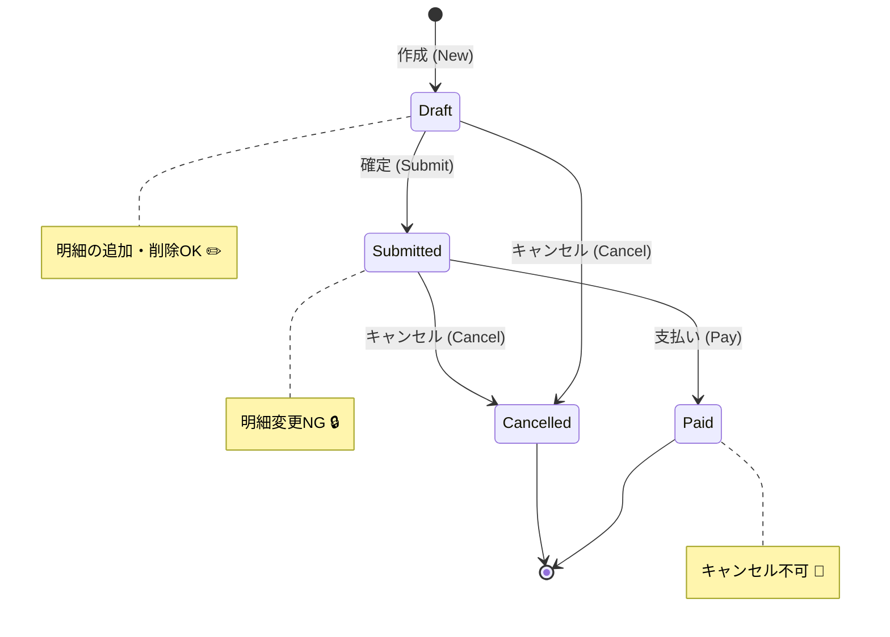

# 第03章：題材の“業務ルール”を決めよう（超ミニ仕様）🧾✨

この章はね、「Entity/VOを分ける前に、そもそも**ルールが無いと設計できない**」って体験する回だよ〜😊💡
コードはまだ最小でOK！まずは**仕様（＝約束）**を作ろう✍️✨

---

## 1) この章のゴール🎯💖


今日の成果物はこれだけ👇（シンプルでOK！）

* **ミニ仕様（10行くらい）**📝
* **用語リスト（ミニ辞書）**📘
* **名詞（もの）候補リスト**📦
* **動詞（操作）候補リスト**🕹️
* **守りたいルール候補（不変条件のタネ）**🛡️

---

## 2) まず題材を決めよ〜（迷ったらこの2択）🎲✨


### A：ミニ注文（おすすめ）🛒🍰

* 注文する、支払う、キャンセルする…って状態が出てきて楽しい！

### B：サークル会計（わかりやすい）📒💰

* 収入/支出、立替、精算…って「ルール」が作りやすい！

この章では **A：ミニ注文** で例を出すね😊🛒
（Bでも同じ手順でできるよ！）

---

## 3) “仕様”って何を書くの？（書かないのも大事）🚦✨


### 仕様に書く✅

* 何がしたい？（目的）🎯
* どんな登場人物・ものがいる？（名詞）📦
* 何ができる？できない？（動詞）🕹️
* 守るべきルールは？（例：0円禁止）🛡️

### 仕様に書かない🙅‍♀️

* DBのテーブル設計💾❌
* 画面UIの見た目🎨❌
* フレームワーク都合の話🧩❌

今は「業務の約束」だけに集中しよ〜🙂✨

---

## 4) 10行仕様テンプレ（コピペして埋めるだけ）📝✨


`docs/ch03-spec.md` を作って、これを埋めてみてね👇

```md
# ミニ注文：超ミニ仕様（10行）

1. お客さんは商品をカートに入れて注文できる
2. 注文には「明細（商品・数量・単価）」が1件以上必要
3. 数量は1以上、単価は0より大きい
4. 注文の合計金額は「明細の合計」で決まる（手入力しない）
5. 注文は Draft（下書き）→ Submitted（確定）→ Paid（支払い済み） に進む
6. Draft のときだけ明細を追加・削除できる
7. Submitted のときは明細を変えられない
8. Paid の注文はキャンセルできない
9. キャンセルできるのは Draft / Submitted のみ（Cancelled になる）
10. 通貨は JPY のみ（今回は固定）
```




ポイントは「**短く、でもルールが入ってる**」こと💖
10行に収まらなかったら、次の章で整理していけばOKだよ〜😊✨

---

## 5) 次に「名詞」と「動詞」を抜き出す🧠🔍


仕様から、単語を拾うだけでOK！

### 名詞（もの）候補📦

* Customer（お客さん）
* Product（商品）
* Cart（カート）
* Order（注文）
* OrderLine / LineItem（明細）
* Money（お金）
* Quantity（数量）
* OrderStatus（状態）

### 動詞（操作）候補🕹️

* addItem（明細を追加する）
* removeItem（明細を削除する）
* submit（確定する）
* pay（支払う）
* cancel（キャンセルする）

ここで大事なのは、**名詞＝モノ**、**動詞＝やること**って分けること🙂✨
（この後の章で、名詞の中から Entity/VO を分けていくよ〜！）

---

## 6) ルール候補（不変条件のタネ）🛡️✨


仕様の中で「絶対守りたい約束」を集めるよ！

* 明細は **1件以上** 必要
* 数量は **1以上**
* 単価は **0より大きい**
* 合計金額は **明細から計算**（手入力禁止）
* Draft のときだけ明細編集OK
* Paid はキャンセル不可

これ、あとでVOやEntityに“閉じ込める”材料になるやつ🧁✨

---

## 7) 用語リスト（ユビキタス言語ごっこ）📘🎀


`docs/ch03-glossary.md` を作って、**同じものを同じ名前で呼ぶ**練習するよ😊

```md
# 用語リスト（ミニ注文）

- 注文（Order）: 明細を1件以上持つ購入の単位
- 明細（LineItem）: 商品・数量・単価を持つ1行
- 下書き（Draft）: 明細を編集できる状態
- 確定（Submitted）: 内容を固定した状態
- 支払い済み（Paid）: 支払い完了。キャンセル不可
- キャンセル（Cancelled）: 取り消された注文の状態
- 合計金額（Total）: 明細の合計で決まる値（手入力しない）
```

**同じ意味の別名**が出るとバグの原因になりがち😵‍💫
例：「明細」なの？「商品行」なの？「Line」なの？…みたいなやつ💦
この辞書で統一しよ〜📘✨

---

## 8) 図解イメージ（今日やったこと）🗺️✨


```txt
超ミニ仕様（10行）
   ↓  単語を拾う
名詞（もの） ──→ 後で Entity/VO 候補になる
動詞（操作） ──→ 後で ユースケース/メソッド候補になる
   ↓  守る約束を集める
ルール候補（不変条件のタネ）
   ↓  言葉を統一
用語リスト（ミニ辞書）
```

---

## 9) 演習（やってみよ〜！）🧪🎉

### 演習①：仕様を「自分の題材」で10行にしてみる📝

* A：ミニ注文 🛒
* B：サークル会計 📒
  どっちでもOK！

**コツ**：
「できること」より「できないこと」を入れると一気に設計っぽくなるよ😉✨

### 演習②：名詞10個、動詞8個、ルール6個を出す📦🕹️🛡️

雑でOK！あとで削るから大丈夫🙆‍♀️✨

---

## 10) 小テスト（ゆるめ）🎓💖

### Q1 ✅：「仕様」に書くべきものはどれ？

A. DBの主キーの型
B. “Paid はキャンセル不可”
C. 画面のボタン色

### Q2 ✅：名詞っぽいのはどれ？

A. pay
B. Order
C. validate

### Q3 ✅：動詞っぽいのはどれ？

A. OrderStatus
B. LineItem
C. submit

### Q4 ✅：「合計金額は手入力しない」が嬉しい理由に一番近いのは？

A. UIが派手になる
B. 計算ミスやズレが減る
C. DBが速くなる

### Q5 ✅：用語リストを作る目的は？

A. 単語帳で英語力UP
B. “同じものを同じ名前で呼ぶ”ため
C. コード量を増やすため

**答え**：Q1=B / Q2=B / Q3=C / Q4=B / Q5=B 🎉✨

---

## 11) AIプロンプト集（この章でめっちゃ使えるやつ）🤖💬✨


### ① 名詞と動詞を抜き出してもらう🔍

「この仕様文から、名詞（もの）候補と動詞（操作）候補を箇条書きで抽出して。重複もまとめて」

### ② ルール候補（不変条件）を集める🛡️

「この仕様で“絶対守るべきルール”を6〜10個に整理して。理由も一言つけて」

### ③ 抜け漏れケースを洗い出す🕳️

「この仕様で起きそうな抜け漏れ・例外ケースを10個出して（初心者が見落としやすい順に）」

### ④ 用語リストの統一案📘

「用語の揺れが起きそうな単語を指摘して、統一案（推奨名）を提案して」

### ⑤ Given/When/Then にしてテスト観点へ🧪

「仕様を Given/When/Then の形に変換して、受け入れ条件を8個作って」

※AIの答えはそのまま採用じゃなくて、**“仕様と矛盾してないか”だけチェック**してね😉✅

---

## 12) いまの周辺事情メモ（最新）🆕✨

* TypeScript は公式ダウンロードページ上「最新は 5.9」と案内されていて、npm上の最新は **5.9.3** になってるよ。([typescriptlang.org][1])
* Node.js は **v24 が Active LTS**、v25 は Current（最新版系）として進んでるよ。([Node.js][2])
* VS Code は 2026年1月時点で **1.108 系**のリリース情報が出てるよ。([code.visualstudio.com][3])

---

### 次の章に向けての一言🌸

この章で作った「ミニ仕様・用語・ルール候補」が、次からの **Entity/VO 判定の材料**になるよ〜🧠💎
なので、完璧じゃなくてOK！「直せる形」にできたら勝ち😊✨

[1]: https://www.typescriptlang.org/download/?utm_source=chatgpt.com "How to set up TypeScript"
[2]: https://nodejs.org/en/about/previous-releases?utm_source=chatgpt.com "Node.js Releases"
[3]: https://code.visualstudio.com/updates?utm_source=chatgpt.com "December 2025 (version 1.108)"
