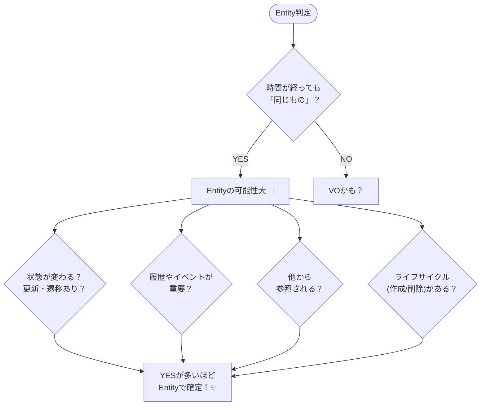

# 第04章：Entity/VOを分ける前に…「同一性」ってなに？🪪🧸

この章は、Entityの“芯”になる **同一性（identity）** を、ゆるっと＆しっかり体に入れる回だよ〜！😊💕

---

## 1) まずは超たとえ話🧸🪪


たとえば、あなたが今日「髪型を変えた」💇‍♀️✨
**見た目（値）は変わった**けど、**あなた本人は同じ人**だよね？

* 髪型・服・気分 → **変わる（状態）** 🌦️
* 「あなた」という存在 → **追跡したい“同じもの”** 🧭

この「時間がたっても“同じ”として扱う芯」＝ **同一性** だよ🪪✨

---

## 2) 同一性（Identity）と 等価性（Equality）を分けよう🔍✨


ここ、Entity/VOの分かれ道！🚪

### ✅ Entity（エンティティ）

* **同一性がある（追跡したい）** 🪪
* 時間で **状態が変わる** ⏳
* “同じかどうか”は **ID（または追跡できるしるし）** で判定しがち

例：注文(Order)🛒、会員(Member)👤、申請(Application)📝

### ✅ Value Object（値オブジェクト / VO）

* 同一性はない（**値そのものが全て**）💎
* 基本 **不変（immutable）** 🔒
* “同じかどうか”は **値が同じか** で判定

例：金額(Money)💰、メール(Email)📧、住所(Address)🏠、期間(Period)📅

---

## 3) 「IDは本質じゃない」ってどういう意味？🤔🪪


よく「Entity＝ID持ってるやつ」って言われるけど…
**本質はそこじゃなくて**、

> **追跡したいか？（時間をまたいで同じとして扱うか？）** 🔍⏳

IDはそのための **手段** だよ🧰✨
だから、IDの付け方は後で整えてもいいけど、**“追跡が必要か”の判断は早めにやると超ラク**😊🍀

---

## 4) Entity候補を見つける「5つの質問」🗺️💡


迷ったら、この質問にYESが多いほどEntityっぽいよ〜！🙌✨

1. **時間がたっても「同じもの」として扱いたい？** ⏳
2. **状態が変わる？（更新・遷移がある？）** 🔄
3. **履歴やイベント（いつ、何が起きた）が大事？** 🗓️
4. **他のものから参照される？（外部から指名される？）** 📌
5. **削除・無効化など「ライフサイクル」がある？** 🌱→🌳→🍂

YESが多いほど「Entityにしよっか！」ってなる😊✨




---

## 5) 図解イメージ：同一性ってこういう感じ🖼️⏳🪪


**同じIDの“同じ注文”**が、時間で変わっていくイメージ👇

* t0：下書き（Draft）📝
* t1：提出（Submitted）📤
* t2：支払い済み（Paid）💳

“見た目（状態）は変わる”けど、追跡対象は同じ🪪✨

---

## 6) TypeScriptで「同一性」を体感しよ〜🧪✨

### 6-1) Entityは「IDで同一判定」しがち🪪


```ts
// Entityの最小イメージ（超ミニ）
export abstract class Entity<Id> {
  protected constructor(public readonly id: Id) {}

  sameIdentityAs(other: Entity<Id>): boolean {
    return this.id === other.id;
  }
}

type OrderStatus = "Draft" | "Paid";

export class Order extends Entity<string> {
  private status: OrderStatus;

  constructor(id: string, status: OrderStatus) {
    super(id);
    this.status = status;
  }

  pay(): void {
    if (this.status !== "Draft") {
      throw new Error("Draftじゃない注文は支払えないよ😵‍💫");
    }
    this.status = "Paid";
  }

  snapshot() {
    return { id: this.id, status: this.status } as const;
  }
}

// 2つのインスタンス（別物）でも、同じ注文を指してることがある
const a = new Order("order-1", "Draft");
const b = new Order("order-1", "Paid");

console.log(a.sameIdentityAs(b)); // true ✅（同じ注文！）
console.log(a.snapshot(), b.snapshot()); // 状態は違うことがある
```

ポイント🥰✨

* `a` と `b` は **別インスタンス**（メモリ上は別物）
* でも `id` が同じなら **同じ注文として追跡**できる🪪

---

### 6-2) VOは「値で等価判定」するよ💎


```ts
export class Email {
  private constructor(private readonly value: string) {}

  static create(raw: string): Email {
    const v = raw.trim().toLowerCase();
    if (!v.includes("@")) throw new Error("メールっぽくないよ📧😵");
    return new Email(v);
  }

  equals(other: Email): boolean {
    return this.value === other.value;
  }

  toString(): string {
    return this.value;
  }
}

const e1 = Email.create("A@EXAMPLE.COM");
const e2 = Email.create("a@example.com");

console.log(e1.equals(e2)); // true ✅（値が同じ）
```

VOは「誰かのEmail」という“個体”じゃなくて、**値そのもの**として扱うイメージだよ💎✨

---

## 7) 初心者がやりがちなID事故あるある⚠️🥺


### ❌ EmailをIDにしちゃう

「ログインIDだし良くない？」ってなりがちだけど、
メールって **変更される** ことあるよね📧🔁
変更された瞬間、参照が壊れたりする😵‍💫

👉 対策：**変更されない“追跡用ID”**を別に持つのが定番🪪✨

### ❌ 配列のindexをID扱い

並び替えたら別人になるやつ！😇

👉 対策：indexはただの位置。IDじゃない🙅‍♀️

---

## 8) 演習①：「追跡したいもの」を3つ挙げよう📝🔍✨

あなたの題材（ミニ注文 or サークル会計）から、次の形で3つ！

**テンプレ**👇

* 候補：＿＿＿＿

  * 追跡したい理由：＿＿＿＿（いつまで？何が変わる？）
  * 起こりそうな変化：＿＿＿＿（状態や属性の変更）

**例（ミニ注文）**🛒

* 候補：Order（注文）

  * 追跡したい理由：支払い前後、キャンセル、配送などを追う
  * 変化：statusが変わる、合計金額が変わる、明細が増える

---

## 9) 演習②：Entityっぽさ判定クイズ（5つの質問）🗺️✅


次の候補に、さっきの「5つの質問」でYES/NOつけてみてね😊

* 注文（Order）🛒
* 注文明細（LineItem）📦
* 金額（Money）💰
* メール（Email）📧
* 期間（Period）📅
* 会員（Member）👤

終わったら、AIにレビューさせると超はかどるよ🤖✨（後ろにプロンプトあるよ！）

---

## 10) 小テスト（3分）⏱️💡

### Q1：Entityの“芯”はどれ？🪪

A. 文字列の長さ
B. 同一性（追跡したいこと）
C. 見た目が変わらないこと

### Q2：VOが基本“不変”なのはなぜ？🔒

A. 変更メソッドを書くのが面倒だから
B. 無効状態やバグを増やしやすいから
C. TypeScriptがそう決めてるから

### Q3：別インスタンスでも同一Entityになりうるのはなぜ？🧠

A. JavaScriptが参照を共有するから
B. 同じIDで同じ対象を指すことがあるから
C. クラスが同じだから

**答え**🎀

* Q1：B ✅
* Q2：B ✅
* Q3：B ✅

---

## 11) AIプロンプト集（コピペで使える）🤖✨

* 「この仕様から、**時間をまたいで追跡したい名詞**を5つ挙げて。理由もつけて」
* 「この候補（一覧）を、**Entity/VO/どっちでも**に分類して。**5つの質問**で判定して」
* 「EmailをIDにする案のリスクを3つ。代替案も」
* 「Order/Memberの“状態が変わるポイント”を列挙して。状態遷移っぽく整理して」

---

## 12) ちょい最新メモ（2026年っぽい周辺事情）📰✨

* TypeScriptの公開リリースは、npm上の `latest` だと **5.9.3** が表示されてるよ（最終公開は2025-09-30表記）。([npm][1])
* TypeScript 5.9では、ECMAScript提案に合わせた `import defer` なども入ってきてるよ。([typescriptlang.org][2])
* Node.js は v24 が **Active LTS**、v22/v20 が **Maintenance LTS**、v25 が **Current** という整理になってる（2026-01-19更新の一覧）。([Node.js][3])

（この章の内容＝同一性そのものは、TSのバージョンが変わってもブレない“設計の基礎”だよ😊🪪）

---

## まとめ🌸✨

* **Entityの芯＝同一性（追跡したいもの）** 🪪⏳
* **VOの芯＝値そのもの（等価性）** 💎
* IDは本質じゃなくて、**追跡のための手段** 🧰
* 迷ったら「5つの質問」でYESを数える🗺️✅

---

次の第5章は、いよいよ **VOの芯（不変＋自己検証＋等価性）** を「気持ちよく実装していく」回だよ💎🛡️✨
その前に、演習①の「追跡したいもの3つ」を書いたら、ここに貼ってくれたら一緒にEntity候補をキレイに仕分けするよ〜😊🎀

[1]: https://www.npmjs.com/package/typescript?utm_source=chatgpt.com "TypeScript"
[2]: https://www.typescriptlang.org/docs/handbook/release-notes/typescript-5-9.html?utm_source=chatgpt.com "Documentation - TypeScript 5.9"
[3]: https://nodejs.org/en/about/previous-releases?utm_source=chatgpt.com "Node.js Releases"
