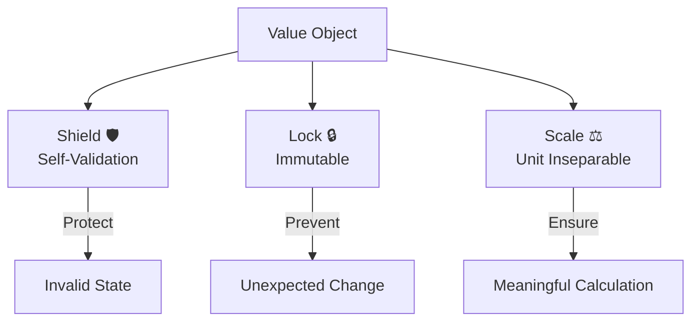
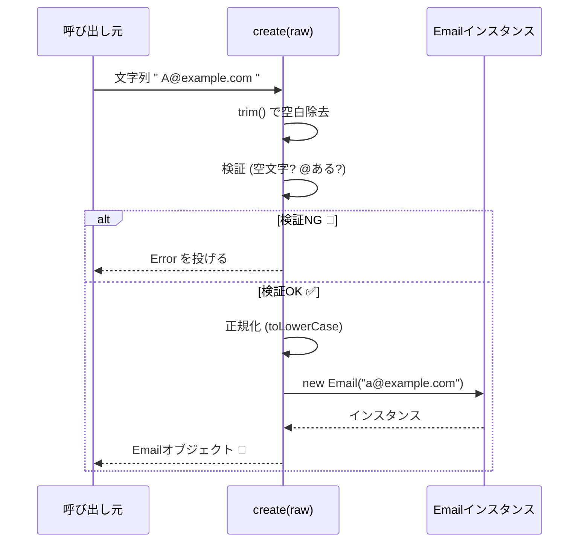

# 第05章：Value Objectの芯＝不変＋自己検証＋値の等価性💎✅

## この章のゴール🎯✨

* 「Value Object（VO）って何？」を **“自分の言葉”** で言える🙂🗣️
* VOの3大ポイント **①不変（Immutable）②自己検証（Always Valid）③値の等価性（Value Equality）** を体感する💎
* 題材から「値そのもの」候補を5つ出して、**守りたいルール（不変条件）** まで書ける🛡️📝

ちなみに今のTypeScriptは **5.9系が最新**（npmのlatestは5.9.3）だよ〜📌✨ ([TypeScript][1])

---

## 1) Value Object（VO）ってなに？ざっくり一言で🍰

VOは **「値そのものを、ちゃんとした“部品”にしたもの」** だよ💎
例：Email、郵便番号、金額、期間、割合、タグ…みたいな「値」たち📧💰📮📅

ポイントはこれ👇

* **IDで追跡しない**（＝同一性が主役じゃない）
* **値が同じなら同じもの扱い**（＝等価性が主役）
* **基本は不変にするとバグが減る**（別名：安心して持ち回れる🧸）
  この「不変にするの大事だよ〜」は、DDD/設計界隈でも定番の考え方だよ📚✨ ([martinfowler.com][2])

---



## 2) VOの三大キモ💎💎💎


### ① 不変（Immutable）🔒

VOは **作ったら変えない** のが基本🙂
変えたいときは「新しいVOを作って差し替える」✨
Fowlerも「別の場所で同じ参照を触っちゃって事故る（aliasing bug）」を避けるために不変を推してるよ🧯 ([martinfowler.com][2])

---

### ② 自己検証（Always Valid）✅

VOは **“無効な値”を中に入れない** が大事🚫
つまり **生成時にチェックして、ダメなら作らせない** 💪✨

例：

* Emailは「空はダメ」「@がないのはダメ」
* 金額は「マイナス禁止」「通貨が必要」
* 期間は「start <= end」

---

### ③ 値の等価性（Value Equality）🟰

VOは「ID」じゃなくて **中身の値で同じか判断** するよ🙂

* `Email("a@b.com")` と `Email("a@b.com")` は **同じ扱い**
* `Email("a@b.com")` と `Email("x@y.com")` は **別物**

だからVOにはだいたい `equals()` が欲しくなる🧩✨

---

## 3) まずはワーク：題材から「値そのもの」候補を5つ出そう📝💡

ここ、めっちゃ大事！最初に候補を出すだけで設計が一気にラクになるよ〜😊🎀

### 候補の出し方（コツ）🔍

「名詞」から見つけるんだけど、VOっぽいのはこういうやつ👇

* **形式がある**（Email/郵便番号/電話番号…）📮📞
* **単位やルールがある**（金額/数量/割合…）💰📦
* **範囲や整合性がある**（期間/住所/座標…）📅🗺️
* **文字列だけど“ただの文字列じゃない”**（会員番号/注文番号/タグ…）🏷️

### 書き方テンプレ🧾✨

* VO名：
* 例（OK）：
* 例（NG）：
* 守りたいルール（不変条件）：
* 正規化（例：trimする？小文字にする？）：

---

## 4) VOの“超ミニ設計テンプレ”🧱✨（これだけでOK！）

VOは最初、これだけ守ればかなり勝てるよ🙂🎉

* 値は `private` にして外から直接触らせない🔐
* 変更できないように `readonly` を使う🔒（ただし “完全な不変” とは別だよ、後で説明するね！） ([TypeScript][3])
* 生成は `static create()` に寄せて、そこで検証する✅
* `equals()` を用意して「値で同じ」を言えるようにする🟰
* `toString()`（または `value` の読み取り）を用意して使いやすくする✨

---

## 5) ここで体験しよ！ミニVOを1個つくる📧💎（Emailの例）

> Emailの厳密な仕様はめっちゃ奥深いので、ここでは学習用に「現場でよくある“ほどほどバリデーション”」にするよ〜🙂🌸

```ts
// Email.ts
export class Email {
  private constructor(private readonly value: string) {}

  static create(raw: string): Email {
    const normalized = raw.trim();

    // 学習用の最小チェック（現場の要件に合わせて強化してOK！）
    if (normalized.length === 0) throw new Error("Emailは空にできません😢");
    if (!normalized.includes("@")) throw new Error("Emailに @ がありません😢");
    if (normalized.startsWith("@") || normalized.endsWith("@"))
      throw new Error("Emailの形式が変です😢");

    // 正規化ポリシー例：ドメイン都合で小文字に寄せる（要件次第！）
    const lower = normalized.toLowerCase();

    return new Email(lower);
  }

  toString(): string {
    return this.value;
  }

  equals(other: Email): boolean {
    return this.value === other.value;
  }
}
```




### ここがVOっぽい理由💎

* `new Email(...)` を外からできない → **必ず検証を通る** ✅
* 変更用メソッドなし → **不変** 🔒
* `equals` が「値が同じなら同じ」を表現🟰

---

## 6) テストで“気持ちよさ”を味わう🧪✨（Vitest想定）

VitestはViteベースのテスト環境で、TypeScriptとも相性が良いよ〜⚡🧪 ([Vitest][4])

```ts
// Email.test.ts
import { describe, it, expect } from "vitest";
import { Email } from "./Email";

describe("Email", () => {
  it("正規化されて作れる（trim & 小文字化）✅", () => {
    const email = Email.create("  A@B.COM  ");
    expect(email.toString()).toBe("a@b.com");
  });

  it("@がないと作れない🚫", () => {
    expect(() => Email.create("abc")).toThrow();
  });

  it("値が同じなら equals が true 🟰", () => {
    const a = Email.create("a@b.com");
    const b = Email.create("A@B.COM");
    expect(a.equals(b)).toBe(true);
  });
});
```

---

## 7) 「readonly」って書けば不変でしょ？…の落とし穴⚠️🥺

TypeScriptの `readonly` は **主に“型の世界の保護”** だよ🧠
ネストした中身まで完全に守ってくれるわけじゃないの🥲 ([TypeScript][5])

「実行時にもガチで凍らせたい」なら `Object.freeze()` があるよ❄️
ただし **freezeは“浅い”**（深い階層は別対策が必要）ってことも覚えとこ🙂 ([MDNウェブドキュメント][6])

---

## 8) よくあるミス集（初心者あるある）😂💥

* ただの `string` や `number` で持ち回って、あちこちでバリデーション地獄😵‍💫
* VOを作ったのに `value` を `public` にして書き換え放題🥲
* 「生成時チェック」じゃなくて「使う直前チェック」で漏れる🕳️
* equalsがなくて `===` で比較しちゃって事故る（参照比較）💥
* 正規化ポリシー（trim/小文字化）がブレて、同じ値なのに別扱い😢

---

## 9) AI活用コーナー🤖🎀（使うと爆速！でも最後は自分でOK/NG判断🫶）

### 不変条件を出してもらうプロンプト🛡️

* 「このVO（例：Email/PostalCode/Money）で守るべき不変条件を、初心者向けに箇条書きで10個出して。現場の“ほどほど版”と“厳密版”に分けて」
* 「このVOの正規化ポリシー案（trim、小文字化、全角半角など）を、メリット/デメリット付きで提案して」

### テストケースを増やすプロンプト🧪

* 「EmailのOK/NG例をそれぞれ20個。境界値も混ぜて」
* 「このVOのバグりやすい入力パターンを列挙して、対策も」

---

## 10) 小テスト🎓✨（5問）

**Q1.** VOを不変にすると嬉しいことは？（1つ選んでね）
A) メモリが必ず減る　B) 参照の事故（別の場所で勝手に変わる）を減らせる　C) DBが速くなる

**Q2.** VOは何で同一性を判断する？
A) ID　B) メモリアドレス　C) 値

**Q3.** 「無効な値を持つVO」を作らないために一番効くのは？
A) public setterを作る　B) 生成時に検証して弾く　C) 呼び出し側で毎回気合いでチェック

**Q4.** `readonly` の注意点は？
A) 実行時も完全に凍る　B) ネスト内部まで完全不変　C) “型の世界”の保護が中心で、完全不変とは限らない ([TypeScript][5])

**Q5.** `Object.freeze()` の特徴は？
A) コピーを作る　B) 渡した同じオブジェクトを凍結する　C) 何もしない ([MDNウェブドキュメント][6])

**答え**：Q1=B / Q2=C / Q3=B / Q4=C / Q5=B 🎉

---

## 11) 宿題（この章の成果物）📘✨

1. 題材から **VO候補を5つ** 出す📝💡
2. それぞれに **不変条件（守りたいルール）** を書く🛡️
3. そのうち1つを選んで、今日のテンプレで **VO実装＋テスト** まで作る🧪💎

---

次の章（第6章）は「Entityは変わる。でも壊れない。更新の入口を絞る」だよ〜🪪🧱
その前に、宿題の「VO候補5つ」だけここに貼ってくれたら、**“不変条件のレビュー”** を絵文字もりもりで一緒にやるよ😊🎀💖

[1]: https://www.typescriptlang.org/download/?utm_source=chatgpt.com "How to set up TypeScript"
[2]: https://martinfowler.com/bliki/ValueObject.html?utm_source=chatgpt.com "Value Object"
[3]: https://www.typescriptlang.org/docs/handbook/classes.html?utm_source=chatgpt.com "Handbook - Classes"
[4]: https://vitest.dev/guide/?utm_source=chatgpt.com "Getting Started | Guide"
[5]: https://www.typescriptlang.org/docs/handbook/2/objects.html?utm_source=chatgpt.com "Documentation - Object Types"
[6]: https://developer.mozilla.org/en-US/docs/Web/JavaScript/Reference/Global_Objects/Object/freeze?utm_source=chatgpt.com "Object.freeze() - JavaScript - MDN Web Docs"
