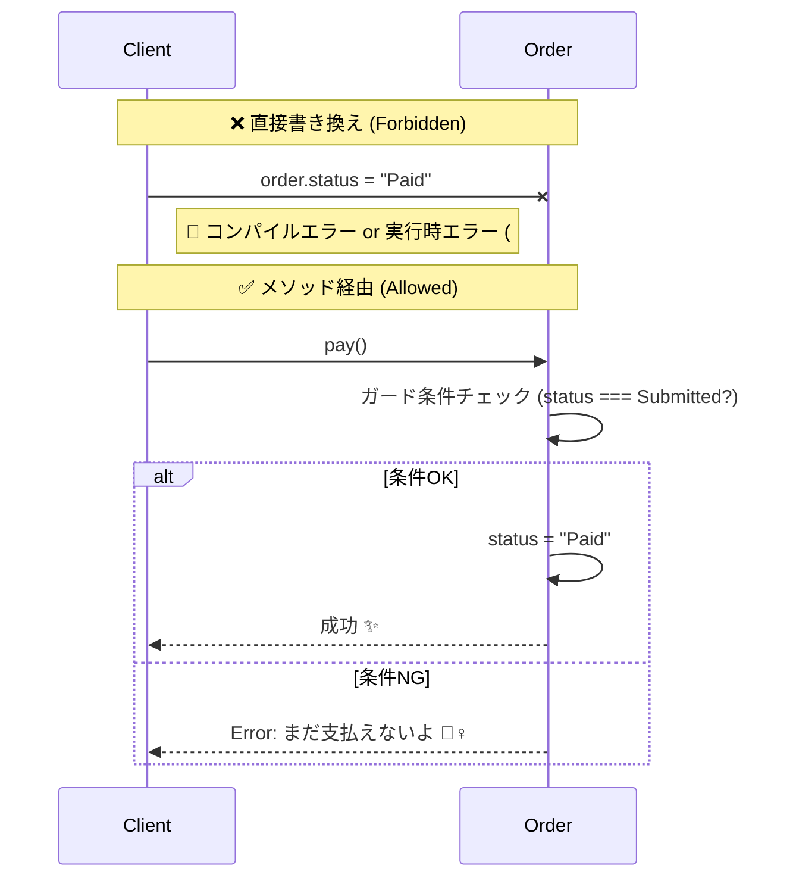
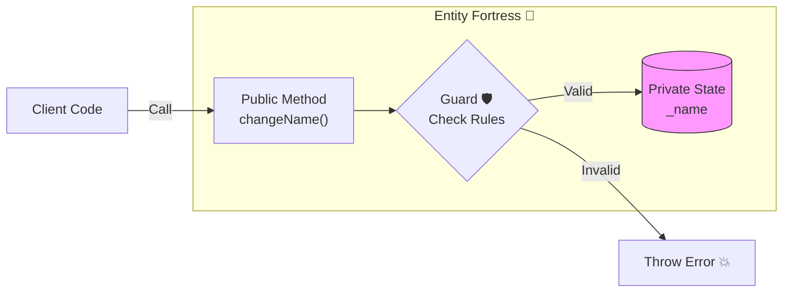

# 第06章：Entityの芯＝更新の入口を絞って“壊れない”設計🧱🪪

この章のゴールはこれだよ〜😊💡
**「Entityは変わるけど、ルールを破って壊れない」**ように、**更新の入口（＝メソッド）をちゃんと用意できる**ようになること！🚪🔒✨

---

## 1) まず結論：Entityは「直接いじらせない」が基本だよ🚫✋

Entityって「時間と一緒に変化する」存在だよね⏳
でも、**どこからでも自由に書き換え可能**だと…😇

* ルールを通らずに値が変わる😱
* バグが出ても原因が追えない😵‍💫
* “ありえない状態”が作れちゃう💥

だから、設計のコツはこれ👇
**✅ フィールドを直接書き換えさせず、更新メソッドに集める** 🧠✨

---

## 2) 今日の題材：ミニ注文（Order）でいくよ🛒🍰

第6章でやりたいのは「更新イベント」を整理することだったよね😊📝
Orderなら、たとえばこんな感じ👇

* **注文を確定する**（submit）📨
* **支払う**（pay）💳
* **キャンセルする**（cancel）🧯

この“動詞”がそのまま、**更新の入口（メソッド）**になるよ〜🚪✨

---

## 3) ダメな例：なんでも直接いじれるOrder 😇🔥

「とりあえず動く」けど、あとで泣きがちパターン😭

```ts
type OrderStatus = "Draft" | "Submitted" | "Paid" | "Cancelled";

class OrderBad {
  id: string;
  status: OrderStatus = "Draft";
  paidAt: Date | null = null;

  constructor(id: string) {
    this.id = id;
  }
}

const o = new OrderBad("o-1");

// どこからでも勝手に…😱
o.status = "Paid";
o.paidAt = null; // 支払い済みなのに支払日時が無い！？💥
```

こういうのが起きると、あとから「え、なんで？」ってなるの🥲
**“更新ルール”がコードに残ってない**からだよ〜。

---

## 4) 良い例：更新の入口を「メソッド」に集めるOrder 🧱✨

### 💡ポイント

* 状態（status）を外から直接変えられないようにする🔒
* 変更は `submit()` / `pay()` / `cancel()` **だけ**にする🚪
* その入口でルール（ガード条件）をチェックする✅

ここで、**より強いカプセル化**として `#` を使う方法を見せるね😊
`#` のプライベート要素は **JSの実行時にも守られる**タイプだよ🔐（TypeScriptの `private` より“ガチ”）✨ ([TypeScript][1])

```ts
type OrderStatus = "Draft" | "Submitted" | "Paid" | "Cancelled";

class DomainError extends Error {
  constructor(message: string) {
    super(message);
    this.name = "DomainError";
  }
}

export class Order {
  readonly id: string;

  #status: OrderStatus = "Draft";
  #paidAt: Date | null = null;
  #cancelledAt: Date | null = null;

  constructor(id: string) {
    this.id = id;
  }

  // 読み取りはOK👌（でも書き換えはNG🙅‍♀️）
  get status(): OrderStatus {
    return this.#status;
  }
  get paidAt(): Date | null {
    return this.#paidAt;
  }
  get cancelledAt(): Date | null {
    return this.#cancelledAt;
  }

  submit(): void {
    if (this.#status !== "Draft") {
      throw new DomainError("Draftのときだけ注文確定できるよ📨");
    }
    this.#status = "Submitted";
  }

  pay(paidAt: Date = new Date()): void {
    if (this.#status !== "Submitted") {
      throw new DomainError("確定済み(Submitted)のときだけ支払えるよ💳");
    }
    this.#status = "Paid";
    this.#paidAt = paidAt;
  }

  cancel(cancelledAt: Date = new Date()): void {
    if (this.#status === "Paid") {
      throw new DomainError("支払い後はキャンセルできないよ🙅‍♀️💥");
    }
    if (this.#status === "Cancelled") {
      throw new DomainError("すでにキャンセル済みだよ🧯");
    }
    this.#status = "Cancelled";
    this.#cancelledAt = cancelledAt;
  }
  }
}
```




### 🌟この設計のうれしさ

* **“ありえない状態”が作れない**（ルールを入口で守る）🛡️
* 変更理由がメソッド名に残る（submit/pay/cancel）🧠
* デバッグが一気にラクになる🔍✨



---

## 5) 図解イメージ：更新は「入口1本化」🚪✨


```text
外の世界🌍
  |
  |  ✅ submit() / pay() / cancel()
  v
Order(Entity) 🪪
  |
  |  入口でルールチェック✅
  v
状態が安全に変わる🔄✨
```

「勝手に書き換え」は通れないようにしておくのがコツだよ〜🔒😊

---

## 6) “更新メソッド”の作り方：初心者向けテンプレ💖

迷ったらこれでOK👇

### ✅ 1. メソッド名は「動詞」にする

* `changeEmail()` ✉️
* `addItem()` ➕
* `removeItem()` ➖

### ✅ 2. メソッドの最初に“ガード条件”

* 状態チェック🚦
* 範囲チェック📏
* nullチェック🧯

### ✅ 3. 成功したら状態を変える

* 状態変更はここだけ！🔁✨

---

## 7) ここも最新寄りTips：`private` と `#` どっち使う？🤔🔐

* `private`：TypeScriptの型チェック上は守られる（でも実行時の強制力は弱め）
* `#`：JavaScriptの機能として**実行時にもアクセス不可**で、より隔離が強い🔒✨ ([TypeScript][1])

学習用＆小さなアプリなら `private` でも全然OK😊
「絶対に外から触らせたくない！」なら `#` が気持ちいいよ〜✨

---

## 8) テストして“壊れない”を確認しよ🧪🍰

「支払い後にキャンセルできない」をテストで守るよ💪✨
（Vitestは最近も4系が継続して更新されてるよ〜🧪 ([Vitest][2])）

```ts
import { describe, it, expect } from "vitest";
import { Order } from "./Order";

describe("Order", () => {
  it("支払い後はキャンセルできない🧯", () => {
    const o = new Order("o-1");
    o.submit();
    o.pay();

    expect(() => o.cancel()).toThrowError();
  });

  it("Draftのまま pay はできない💳", () => {
    const o = new Order("o-2");
    expect(() => o.pay()).toThrowError();
  });
});
```

---

## 9) 演習（やってみよ〜！）🎀📝

### 演習1：更新イベントを3つ書く✍️✨

Order以外でもOKだよ😊
例：サークル会計なら

* `collectFee()` 💰
* `refund()` 🔁
* `closeMonth()` 📅

### 演習2：禁止ルールを2つ入れる🚫

例：

* Cancelledのあとにsubmitできない
* Paidのあとにsubmitできない

### 演習3：テストを2本追加🧪

* “すでにCancelledならcancelできない”
* “Submittedじゃないとpayできない”

---

## 10) 小テスト（サクッと！）🎓✨

Q1. Entityを直接書き換えできると何が困る？😵‍💫
A. ルールを通らずに状態が変わって、**ありえない状態**が作れるから💥

Q2. 更新の入口を絞るって、具体的に何する？🚪
A. **フィールドを隠して**、変更は **動詞メソッド**だけにする🔒✨

Q3. `pay()` の中で最初にやるべきことは？💳
A. **ガード条件（状態チェック）** 🚦✅

---

## 11) AIプロンプト集（Copilot/Codex向け）🤖💖

* 「Orderの状態遷移で、禁止すべきケースを10個列挙して。理由もつけて」🚦
* 「submit/pay/cancel のテストケースを境界値っぽく増やして」🧪
* 「このEntity、外から直接書き換えできそうな穴がないかレビューして」🔍
* 「メソッド名が“動詞”になってるかチェックして、改善案を出して」📝

---

## 12) まとめチェックリスト✅🌈

* [ ] フィールドを外から直接書き換えできない🔒
* [ ] 更新は“動詞メソッド”に集まってる🚪
* [ ] 入口でルール（ガード条件）を守ってる🛡️
* [ ] “ありえない状態”が作れないようになってる✨
* [ ] テストで禁止ルールを固定した🧪

---

## おまけ：今日の「最新版メモ」📌✨（参考）

* TypeScript は **5.9** のリリースノートが公開・更新されてるよ🧡 ([TypeScript][3])
* Node.js は **v24 Krypton がActive LTS**で、**24.13.0 (LTS)** のリリース情報も出てるよ🔐 ([nodejs.org][4])
* VS Code は **1.108（リリース日 2026-01-08）**、Insiders は **1.109** のノートが更新されてるよ🧰 ([Visual Studio Code][5])

---

次の章（第7章）は「迷わないための判定フロー」だね🗺️✨
この第6章の内容を使って、**“更新イベント→入口メソッド”**の流れをチートシート化していこ〜😊💖

[1]: https://www.typescriptlang.org/docs/handbook/classes.html?utm_source=chatgpt.com "Handbook - Classes"
[2]: https://vitest.dev/blog/vitest-4?utm_source=chatgpt.com "Vitest 4.0 is out!"
[3]: https://www.typescriptlang.org/docs/handbook/release-notes/typescript-5-9.html?utm_source=chatgpt.com "Documentation - TypeScript 5.9"
[4]: https://nodejs.org/en/about/previous-releases?utm_source=chatgpt.com "Node.js Releases"
[5]: https://code.visualstudio.com/updates?utm_source=chatgpt.com "December 2025 (version 1.108)"
