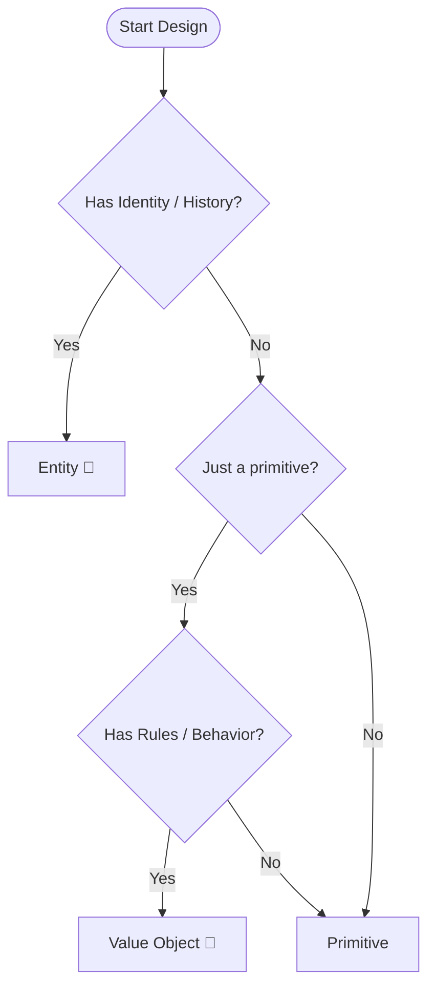
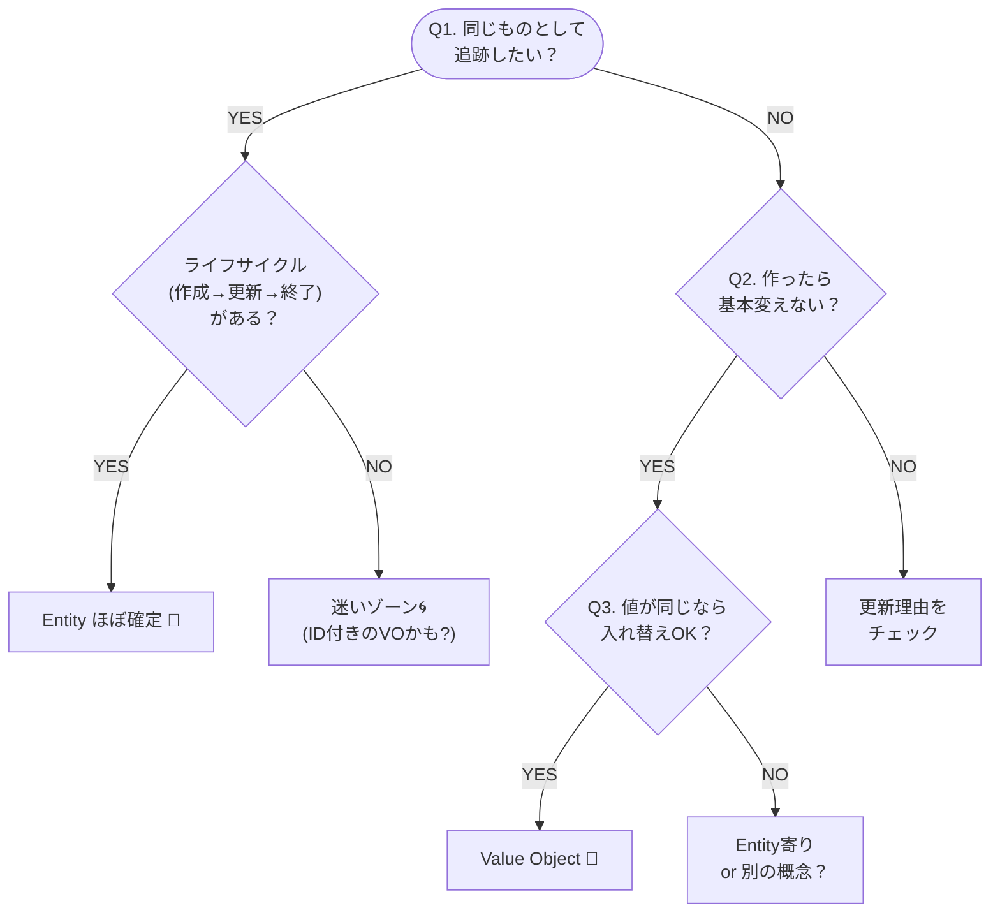

# 第07章：迷わないための“判定フロー”を作る🗺️✨

（Entity/Value Objectを**ブレずに**決められるようになる回だよ〜☺️🌷）

---

## 0. この章でできるようになること🎯💖

この章のゴールはシンプル！

* 「これってEntity？VO？」って聞かれたときに、**理由つきで答えられる**🗣️✨
* 迷ったときのために、**自分専用の判定フロー（チートシート）**を1枚作る📄💎
* AIに相談するときも、**ブレない聞き方**ができる🤖🧠

---

## 1. なんで“判定フロー”が必要なの？🤔🧸

Entity/VOの切り分けって、最初はこうなりがち👇

* 「IDがあるからEntityでしょ？」🆔💦
* 「なんとなくクラスっぽいからEntityかな…？」🧱😵
* 「とりあえず全部VOにしてみた！」💎💨（←あとで詰むことある）

でもね、設計って「センス」よりも「問いの順番」が大事なの🧩✨
だから **“いつも同じ質問をする”** だけで、判断が安定するよ〜☺️🌸

---

## 2. まずは“3点セット”だけ覚えよ🧠✨



この章の核はこれ！👇

### ✅ 判定3点セット（最初はこれだけでOK）

1. **追跡する必要ある？**（時間が経っても「同じもの」って言いたい？）🕵️‍♀️⏳
2. **不変が自然？**（作ったら基本変えない？ 変えるなら「新しく作り直す」？）🔒💎
3. **置き換えできる？**（中身が同じなら、入れ替えても困らない？）🔁😌

ざっくり言うと…👇

* **「追跡する」→ Entity寄り**🪪
* **「不変＋置き換え」→ VO寄り**💎

> ちなみに最近のTypeScriptは5.9系が最新（5.9.3が“Latest”扱い）で、型でルールを守る流れはますます強いよ〜📈✨ ([GitHub][1])

---

## 3. “迷わない判定フロー”の完成形（テンプレ）🗺️✨


まずはテンプレをそのまま使ってOK！
（あとで自分の題材に合わせてカスタムするよ〜☺️🎀）

```text
【Entity/VO 判定フロー（テンプレ）】

Q1. それは「同じもの」として追跡したい？（時間をまたいで同一扱い？）
  ├─ YES → Entity候補 🪪
  │      └ Q1-2. ライフサイクル（生成→更新→終了）がある？
  │             ├─ YES → Entityほぼ確 🪪✅
  │             └─ NO  → 迷いゾーン（※後述）
  └─ NO  → 次へ

  └─ NO  → Entity/VOどちらもあり（※“更新理由”で判断）

Q3. 値が同じなら入れ替えOK？（等価なら同じ扱いで困らない？）
  ├─ YES → Value Object 💎✅
  └─ NO  → Entity寄り / もしくは別概念（状態を持つ？）🌀
```




---

## 4. “迷いゾーン”あるある🌀（ここが一番おいしい🍰）

### 4-1. 「IDがある＝Entity」じゃないよ🆔❌

IDは“都合で付く”ことがある！
例：画面上の一時ID、DBの主キー、外部APIの識別子…などなど💦
**本質は「追跡したいか」**だよ〜🕵️‍♀️✨

---

### 4-2. 「住所」ってEntity？VO？🏠🤔

多くの学習題材だと **住所はVO** が気持ちいいことが多い💎✨

* 住所そのものは「値」
* 変更は「新しい住所に差し替え」🔁

ただし！
「住所履歴を追跡して監査したい」とか
「住所自体が管理対象（住所マスタ）」ならEntityに寄ることもあるよ🪪📝

---

### 4-3. 「注文の状態（Draft/Paid…）」は何？🧾🚦

状態そのものはだいたい **VO（もしくはenum）** でOKなことが多い☺️
でも「状態が変わる主体」は **Order Entity** 🪪✨
つまりこう👇

* **Order（追跡する）→ Entity**
* **OrderStatus（値）→ VO/enum**

---

## 5. ハンズオン：自分専用チートシートを作ろう📝💎

ここからが実作業だよ〜！
あなたの題材が「ミニ注文」でも「サークル会計」でも同じ手順でいける☺️🌷

### Step 1：名詞を10個並べる🧾✨

例（注文系）🛒：
Order / Member / Email / Money / Address / LineItem / ProductName / Quantity / Period / Tag

例（会計系）📒：
Member / Payment / Receipt / Money / Date / Period / Category / Note / Budget / Balance

---

### Step 2：各名詞に“3点セット質問”を当てる🔍💡

こんな表をメモ帳に作るだけでOK👇（手書きでも最高✍️💕）

* 追跡する？（Y/N）
* 不変が自然？（Y/N）
* 置き換えOK？（Y/N）
* ひとこと理由（1行）

---

### Step 3：判定が割れたやつだけ“追加質問”する🧠✨

追加質問のおすすめはこれ👇

* **履歴が欲しい？**📜
* **状態遷移がある？**🚦
* **他から参照される“中心”？**🧲
* **“それ単体”を探したい？（検索・一覧・管理）**🔎

---

## 6. 演習：仕分けクイズ（理由もセットで！）🧩💖

次の10個を、**Entity / VO** に分けてみてね☺️✨
（題材は注文っぽいけど、考え方は共通だよ〜）

1. Order
2. OrderId
3. Email
4. Money
5. LineItem
6. Quantity
7. Member
8. Address
9. OrderStatus
10. Coupon（割引券）

### 模範解答（例）✅🎀

* 1. **Order：Entity**（追跡・状態遷移・履歴）🪪🚦
* 2. **OrderId：VO**（値・等価）💎
* 3. **Email：VO**（形式の値・不変・等価）📧💎
* 4. **Money：VO**（計算する値・不変で扱える）💰💎
* 5. **LineItem：迷いゾーン**🌀

  * 追跡したいならEntity寄り（行の変更履歴とか）
  * 「注文明細はOrderの一部で、入れ替え可能」ならVO寄り
* 6. **Quantity：VO**（0以上などルール持つ値）🔢💎
* 7. **Member：Entity**（会員として追跡）🪪✨
* 8. **Address：VO寄り**（差し替えで表現しやすい）🏠💎
* 9. **OrderStatus：VO/enum**（値）🚦💎
* 10. **Coupon：ケース次第**🌀

  * 「コード文字列」だけならVO
  * 「使用済み/期限/回数制限」を追跡するならEntity寄り🎫🪪

この“迷いゾーン”が出たら勝ち！🥳
設計って、まさにそこを言語化するゲームだからね🎮✨

---

## 7. 小テスト（サクッと5問）🧪💗

**Q1**：「追跡する？」の意味に一番近いのはどれ？
A. 文字列かどうか
B. 時間が経っても“同じもの”として扱いたいか
C. DBに保存するか
D. クラスで表現したいか

**Q2**：VOが強いときの特徴を2つ選んでね
A. 不変が自然
B. 履歴を追いたい
C. 値が同じなら入れ替えOK
D. 生成→更新→終了がある

**Q3**：「IDがあるからEntity」は正しい？
A. だいたい正しい
B. 常に正しい
C. 常に間違い
D. ときどき間違うので、追跡の要否で判断する

**Q4**：住所がEntityになる可能性が上がるのは？
A. 住所を差し替えるだけ
B. 住所の変更履歴や監査が重要
C. 郵便番号がある
D. 文字列が長い

**Q5**：迷ったときに追加で聞くと強い質問は？
A. かわいい名前にできる？
B. 状態遷移がある？
C. コメントが書ける？
D. importできる？

### 解答✅

Q1=B / Q2=A,C / Q3=D / Q4=B / Q5=B 🎉✨

---

## 8. AIプロンプト集（ブレない相談テンプレ）🤖🪄

### 8-1. まずは“Plan”で質問を作らせる📋✨

VS CodeのAI機能は「Plan」エージェントみたいに“先に確認質問を出す”流れが強くなってるよ〜🧠🌷 ([Visual Studio Code][2])

**プロンプト例（Plan用）**

```text
Entity/Value Objectで迷っています。
次の候補を、判定に必要な質問に分解して（最大7問）、
私が答えたら結論が出るように進めてください。

候補：{ここに名詞}
前提：追跡/不変/置き換え の3点を軸にしたい
```

---

### 8-2. 結論だけじゃなく“理由の型”で返してもらう🧠✨

```text
次の候補について、Entity/VOを判定してください。
ただし、必ずこのフォーマットで：

- 追跡：YES/NO（理由）
- 不変：YES/NO（理由）
- 置き換え：YES/NO（理由）
- 結論：Entity/VO/迷いゾーン
- 迷いゾーンなら追加質問を3つ
```

---

### 8-3. 最後は“反例チェック”で事故防止🧯✨

```text
いまの判定（Entity/VO）に対して、
「逆にすると困るケース」を3つ挙げてください。
困りごとが弱いなら、判定を見直す提案もください。
```

> ちなみにVS Code側もAI機能がどんどん統合されてて、Copilot拡張が統合・整理される流れ（マーケットプレイスから外れる予定）も出てるよ〜🧹✨ ([Visual Studio Code][3])
> Codex連携も“Insiders＋特定プラン”など条件つきで動くものがあるから、AIの種類は増える前提で「質問の型」を持ってると超強い☺️💪 ([GitHub Docs][4])

---

## 9. この章のまとめ（1枚チートシート用）📄💎

最後に、コピペ用の“超短縮版”置いとくね☺️🌸

```text
【Entity/VO チートシート】

Entity 🪪：
- 時間をまたいで追跡したい
- 状態遷移/履歴/ライフサイクルがある
- “同じ個体”として扱う

VO 💎：
- 値そのもの（不変が自然）
- 同じ値なら同じ扱い（等価性）
- 変更＝作り直して差し替え

迷ったら追加質問 🧠：
- 履歴いる？ 状態遷移ある？ 管理対象として一覧/検索したい？
```

---

次の第8章は、いよいよ **「形式のVO（Email/PostalCode）」を実装して気持ちよさ体験💎📧** に入るよ〜☺️✨

[1]: https://github.com/microsoft/typescript/releases "Releases · microsoft/TypeScript · GitHub"
[2]: https://code.visualstudio.com/blogs/2025/11/03/unified-agent-experience "A Unified Experience for all Coding Agents"
[3]: https://code.visualstudio.com/blogs/2025/11/04/openSourceAIEditorSecondMilestone "Open Source AI Editor: Second Milestone"
[4]: https://docs.github.com/en/copilot/concepts/agents/openai-codex "OpenAI Codex - GitHub Docs"
