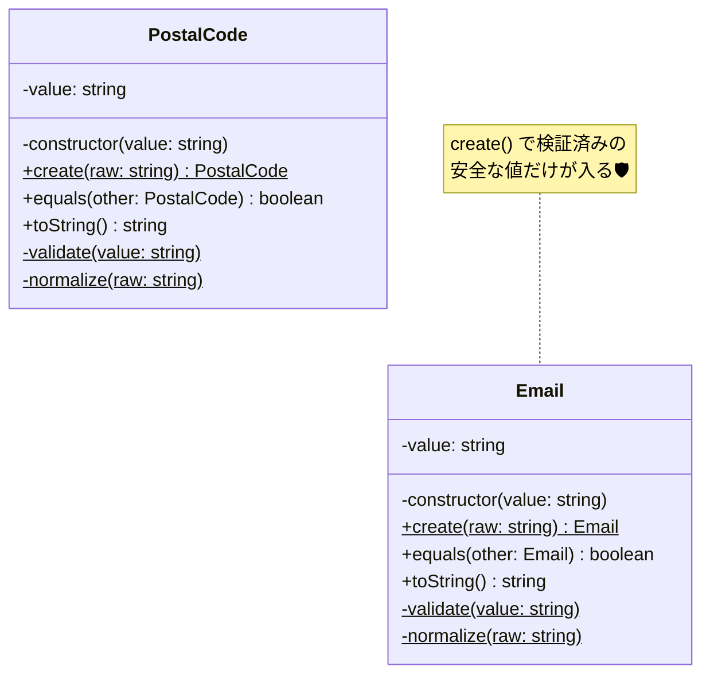

# 第08章：VO実装①「Email」や「PostalCode」みたいな“形式の値”📧📮

まず「今この瞬間の最新」だけ、超さらっと共有ね🫶

* npm上のTypeScriptの最新安定版は **5.9.3**（少なくとも現時点で）だよ📌 ([npm][1])
* TypeScriptは **6.0→7.0（Go移植）** へ大きく動いてる最中で、6.0は“橋渡し版”という位置づけ✨ ([Microsoft for Developers][2])

---

## 8-1. この章でできるようになること🎯💖


この章のゴールはこれっ👇✨

* 「無効なEmail/郵便番号」を **“そもそも作れない”** ようにできる🙅‍♀️
* 文字列じゃなくて、`Email` / `PostalCode` という **“意味のある型”** でコードを書ける💎
* テストで「OK/NG」をサクッと守れる🧪🫧

---

## 8-2. まずはイメージ図🧠➡️🧱


「VO」は入口で止めるのが命！🔥

```txt
外から来た文字列（危険😵）
        ↓
VOのcreate()でチェック✅（ここが関所🚪）
        ↓
安全な値だけがドメイン内へ🧼✨
```

---

## 8-3. “形式の値”VOの基本設計（テンプレ）📦✨


EmailもPostalCodeも、形はほぼ同じになるよ☺️

### ✅ 形式VOの鉄板ルール（初心者向けまとめ）🍀

* `constructor` は **隠す**（勝手にnewされるのを防ぐ）🚫
* 作る時は `static create(raw)` だけにする🚪
* 作る時に **バリデーション**（不正なら例外）⚠️
* 中身は `readonly`（不変）🔒
* “表記ゆれ”はここで **正規化（normalize）** ✨（例：空白除去、ハイフン統一）




---

## 8-4. Email VOを作ろう📧💎

### 8-4-1. そもそもメールの判定って難しいの？😵‍💫


うん、けっこう難しい…！
メールの正式な構文はRFCで定義されてて、現実の運用も絡むから「完璧な正規表現」作ろうとすると沼りやすいの🌀 ([IETF Datatracker][3])

さらに、ブラウザ（`<input type="email">`）にも「それっぽい」判定ルールがあるけど、ASCII中心だったり議論があったりするよ🧩 ([HTML Living Standard][4])

なのでこの章では、**実務で破綻しにくい“ほどよい判定”**を採用するね🫶✨

---

### 8-4-2. Emailの“このアプリのルール”を決めよう📝✨


今回はこうするよ（超ありがちで安全寄り）👇

* 前後の空白はトリム✂️
* 全体を小文字化（大文字小文字を区別しない運用）🔡
* 最低限の形式チェック：

  * `@` が1個
  * `@` の前後が空じゃない
  * ドメイン側に `.` がある（例: `example.com`）

> この「どこまで厳しくするか」は“業務ルール”だから、必要なら後で強化できるように作るのがコツだよ🌱

---

### 8-4-3. 実装コード（Email）🧱📧

#### `src/domain/errors.ts`

```ts
export abstract class DomainError extends Error {
  override readonly name: string;
  protected constructor(message: string) {
    super(message);
    this.name = this.constructor.name;
  }
}

export class InvalidEmailError extends DomainError {}
export class InvalidPostalCodeError extends DomainError {}
```

#### `src/domain/valueObjects/Email.ts`

```ts
import { InvalidEmailError } from "../errors";

export class Email {
  private constructor(private readonly value: string) {}

  static create(raw: string): Email {
    const normalized = Email.normalize(raw);

    if (!Email.isValid(normalized)) {
      throw new InvalidEmailError(`Invalid email: "${raw}"`);
    }

    return new Email(normalized);
  }

  /** UI表示やログ用（安易に生文字列を配りすぎないのがコツ） */
  toString(): string {
    return this.value;
  }

  equals(other: Email): boolean {
    return this.value === other.value;
  }

  private static normalize(raw: string): string {
    return raw.trim().toLowerCase();
  }

  private static isValid(email: string): boolean {
    // 「完璧」は目指さない！まずは実務で困りにくい最低限✨
    // RFC/HTML仕様などでメール構文は奥が深いので、ここは段階的に育てる前提にするよ📈
    const at = email.indexOf("@");
    if (at <= 0) return false;
    if (email.indexOf("@", at + 1) !== -1) return false; // @が2個以上はNG

    const local = email.slice(0, at);
    const domain = email.slice(at + 1);

    if (!local) return false;
    if (!domain) return false;
    if (domain.startsWith(".") || domain.endsWith(".")) return false;
    if (!domain.includes(".")) return false;
    if (email.includes(" ")) return false;

    return true;
  }
}
```

---

### 8-4-4. Emailのテスト（Vitest）🧪🫧

Vitestは公式ガイドに沿って入れればOKだよ✨ ([Vitest][5])

#### `src/domain/valueObjects/Email.test.ts`

```ts
import { describe, it, expect } from "vitest";
import { Email } from "./Email";
import { InvalidEmailError } from "../errors";

describe("Email", () => {
  it("trim + lowercase されて生成できる", () => {
    const email = Email.create("  Alice@Example.COM  ");
    expect(email.toString()).toBe("alice@example.com");
  });

  it("等価性は値で比較できる", () => {
    const a = Email.create("alice@example.com");
    const b = Email.create("ALICE@EXAMPLE.COM");
    expect(a.equals(b)).toBe(true);
  });

  it("不正な形式は弾く", () => {
    expect(() => Email.create("alice.example.com")).toThrow(InvalidEmailError);
    expect(() => Email.create("alice@")).toThrow(InvalidEmailError);
    expect(() => Email.create("@example.com")).toThrow(InvalidEmailError);
    expect(() => Email.create("a@b")).toThrow(InvalidEmailError);
  });
});
```

---

### 8-4-5. 🌟オプション：ライブラリで強化したい人へ（実務寄り）🧰✨

「もっとちゃんと判定したい！」なら、`validator.js` みたいな有名どころを使う手もあるよ📌
（isEmailなどが用意されてる） ([GitHub][6])

> ただし！ライブラリ判定も“世界のすべて”を救うわけじゃないので、どこまで厳密にしたいかはアプリの方針で決めよ〜🫶

---

## 8-5. PostalCode（郵便番号）VOを作ろう📮💎

### 8-5-1. ルール決め（今回は日本向け）🇯🇵✨


日本の郵便番号は基本これ👇

* **7桁**
* **3桁-4桁** のハイフン区切りが一般的（`000-0000`） ([Real Estate Tokyo][7])

なので今回のVOはこうするよ☺️

* `1234567` でも `123-4567` でも受け取る👌
* 中では **`123-4567` に統一**（正規化）✨
* 数字7桁以外はエラー🙅‍♀️

---

### 8-5-2. 実装コード（PostalCode）📮🧱

#### `src/domain/valueObjects/PostalCodeJP.ts`

```ts
import { InvalidPostalCodeError } from "../errors";

export class PostalCodeJP {
  private constructor(private readonly value: string) {}

  static create(raw: string): PostalCodeJP {
    const normalized = PostalCodeJP.normalize(raw);

    if (!PostalCodeJP.isValidDigits(normalized)) {
      throw new InvalidPostalCodeError(`Invalid postal code: "${raw}"`);
    }

    const formatted = `${normalized.slice(0, 3)}-${normalized.slice(3)}`;
    return new PostalCodeJP(formatted);
  }

  toString(): string {
    return this.value;
  }

  equals(other: PostalCodeJP): boolean {
    return this.value === other.value;
  }

  private static normalize(raw: string): string {
    // 〒123-4567 みたいなのも優しく受け取ってあげる💖
    return raw
      .trim()
      .replace("〒", "")
      .replace("-", "")
      .replace(/\s+/g, "");
  }

  private static isValidDigits(digits7: string): boolean {
    return /^\d{7}$/.test(digits7);
  }
}
```

---

### 8-5-3. PostalCodeのテスト🧪📮

#### `src/domain/valueObjects/PostalCodeJP.test.ts`

```ts
import { describe, it, expect } from "vitest";
import { PostalCodeJP } from "./PostalCodeJP";
import { InvalidPostalCodeError } from "../errors";

describe("PostalCodeJP", () => {
  it("ハイフン無しでも作れて、表記は統一される", () => {
    expect(PostalCodeJP.create("1234567").toString()).toBe("123-4567");
  });

  it("〒付きでも作れる（優しさ）", () => {
    expect(PostalCodeJP.create("〒123-4567").toString()).toBe("123-4567");
  });

  it("不正は弾く", () => {
    expect(() => PostalCodeJP.create("12-34567")).toThrow(InvalidPostalCodeError);
    expect(() => PostalCodeJP.create("abcdefg")).toThrow(InvalidPostalCodeError);
    expect(() => PostalCodeJP.create("123456")).toThrow(InvalidPostalCodeError);
  });

  it("等価性は値で比較できる", () => {
    const a = PostalCodeJP.create("1234567");
    const b = PostalCodeJP.create("123-4567");
    expect(a.equals(b)).toBe(true);
  });
});
```

---

## 8-6. “VOを使うと何が嬉しいの？”を体感しよ🧁✨


例えば「会員情報」を持つとき、文字列をそのまま持つとこうなる👇😵

* `email` のチェックがあちこちに散る🌀
* `postalCode` に `"１２３ー４５６７"` みたいな変なのが混ざる😇
* バグったとき原因追跡が地獄👻

VOにするとこうなる👇😍

* 「作れた＝正しい」が保証される✅
* バリデーションはVOの中に集約🧼
* テストで安心🫧🧪

---

## 8-7. よくあるミス集（先に潰そ〜）🔨😆


* `constructor` を `public` にして、誰でも `new Email("???")` できちゃう🚫
* `readonly` にせず、後から書き換えできちゃう🫠
* チェックがUI側だけで、APIやバッチから壊れた値が入る😇
* Emailを正規表現で厳密にしすぎて、正しいアドレスを弾く😵（メール構文は奥深い…） ([IETF Datatracker][3])

---

## 8-8. 演習（手を動かすタイム）✍️💖

### 演習①：Emailに “ドメインだけ取り出す” メソッドを追加してみよう🔍📧

* `getDomain(): string` を追加
* `alice@example.com` → `example.com`

### 演習②：PostalCodeに “数字7桁だけ返す” メソッドを追加してみよう🔢📮

* `toDigits(): string`
* `123-4567` → `1234567`

### 演習③：境界値テストを増やそう🧪✨

* Email：`a@b.c` はOK？NG？（あなたのアプリの方針で決めてテスト！）
* Postal：`000-0000` はOK？（多くのシステムではOK扱いにすることが多いよ）

---

## 8-9. 小テスト（サクッと確認）✅🎀

### Q1️⃣：VOの目的として一番近いのはどれ？

A. DB保存を楽にする
B. UIの入力フォームを作る
C. **無効値を作れないようにして、ルールを1か所に集める**
D. クラスを増やしてかっこよくする

### Q2️⃣：Email VOの `constructor` を隠す理由は？

→ **不正な値が直接入り込むルートを潰すため**🚪🛡️

（答え：Q1=C、Q2=上の通りだよ💯）

---

## 8-10. AIプロンプト集（コピペOK）🤖💞

* 「EmailのOK/NG例を20個ずつ出して。初心者向けに理由も一言つけて」
* 「このEmailバリデーション、厳しすぎる/緩すぎる点をレビューして改善案を3つ」
* 「PostalCodeJPの正規化で想定漏れがないか、入力例を10個作って」
* 「VOのテスト観点を“境界値・異常系・正規化”で整理してチェックリスト化して」

---

## 8-11. まとめ🌸✨

* 形式VOは **createでチェック→不変で保持** が基本🧱🔒
* Emailは沼りやすいので、まずは **現実的なルール** から育てるのが正解📈 ([IETF Datatracker][3])
* PostalCodeは **正規化（ハイフン統一）** が超効く✨ ([Real Estate Tokyo][7])

---

次の第9章は「Money」みたいな **計算するVO**（add/multiplyとか）に進むよ💰➕✨
この章のコードを土台にして、Moneyでも「無効な金額を作れない」をやろうね🥰

[1]: https://www.npmjs.com/package/typescript?activeTab=versions&utm_source=chatgpt.com "typescript"
[2]: https://devblogs.microsoft.com/typescript/progress-on-typescript-7-december-2025/?utm_source=chatgpt.com "Progress on TypeScript 7 - December 2025"
[3]: https://datatracker.ietf.org/doc/html/rfc5322?utm_source=chatgpt.com "RFC 5322 - Internet Message Format - Datatracker - IETF"
[4]: https://html.spec.whatwg.org/multipage/input.html?utm_source=chatgpt.com "4.10.5 The input element - HTML Standard - WhatWG"
[5]: https://vitest.dev/guide/?utm_source=chatgpt.com "Getting Started | Guide"
[6]: https://github.com/validatorjs/validator.js/blob/master/README.md?utm_source=chatgpt.com "README.md - validator.js"
[7]: https://www.realestate-tokyo.com/living-in-tokyo/japan-info/japanese-address/?utm_source=chatgpt.com "Japanese Addresses: How to Read, Write, Say & ..."
