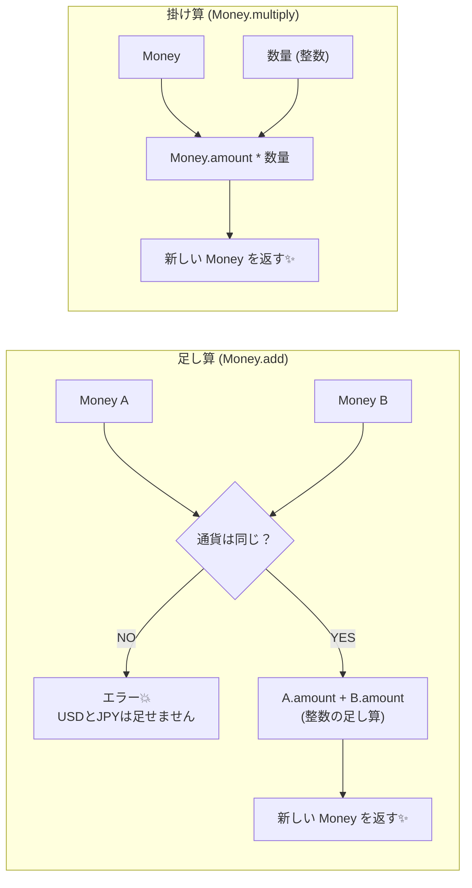

# 第09章：VO実装②「Money」みたいな“計算する値”💰➕

この章では **「お金」をValue Object（VO）として作る**よ！
お金って、ただの `number` で持つと事故りやすい代表選手なんだよね…😇💥
だから **「無効なお金を作れない」「通貨が混ざらない」「計算してもズレない」** を、VOの力で守っていくよ〜！🛡️💎

---

## 0) まず “2026の最新事情”をちょい押さえ📌✨

* TypeScript は npm の `typescript` パッケージだと **5.9.3 が最新**（2026-01-22時点で確認できる範囲）だよ 🧩✨ ([npm][1])
* TypeScript は今後、**6.0（橋渡し）→ 7.0（ネイティブ移植）**の流れが公式ブログで進捗共有されてるよ 🚀 ([Microsoft for Developers][2])
* テストは “速くて扱いやすい” で **Vitest 4** が現行の大きな節目（2025-10リリース）🧪✨ ([Vitest][3])
* 「Decimal型（小数を正確に扱える言語機能）」は提案はあるけど、**まだ Stage 1 Draft**（＝まだ使える前提にしないのが安全）だよ 📉🧠 ([TC39][4])

なのでこの章は、**“今すぐ実務で安全”な定番手法**でいくね：
✅ **最小通貨単位（円なら1円、ドルなら1セント）を整数で持つ**（BigInt）💪

---

## 1) MoneyをVOにする理由（ここ超大事）💡💰


### ❌ `number` のお金が危険な理由


* **小数の誤差**（0.1 + 0.2 が 0.3 にならない系）😇
* **通貨が混ざる**（JPY + USD とか地獄）🌍💥
* **丸めがバラバラ**（画面とDBと計算が一致しない）🌀
* **マイナスが混ざる**（返金OKなのか、未払いを表すのか曖昧）🤔

### ✅ VOにすると何が嬉しい？

* 「**無効な金額を作れない**」を強制できる🛡️
* 「**通貨が違うなら計算できない**」を型＆実装で守れる🔒
* 「**丸めルールを1箇所に固定**」できる📌
* 「**計算の責務をMoneyに集約**」できて、Entityがスッキリ✨

---

## 2) この章のゴール🎯✨


最終的に、こんなコードが気持ちよく書ける状態にするよ😊💖

```ts
const price = Money.jpyFromMajor("1980");        // 1,980円
const qty = 3n;
const subtotal = price.multiply(qty);           // 5,940円

const tax = subtotal.rateBps(1000);             // 10% (1000bps) の税 -> 594円
const total = subtotal.add(tax);                // 6,534円
```

---

## 3) 設計の方針（迷ったらここに戻る）🧭✨


### Money VOの基本ルール（おすすめ）


1. **内部表現は “最小単位” の整数**（円=1円、USD=1セント）
2. **通貨を必ず持つ**（"JPY" とか）
3. **不変（Immutable）**：足し算したら “新しいMoney” を返す
4. **同じ通貨しか足せない**（違うならエラー）
5. **丸めルールをMoney側で統一**（税・割引・按分）




---

## 4) 図解イメージ（責務の置き場所）🧩🎨


* Entity（例：Order）は「何をしたいか（目的）」
* Money は「お金計算の正しさ（ルール）」

```text
Order(Entity)
  ├─ addItem(product, price: Money, qty)
  ├─ getSubtotal(): Money
  └─ getTotal(): Money
        ↑
        │ 計算の正しさ・通貨・丸めは
        │ Money(VO) が責任を持つ💪
```

---

## 5) 実装していこう（Currency と Money）💻💰✨

### 5-1) DomainError（まずはシンプルに投げる）⚠️

※ 例外/Resultの作り分けは後の章でより丁寧にやるけど、この章は “VOの気持ちよさ”優先でOK！

```ts
// src/domain/errors/DomainError.ts
export class DomainError extends Error {
  constructor(message: string) {
    super(message);
    this.name = "DomainError";
  }
}
```

### 5-2) Currency（通貨情報：小数桁）🌍💱


JPYは小数0桁、USDは2桁…みたいな “最小限” の情報を持たせるよ。

```ts
// src/domain/money/Currency.ts
import { DomainError } from "../errors/DomainError";

export type CurrencyCode = "JPY" | "USD" | "EUR";

const FRACTION_DIGITS: Record<CurrencyCode, number> = {
  JPY: 0,
  USD: 2,
  EUR: 2,
};

export class Currency {
  private constructor(
    public readonly code: CurrencyCode,
    public readonly fractionDigits: number,
  ) {}

  static of(code: CurrencyCode): Currency {
    const digits = FRACTION_DIGITS[code];
    if (digits === undefined) throw new DomainError(`Unsupported currency: ${code}`);
    return new Currency(code, digits);
  }
}
```

### 5-3) Money（本体）💎💰


ポイントはこれ👇

* `minor`（最小単位）を **BigInt** で持つ
* `add/subtract` は通貨一致チェック
* `multiply` は **整数（数量）** に限定（小数倍率は別メソッド）
* 税率などは **bps（1/10000）** を使うと安全（小数を避けられる）✨

```ts
// src/domain/money/Money.ts
import { DomainError } from "../errors/DomainError";
import { Currency, CurrencyCode } from "./Currency";

type RoundingMode = "HALF_UP" | "FLOOR" | "CEIL";

export class Money {
  private constructor(
    private readonly minor: bigint,
    public readonly currency: Currency,
  ) {}

  // よく使う工場メソッド（例：JPY）
  static jpyFromMinor(minor: bigint): Money {
    return new Money(minor, Currency.of("JPY"));
  }

  static jpyFromMajor(major: string): Money {
    return Money.fromMajorString(major, "JPY");
  }

  static fromMinor(minor: bigint, code: CurrencyCode): Money {
    return new Money(minor, Currency.of(code));
  }

  // "1980" / "19.80" みたいな文字列から作る（numberはなるべく避ける）
  static fromMajorString(major: string, code: CurrencyCode): Money {
    const currency = Currency.of(code);
    const minor = parseMajorToMinor(major, currency.fractionDigits);
    return new Money(minor, currency);
  }

  add(other: Money): Money {
    this.assertSameCurrency(other);
    return new Money(this.minor + other.minor, this.currency);
  }

  subtract(other: Money): Money {
    this.assertSameCurrency(other);
    return new Money(this.minor - other.minor, this.currency);
  }

  multiply(quantity: number | bigint): Money {
    const q = typeof quantity === "number" ? BigInt(quantity) : quantity;
    if (q < 0n) throw new DomainError("Quantity must be non-negative");
    return new Money(this.minor * q, this.currency);
  }

  // 税率・割引率は bps（1/10000）にすると安全✨ 10% = 1000bps
  rateBps(bps: number, rounding: RoundingMode = "HALF_UP"): Money {
    if (!Number.isInteger(bps)) throw new DomainError("bps must be integer");
    const b = BigInt(bps);
    return new Money(divRound(this.minor * b, 10_000n, rounding), this.currency);
  }

  isZero(): boolean {
    return this.minor === 0n;
  }

  isNegative(): boolean {
    return this.minor < 0n;
  }

  equals(other: Money): boolean {
    return this.currency.code === other.currency.code && this.minor === other.minor;
  }

  toMinorString(): string {
    return this.minor.toString();
  }

  toMajorString(): string {
    // 例: USD(2桁) なら "1234" -> "12.34"
    const digits = this.currency.fractionDigits;
    return formatMinorToMajor(this.minor, digits);
  }

  private assertSameCurrency(other: Money) {
    if (this.currency.code !== other.currency.code) {
      throw new DomainError(`Currency mismatch: ${this.currency.code} vs ${other.currency.code}`);
    }
  }
}

function parseMajorToMinor(input: string, fractionDigits: number): bigint {
  const s = input.trim();
  if (!s) throw new DomainError("amount is empty");

  const sign = s.startsWith("-") ? -1n : 1n;
  const raw = s.replace(/^[+-]/, "");

  const [intPart, fracPartRaw = ""] = raw.split(".");
  if (!/^\d+$/.test(intPart)) throw new DomainError(`invalid amount: ${input}`);
  if (!/^\d*$/.test(fracPartRaw)) throw new DomainError(`invalid amount: ${input}`);

  const fracPart = fracPartRaw.padEnd(fractionDigits, "0").slice(0, fractionDigits);
  if (fracPartRaw.length > fractionDigits) {
    // ここは「丸める」設計もあるけど、まずは事故防止で弾くのが初心者に優しい✨
    throw new DomainError(`too many decimal places: ${input}`);
  }

  const minorStr = intPart + fracPart;
  const minor = minorStr === "" ? 0n : BigInt(minorStr);
  return minor * sign;
}

function formatMinorToMajor(minor: bigint, fractionDigits: number): string {
  const sign = minor < 0n ? "-" : "";
  const abs = minor < 0n ? -minor : minor;

  const raw = abs.toString().padStart(fractionDigits + 1, "0");
  if (fractionDigits === 0) return sign + raw;

  const intPart = raw.slice(0, -fractionDigits);
  const fracPart = raw.slice(-fractionDigits);
  return `${sign}${intPart}.${fracPart}`;
}

function divRound(numer: bigint, denom: bigint, mode: RoundingMode): bigint {
  // denom > 0 前提
  const q = numer / denom;
  const r = numer % denom;
  if (r === 0n) return q;

  const isPositive = numer >= 0n;
  switch (mode) {
    case "FLOOR":
      return isPositive ? q : q - 1n;
    case "CEIL":
      return isPositive ? q + 1n : q;
    case "HALF_UP": {
      const absR2 = (r < 0n ? -r : r) * 2n;
      if (absR2 >= denom) return isPositive ? q + 1n : q - 1n;
      return q;
    }
  }
}
```

---

## 6) テストを書こう（Vitestでサクッと）🧪💖

Vitest 4 系が現行の大きい節目だよ〜（移行ガイドも公式にある）🧪✨ ([Vitest][3])

```ts
// test/domain/money/Money.test.ts
import { describe, it, expect } from "vitest";
import { Money } from "../../../src/domain/money/Money";

describe("Money", () => {
  it("add: same currency only", () => {
    const a = Money.jpyFromMajor("1980");
    const b = Money.jpyFromMajor("20");
    expect(a.add(b).toMajorString()).toBe("2000");
  });

  it("multiply: integer quantity", () => {
    const price = Money.jpyFromMajor("1980");
    expect(price.multiply(3n).toMajorString()).toBe("5940");
  });

  it("rateBps: 10% tax (1000bps)", () => {
    const subtotal = Money.jpyFromMajor("5940");
    const tax = subtotal.rateBps(1000);
    expect(tax.toMajorString()).toBe("594"); // 5940 * 0.10
  });

  it("parse: too many decimals should throw", () => {
    expect(() => Money.fromMajorString("12.345", "USD")).toThrow();
  });
});
```

---

## 7) よくあるバグ集（初心者が踏みがち）🥲💥 → 回避策✨


### ① `number` の小数で金額を持つ

**バグ**：端数がズレる → 合計が合わない
**回避**：最小単位の整数（BigInt）で持つ✅

### ② 通貨を持たない

**バグ**：JPYとUSDが混ざっても気づかない
**回避**：Moneyは必ずCurrencyを含む✅

### ③ 丸めが画面側・API側・ドメイン側でバラバラ

**バグ**：どこかで1円ズレる
**回避**：丸めはMoneyの中に集約✅

### ④ 税率を `1.1` とかで掛ける

**バグ**：浮動小数の誤差が混入
**回避**：`bps`（10% = 1000bps）で計算✅

### ⑤ “小数を正確に扱うDecimal型”を期待する

**現状**：提案はあるけど **Stage 1 Draft** で、今すぐ標準機能として頼るのは危険⚠️ ([TC39][4])
**回避**：整数（最小単位）方式で堅くいこう💪

---

## 8) 演習（手を動かすパート）✍️💰✨

### 演習1：`discountBps()` を作ろう 🎟️

* `rateBps()` を流用してOK
* `subtotal.subtract(subtotal.discountBps(500))` で **5%割引**とかできるようにしてみて！

### 演習2：`allocate()`（按分）を作ろう 🧁

例：1000円を `[1,1,1]` で割る → `[334,333,333]` みたいに、**合計が必ず一致**するやつ！
（ここ、実務でめっちゃ使う🥹）

### 演習3：Orderっぽい関数を作って “使い心地”を確かめよう 🛒

* `LineItem = { price: Money, qty: bigint }`
* `calcSubtotal(items): Money`
* `calcTotal(items, taxBps): Money`

---

## 9) 小テスト（サクッと確認）📝💖

1. MoneyをVOにする一番の狙いは？
2. 金額を `number` で持つと何が怖い？（1つでOK）
3. “最小通貨単位”って何？（円で言うと？）
4. 税率10%を bps で表すと？
5. `add()` で通貨が違ったらどうするのが安全？

👉 解答例（ざっくり）

1. 無効値・通貨混在・丸め事故を防ぐ
2. 小数誤差
3. 円なら1円（USDなら1セント）
4. 1000bps
5. エラー（DomainError）で止める

---

## 10) AIプロンプト集（Copilot/Codexに投げる用）🤖💖

* 「Money VO を BigInt（最小単位）で実装したい。`add/subtract/multiply(rateBps)` の設計レビューして、危ない点を指摘して」
* 「`allocate()` の按分実装案を出して。**合計が必ず一致**する仕様で、テストケースもセットで」
* 「Moneyのテスト観点を増やして。境界値（0、負数、巨大値、桁、丸め）を中心に」
* 「`fromMajorString()` のパースで、初心者が混乱しやすい入力例と、弾くべき/許可すべきの判断表を作って」
* 「Order合計計算のサンプル（items -> subtotal -> tax -> total）を、読みやすさ重視で書き直して」

---

## まとめ（この章で “強くなる”ポイント）🌟💰

* お金は “ただの数”じゃなくて **ルールの塊**だよ🧠💥
* VOにすると、**事故の芽を最初から潰せる**🛡️✨
* **BigInt × 最小単位 × bps** の組み合わせは、今すぐ使える堅実セット💪
* テストで「ズレない」を証明すると、安心して育てられる🧪💖

次の第10章（Period）も、今回のMoneyと同じで「範囲の整合性」をVOで守っていく感じだよ〜📅↔️✨

[1]: https://www.npmjs.com/package/typescript?activeTab=versions&utm_source=chatgpt.com "typescript"
[2]: https://devblogs.microsoft.com/typescript/progress-on-typescript-7-december-2025/?utm_source=chatgpt.com "Progress on TypeScript 7 - December 2025"
[3]: https://vitest.dev/blog/vitest-4?utm_source=chatgpt.com "Vitest 4.0 is out!"
[4]: https://tc39.es/proposal-decimal/?utm_source=chatgpt.com "Decimal"
