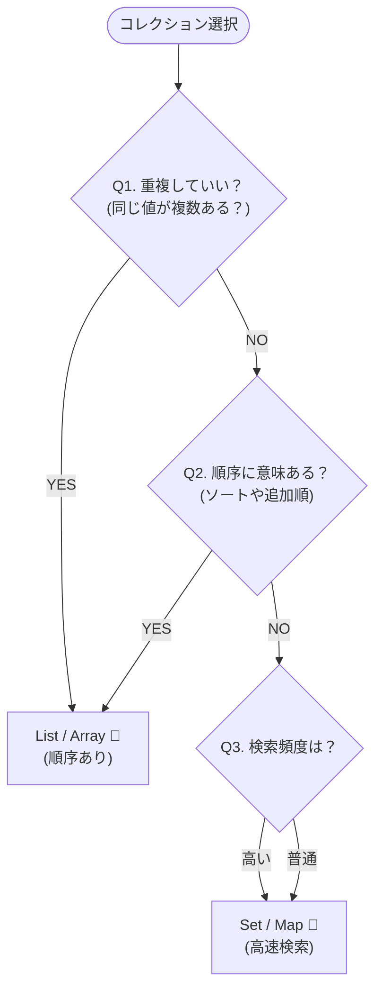

# 第11章：VOの“等価性”と“コレクション”設計（Set/List）🧺💎

## この章のゴール🎯

この章が終わったら、こんなことができるようになります😊✨

* Value Object（VO）同士を「正しく比べる」方法がわかる🔍💎
* 「Setにする？Listにする？」をルールで判断できる🧠🧺
* “コレクション自体をVOにする”設計ができる（重複・順序・最大数などを守れる）🛡️✨

---

## 1) まず超大事：Set/Mapは“オブジェクトを値で比較しない”😇💥


JavaScript/TypeScript の `Set` や `Map` は、基本「SameValueZero」という仕組みで “同じ” を決めます✅

* `NaN` は `NaN` と同じ扱い（`NaN !== NaN` なのに！）😳
* `0` と `-0` は同じ扱い🙂
* でも **オブジェクトは参照（同一オブジェクト）で比較** されます⚠️（中身が同じでも別物） ([MDNウェブドキュメント][1])

つまりこう👇

```ts
const a = { value: "tokyo" };
const b = { value: "tokyo" };

console.log(a === b); // false 😭（中身が同じでも別）
console.log(new Set([a, b]).size); // 2 😭
```

**VOをそのまま `Set<VO>` に入れて「重複消えるよね？」って期待すると、事故りがち**です🚑💦 ([MDNウェブドキュメント][1])

---

## 2) VOの等価性は「同じ値なら同じ」💎＝“値の世界”

VOの思想はシンプル😊

* **同じ値なら同じもの**（同一性じゃない）💎
* だから「等価性（equals）」が超重要✨

ここでおすすめはこの2点セット💡

1. `equals(other)` を用意する✅
2. `key()`（正規化された文字列キー）も用意する🔑（Set/Map向け）

---

## 3) “equals”の作り方：まずは素直に比較しよ🙂✨


例：`Tag`（ラベル）VO を作る（小文字に正規化して扱う）🏷️

```ts
export class Tag {
  private constructor(private readonly raw: string) {}

  static create(input: string): Tag {
    const v = input.trim();
    if (v.length === 0) throw new Error("Tag must not be empty");
    if (v.length > 20) throw new Error("Tag is too long");
    return new Tag(v);
  }

  /** Set/Mapで使いやすい “正規化キー” */
  key(): string {
    return this.raw.toLowerCase();
  }

  equals(other: Tag): boolean {
    return this.key() === other.key();
  }

  toString(): string {
    return this.raw;
  }
}
```

ポイント💡

* `equals` は **「業務的に同じと言えるか」** を表現する場所🧠✨
* `key()` は **Set/Mapに入れるための“変換口”** 🔑✨

---

## 4) Set？List？迷ったらこの3問で決めよ🧠🧺✨


### ✅ Q1：重複していい？

* **ダメ** → Set寄り（集合）🙅‍♀️
* **OK** → List寄り（配列）🙆‍♀️

### ✅ Q2：順序に意味ある？

* **ある**（例：表示順、購入順、履歴順）→ List 📜
* **ない**（例：タグ、権限、参加メンバーの集合）→ Set 🧺

### ✅ Q3：検索・存在チェックが多い？

* 多い → Set/Map寄り（`has` が速い）⚡

※Setは「挿入順で列挙」される性質もあるけど、**“順序が仕様”なら最初からListで宣言しちゃう方が安全**だよ😊🧷

* 多い → Set/Map寄り（`has` が速い）⚡



`Set`/`Map` の同一判定が SameValueZero ベースなことはこの章の土台なので覚えておくと強いです💪 ([MDNウェブドキュメント][1])


---

## 5) コレクションもVOにしちゃおう🧺💎（この章のメイン！）


「タグ集合」「行アイテム一覧」みたいな **“集まり”** にこそルールが乗ります🎁✨
例：Tags のルール

* 重複禁止🙅‍♀️
* 最大5個まで🧢
* 大文字小文字は同一扱い（正規化）🔡

こういうの、配列で放置すると一瞬で崩れます😇💥
だから **Tags自体をVO** にして守ります🛡️✨

---

## 6) 実装例：Tags（Set的コレクションVO）🏷️🧺✨


中では `Map<string, Tag>` を使うのが扱いやすいです😊

* key（正規化文字列）で重複を潰す🔑
* 値として Tag を保持して表示もできる✨

```ts
import { Tag } from "./Tag";

export class Tags {
  private constructor(private readonly byKey: ReadonlyMap<string, Tag>) {}

  static empty(): Tags {
    return new Tags(new Map());
  }

  static from(items: readonly Tag[]): Tags {
    let tags = Tags.empty();
    for (const t of items) tags = tags.add(t);
    return tags;
  }

  size(): number {
    return this.byKey.size;
  }

  has(tag: Tag): boolean {
    return this.byKey.has(tag.key());
  }

  add(tag: Tag): Tags {
    const next = new Map(this.byKey);
    next.set(tag.key(), tag);

    if (next.size > 5) {
      throw new Error("Tags must be 5 or less");
    }
    return new Tags(next);
  }

  remove(tag: Tag): Tags {
    const next = new Map(this.byKey);
    next.delete(tag.key());
    return new Tags(next);
  }

  /** 表示用（安定させたいのでソート） */
  toArraySorted(): Tag[] {
    return [...this.byKey.values()].sort((a, b) => a.key().localeCompare(b.key()));
  }

  /** “集合として同じか” を定義する（順序は無視） */
  equals(other: Tags): boolean {
    if (this.size() !== other.size()) return false;
    for (const k of this.byKey.keys()) {
      if (!other.byKey.has(k)) return false;
    }
    return true;
  }
}
```

ここが気持ちいいところ😍✨

* ルール（最大5個）が **1箇所に固定** される🛡️
* どこから触っても崩れない😊
* “集合として等しい” を `equals` で言える💎

---

## 7) 実装例：LineItems（List的コレクション）🧾📦


LineItemは「順序が意味ある（表示順・追加順）」ケースが多いので List 寄りになりやすいです🙂✨
（※ここでは雰囲気だけ：設計の着眼点が大事だよ🫶）

例ルール案🧠

* 同じ商品はまとめる？それとも行を分ける？🛒
* 最大99行まで？📏
* 数量は1以上？🔢

**順序が仕様なら** `ReadonlyArray` で守りつつ、操作メソッドで更新するのがおすすめ😊🧷

---

## 8) テストで“等価性”を安心にしよ🧪💖

`equals` や `Tags` のルールはテストすると超安心です✨

```ts
import { describe, it, expect } from "vitest";
import { Tag } from "./Tag";
import { Tags } from "./Tags";

describe("Tags", () => {
  it("treats tags case-insensitively", () => {
    const a = Tag.create("TypeScript");
    const b = Tag.create("typescript");

    const tags = Tags.empty().add(a);
    expect(tags.has(b)).toBe(true);
  });

  it("equals ignores order", () => {
    const t1 = Tag.create("a");
    const t2 = Tag.create("b");

    const x = Tags.from([t1, t2]);
    const y = Tags.from([t2, t1]);

    expect(x.equals(y)).toBe(true);
  });

  it("limits size to 5", () => {
    const tags = Tags.from(["a","b","c","d","e"].map(Tag.create));
    expect(() => tags.add(Tag.create("f"))).toThrowError();
  });
});
```

---

## 9) ありがち事故💥（ここ、試験に出るよ〜😆📝）


### ❌ 事故1：VOを `Set<VO>` に入れれば重複消えると思う

→ **消えません**（参照比較だから）😭 ([MDNウェブドキュメント][1])

### ❌ 事故2：`JSON.stringify` で equals を作る

* プロパティ順序とかで壊れやすい😇
* “業務的に同じ” と “構造が同じ” は別物になりがち

### ❌ 事故3：コレクションを `push()` で増やしていく

→ どこでルール守るの？ってなって散らかります🧨
→ だから **コレクションVO + 追加メソッド** が強い🛡️✨

---

## 10) ミニ図解：Set / List 判断マップ🗺️✨


* 重複NG & 順序意味なし → **Set（集合）** 🧺
* 順序が意味あり → **List（配列）** 📜
* どっちもあり得る → “仕様”に書かれてる方が正解✍️😊

---

## 11) 小テスト（答えつき）📝💕

### Q1：`Set` が値の同一判定に使う仕組みは？

A) `==`  B) `===`  C) SameValueZero  D) deepEqual
✅答え：C ([MDNウェブドキュメント][1])

### Q2：`{a:1}` と `{a:1}` を `Set` に入れたらサイズは？

A) 1  B) 2
✅答え：B（参照が違う） ([MDNウェブドキュメント][1])

### Q3：VOの等価性は基本どっち？

A) 同一性（ID） B) 値（中身）
✅答え：B 💎

### Q4：「タグ」は多くの場合 Set / List どっち向き？

A) Set  B) List
✅答え：A（重複NG、順序なしが多い）🧺

### Q5：「注文の明細行」は多くの場合 Set / List どっち向き？

A) Set  B) List
✅答え：B（表示順や追加順が仕様になりやすい）📜

### Q6：VOをSet/Mapで扱いやすくするために用意すると便利なものは？

A) key()  B) equals()  C) 両方
✅答え：C 🔑💎

---

## 12) 演習（手を動かすやつ💪✨）

### 演習1：Tagsを完成させよう🏷️

* ルール：最大5個、重複NG、空白トリム、大小同一扱い
* `add/remove/equals/toArraySorted` を実装✅

### 演習2：LineItems（List VO）を作ろう🧾

* ルール例：最大99行、数量は1以上
* `addItem/removeItem/changeQuantity` を “差し替え更新” で実装🔁✨

### 演習3：テストを書こう🧪

* 大小同一扱いのテスト
* equalsが順序無視のテスト
* 最大数で例外になるテスト

---

## 13) AIプロンプト集（コピペでOK🤖💖）

* 「`Tags` の equals 実装をレビューして、抜けそうなケースを列挙して」🔍
* 「`Tag` のバリデーション境界値テストを20個作って（OK/NG半々）」🧪
* 「このコレクションは Set 向き？ List 向き？ “重複/順序/検索頻度”で理由も添えて」🧠
* 「`JSON.stringify` を equals に使う危険パターンを具体例で教えて」💥
* 「最大数・重複禁止・正規化のルールが散らばってないか、責務の観点で指摘して」🛡️

---

## 14) ちょい最新トピック：TypeScriptも進化してるよ✨🆕

最近の TypeScript は **5.9** のリリースノートが公開・更新されています（2026年1月時点で更新あり）📌 ([TypeScript][2])
この章の設計（VO/コレクションVO）は、TSが新しくなってもずっと効く “土台スキル” だよ😊💎

---

## 15) おまけ：Setが便利になる新しめ機能🧺✨

`Set.prototype.union` / `intersection` みたいな集合メソッド追加が **仕様に入った（Stage 4）** という流れもあります🙂 ([GitHub][3])
使えたらめちゃ便利なので、1行チェックで存在確認しちゃうのが安全だよ✅

```ts
const supportsSetMethods = "intersection" in Set.prototype;
```

---

## まとめ🎀✨

* VOの等価性は「値で同じ」💎
* でもJSのSet/Mapは **オブジェクトを参照で比較** する⚠️ ([MDNウェブドキュメント][1])
* だから `equals()` と `key()` が超頼れる😊🔑
* さらに “コレクション自体をVO” にすると、重複・順序・最大数が壊れなくなる🧺🛡️✨

次の章（第12章）はいよいよ **Entityの骨格づくり** 🪪🧱✨
この章で作った「コレクションVO」も、Entityの中に自然に入ってきます😊💖

[1]: https://developer.mozilla.org/en-US/docs/Web/JavaScript/Reference/Global_Objects/Set?utm_source=chatgpt.com "Set - JavaScript - MDN Web Docs"
[2]: https://www.typescriptlang.org/docs/handbook/release-notes/typescript-5-9.html?utm_source=chatgpt.com "Documentation - TypeScript 5.9"
[3]: https://github.com/tc39/proposal-set-methods?utm_source=chatgpt.com "Proposal for new Set methods in JS"
