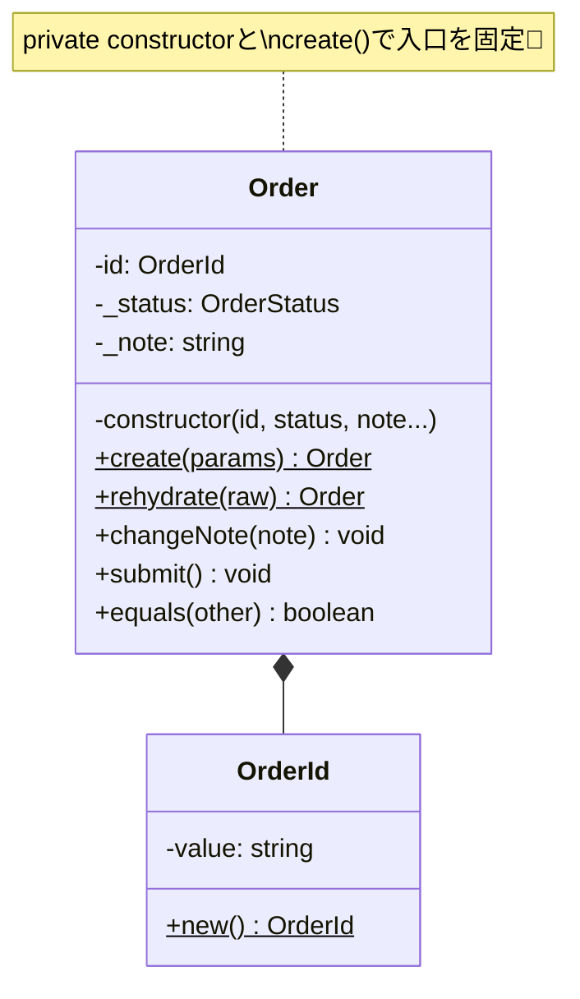

# 第12章：Entity実装①「基本のEntity骨格」を作る🪪🧱

この章はね、**「Entityって結局どんな“形”で書けばいいの？」**をスッキリさせる回だよ〜！😊🌸
Value Object（VO）は前の章で作ってきたけど、Entityは **“更新される前提”** だから、**壊れにくい骨格**が超大事っ💪✨

---

## 1) 今日つくる「Entityの骨格」ってなに？🦴🪪


Entityの骨格は、だいたいこの3点セットでできてるよ👇

* **① 同一性（ID）**：時間が経っても「同じもの」って追跡できる🆔⏳
* **② 生成の入口（create）**：最初から“変な状態”で生まれないようにする🚪👶
* **③ 更新の入口（メソッド）**：外から勝手に書き換えられないようにする🔒✍️

> つまり…
> **「newで雑に作らせない」「プロパティを雑に変更させない」** が骨格のコツだよ🙂✨

---

## 2) 図でイメージしよ〜📦🧠


Entityはこういう流れが気持ちいい👇

```text
外（UI/API） → DTO（ただのデータ） → 変換（境界） → Entity.create()
                                             ↓
                                      Entityのメソッドで更新
                                             ↓
                                     Entityの中のルールで守る
```

* 外からは **「作って」** と **「更新して」** しかさせない
* その代わりEntityの中では **ルールを信じられる**（安全）✅

---

## 3) 今回の題材：ミニOrder（注文）🛒✨

この章では **“骨格だけ”**に集中したいから、Orderを最小でいくよ！

* Orderは **IDを持つ（同一性）**
* 作った直後は `Draft`
* メモ（note）を更新できる（とりあえず1つだけ更新メソッドを作る）

---

## 4) 実装：ID（OrderId）から作る🆔✨


まず、Entityの同一性の核になる **ID** を用意するよ！

```ts
// src/domain/order/OrderId.ts
import { randomUUID } from "node:crypto";

export class OrderId {
  private constructor(public readonly value: string) {}

  /** 新規作成用（新しいIDを発行） */
  static new(): OrderId {
    return new OrderId(randomUUID());
  }

  /** 復元用（DBなどから読み込む） */
  static from(value: string): OrderId {
    if (!value || value.trim().length === 0) {
      throw new Error("OrderId is required");
    }
    return new OrderId(value);
  }

  equals(other: OrderId): boolean {
    return this.value === other.value;
  }

  toString(): string {
    return this.value;
  }
}
```

ポイント😊👇

* `new OrderId(...)` を外からできないようにしてる（`private constructor`）🚪🔒
* `new()` と `from()` の **2ルート**に分けるのが超実務で効く✨

  * `new()`：新規作成
  * `from()`：永続化からの復元（この先の章で使う！）

---

## 5) 実装：Entity本体（Order）🪪🧱


次に、Orderを「骨格どおり」に書くよ！

```ts
// src/domain/order/Order.ts
import { OrderId } from "./OrderId";

export type OrderStatus = "Draft" | "Submitted";

type CreateOrderParams = {
  note?: string;
};

type RehydrateOrderParams = {
  id: string;
  status: OrderStatus;
  note: string;
  createdAt: string; // ISO文字列でOK（外の都合）
  updatedAt: string; // ISO文字列でOK（外の都合）
};

export class Order {
  // 外から勝手に触られないようにする🔒
  private _status: OrderStatus;
  private _note: string;
  private _updatedAt: Date;

  private constructor(
    public readonly id: OrderId,
    status: OrderStatus,
    note: string,
    public readonly createdAt: Date,
    updatedAt: Date
  ) {
    this._status = status;
    this._note = note;
    this._updatedAt = updatedAt;
  }

  // --- getters（読み取り専用の窓）🪟 ---
  get status(): OrderStatus {
    return this._status;
  }

  get note(): string {
    return this._note;
  }

  get updatedAt(): Date {
    return new Date(this._updatedAt);
  }

  // --- 生成の入口（新規作成）🚪👶 ---
  static create(params: CreateOrderParams = {}): Order {
    const now = new Date();

    // 生成時に“最初のルール”を守る🛡️
    const note = (params.note ?? "").trim();
    if (note.length > 200) {
      throw new Error("note must be 200 chars or less");
    }

    return new Order(
      OrderId.new(),
      "Draft",
      note,
      now,
      now
    );
  }

  // --- 復元の入口（DBなどから読み込む）💾🔁 ---
  static rehydrate(raw: RehydrateOrderParams): Order {
    return new Order(
      OrderId.from(raw.id),
      raw.status,
      raw.note,
      new Date(raw.createdAt),
      new Date(raw.updatedAt)
    );
  }

  // --- 更新の入口（メソッド経由だけ）✍️🔒 ---
  changeNote(note: string): void {
    const trimmed = note.trim();
    if (trimmed.length > 200) {
      throw new Error("note must be 200 chars or less");
    }

    // Entityは「変わる」けど、入口で守る🙂✨
    this._note = trimmed;
    this._updatedAt = new Date();
  }

  submit(): void {
    // いったん最小のルールだけ
    if (this._status !== "Draft") {
      throw new Error("only Draft order can be submitted");
    }
    this._status = "Submitted";
    this._updatedAt = new Date();
  }

  // --- 同一性比較（超大事）🪪✨ ---
  equals(other: Order): boolean {
    return this.id.equals(other.id);
  }

  // --- テストやデバッグ用のスナップショット📸 ---
  snapshot() {
    return {
      id: this.id.value,
      status: this._status,
      note: this._note,
      createdAt: this.createdAt.toISOString(),
      updatedAt: this._updatedAt.toISOString(),
    };
  }
}
```

### ここ、めっちゃ大事な観点だよ〜🧠✨


* **コンストラクタは private**：外から `new Order(...)` させない🚫
* **create() が唯一の“新規作成入口”**：最初からルールを守る✅
* **更新は changeNote() みたいなメソッド経由**：勝手に壊せない🔒
* **equals() は ID基準**：値じゃなくて“同一性”🪪




---

## 6) テスト（Vitest想定）🧪✨


骨格はテストで固めると一気に安心になるよ〜😊🍰

```ts
// src/domain/order/Order.test.ts
import { describe, it, expect } from "vitest";
import { Order } from "./Order";

describe("Order", () => {
  it("create: Draftで作られる", () => {
    const order = Order.create({ note: "hello" });

    expect(order.status).toBe("Draft");
    expect(order.note).toBe("hello");
    expect(order.id.value).toBeTruthy();
  });

  it("create: noteが長すぎるとエラー", () => {
    const tooLong = "a".repeat(201);
    expect(() => Order.create({ note: tooLong })).toThrow();
  });

  it("changeNote: メモを更新できる", () => {
    const order = Order.create({ note: "before" });
    order.changeNote(" after ");

    expect(order.note).toBe("after");
  });

  it("submit: Draft → Submitted", () => {
    const order = Order.create();
    order.submit();

    expect(order.status).toBe("Submitted");
  });

  it("equals: IDが同じなら同一", () => {
    const a = Order.create({ note: "A" });
    const b = Order.rehydrate({
      id: a.id.value,
      status: a.status,
      note: a.note,
      createdAt: a.createdAt.toISOString(),
      updatedAt: a.updatedAt.toISOString(),
    });

    expect(a.equals(b)).toBe(true);
  });
});
```

---

## 7) よくある事故パターン💥（先に潰そ〜😇）


### ❌ 事故1：プロパティをpublicにして外から書き換え放題

* 「いつ誰が変えたの…？」が起きる😵‍💫
  ✅ `private` + 更新メソッドで入口を固定しよう🔒

### ❌ 事故2：どこでも new できる

* `Draftじゃない状態で生まれた…` みたいな怪奇現象👻
  ✅ `private constructor` + `create()` が正解🚪

### ❌ 事故3：equals が「全部の値比較」になってる

* Entityは更新されるから、値比較だと破綻しやすい😇
  ✅ Entityの比較は **ID** が基本🪪

---

## 8) 演習（やってみよ〜！）🎀🧩

### 演習A：Member Entityを骨格で作る👤🪪

要件👇

* `MemberId` を持つ
* `displayName` を持つ（空はNG、🙅‍♀️、最大30文字）
* `changeDisplayName()` で更新できる
* `create()` と `rehydrate()` を作る
* テストを最低3本🧪（create成功 / create失敗 / change成功）

### 演習B（ちょい上級🌟）：snapshot() を使ってテストを書きやすくする📸

* `snapshot()` の戻り値が常にシンプルになるように調整してみてね🙂✨

---

## 9) 小テスト（サクッと確認）✍️🐣

**Q1. Entityでequalsを作るとき、基本の比較軸は？**
A. 全プロパティ　B. ID　C. createdAt

**Q2. `private constructor` の狙いは？**
A. 速くなる　B. newを制限して入口を固定する　C. テストが不要になる

**Q3. `create()` と `rehydrate()` を分けると嬉しいのは？**
A. なんとなく　B. 新規作成と復元で責務が違うから　C. 型が減るから

**Q4. Entityの更新を public setter でやると起きやすいのは？**
A. バグが減る　B. 変更箇所が追えなくなる　C. 速度が上がる

**答え**：Q1=B / Q2=B / Q3=B / Q4=B ✅🎉

---

## 10) AIプロンプト集（Copilot/Codexに投げる用）🤖✨

### 🧱 骨格生成

* 「Order Entityの骨格を、private constructor + create + rehydrate + 更新メソッドで提案して。更新はsetter禁止で。」

### 🧪 テスト強化

* 「このEntityのテスト観点を増やして。境界値・異常系中心で5つ追加して。」

### 🔍 設計レビュー

* 「このEntity、責務が増えすぎそうなポイントを指摘して。分割案も。」

### 🛡️ ルールの入口整理

* 「不変条件（入力チェック）を入口に集める観点で、改善案を出して。」

---

## 11) “本日時点の最新”ちょこっとメモ📰✨（設計に関係ある範囲だけ）

* TypeScriptは **GitHub Releases上で 5.9.3 が “Latest”** になってるよ（2025-10-01表示）。 ([GitHub][1])
* Node.jsは **v24系がActive LTS**、直近だと **24.13.0（2026-01-13）** のリリースが出てるよ。 ([Node.js][2])
* Vitestは **4.0** が出てて、移行ガイドも更新されてるよ（2026-01-08）。 ([Vitest][3])
* TypeScriptは将来に向けて **ネイティブ版（TypeScript 7 Native Preview）** の動きも進んでるよ。 ([Microsoft Developer][4])

---

次は第13章で、今日作ったEntityに **Email/Money/PeriodみたいなVOを“差し替え更新”で組み込む**よ〜🔁💎✨
その前に、もし良かったら：
**演習A（Member Entity）**のあなたの実装を貼ってくれたら、私が「壊れにくさチェック」するね😊🧪🎀

[1]: https://github.com/microsoft/typescript/releases "Releases · microsoft/TypeScript · GitHub"
[2]: https://nodejs.org/en/about/previous-releases?utm_source=chatgpt.com "Node.js Releases"
[3]: https://vitest.dev/blog/vitest-4?utm_source=chatgpt.com "Vitest 4.0 is out!"
[4]: https://developer.microsoft.com/blog/typescript-7-native-preview-in-visual-studio-2026?utm_source=chatgpt.com "TypeScript 7 native preview in Visual Studio 2026"
