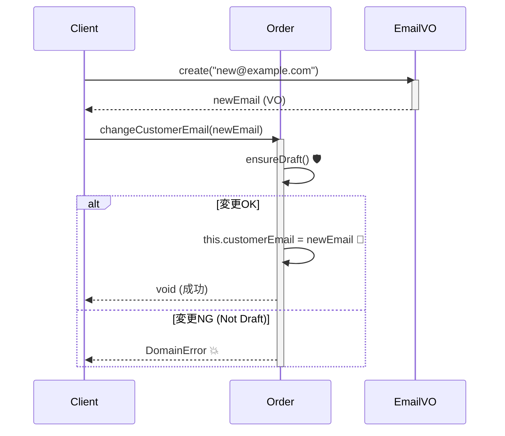

# 第13章：Entity実装②「VOを持たせる」＋“更新は差し替え”🔁💎

この章は、**Entityの中にVO（Value Object）を入れて**、更新するときは **VOを「作り直して差し替える」** っていう気持ちいい形を作る回だよ〜！🧸✨
（※2026/01/22時点：TypeScriptの最新安定版は **5.9** だよ〜📌） ([typescriptlang.org][1])

---

## 0. 今日のゴール🎯✨

できるようになることはこの3つっ💡💕

1. Entityが **VOをプロパティとして持てる** 🧱💎
2. 更新は **「VOを差し替える」** で安全にできる 🔁✅
3. 変更時に **Entity側のルール（不変条件）** を守れる 🛡️✨

---

## 1. まずは“差し替え”って何？🔁🤔


たとえば、会員のメールアドレスを変更したいとするよね📧

### ❌ ありがちな（危ない）更新

* Entityの中に `string` を持ってて
* いろんな場所で正規表現チェックして
* そのうちどこかが漏れて事故る…💥😇

### ✅ “差し替え”更新（今回の正解）

* Emailは **Email VO** として保持する💎
* 変更したいときは

  * 新しいEmail VOを作る
  * Entityの中のEmailを **丸ごと入れ替える** 🔁
* Entityは「変更していいタイミング？」みたいな **状態ルール** を守る🧱✨

イメージ👇

* 「メール文字列を書き換える」じゃなくて
* 「**正しいEmailオブジェクトに差し替える**」って感覚💎💕

---

## 2. 今回の題材（ミニ注文）🛒✨

この章では **Order（注文）Entity** を作るよ〜！📦💕

Orderが持つVOはこんな感じ👇

* `Email`（顧客メール）📧
* `Money`（合計金額）💰
* `Period`（配送期間）📅↔️

---

## 3. 図解イメージ（頭の中でOK）🧠🗺️


* 外から来るのはだいたいプリミティブ（string/number）
* 中に入れるときにVOで固める💎
* Entityは「更新していい？」を守る🛡️

```text
[外の世界]  DTO/入力(string, number)
      │
      ▼
  VOの生成(検証) ✅  例: Email.create(...)
      │
      ▼
[ドメイン] Entityのメソッド(ルール) 🧱
      │
      ▼
  VOを差し替える 🔁  例: this.customerEmail = newEmail
```

---

## 4. 実装：DomainError（最低限）⚠️🧯

「ルール違反だよ〜」を投げるためのエラーを用意しよっ✨

```ts
// src/domain/errors/DomainError.ts
export class DomainError extends Error {
  constructor(
    public readonly code: string,
    message: string,
  ) {
    super(message);
    this.name = "DomainError";
  }
}
```

---

## 5. VO（Email / Money / Period）の“最低限の形”💎

※第8〜10章で作った前提だけど、章の中で動くようにミニ版を置くね🧸✨
（本番はもっと丁寧にテストしてOK！🧪💪）

### 5.1 Email VO 📧

```ts
// src/domain/valueObjects/Email.ts
import { DomainError } from "../errors/DomainError";

export class Email {
  private constructor(public readonly value: string) {}

  static create(raw: string): Email {
    const v = raw.trim();
    // 超ざっくり版（本当はもう少し丁寧に！）
    if (!v.includes("@") || v.startsWith("@") || v.endsWith("@")) {
      throw new DomainError("EMAIL_INVALID", "メールアドレスの形式が正しくないよ📧💦");
    }
    return new Email(v);
  }

  equals(other: Email): boolean {
    return this.value.toLowerCase() === other.value.toLowerCase();
  }
}
```

### 5.2 Money VO 💰（“円”だけのミニ版）

```ts
// src/domain/valueObjects/Money.ts
import { DomainError } from "../errors/DomainError";

export class Money {
  private constructor(public readonly yen: number) {}

  static yenOf(amount: number): Money {
    if (!Number.isInteger(amount)) {
      throw new DomainError("MONEY_NOT_INT", "金額は整数（円）でお願い🙏💰");
    }
    if (amount < 0) {
      throw new DomainError("MONEY_NEGATIVE", "金額がマイナスはダメだよ💰💦");
    }
    return new Money(amount);
  }

  add(other: Money): Money {
    return Money.yenOf(this.yen + other.yen);
  }

  subtract(other: Money): Money {
    if (this.yen - other.yen < 0) {
      throw new DomainError("MONEY_UNDERFLOW", "引いたらマイナスになっちゃうよ💸💦");
    }
    return Money.yenOf(this.yen - other.yen);
  }

  equals(other: Money): boolean {
    return this.yen === other.yen;
  }
}
```

### 5.3 Period VO 📅↔️（Dateの罠に注意⚠️）

JSの `Date` は **ミュータブル（書き換え可能）** だから、外に渡すときに事故りがち😇
ここでは **内部はepoch(ms)で保持** して安全にするよ🛡️✨

```ts
// src/domain/valueObjects/Period.ts
import { DomainError } from "../errors/DomainError";

export class Period {
  private constructor(
    private readonly startMs: number,
    private readonly endMs: number,
  ) {}

  static between(start: Date, end: Date): Period {
    const s = start.getTime();
    const e = end.getTime();
    if (Number.isNaN(s) || Number.isNaN(e)) {
      throw new DomainError("PERIOD_INVALID_DATE", "日付が変だよ📅💦");
    }
    if (s > e) {
      throw new DomainError("PERIOD_REVERSED", "開始が終了より後だよ📅↔️💦");
    }
    return new Period(s, e);
  }

  get start(): Date {
    return new Date(this.startMs); // コピーして返す✅
  }

  get end(): Date {
    return new Date(this.endMs); // コピーして返す✅
  }

  equals(other: Period): boolean {
    return this.startMs === other.startMs && this.endMs === other.endMs;
  }

  contains(at: Date): boolean {
    const t = at.getTime();
    return this.startMs <= t && t <= this.endMs;
  }
}
```

---

## 6. いよいよ本題：Order EntityがVOを持つ🪪📦💎

ポイントはここ👇✨

* Orderは **Email/Money/Period をそのまま持つ**
* 更新は **差し替え**（新しいVOに入れ替え）
* さらに「更新していい状態？」みたいな **Entityのルール** も守る🛡️

今回は状態をシンプルに `Draft / Submitted` の2つにするね✌️（第16章で本格化するよ🚦）

```ts
// src/domain/entities/Order.ts
import { DomainError } from "../errors/DomainError";
import { Email } from "../valueObjects/Email";
import { Money } from "../valueObjects/Money";
import { Period } from "../valueObjects/Period";

export type OrderStatus = "Draft" | "Submitted";

export class Order {
  private status: OrderStatus = "Draft";

  private constructor(
    public readonly id: string,
    private customerEmail: Email,
    private total: Money,
    private delivery: Period,
  ) {}

  static create(args: {
    id: string;
    customerEmail: Email;
    total: Money;
    delivery: Period;
  }): Order {
    if (!args.id.trim()) {
      throw new DomainError("ORDER_ID_EMPTY", "注文IDが空だよ🆔💦");
    }
    return new Order(args.id.trim(), args.customerEmail, args.total, args.delivery);
  }

  // ✅ VOは不変なので、getterでそのまま返しても安全（Periodは内部で防御済み）
  getCustomerEmail(): Email {
    return this.customerEmail;
  }
  getTotal(): Money {
    return this.total;
  }
  getDeliveryPeriod(): Period {
    return this.delivery;
  }
  getStatus(): OrderStatus {
    return this.status;
  }

  // -----------------------------
  // ここが第13章のキモ！🔥
  // 「更新は差し替え」＋「更新ルールはEntityが守る」
  // -----------------------------

  changeCustomerEmail(newEmail: Email): void {
    this.ensureDraft("メール変更");
    // ✅ 差し替え
    this.customerEmail = newEmail;
  }

  applyDiscount(discount: Money): void {
    this.ensureDraft("割引");
    // ✅ 差し替え（計算結果が新しいVO）
    this.total = this.total.subtract(discount);
  }

  rescheduleDelivery(newPeriod: Period): void {
    this.ensureDraft("配送期間変更");
    // ✅ 差し替え
    this.delivery = newPeriod;
  }

  submit(): void {
    this.ensureDraft("確定");
    this.status = "Submitted";
  }

  private ensureDraft(action: string): void {
    if (this.status !== "Draft") {
      throw new DomainError(
        "ORDER_NOT_DRAFT",
        `${action}はDraftのときだけできるよ🧱💦（今は ${this.status} ）`,
      );
    }
  }
}
```



---

## 7. テスト（Vitest）🧪🍰

2026でも **Vitest** はTypeScriptと相性よくて人気だよ〜✨
（型テストの仕組みも公式ガイドがあるよ📌） ([vitest.dev][2])

### 7.1 Orderの「差し替え更新」をテストする✅

```ts
// test/Order.test.ts
import { describe, it, expect } from "vitest";
import { Order } from "../src/domain/entities/Order";
import { Email } from "../src/domain/valueObjects/Email";
import { Money } from "../src/domain/valueObjects/Money";
import { Period } from "../src/domain/valueObjects/Period";
import { DomainError } from "../src/domain/errors/DomainError";

describe("Order（第13章）", () => {
  it("VOを持ったOrderを作れて、差し替え更新できる🔁💎", () => {
    const order = Order.create({
      id: "order-001",
      customerEmail: Email.create("a@example.com"),
      total: Money.yenOf(3000),
      delivery: Period.between(new Date("2026-02-01"), new Date("2026-02-03")),
    });

    const before = order.getCustomerEmail();

    order.changeCustomerEmail(Email.create("b@example.com"));

    const after = order.getCustomerEmail();

    expect(before.equals(Email.create("a@example.com"))).toBe(true);
    expect(after.equals(Email.create("b@example.com"))).toBe(true);
    expect(before.equals(after)).toBe(false); // ✅ 差し替わってる
  });

  it("Submittedになったら更新はできない🧱🚫", () => {
    const order = Order.create({
      id: "order-002",
      customerEmail: Email.create("a@example.com"),
      total: Money.yenOf(3000),
      delivery: Period.between(new Date("2026-02-01"), new Date("2026-02-03")),
    });

    order.submit();

    expect(() => order.applyDiscount(Money.yenOf(100))).toThrowError(DomainError);
  });

  it("割引でマイナスになりそうならエラー💸💦", () => {
    const order = Order.create({
      id: "order-003",
      customerEmail: Email.create("a@example.com"),
      total: Money.yenOf(300),
      delivery: Period.between(new Date("2026-02-01"), new Date("2026-02-03")),
    });

    expect(() => order.applyDiscount(Money.yenOf(500))).toThrowError(DomainError);
  });
});
```

---

## 8. “差し替え更新”のよくある落とし穴😇⚠️（超大事）

### 落とし穴①：VOをミュータブルにしちゃう🧨

* VOの中に `public value: string` とか置いて書き換えOKにすると
  「VOなのにVOじゃない」になっちゃう💦
  ➡️ `readonly` ＋ `private constructor` の形が安心💎✅

### 落とし穴②：Dateをそのまま外に返す📅💥

* `Period.start` をそのまま返すと
  呼び出し側が `setDate()` で書き換えられる…😇
  ➡️ **コピーして返す** / **msで保持** が安全🛡️✨

### 落とし穴③：更新ルールがあちこちに散る🌀

* 「Submittedなら変更不可」みたいなルールを
  UI側やサービス側に分散すると漏れる😵‍💫
  ➡️ **Entityのメソッドで守る** が基本🧱✅

---

## 9. 演習（手を動かすパート）✍️💕

### 演習1：Member EntityにEmail VOを持たせよう📧🪪

* `Member` を作って
* `changeEmail(newEmail: Email)` を実装
* 「退会済みなら変更不可」みたいなルールを1個入れてみて🧱✨

**チェックリスト✅**

* `string` じゃなくて `Email` を持ってる？
* 更新は `this.email = newEmail` の差し替え？
* ルールがEntity内にある？

### 演習2：Orderに「配送期間変更」を追加しよう📅🔁

* `rescheduleDelivery(newPeriod: Period)` を追加
* DraftのみOKにする
* テストを書く🧪✨

### 演習3（ちょい難）：VOの差し替えが“見える”テストを書こう👀🧪

* `before` と `after` を取って
* `equals` で比較して「変わった！」を確認する✨

---

## 10. 小テスト（サクッと確認）📝🎀

### Q1 ✅/❌

VOの中身は、あとから書き換えできるほうが便利なので `public` にするべき。
→ **❌**（VOは不変が基本だよ💎🔒）

### Q2 選択

「住所変更」を安全にしたい。良いのはどれ？
A. `this.address.zip = newZip`
B. `this.address = Address.create(newZip, ...)`
→ **B ✅**（差し替え〜🔁💖）

### Q3 選択

更新ルール（Submittedなら変更不可）はどこに置くのが基本？
A. UI
B. Entity
C. DB
→ **B ✅**（ルールは中へ🧱✨）

### Q4 ✅/❌

VOをEntityから返しても危なくない（VOが不変なら）。
→ **✅**（ただしDateみたいなミュータブルを直接返すのは注意⚠️）

---

## 11. AIプロンプト集（Copilot/Codex向け）🤖💕

### 11.1 “設計チェック”させるプロンプト🧠✅

* 「このOrder Entityの更新は“VOの差し替え”になってる？ミュータブルな箇所がないかも含めて指摘して🙏」

### 11.2 “テスト観点”を増やすプロンプト🧪🍰

* 「Order.changeCustomerEmail のテスト観点を10個出して。境界値もお願い✨」

### 11.3 “ルールの置き場所”レビュー🧱🔍

* 「このルール（Submittedなら割引不可）をEntityに置くメリット/デメリットを初心者向けに説明して」

### 11.4 “Dateの罠”を嗅ぎ分けるプロンプト📅⚠️

* 「このVOが外部から書き換え可能になってない？防御的コピーが必要な箇所を探して」

---

## 12. まとめ🌟😊

この章でいちばん大事なのはこれだよ〜！💕

* **EntityはVOを持つ**（プリミティブを抱え込まない）💎
* **更新はVOを“作り直して差し替え”** 🔁
* **更新ルールはEntityが守る** 🧱🛡️

これができると、モデルが一気に “壊れにくくて気持ちいい” になるよ〜🧸✨

---

次の第14章（Aggregateの入口🚪👑）に行く前に、もしよければ👇どっち派？💕

* **演習をもう1セット追加して「住所(Address VO)」までやる** 🏠💎
* **このまま第14章へ進む** 🚀

[1]: https://www.typescriptlang.org/download/?utm_source=chatgpt.com "How to set up TypeScript"
[2]: https://vitest.dev/guide/testing-types?utm_source=chatgpt.com "Testing Types | Guide"
