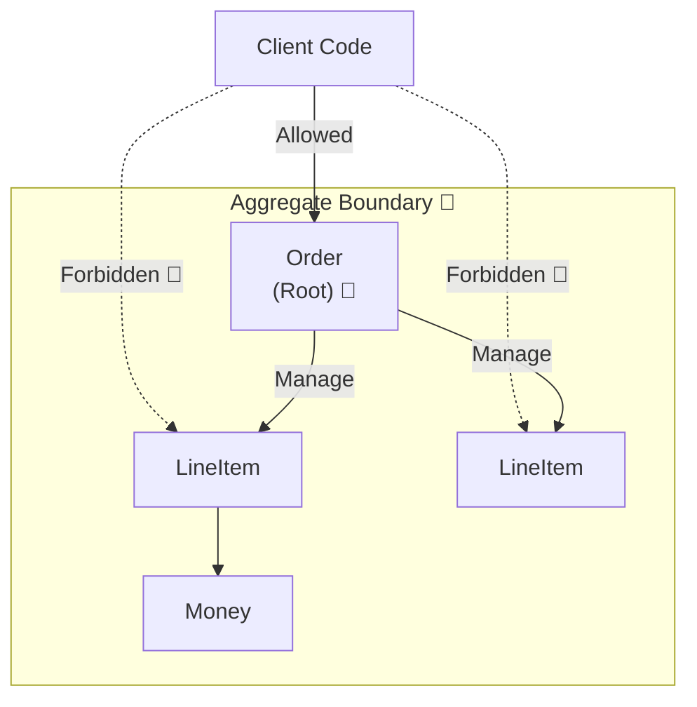
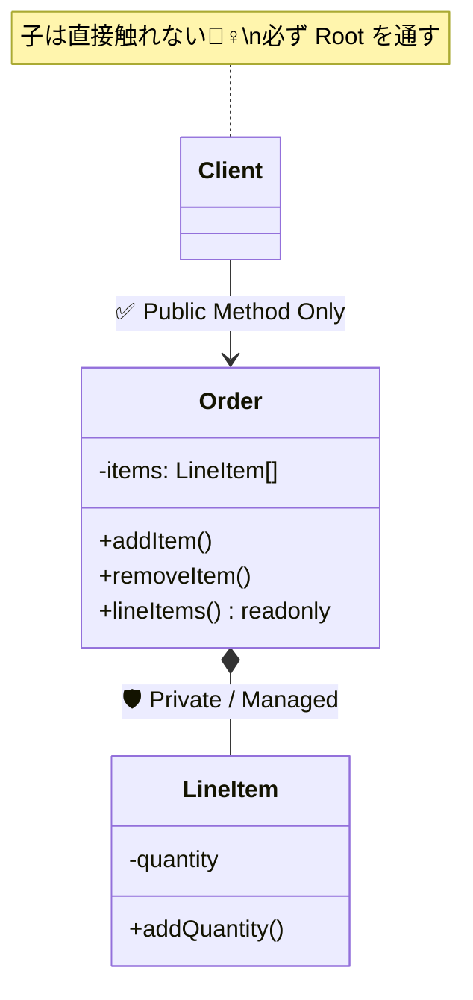

# 第14章：Aggregateの入口（更新ルートを1つに絞る）🚪👑

この章のゴールはこれっ👇
**「子（LineItemとか）をいじるときは、必ず“親（Aggregate Root）”を通す」**って体にしみ込ませることです☺️🧠💕

---

## 0) まず“Aggregate”って何者？📦✨

Aggregate（集約）はひとことで言うと…

> **「この範囲の中は、いまこの瞬間もルールが正しい（整合してる）って約束する境界」**🎀

そして、その境界の代表が **Aggregate Root（集約ルート）** だよ👑

* 集約の中には **Entity が複数いてOK**
* でも **外から触っていいのは Root だけ**🙅‍♀️
* 参照・検索も基本は **Root のID** で行うよ🔍🪪 ([Microsoft Learn][1])

---

## 1) なぜ「更新ルート1本化」が必要なの？🚑💥

### ありがちな事故😇💦

「Order の中の LineItem を、外側のコードが直接いじれる」状態だと…

* LineItem を消したのに合計金額が更新されない💸
* 数量が 0 や -3 になってしまう😱
* 「支払い済みなのに、商品が追加できちゃった」みたいな状態が起きる🌀

つまり…
**ルール（不変条件）が“あちこち”で破られる**のが一番こわい😵‍💫

---

## 2) この章のキーワード3つだけ覚えよ💡🧸

### ✅(1) 整合性境界（Consistency Boundary）🧱

* **集約の中だけは**、更新が終わった時点で必ずルールが成立してる状態にする🎯 ([Microsoft Learn][1])

### ✅(2) Root 経由のみ更新（Only through Root）🚪

* 子Entity/VOを外から直で触らせない🙅‍♀️
* **Rootのメソッド**で更新する✨

### ✅(3) RepositoryはRootに1つ（子に作らない）📚

* DB都合で「LineItemRepository」とか作り始めると、境界が崩れやすい💥
* **集約ルート単位で永続化**が基本だよ🧼 ([Microsoft Learn][2])

---

## 3) 図でイメージ掴も〜🖼️✨


### 🙅‍♀️ダメな構造（外から子を直接触れる）

* Order を取ってきた
* items 配列をそのまま触れる
* ルールが Order の外に漏れる💧



### 🙆‍♀️いい構造（Rootが入口🚪）

```
UI/Service ──▶ order.addItem(...)
            └▶ order.changeQuantity(...)
                 ↑ここで全部ルールチェック✅
```




---

## 4) “やりたいルール”を先に決めよう🧾✨（ここ超大事！）

今回は Order を例に、こんなルールにするね☺️🍰

* ルールA：**同じ商品は1行にまとめる（重複行を作らない）**🧺
* ルールB：**数量は 1〜99**🔢
* ルールC：**支払い済み（Paid）なら明細を変更できない**💳🚫
* ルールD：**明細が0件なら Submit できない**📭🚫

この「A〜D」を守る責任者が、**Order（Aggregate Root）**だよ👑✨

---

## 5) 実装してみよ〜（TypeScript）🛠️💖

### ポイント🌟

* `items` は **private** にして外からいじれないようにする🔒
* 外に出すときは **読み取り専用**（コピー）にする🧊
* 更新は `addItem/changeQuantity/removeItem` みたいに **Orderのメソッド**だけに集約する🚪

```ts
// ちょい簡略版（学習用）💡
// 実務では Result 型や DomainError などに発展させていくと強いよ✨

type OrderStatus = "Draft" | "Submitted" | "Paid" | "Cancelled";

class Quantity {
  private constructor(public readonly value: number) {}

  static create(n: number): Quantity {
    if (!Number.isInteger(n)) throw new Error("数量は整数だよ🥺");
    if (n < 1 || n > 99) throw new Error("数量は1〜99だよ🥺");
    return new Quantity(n);
  }

  add(other: Quantity): Quantity {
    return Quantity.create(this.value + other.value);
  }
}

class ProductId {
  private constructor(public readonly value: string) {}
  static create(v: string): ProductId {
    if (v.trim().length === 0) throw new Error("ProductIdが空だよ🥺");
    return new ProductId(v);
  }
}

class LineItem {
  private constructor(
    public readonly productId: ProductId,
    public readonly quantity: Quantity
  ) {}

  static create(productId: ProductId, quantity: Quantity): LineItem {
    return new LineItem(productId, quantity);
  }

  changeQuantity(quantity: Quantity): LineItem {
    return new LineItem(this.productId, quantity);
  }

  addQuantity(delta: Quantity): LineItem {
    return new LineItem(this.productId, this.quantity.add(delta));
  }
}

class Order {
  private status: OrderStatus = "Draft";
  private items: LineItem[] = [];

  constructor(public readonly id: string) {}

  // 外には「読めるだけ」を渡す（コピー）🧊
  get lineItems(): readonly LineItem[] {
    return [...this.items];
  }

  private ensureEditable(): void {
    if (this.status === "Paid") throw new Error("支払い済みは変更できないよ💳🚫");
    if (this.status === "Cancelled") throw new Error("キャンセル済みは変更できないよ🙅‍♀️");
  }

  addItem(productId: ProductId, quantity: Quantity): void {
    this.ensureEditable();

    const idx = this.items.findIndex(x => x.productId.value === productId.value);

    // ルールA：同じ商品はまとめる🧺
    if (idx >= 0) {
      const merged = this.items[idx].addQuantity(quantity); // Quantity側で上限も守る✅
      this.items[idx] = merged;
      return;
    }

    this.items.push(LineItem.create(productId, quantity));
  }

  changeQuantity(productId: ProductId, quantity: Quantity): void {
    this.ensureEditable();

    const idx = this.items.findIndex(x => x.productId.value === productId.value);
    if (idx < 0) throw new Error("その商品は入ってないよ🥺");

    this.items[idx] = this.items[idx].changeQuantity(quantity);
  }

  removeItem(productId: ProductId): void {
    this.ensureEditable();
    this.items = this.items.filter(x => x.productId.value !== productId.value);
  }

  submit(): void {
    if (this.status !== "Draft") throw new Error("Draftのときだけ送信できるよ📮");
    if (this.items.length === 0) throw new Error("明細0件は送信できないよ📭🚫"); // ルールD
    this.status = "Submitted";
  }

  markPaid(): void {
    if (this.status !== "Submitted") throw new Error("Submittedのときだけ支払いにできるよ💳");
    this.status = "Paid";
  }
}
```

✅これで、**LineItem をどういじっても Order の入口でルールが守られる**ようになるよ〜！🥳🎉

---

## 6) 「RepositoryはRootに1個」の感覚もつかも🧠📚

DDDの定番ルールとして、**集約の整合性を保つために**

* **RepositoryはAggregate Rootごとに1つ**
* 子テーブルごとにRepositoryを乱立させない
  …が推奨されるよ🧼✨ ([Microsoft Learn][2])

（この“永続化”の話は後半章で本格的にやるけど、ここで感覚だけ先取りね😉）

---

## 7) 演習（ハンズオン）🧪✨

### 演習1：ダメ設計を直してね🙅‍♀️➡️🙆‍♀️

次の状態を想像してみて👇

* `order.items` が public で触れる
* 外側のコードが `push/splice` しまくる

✅やること

* `items` を private に
* 読み取り用 `get lineItems()` を追加
* 更新は `addItem/changeQuantity/removeItem` に寄せる

🎯チェック

* 外側から `order.items.push` ができないこと
* ルールA〜Dが Order の中だけで守れてること

---

### 演習2：新ルール追加してみよ🍓

ルールE：**LineItemは最大20件まで**（サークル会計でもありがち！）🎒

✅ヒント

* `addItem` の中で `this.items.length` をチェック
* ただし「同じ商品はまとめる」なら、件数は増えないよね？😏🧺

---

### 演習3：テストを書こう🧪💪

最低これだけ書けたら勝ち🎉

* 同じ商品を2回 addItem → 行が1行のまま、数量が合算される✅
* Paid にした後 addItem → エラーになる✅
* items 0件で submit → エラーになる✅

---

## 8) 小テスト（5問）📘🎀

### Q1️⃣ Aggregate Root の役割で一番近いのは？

A. DTOを作る
B. 集約内の整合性を守る代表
C. DBのテーブルを表す
D. 画面の表示を担当する

### Q2️⃣ 直接触っていいのは？

A. 子Entity（LineItem）
B. VO（Quantity）
C. Root（Order）
D. どれでもOK

### Q3️⃣ 「Paid のあと変更禁止」みたいなルールはどこに置く？

A. UI
B. Root のメソッド入口
C. DBトリガ
D. どこでも同じ

### Q4️⃣ 「同じ商品は1行にまとめる」はどこで保証する？

A. Root（Order）の addItem
B. Controller
C. Repository
D. Logger

### Q5️⃣ Repositoryは基本どの単位？

A. テーブルごと
B. 子Entityごと
C. Aggregate Rootごと
D. 画面ごと

---

### ✅答え

Q1=B / Q2=C / Q3=B / Q4=A / Q5=C 🎉
（Rootが“入口”になるのが最大のポイントだよ〜🚪👑）

---

## 9) AIプロンプト集（Copilot/Codex向け）🤖✨

そのまま投げてOKだよ〜🫶

* 「OrderをAggregate Rootとして、LineItemを外から変更できない設計にして。TypeScriptで」
* 「このOrderの不変条件（Paid後変更禁止、明細0件Submit禁止、数量範囲）を満たすテストケースを列挙して」
* 「“参照漏れ（reference leak）”が起きそうな箇所を指摘して、直し方を提案して」
* 「addItemで“同一商品はマージ”する実装を、読みやすくリファクタして」
* 「このドメインルールを増やしたい：最大20件、合計金額の下限、状態遷移。拡張しやすい形にして」

---

## 10) まとめ🌈✨

この章で一番大事なのはこれっ👇😍

* **集約の中の更新は、必ずRootから！**🚪👑
* Rootが **整合性（不変条件）を守る門番**になる🛡️
* 永続化も基本は **Root単位**で考える📚 ([Microsoft Learn][2])

ちなみに、2026-01-22時点の TypeScript は GitHub releases 上で 5.9.2 が確認できるよ（最新側の改善も入りつつ、基本の書き味は安定してる感じ！）🧡 ([GitHub][3])

---

次の第15章では、この流れをさらに強化して
**「不変条件は“入口”で守ると最強」**🛡️🚪✨
を、もっと気持ちよく仕上げていくよ〜☺️🎀

[1]: https://learn.microsoft.com/en-us/azure/architecture/microservices/model/tactical-ddd?utm_source=chatgpt.com "Using tactical DDD to design microservices"
[2]: https://learn.microsoft.com/en-us/dotnet/architecture/microservices/microservice-ddd-cqrs-patterns/infrastructure-persistence-layer-design?utm_source=chatgpt.com "Designing the infrastructure persistence layer - .NET"
[3]: https://github.com/microsoft/typescript/releases "Releases · microsoft/TypeScript · GitHub"
