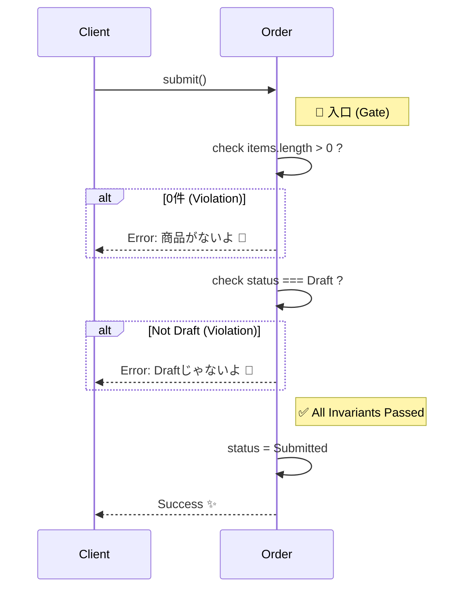

# 第15章：不変条件を“入口”で守る（作れない状態を作らない）🛡️🚪

まず、**本日時点のTypeScript周辺の最新メモ**だけサクッと📌

* **TypeScriptの最新安定版ラインは 5.9 系（5.9.3 が “Latest” 表示）**になっています（2025/10/1）。 ([GitHub][1])
* そして **TypeScript 6.0 / 7.0（Goでのネイティブ化）**は進捗が公開されていて、6.0は「5.9→7.0の橋渡し」になる方針が書かれています。 ([Microsoft for Developers][2])
  この章のコードは、**今いちばん現実的に使われてる 5.9 系**で素直に書くね😊✨

---

## この章でできるようになること 🎯💖

* 「**いつでも守られてないと困るルール**（不変条件 / Invariants）」を言語化できる🧠✨
* そのルールを **“入口”＝生成・更新メソッド**に集めて、コードが散らからないようにできる🧹🚪
* 「無効な状態」を **そもそも作れない**ようにして、バグを減らせる🛡️✨

---

## まずイメージ：不変条件ってなに？🧸💭


**不変条件（Invariant）**は、ざっくり言うと👇

> 「このオブジェクトは、いつ見ても *これだけは必ず成立しててほしい* ルール」✨

例（Orderでよくあるやつ）🛒

* 注文は **商品が1つ以上**ないと “提出（submit）” できない🙅‍♀️
* “支払い済み（Paid）” の注文は **キャンセルできない**🙅‍♀️
* 金額は **マイナス禁止**💰🚫（Money VOが守る）

こういうのを「画面側でチェック」だけに頼ると…
**どこか1か所抜けた瞬間に壊れる**の🥲💥

---

## 今日の主役：入口で守る、ってどういうこと？🚪🛡️


ポイントはコレ👇✨

### ✅ 入口＝「生成」と「更新メソッド」

* **生成**：`Order.create(...)` みたいなファクトリ
* **更新**：`order.submit()` / `order.pay(...)` みたいなドメイン操作

ここで不変条件を守れたら、**中（内部ロジック）は安心して信じていい**💖
👉 だから内部に `if (x==null) ...` が増殖しにくい🧹✨

DDDでも「集約の不変条件はルートが責任を持って守る」って考え方が書かれてるよ📘 ([Domain Language][3])

---

## ありがち事故パターン（先に潰すよ）💥😵‍💫

### ❌ パターンA：どこでもチェックしてて散らかる


* 画面でもチェック
* APIでもチェック
* サービスでもチェック
* Entity内部でもチェック
  → **漏れ or 二重チェック地獄**🥲🌀

### ❌ パターンB：public field で直接書き換えできちゃう

`order.status = "Paid"` みたいなのができると、**不変条件が一瞬で崩壊**😇

---

## 入口で守るための「型」🧩✨（設計の型だよ！）

### 1) コンストラクタは隠す（むやみに new させない）🚪🙅‍♀️


* `constructor` を `private` にして
* `static create()` だけを入口にする

### 2) 更新は「意図があるメソッド」だけにする 🪄

* `setStatus()` じゃなくて
* `submit()` / `pay()` / `cancel()` みたいに **動詞で表す**✨

### 3) “ガチで隠したい値”は `#private` も使える🔒✨

JavaScriptの `#` private は、**言語として外から触れない**のが強い💪
（TypeScriptでも普通に使えるよ） ([MDN Web Docs][4])

---

# ハンズオン：Orderで「入口に不変条件を集める」🛒🛡️✨

## 0) 今日の不変条件（この章で守るルール）📋🖊️


Order（集約ルート）で、まずはこの3つでいくね😊

1. `submit()` は **LineItem が1つ以上**必要
2. `pay()` は **Submitted のときだけ**可能
3. `cancel()` は **Paid のときは不可**

---

## 1) 最小のVOたち（雑にしない版）💎✨

> ここでは章の主役が「入口」なので、VOは最小限にしてるよ🙂
> （Email/Money/Period を既に作ってる前提なら差し替えてOK！）

```ts
// domain/errors.ts
export class DomainError extends Error {
  constructor(message: string) {
    super(message);
    this.name = "DomainError";
  }
}
```

```ts
// domain/money.ts
import { DomainError } from "./errors";

export class Money {
  private constructor(private readonly amount: number) {}

  static of(amount: number): Money {
    if (!Number.isFinite(amount)) throw new DomainError("金額が不正だよ💰😵");
    if (amount < 0) throw new DomainError("金額はマイナスにできないよ💰🚫");
    return new Money(amount);
  }

  add(other: Money): Money {
    return Money.of(this.amount + other.amount);
  }

  multiply(n: number): Money {
    if (!Number.isInteger(n) || n <= 0) throw new DomainError("個数は1以上の整数だよ📦🔢");
    return Money.of(this.amount * n);
  }

  toNumber(): number {
    return this.amount;
  }
}
```

```ts
// domain/lineItem.ts
import { DomainError } from "./errors";
import { Money } from "./money";

export class LineItem {
  private constructor(
    private readonly productId: string,
    private readonly unitPrice: Money,
    private readonly quantity: number,
  ) {}

  static create(productId: string, unitPrice: Money, quantity: number): LineItem {
    if (!productId.trim()) throw new DomainError("productId が空だよ😵");
    if (!Number.isInteger(quantity) || quantity <= 0) throw new DomainError("数量は1以上だよ📦");
    return new LineItem(productId, unitPrice, quantity);
  }

  subtotal(): Money {
    return this.unitPrice.multiply(this.quantity);
  }

  getProductId(): string {
    return this.productId;
  }
}
```

---

## 2) 主役：Order（入口に不変条件を集約する）🪪🚪🛡️


```ts
// domain/order.ts
import { DomainError } from "./errors";
import { LineItem } from "./lineItem";
import { Money } from "./money";

export type OrderStatus = "Draft" | "Submitted" | "Paid" | "Cancelled";

export class Order {
  // ✅ 外から勝手に触れないように、ガチめに隠す（JSレベルprivate）🔒
  // `private` 修飾子より強く「触れない」を保証しやすいよ✨ :contentReference[oaicite:4]{index=4}
  #id: string;
  #status: OrderStatus;
  #items: LineItem[];

  private constructor(id: string, status: OrderStatus, items: LineItem[]) {
    this.#id = id;
    this.#status = status;
    this.#items = items;
  }

  // ✅ 入口①：生成（create）で “作れない状態を作らない”
  static create(id: string): Order {
    if (!id.trim()) throw new DomainError("注文IDが空だよ😵");
    return new Order(id, "Draft", []);
  }

  // ✅ 入口②：更新（ドメイン操作）で不変条件を守る

  addItem(item: LineItem): void {
    if (this.#status !== "Draft") {
      throw new DomainError("Draftのときだけ商品追加できるよ🛒✋");
    }
    // productIdの重複禁止ルール…など、ここで守ってもOK✨
    const exists = this.#items.some(x => x.getProductId() === item.getProductId());
    if (exists) throw new DomainError("同じ商品は重複追加できないよ😵‍💫（ルールならここ！）");
    this.#items = [...this.#items, item];
  }

  submit(): void {
    // ✅ 不変条件：アイテム0件では提出できない
    if (this.#items.length === 0) {
      throw new DomainError("商品が1つもない注文は提出できないよ🛒🚫");
    }
    if (this.#status !== "Draft") {
      throw new DomainError("Draftの注文だけ提出できるよ📮✋");
    }
    this.#status = "Submitted";
  }

  pay(paidAmount: Money): void {
    // ✅ 不変条件：Submitted のときだけ支払いできる
    if (this.#status !== "Submitted") {
      throw new DomainError("支払いは提出後（Submitted）だけできるよ💳✋");
    }

    const total = this.total();
    if (paidAmount.toNumber() !== total.toNumber()) {
      throw new DomainError("支払い金額が合ってないよ💰😵（合計と一致がルール）");
    }

    this.#status = "Paid";
  }

  cancel(): void {
    // ✅ 不変条件：Paid ならキャンセル不可
    if (this.#status === "Paid") {
      throw new DomainError("支払い済みはキャンセルできないよ🙅‍♀️💥");
    }
    if (this.#status === "Cancelled") {
      throw new DomainError("すでにキャンセル済みだよ🙂");
    }
    this.#status = "Cancelled";
  }

  // ✅ 合計金額は “導出値” にして、ズレ事故を防ぐ（おすすめ）✨
  total(): Money {
    return this.#items.reduce((acc, item) => acc.add(item.subtotal()), Money.of(0));
  }

  // ✅ 外へは “必要な情報だけ” 出す（参照用）
  getStatus(): OrderStatus {
    return this.#status;
  }

  getId(): string {
    return this.#id;
  }

  getItemsCount(): number {
    return this.#items.length;
  }
}
```

### ここが大事ポイントだよ～！💖


* **チェックが `create/submit/pay/cancel` に集まってる**✨
* だから内部は「正しい前提」で書けて、コードがスッキリ🧹
* `total` を保存しないで **毎回計算**すると、整合性が壊れにくい💪




---

## 3) テストで「不変条件が守られてる」を確認する🧪✨（Vitest）


Vitestは「Vite前提の高速テスト」だけど、Vite無しでも普通に使えるよ🧪 ([Vitest][5])

```ts
// domain/order.test.ts
import { describe, it, expect } from "vitest";
import { Order } from "./order";
import { LineItem } from "./lineItem";
import { Money } from "./money";
import { DomainError } from "./errors";

describe("Order invariants 🛡️", () => {
  it("商品なしでは submit できない 🛒🚫", () => {
    const order = Order.create("order-1");
    expect(() => order.submit()).toThrow(DomainError);
  });

  it("Draftでだけ addItem できる 🛒✅", () => {
    const order = Order.create("order-1");
    order.addItem(LineItem.create("p1", Money.of(100), 2));
    order.submit();
    expect(() => order.addItem(LineItem.create("p2", Money.of(100), 1))).toThrow(DomainError);
  });

  it("Submittedでだけ pay できる 💳✅", () => {
    const order = Order.create("order-1");
    order.addItem(LineItem.create("p1", Money.of(100), 2));
    expect(() => order.pay(Money.of(200))).toThrow(DomainError); // submit前はダメ
  });

  it("支払い金額が合わないと pay できない 💰😵", () => {
    const order = Order.create("order-1");
    order.addItem(LineItem.create("p1", Money.of(100), 2));
    order.submit();
    expect(() => order.pay(Money.of(999))).toThrow(DomainError);
  });

  it("Paid は cancel できない 🙅‍♀️💥", () => {
    const order = Order.create("order-1");
    order.addItem(LineItem.create("p1", Money.of(100), 2));
    order.submit();
    order.pay(Money.of(200));
    expect(() => order.cancel()).toThrow(DomainError);
  });
});
```

---

# まとめ：この章の“合言葉”🧠💖

## ✅ 不変条件は「入口」に集める！🚪🛡️

* **作るとき（create）**に守る
* **変えるとき（メソッド）**に守る
* そうすると、**内部が安心**＆**散らからない**✨

DDDでも「不変条件は（特に集約ルートが）責任を持って守る」って整理がされてるよ📘 ([Domain Language][3])

---

# 演習（やってみよ〜！）🎒✨

## 演習1：不変条件を1個追加してみよ🧩

次のどれかを追加してみて😊（おすすめ順✨）

1. LineItem は **最大20個まで**🛒
2. quantity は **1〜99**まで📦
3. 同じ productId は **追加不可**（もう入ってたら数量変更にする）🔁

👉 追加したら **テストも1本増やす**🧪💖（ここが勝ち筋！）

## 演習2：「導出値」を増やして事故を減らす💡

* `total()` は導出値OKだったね✨
  じゃあ **「itemsCount」** も `#items.length` からだけにして、
  「別変数で持たない」を徹底してみよ🧹

---

# 小テスト（3分）⏱️💗

1. 不変条件チェックを “あちこち” に散らすと何が起きやすい？😵‍💫
   A. パフォーマンスが上がる　B. 漏れと二重チェックが増える　C. 型が強くなる

2. `Order.submit()` は何のためにある？📮
   A. どこでも状態を書き換えるため
   B. 「提出する」という意図の入口を1か所にするため
   C. テストを減らすため

3. `#private`（JS private）の嬉しさは？🔒
   A. 実行時も外から触りにくい
   B. 速くなる
   C. exportしなくてよくなる

（答え：1=B, 2=B, 3=A 💮）

---

# AIプロンプト集（Copilot/Codex向け）🤖💞

そのまま貼ってOKだよ〜！

* 「この `Order` に追加できそうな不変条件を10個、業務っぽい例で出して」🧠
* 「不変条件を `create/submit/pay/cancel` に集めたまま、仕様：‘最大20件’ を追加したい。差分コード案ちょうだい」🧩
* 「このテスト足りない観点ある？境界値テスト観点で追加案だけ列挙して」🧪
* 「`DomainError` のメッセージをユーザー向けに優しくしたい。言い換え案を20個」💬✨

---

次の第16章は「状態遷移（State Machine）」だよ🚦🔄
今日の `status` が、もっと**見通しよく**なるから楽しみにしててね〜！💖😊

[1]: https://github.com/microsoft/typescript/releases "Releases · microsoft/TypeScript · GitHub"
[2]: https://devblogs.microsoft.com/typescript/progress-on-typescript-7-december-2025/?utm_source=chatgpt.com "Progress on TypeScript 7 - December 2025"
[3]: https://www.domainlanguage.com/wp-content/uploads/2016/05/DDD_Reference_2015-03.pdf "Microsoft Word - pdf version of final doc - Mar 2015.docx"
[4]: https://developer.mozilla.org/en-US/docs/Web/JavaScript/Reference/Classes/Private_elements?utm_source=chatgpt.com "Private elements - JavaScript - MDN Web Docs"
[5]: https://vitest.dev/?utm_source=chatgpt.com "Vitest | Next Generation testing framework"
