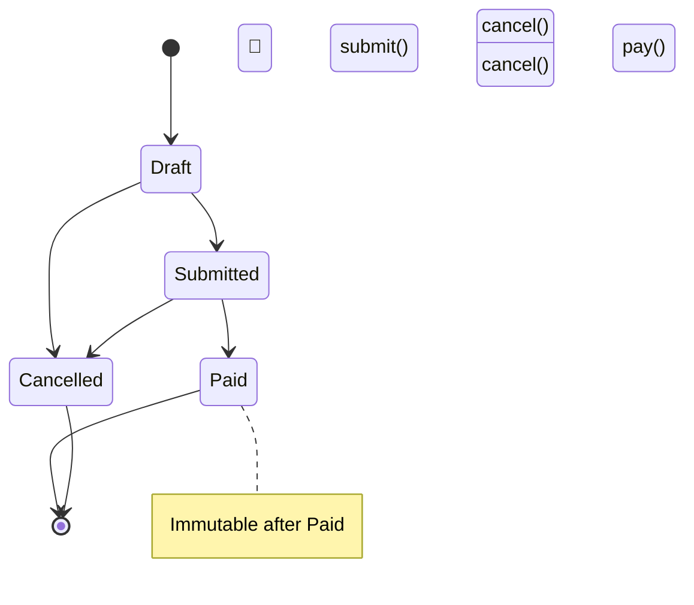
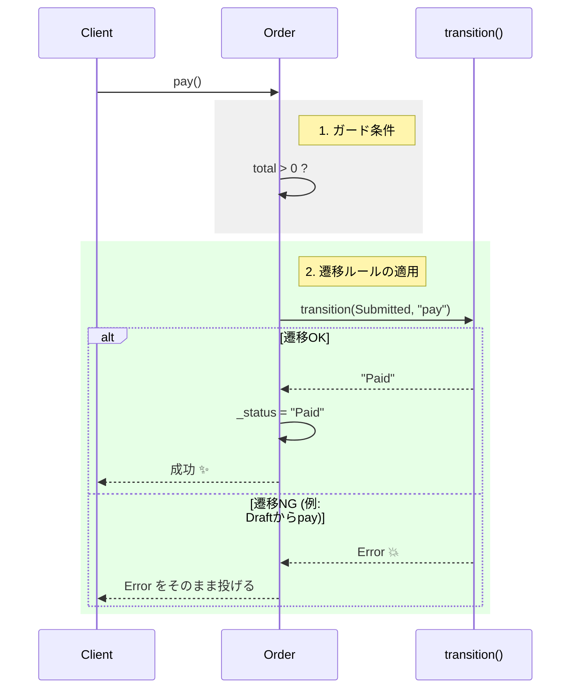

# 第16章：状態遷移（超入門のState Machine）🚦🔄

この章は「Entityの状態が増えると、バグも一緒に増える😭」を止める章だよ〜！
**状態（State）**と**遷移（Transition）**を整理すると、**「できない操作」をコードで禁止できて**めちゃ安心になる✨🛡️

---

## 0. まず“最新事情”をサクッと（2026/01/22 時点）🗓️✨

* TypeScriptの最新版は **5.9**（npmで入る最新）だよ〜📦✨ ([TypeScript][1])
* TypeScript **6.0 / 7.0** は「早期2026」狙いで、7.0はコンパイラのネイティブ化（Go移植）で超高速化が話題！🚀 ([Microsoft for Developers][2])
* Nodeは **v24 が Active LTS**、v25 は Current（最新系）って感じ！安定重視なら v24 が無難👍 ([Node.js][3])
* テストは **Vitest 4** が現役の主流ラインだよ🧪✨ ([Vitest][4])

この章のコードは TypeScript 5.9 前提で「いま普通に使える書き方」でいくね😊💕

---

## 1. State Machineってなに？🧠🚦


めっちゃ簡単に言うとこう👇

* **状態（State）**：いまのステータス（例：下書き、提出済み、支払い済み…）
* **イベント（Event）**：やりたい操作（例：提出する、支払う、キャンセルする）
* **遷移（Transition）**：状態AでイベントXしたら状態Bへ、みたいなルール
* **ガード（Guard）**：この条件のときだけOK（例：金額が0なら支払い禁止）

つまり「**いま何ができるか**」を、状態で管理する仕組みだよ〜✨

---

## 2. お題：OrderStatus を作ろう🛒✨


今回はこの超定番でいくね👇

* 状態：

  * `Draft`（下書き）📝
  * `Submitted`（提出済み）📮
  * `Paid`（支払い済み）💰
  * `Cancelled`（キャンセル）🛑

* やりたい操作（イベント）：

  * `submit`（提出）📮
  * `pay`（支払い）💳
  * `cancel`（キャンセル）🛑

---

## 3. 図で見るとこう！🗺️✨（図解イメージ）




---

## 4. 遷移表（テーブル）を作ると一気にバグ減る📋✨


状態とイベントの「許可/禁止」を表にすると、抜けが見えるよ〜👀

| 現在の状態     | submit      | pay    | cancel      |
| --------- | ----------- | ------ | ----------- |
| Draft     | ✅ Submitted | ❌      | ✅ Cancelled |
| Submitted | ❌           | ✅ Paid | ✅ Cancelled |
| Paid      | ❌           | ❌      | ❌（例）        |
| Cancelled | ❌           | ❌      | ❌           |

ここで大事なのは👇
「**表にない遷移は全部禁止**」にしちゃうこと！🚫✨
（人間は絶対に抜けるから、コードが守ってくれるのが最高👍）

---

## 5. 実装①：いちばんやさしい “遷移マップ方式” 🗺️🧸


まずは「辞書（map）」でルールを固定するやり方！初心者にやさしい💕

```ts
// status.ts
export type OrderStatus = "Draft" | "Submitted" | "Paid" | "Cancelled";
export type OrderEvent = "submit" | "pay" | "cancel";

const transitions = {
  Draft: {
    submit: "Submitted",
    cancel: "Cancelled",
  },
  Submitted: {
    pay: "Paid",
    cancel: "Cancelled",
  },
  Paid: {
    // 何も許可しない（空）
  },
  Cancelled: {
    // 何も許可しない（空）
  },
} as const satisfies Record<OrderStatus, Partial<Record<OrderEvent, OrderStatus>>>;

export class InvalidTransitionError extends Error {
  constructor(
    public readonly from: OrderStatus,
    public readonly event: OrderEvent
  ) {
    super(`Invalid transition: ${from} --(${event})-> ???`);
  }
}

export function transition(
  from: OrderStatus,
  event: OrderEvent
): OrderStatus {
  const next = transitions[from][event];
  if (!next) throw new InvalidTransitionError(from, event);
  return next;
}
```

### ここがポイント💡✨

* `transitions` に「OKな遷移」だけ書く
* それ以外は `InvalidTransitionError` で止める🛑
* `satisfies` を使うと「型的に辞書の形が崩れにくい」よ👍（TypeScriptの安心機能✨）

---

## 6. 実装②：Entity（Order）に組み込む🪪🧱


State Machineのいいところは、Entityの更新がスッキリすること✨
「状態を勝手に書き換える」を禁止して、**メソッド経由だけにする**よ〜🚪🛡️

```ts
// order.ts
import { OrderStatus, OrderEvent, transition, InvalidTransitionError } from "./status";

type Money = number; // ※本当はMoney VOが理想だよ💰✨（第9章のやつ）

export class Order {
  private _status: OrderStatus;
  private readonly _total: Money;

  constructor(total: Money) {
    this._status = "Draft";
    this._total = total;
  }

  get status(): OrderStatus {
    return this._status;
  }

  submit(): void {
    this.apply("submit");
  }

  pay(): void {
    // ガード例：0円は支払いできない（例）
    if (this._total <= 0) {
      throw new Error("Cannot pay when total is 0 or less 😢");
    }
    this.apply("pay");
  }

  cancel(): void {
    this.apply("cancel");
  }

  private apply(event: OrderEvent): void {
    try {
      this._status = transition(this._status, event);
    } catch (e) {
      if (e instanceof InvalidTransitionError) {
        // ここは“ドメインのエラー”として扱うのがコツ⚠️
        throw e;
      }
      throw e;
    }
  }
}
```

### ここが最高ポイント🌟

* 状態変更の入口が **submit/pay/cancel の3つだけ**になる🚪✨
* 「ありえない状態」へ行く道が塞がれて、事故が減る🚑💨




---

## 7. テスト（遷移テスト）を書こう🧪✨


State Machineはテストが超書きやすい！
表（遷移表）をそのままテストにできるよ〜😊💕

```ts
// status.test.ts
import { describe, it, expect } from "vitest";
import { transition, InvalidTransitionError } from "./status";

describe("OrderStatus transitions 🚦", () => {
  it("Draft --submit--> Submitted", () => {
    expect(transition("Draft", "submit")).toBe("Submitted");
  });

  it("Submitted --pay--> Paid", () => {
    expect(transition("Submitted", "pay")).toBe("Paid");
  });

  it("Draft --pay--> throws", () => {
    expect(() => transition("Draft", "pay")).toThrow(InvalidTransitionError);
  });

  it("Cancelled --submit--> throws", () => {
    expect(() => transition("Cancelled", "submit")).toThrow(InvalidTransitionError);
  });
});
```

Vitest 4 系が現役ラインだよ〜🧪✨ ([Vitest][4])

---

## 8. よくあるバグあるある🥺👉 こう防ぐ！


### 😭あるある1：状態が増えたのに、遷移が更新されてない

✅対策：**遷移表（map）を唯一の正**にする📋✨
→ if文を散らすと、更新漏れが起きやすいよ〜

### 😭あるある2：直接 status を書き換えちゃう

✅対策：`private _status` ＋ メソッド経由のみ🚪🛡️

### 😭あるある3：支払い後にキャンセルできちゃった

✅対策：**“禁止”をデフォルトにする**🚫✨
→ mapに書いてない遷移は全部NGにする！

---

## 9. ミニ演習（手を動かそう）✍️💕

### 演習A：状態を1個増やしてみよ🎮✨

`Refunded`（返金済み）を追加してみて👇

* `Paid --refund--> Refunded` を許可
* `Refunded` からは何もできない

💡ヒント：`OrderStatus` と `OrderEvent` と `transitions` を更新するだけ！

### 演習B：ガード条件を増やしてみよ🛡️

* `Submitted` から `cancel` は「発送前だけOK」みたいにしたい📦
  → `Order` に `isShipped` 的なフラグがある前提で、`cancel()` にガードを追加してみてね！

---

## 10. 小テスト（やさしめ）🎓🍬

**Q1.** State Machineで一番おいしい効果はどれ？😋
A. 状態が増えるほど、バグが増える
B. 「できない操作」をコードで禁止できる
C. どこでもif文が書ける

**Q2.** 「表にない遷移」はどうするのが安全？🔒
A. なんとなく許可
B. ログだけ出して通す
C. 全部禁止してエラーにする

<details>
<summary>答えを見る👀✨</summary>

* Q1：**B** ✅
* Q2：**C** ✅

</details>

---

## 11. AIプロンプト集（この章用）🤖💖

* 「OrderStatusの遷移表を作って。抜けや矛盾も指摘して」📋🔍
* 「この状態遷移で“禁止すべき遷移”を洗い出して」🚫
* 「遷移表からVitestのテストケースを自動生成して」🧪
* 「状態が増えたときに破綻しない設計（map方式/型の工夫）を提案して」🧠✨
* 「ガード条件の例を10個（EC注文っぽい例）出して」🛒📦

---

## まとめ💐✨

この章でできるようになったこと👇

* Entityの状態を **“勝手に変えられない”** 形にできる🚪🛡️
* 遷移表で **抜け漏れを見える化**できる📋👀
* 「ありえない操作」は **コードで止める**🚫✨
* テストが **表から作れて気持ちいい**🧪💕

---

次は第17章（境界DTO→ドメイン＆エラー）に進む流れだけど、
その前に「第16章の演習A（Refunded追加）」の**完成例コード**もここで作っちゃう？😊✨

[1]: https://www.typescriptlang.org/download/?utm_source=chatgpt.com "How to set up TypeScript"
[2]: https://devblogs.microsoft.com/typescript/progress-on-typescript-7-december-2025/?utm_source=chatgpt.com "Progress on TypeScript 7 - December 2025"
[3]: https://nodejs.org/en/about/previous-releases?utm_source=chatgpt.com "Node.js Releases"
[4]: https://vitest.dev/blog/vitest-4?utm_source=chatgpt.com "Vitest 4.0 is out!"
