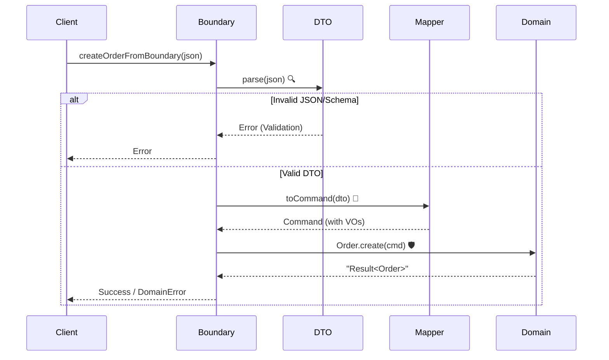

# 第17章：境界（DTO→ドメイン）とエラーの基本（Result/例外）🚪⚠️

## この章のゴール 🎯💖

* 外から来たデータ（DTO）を **安全に** ドメインへ入れられる🙂🛡️
* 失敗を **型で表現** できる（Result型）💎
* **入力ミス** と **システム障害** を分けて扱える🚦
* 「Resultにする？例外にする？」の判断ができるようになる🤔✨

---

## 0. 2026っぽい “今どき” 事情（超要点だけ）📰✨

* 近年は **DTO（外のデータ）をランタイム検証** してからドメインに入れるのが定番だよ〜📦✅
  例：Zod / Valibot など（Standard Schema で共通IF化の動きもある）🌉✨ ([Zod][1])
* Zod は **v4が安定版** になって高速化・軽量化が進んでるよ🏎️💨 ([Zod][1])
* Result型の実用ライブラリとして **neverthrow** が有名（ResultAsyncもある）🧰✨ ([GitHub][2])
* TypeScript自体も “ネイティブ化” の流れ（ビルド高速化など）が話題だけど、この章は **設計の考え方** に集中するね🧠💖 ([Microsoft Developer][3])

---

## 1. 境界（Boundary）ってなに？🚪🙂


境界は「外の世界（信用できない）」と「内の世界（安全）」の **関所** だよ〜🏯✨

```text
外（フォーム/HTTP/JSON/CLI）  ← 何が来るかわからない😵‍💫
   ↓ input: unknown
DTO（string/number/null/optionalだらけ） ← まだ危険⚠️
   ↓ ランタイム検証 + 変換
ドメイン入力（VO/Entityで型が強い） ← 安全✨
   ↓
ドメイン（業務ルールの中心）💎
```

### ✅ なぜ DTO をそのままドメインに入れちゃダメ？

* TypeScriptの型は **実行時に消える** 😭（つまり `as` は嘘つけちゃう）
* 外から来る値はこうなりがち👇

  * `"1000"`（文字列）なのに金額として扱いたい
  * `null` や `undefined` が混じる
  * 欠けてる / 余計な項目がある
  * 形式はOKでも意味がNG（数量0、終了日が開始日より前…）

---

## 2. エラーは2種類に分けると楽ちん🧠✨

ここ、めちゃ大事〜！🌟

### (A) ドメインエラー（入力ミス・業務ルール違反）🧾🚫

例：

* Email形式が変
* items が空
* 数量が1以上じゃない
* 状態遷移できない（PaidなのにCancelしようとした）

👉 **ユーザーに返してOK** な失敗🙂

### (B) システムエラー（障害・例外的な失敗）🖥️💥

例：

* DB接続が落ちた
* 外部APIがタイムアウト
* ファイルが壊れてる

👉 **ユーザー入力のせいじゃない** 失敗😢

---

## 3. Result型と例外、どっち使う？🤔⚖️


### ✅ ざっくり結論

* **入力ミス / ルール違反** → Result型が相性よい💎
* **本当に想定外 / 復旧不能** → 例外（throw）でもOK⚠️

### Result型が人気な理由✨

* 「失敗するかも」を **型に刻める**（呼び出し側が忘れにくい）🙂
* 失敗パターンを **discriminated union**（判別可能なunion）で整理できる🎯 ([TypeScript][4])
* `if (result.ok)` みたいに分岐すると、TSが型を絞ってくれる（narrowing）🧠✨ ([TypeScript][5])
* neverthrow みたいな実用ライブラリもある🧰 ([GitHub][2])

---

## 4. 実装してみよう！：DTO → ドメイン変換 🚀💖

### 今回の題材（例）🛒✨

「注文を作る」：`CreateOrderRequest DTO` を受け取って `Order` を作るよ〜😊

---

### 4-1. Result型（最小実装）💎

```ts
export type Result<T, E> = Ok<T> | Err<E>;

export type Ok<T> = { ok: true; value: T };
export type Err<E> = { ok: false; error: E };

export const ok = <T>(value: T): Ok<T> => ({ ok: true, value });
export const err = <E>(error: E): Err<E> => ({ ok: false, error });
```

---

### 4-2. エラー型（ドメインエラーは “型で分類” しよう）🧯✨

```ts
export type DomainError =
  | { kind: "Validation"; field: string; message: string }
  | { kind: "Rule"; code: "EmptyItems" | "InvalidState"; message: string };
```

💡ポイント：`kind` があると **判別union** になって扱いやすいよ〜🎀 ([TypeScript][4])

---

### 4-3. DTOのランタイム検証（Zod例）✅📦

Zod v4 は安定版＆軽量化・高速化の流れがあるので、境界で使いやすいよ〜🏎️💨 ([Zod][1])

```ts
import * as z from "zod";
import { Result, ok, err } from "./result";
import { DomainError } from "./errors";

const CreateOrderRequestSchema = z.object({
  customerId: z.string().min(1),
  email: z.string().email(),
  items: z.array(z.object({
    productId: z.string().min(1),
    unitPrice: z.number().nonnegative(),
    quantity: z.number().int().positive(),
  })).min(1),
});

export type CreateOrderRequestDto = z.infer<typeof CreateOrderRequestSchema>;

export function parseCreateOrderRequest(input: unknown): Result<CreateOrderRequestDto, DomainError[]> {
  const r = CreateOrderRequestSchema.safeParse(input);
  if (r.success) return ok(r.data);

  const errors: DomainError[] = r.error.issues.map((i) => ({
    kind: "Validation",
    field: i.path.join(".") || "(root)",
    message: i.message,
  }));
  return err(errors);
}
```

#### 🌟ちょい最新ネタ：optionalの罠を減らす

Zod v4 には `exactOptional()` みたいな “optionalの厳密化” もあるよ（`undefined` を明示で渡すのを嫌う時に便利）🧷✨ ([GitHub][6])

---

### 4-4. DTO → ドメイン（VOへ変換して安全にする）💎🔁

ここがこの章の本体だよ〜！💖

（前の章までで作った想定のVO：`Email`, `Money` があるとして進めるね🙂）

```ts
import { Result, ok, err } from "./result";
import { DomainError } from "./errors";
import { CreateOrderRequestDto } from "./dto";

// 例：前章までで作ってる想定
import { Email } from "../domain/valueObjects/Email";
import { Money } from "../domain/valueObjects/Money";

export type CreateOrderCommand = {
  customerId: string;
  email: Email;
  items: Array<{
    productId: string;
    unitPrice: Money;
    quantity: number;
  }>;
};

export function toCreateOrderCommand(dto: CreateOrderRequestDto): Result<CreateOrderCommand, DomainError[]> {
  const errors: DomainError[] = [];

  const emailR = Email.create(dto.email);
  if (!emailR.ok) errors.push(...emailR.error.map((m) => ({ kind: "Validation", field: "email", message: m })));

  const items: CreateOrderCommand["items"] = dto.items.map((it, idx) => {
    const priceR = Money.create(it.unitPrice);
    if (!priceR.ok) {
      errors.push(...priceR.error.map((m) => ({
        kind: "Validation",
        field: `items.${idx}.unitPrice`,
        message: m,
      })));
    }

    if (it.quantity > 99) {
      errors.push({
        kind: "Rule",
        code: "EmptyItems", // ← 本当は別codeにしてね（演習で直すよ😉）
        message: "数量は99以下にしてね🥺",
      });
    }

    return {
      productId: it.productId,
      unitPrice: priceR.ok ? priceR.value : Money.zero(), // 一旦ダミー（失敗時はどうせerrorsで弾く）
      quantity: it.quantity,
    };
  });

  if (dto.items.length === 0) {
    errors.push({ kind: "Rule", code: "EmptyItems", message: "明細が1つもないよ🥲" });
  }

  if (errors.length > 0) return err(errors);

  return ok({
    customerId: dto.customerId,
    email: emailR.value,
    items,
  });
}
```

✅コツ：

* **VO生成で失敗したら errors に積む**
* 最後にまとめて `err(errors)` で返す
* `items.0.unitPrice` みたいに **フィールドパス** を付けるとUI表示が超楽🎀✨

---

### 4-5. “境界の全部入り” フロー（Parse → Convert → Domain）🚪➡️💎

```ts
import { Result, ok, err } from "./result";
import { DomainError } from "./errors";
import { parseCreateOrderRequest } from "./dto";
import { toCreateOrderCommand } from "./mapper";

// ドメイン側（例）
import { Order } from "../domain/entities/Order";

export function createOrderFromBoundary(input: unknown): Result<Order, DomainError[]> {
  const dtoR = parseCreateOrderRequest(input);
  if (!dtoR.ok) return err(dtoR.error);

  const cmdR = toCreateOrderCommand(dtoR.value);
  if (!cmdR.ok) return err(cmdR.error);

  // Order.create が Result を返す想定（状態遷移や不変条件を守る）
  const orderR = Order.create(cmdR.value);
  if (!orderR.ok) return err(orderR.error);

  return ok(orderR.value);
}
```



---

## 5. 例外（throw）はどこで使う？⚠️🧯

おすすめはこう👇

* **境界〜ドメインは Result中心**（入力ミスが多いから）🙂
* **DB/外部APIは try/catch** になりやすい（I/Oは落ちる）🌧️

例外をcatchする時、TSでは `unknown` 扱いが基本で安全だよ🧤✨

```ts
try {
  // DB保存とか
} catch (e: unknown) {
  // e を Error と決め打ちしない🙂
  const message = e instanceof Error ? e.message : "unknown error";
  throw new Error(`system failure: ${message}`);
}
```

---

## 6. よくある事故あるある 😵‍💫💥（回避策つき）

### ❌ `as DTO` で握りつぶす

* **回避**：必ず `unknown → safeParse` ✅

### ❌ “コントローラ” に業務ルールを書く

* **回避**：ルールはVO/Entityへ💎（境界は「整形」と「分類」まで）

### ❌ 何でも例外throw（入力ミスまでthrow）

* **回避**：入力ミスはResultで返す（呼び出し側が扱いやすい）🙂

### ❌ エラーを文字列だけで返す

* **回避**：`kind` や `code` を持たせて “機械にも人にも分かる” ように🤖💖

---

## 7. 演習（やってみよ〜！）🧪🎀

### 演習1：エラーコードをちゃんと分ける🏷️✨

さっきの `quantity > 99` が変な `code` になってたよね😂

* `code: "QuantityTooLarge"` を追加して直してみよう✅

---

### 演習2：DTOに `couponCode` を追加🎫✨

* DTO：`couponCode` は **省略OK**
* ただし、入ってるなら `min(5)` くらいにしたい🙂
* Zod v4の `exactOptional()` を使うと、`couponCode: undefined` を弾けて気持ちよいかも🧷 ([GitHub][6])

---

### 演習3：エラーをUI向けに整形する💄✨

`DomainError[]` を

* `{ fieldErrors: Record<string, string[]> }`
  みたいに変換する関数を作ってみよう🙂📦

---

## 8. 小テスト（5問）✍️🎀

1. DTOをそのままドメインに入れると危ない理由を1つ言ってね⚠️
2. ドメインエラーとシステムエラー、違いは？🙂
3. Result型のメリットを1つ言ってね💎
4. `kind` を入れた union が扱いやすいのはなぜ？🎯（ヒント：narrowing） ([TypeScript][5])
5. `catch (e)` の `e` を `unknown` として扱うのが安全なのはなぜ？🧤

（答えは自分の言葉でOKだよ〜！😊）

---

## 9. AIプロンプト集（すぐ使える）🤖💖

* 「このDTOのZodスキーマ作って。境界値も意識して！」🧩
* 「DomainErrorを `kind` と `code` で設計して。UI表示も考えて！」🎨
* 「DTO→Command変換で errors を集約する実装を提案して」🧺
* 「このResult型に map / flatMap を足して使いやすくして」🔁
* 「入力ミス（400）とルール違反（409）と障害（500）の切り分け案ちょうだい」🚦

---

## まとめ 🌟😊

* 境界は **関所**：`unknown → DTO検証 → VO/Entityへ変換` 🚪➡️💎
* エラーは **入力由来** と **障害由来** を分ける🧠✨
* Result型は “失敗を型で表す” から、設計が安定しやすい🙂💖
* ランタイム検証（Zod/Valibotなど）を境界でやるのが今どき📦✅ ([Zod][1])

---

次の章（第18章：永続化とドメイン分離💾🧼）に行く前に、もしよければ…🙂🎀
この第17章のコードを「注文」じゃなくて、こみやんまさんが作ってる題材（サークル会計とか）に合わせて **DTO項目を差し替えた版** も作るよ〜？✨

[1]: https://zod.dev/v4 "Release notes | Zod"
[2]: https://github.com/supermacro/neverthrow?utm_source=chatgpt.com "supermacro/neverthrow: Type-Safe Errors for JS & TypeScript"
[3]: https://developer.microsoft.com/blog/typescript-7-native-preview-in-visual-studio-2026?utm_source=chatgpt.com "TypeScript 7 native preview in Visual Studio 2026"
[4]: https://www.typescriptlang.org/docs/handbook/unions-and-intersections.html?utm_source=chatgpt.com "Handbook - Unions and Intersection Types - TypeScript"
[5]: https://www.typescriptlang.org/docs/handbook/2/narrowing.html?utm_source=chatgpt.com "Documentation - Narrowing - TypeScript"
[6]: https://github.com/colinhacks/zod/releases "Releases · colinhacks/zod · GitHub"
