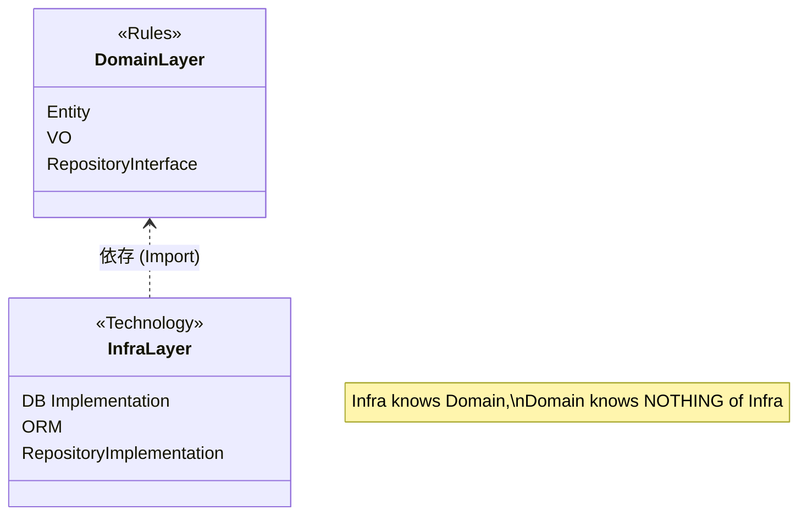

# 第18章：永続化とドメインは別物（分離の考え方）💾🧼

## この章でできるようになること 🎯💖

* 「DBに入れる形」と「業務ルールの形」が**違ってOK**って腹落ちする 🙆‍♀️✨
* ドメインを**DB都合でグニャっと歪ませない**設計のコツがわかる 🧠🛡️
* 次章（Repository）に向けて、「依存の向き」を体で理解する 🚪➡️📦

---

## まず結論：DBは“保管庫”、ドメインは“ルールの世界”🏦📘


DB（永続化）は、データを安全に保管して取り出すための都合（型・正規化・ID・JOIN・NULL・インデックス…）がいっぱい😵‍💫
でもドメイン（業務ルール）は、「支払い済みはキャンセルできない」とか「金額はマイナス禁止」みたいな**意味**が中心💡💖

だから **“同じ情報”でも、形が違って当然**なんだよ〜！😊✨

> こういう分離をちゃんとやると、ドメインがDBやORMに引きずられにくくなって、変更に強くなるよ💪🧼
> （Repository パターンはまさに「永続化の都合を外に出す」ための定番アプローチだよ） ([Microsoft Learn][1])

---

## 2026の今っぽい話（最新チェック）🔎🆕✨

* TypeScript は **5.9** が現行ラインで、次の **6.0** は “橋渡し”、その先の **7.0（Project Corsa）** はネイティブ化（高速化）が進んでるよ〜🏎️💨 ([TypeScript][2])
* 「速くなる・便利になる」ほど、**コンパイルや型の恩恵**が増えるからこそ、ドメインを綺麗に保つ価値が上がるよ✨
* ORM も進化中で、たとえば Prisma は v7 系の話題が多い（Node/TSの要求も更新されてる）よ〜🧩 ([Prisma][3])

※この章は特定ORMの使い方ではなく、「分離の考え方」を固める回だよ😊🧼

---

## よくある事故あるある 😭💥（分離しないとこうなる）

### 事故パターンA：ドメインがDBカラム名に支配される 😵


* `user_id` とか `created_at` とか **DBの命名**がそのままドメインに入り込む
* 「本当に必要な意味」が見えなくなって、ルールが散らかる🌀

### 事故パターンB：NULLがドメインに侵入して、分岐地獄 🤯


* DB都合の `NULL` がそのまま来て
  `if (x == null)` が増殖していく…🌱🌱🌱

### 事故パターンC：ORMの型がドメインを汚す 😫

* “保存のための型” をそのまま “ルールの型” に使ってしまう
* 後で永続化方式を変えたくなった時、ドメイン全体が巻き添えで大工事🛠️🔥

---

## 図解イメージ：依存の向きが命だよ！🧭✨


```text
[ 外の世界 ]  DTO / API / DB / ORM
     │
     │ 変換(翻訳)するよ
     ▼
[ ドメイン ]  Entity / ValueObject / ルール
     ▲
     │ 参照してOK（依存してOK）
     │
[ インフラ ]  Repository実装 / ORM / SQL
```

ポイントはこれ👇💖

* **ドメイン → インフラ** に依存しない（これがいちばん大事！）🛡️
* インフラ側がドメインを知って変換する（翻訳係）🌉🧼

---

## ミニ題材：Order（注文）で見てみよ〜🛒✨

「ドメインのOrder」と「DBに入れるOrderRecord」は、同じ情報でも形が違うことがあるよ😊

### 1) ドメイン側（意味・ルールの形）📘💎

* `Money` は “金額” という意味の塊（マイナス禁止とか）
* `OrderStatus` は “状態遷移” のルールと仲良し🚦

```ts
// domain/order/Order.ts
export type OrderStatus = "Draft" | "Submitted" | "Paid" | "Cancelled";

export class Money {
  private constructor(private readonly yen: number) {}
  static ofYen(yen: number): Money {
    if (!Number.isInteger(yen)) throw new Error("金額は整数だけにしてね💰");
    if (yen < 0) throw new Error("マイナス金額は禁止だよ🙅‍♀️");
    return new Money(yen);
  }
  add(other: Money): Money {
    return Money.ofYen(this.yen + other.yen);
  }
  toYen(): number {
    return this.yen;
  }
}

export class Order {
  private constructor(
    private readonly id: string,
    private status: OrderStatus,
    private total: Money,
  ) {}

  static create(id: string, total: Money): Order {
    return new Order(id, "Draft", total);
  }

  pay(): void {
    if (this.status !== "Submitted") {
      throw new Error("Submittedじゃないと支払いできないよ💳❌");
    }
    this.status = "Paid";
  }

  submit(): void {
    if (this.status !== "Draft") throw new Error("Draftからだけ提出できるよ🧾");
    this.status = "Submitted";
  }

  // 永続化のために “素の値” で取り出す口（この章では雰囲気だけ）
  snapshot() {
    return {
      id: this.id,
      status: this.status,
      totalYen: this.total.toYen(),
    } as const;
  }
}
```

ここでの気持ち👉

* ドメインは「ルールが守れる形」になってる✨
* DBの `NULL` とか `created_at` とかは、まだ登場しない（必要なら後で考える）🧼

---

### 2) 永続化側（保存しやすい形）💾📦


DBに入れやすくするために、**プリミティブ寄せ**（string/number/boolean）にするのがよくあるよ🙂

```ts
// infra/persistence/order/OrderRecord.ts
export type OrderRecord = {
  id: string;
  status: "Draft" | "Submitted" | "Paid" | "Cancelled";
  total_yen: number;      // ← DBカラム名っぽくてもOK（ここはインフラ）
  created_at: string;     // ← ISO文字列で保存、とかもOK
  updated_at: string;
};
```

ポイント👇

* `total_yen` みたいなDB都合の命名は **インフラならOK**🙆‍♀️
* ドメインに持ち込むと、意味が薄れて事故りやすい😵‍💫

---

## じゃあ“createdAt / updatedAt”はドメインに要る？🤔⏰


ここ、初心者が迷いやすいとこ！💡

* ✅ **ドメインに必要**：
  例）「注文は作成から24時間以内ならキャンセル可」みたいに**ルールに直結**する
* ✅ **インフラに置いてOK**：
  例）監査ログのために持ってるだけ（ルールに関係ない）

つまり…
**“それが業務ルールの判断材料か？”**で決めればOKだよ😊🧠✨

---

## 章のメイン：分離のための「3つの線引き」✍️🧼


### 線引き①：ドメイン層は「DB語」をしゃべらない 🙊💾

* `Record`, `Row`, `Table`, `JOIN`, `NULL`, `AUTO_INCREMENT`…
  → これらがドメインに出てきたら黄色信号🚥

### 線引き②：ドメイン層は「ORM型」を直で使わない 🧩🚫

* “保存の型” と “意味の型” は別でいい
  → 変換（Mapper）で翻訳する（第20章でやるよ）🔁✨

### 線引き③：依存の向きは「外 → 内」🌊➡️🏝️

* インフラ（DB/ORM）がドメインを使うのはOK
* ドメインがインフラを使い始めたら、じわじわ壊れる😇

（Repositoryが「内側に抽象、外側に実装」を作るのはこのためだよ〜） ([Microsoft Learn][1])




---

## 演習（ハンズオン）🧪✨：分離を“手で”体験しよ〜💖

### 演習1：ドメインから「DB匂い」を探して削る🔍🧼

次のチェックをしてみてね👇

* ドメインに `*_id`, `*_at`, `row`, `record` って名前がない？
* `null` を前提にしたプロパティが多くない？
* “保存のための都合” のフィールド（例：`version`, `lock`, `deleted_flag`）が混ざってない？

✅ **成果物**：
「これはドメインに要る / これは要らない」メモを3つ書く📝✨

---

### 演習2：OrderRecord を作って、ドメインと切り分ける💾✂️

* `OrderRecord` を “保存しやすい形” で定義する
* ドメインの `Order` には **DB都合を入れない**のを守る

✅ **成果物**：
`OrderRecord` 型（上の例を自分の題材に合わせて調整）📄✨

---

### 演習3：スナップショット方式で「境界」を作る🚪✨

さっきの `snapshot()` みたいに、ドメインから素の値を出す口を用意してみてね🙂

✅ **成果物**：
`Order.snapshot()` が返す形を決める（`as const` 推奨）🧡

---

## 小テスト（5問）🎓💖（答えは下にあるよ👇）

**Q1.** ドメインに `created_at` があるのは絶対ダメ？
A. ダメ　B. ルール次第でOK　C. ORM次第でOK

**Q2.** ドメインが Prisma（やORM）を直接importしてもいい？
A. いいよ　B. 基本だめ　C. 小規模ならOK

**Q3.** DB都合の `NULL` をドメインに持ち込むと起きやすいのは？
A. テストが速くなる　B. if分岐が増える　C. 型が強くなる

**Q4.** 「依存の向き」で正しいのは？
A. ドメイン→DBに依存　B. DB→ドメインに依存　C. 相互依存が理想

**Q5.** “保存の形” と “意味の形” を分ける主な狙いは？
A. SQLが好きだから　B. 変更に強くするため　C. 行数を増やすため

---

## AIプロンプト集（この章用）🤖💖

コピペで使えるよ〜✨（AIに投げて、出てきた案を**鵜呑みにせず**レビューしてね😉）

1. **分離チェック**

* 「このドメインモデルにDB都合が混ざってないか、匂いチェックして。混ざってたら具体的に指摘して」

2. **Record設計**

* 「このドメインの `snapshot()` から、保存向けの `Record` 型を提案して。カラム名はDB寄りでOK」

3. **依存の向きレビュー**

* 「このフォルダ構成で、ドメインがインフラに依存してないか確認して。ダメなimport例も出して」

4. **境界の例**

* 「DTO→ドメイン、ドメイン→Record の境界を、責務が混ざらないように分ける案を3つ出して」

---

## 小テストの答え 🎀✅

* **A1：B**（ルールに必要ならOK！）
* **A2：B**（基本だめ。分離が崩れる）
* **A3：B**（分岐地獄になりがち）
* **A4：B**（外側が内側を使う）
* **A5：B**（変更に強くする！）

---

## まとめ（この章の一言）🌟

**「保存の都合」と「意味の都合」を混ぜないと、設計がスッキリして強くなるよ💾🧼✨**
次章で、その分離を“型（interface）で固定する”Repositoryに入るよ〜🚪🧩💖

[1]: https://learn.microsoft.com/en-us/dotnet/architecture/microservices/microservice-ddd-cqrs-patterns/infrastructure-persistence-layer-design?utm_source=chatgpt.com "Designing the infrastructure persistence layer - .NET"
[2]: https://www.typescriptlang.org/docs/handbook/release-notes/typescript-5-9.html "TypeScript: Documentation - TypeScript 5.9"
[3]: https://www.prisma.io/blog/announcing-prisma-orm-7-0-0 "Prisma 7 Release: Rust-Free, Faster, and More Compatible"
