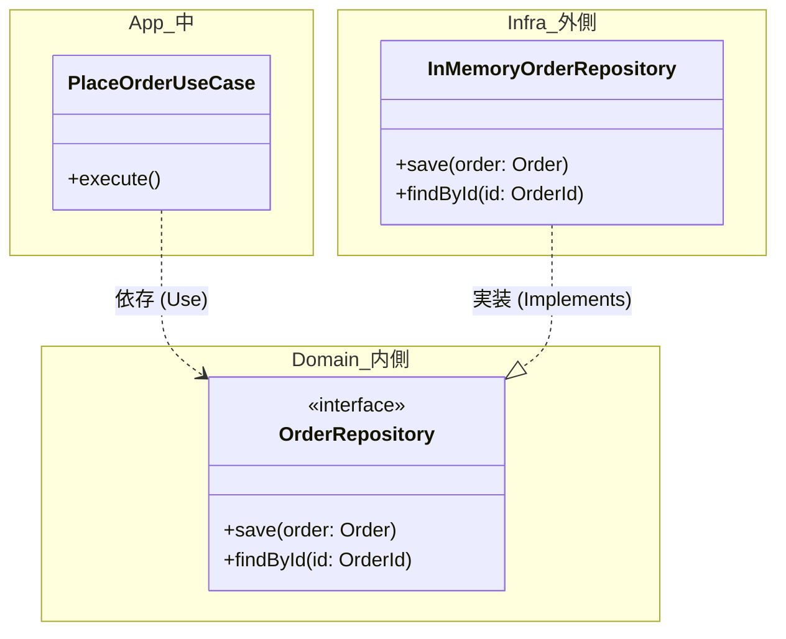
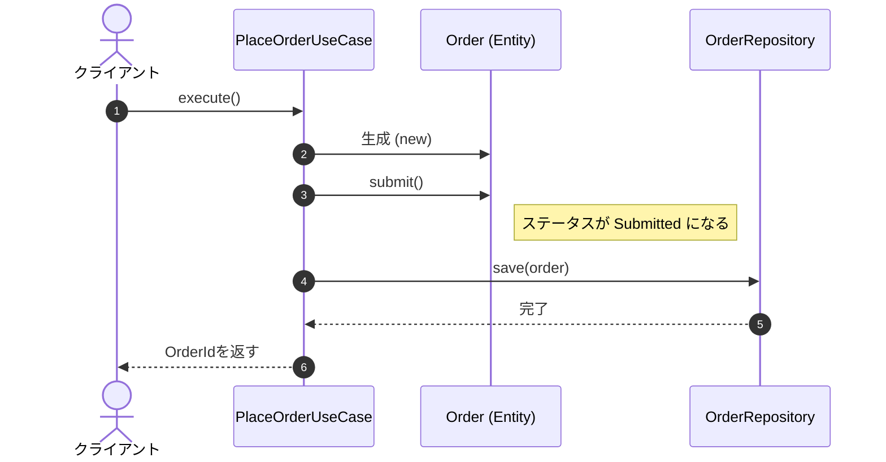

# 第19章：Repositoryの入口（interfaceで守る：DIP入門）🧩🧱

## この章でできるようになること🎯✨

* 「ドメイン（Entity/VO）」が「DBやAPI」に**依存しない**形を作れるようになるよ💪
* Repositoryを **interface（約束）** として定義して、実装は外側に逃がせるようになるよ🚪➡️
* 「save/find の置き場所」と「メソッド設計のコツ」が分かるよ🗺️

---

## まずは超イメージ：Repositoryってなに？🧠☕

Repositoryはひと言でいうと…

> **「保存・取得の“窓口”を、ドメイン側が“約束”として持つ」もの**📮

ポイントはここ👇

* ドメインは「DBがMySQLだろうがSQLiteだろうが」気にしない🙈
* でも「保存する」「取り出す」は必要だよね？
* だから **“こういう形で保存/取得できるよ”という約束（interface）** を先に決める✨


---

## DIP入門：依存の向きをひっくり返す🔁🧲

設計初心者が一番ハマりやすいのがこれ😵‍💫

### ❌ ありがちな形（危ない）🧨

ドメインがDBライブラリに直接依存すると…

* ちょっとDB変更しただけでドメインが壊れる💥
* テストもしにくい（DBがないと動かない）😢

### ✅ 目指す形（安全）🛡️

ドメインは「約束（interface）」だけ知って、DB側がそれを実装する✨




この「外側が内側に合わせる」感じがDIP（依存性逆転）だよ〜🌀✨

---

## 2026年の“今どき”メモ🗓️✨（さらっと）

* TypeScript の最新安定版は **5.9** と案内されてるよ（公式DLページ）📌 ([typescriptlang.org][1])
* Node は **v25 が Current、v24 が Active LTS** と整理されてるよ（公式）🟢 ([Node.js][2])
* テストは **Vitest 4.0** が出ていて、移行ガイドも更新されてるよ🧪 ([vitest.dev][3])
* さらに TypeScript は “Native preview” や次期メジャーの進捗も出てる（コンパイル高速化系）🚀 ([Microsoft for Developers][4])

（この章は「Repositoryの基本」が主役なので、機能の細部は深入りしないよ🙂）

---

## Repository設計のコツ（初心者向けチートシート）📄✨

Repositoryのメソッドを考えるとき、まずこの3つだけでOK🙆‍♀️

1. **集約（Aggregate）単位で作る**📦

   * 例：Order（注文）を扱うなら `OrderRepository`
2. **基本は save と findById から**🧩

   * 最小で始めて、必要になったら足す
3. **“検索の盛り合わせ”にしない**🍱❌

   * `findByNameAndAgeAndStatusAnd...` みたいに増やしすぎると破綻しやすい😵
   * まずは「ユースケースが本当に必要なもの」だけ

---

## ハンズオン①：Repository interface を作ろう✍️💎

ここからは、ミニ注文（Order）を題材に進めるよ🛒✨
（VO/Entityは簡略版。後の章で育てていける形にするね🌱）

### フォルダ構成（例）📁

```text
src/
  domain/
    order/
      OrderId.ts
      Order.ts
      OrderRepository.ts
  app/
    PlaceOrderUseCase.ts
  infra/
    InMemoryOrderRepository.ts
```

---

### 1) OrderId（Value Object）💎

```ts
// src/domain/order/OrderId.ts
import { randomUUID } from "node:crypto";

export class OrderId {
  private constructor(public readonly value: string) {}

  static new(): OrderId {
    // "ord_" を付けるとログで追いやすいよ👀✨
    return new OrderId(`ord_${randomUUID()}`);
  }

  static from(value: string): OrderId {
    if (!value.startsWith("ord_")) {
      throw new Error("OrderId must start with 'ord_'.");
    }
    return new OrderId(value);
  }

  equals(other: OrderId): boolean {
    return this.value === other.value;
  }
}
```

---

### 2) Order（Entity）🪪

```ts
// src/domain/order/Order.ts
import { OrderId } from "./OrderId";

export class Order {
  // Entityは「同一性（ID）」が命🪪✨
  constructor(
    public readonly id: OrderId,
    private _status: "Draft" | "Submitted" = "Draft",
  ) {}

  get status() {
    return this._status;
  }

  submit() {
    if (this._status !== "Draft") {
      throw new Error("Only Draft order can be submitted.");
    }
    this._status = "Submitted";
  }
}
```

---

### 3) OrderRepository（約束 / interface）🤝✨

ここが第19章の主役だよ〜！🎉

```ts
// src/domain/order/OrderRepository.ts
import { Order } from "./Order";
import { OrderId } from "./OrderId";

export interface OrderRepository {
  findById(id: OrderId): Promise<Order | null>;
  save(order: Order): Promise<void>;
}
```

✅ 大事ポイント

* **ドメイン側に置く**（DBのことを知らないで済む）🧼
* `Promise` にしておくと、後でDB実装に差し替えても形が揃うよ🔁✨

---

## ハンズオン②：インメモリ実装で動かす（外側の実装）🧺🧱

次に、外側（infra）で interface を実装するよ！

```ts
// src/infra/InMemoryOrderRepository.ts
import { OrderRepository } from "../domain/order/OrderRepository";
import { Order } from "../domain/order/Order";
import { OrderId } from "../domain/order/OrderId";

export class InMemoryOrderRepository implements OrderRepository {
  private readonly store = new Map<string, Order>();

  async findById(id: OrderId): Promise<Order | null> {
    return this.store.get(id.value) ?? null;
  }

  async save(order: Order): Promise<void> {
    this.store.set(order.id.value, order);
  }
}
```

✅ ここが気持ちいいところ😍

* ドメインは `Map` の存在すら知らない🙈
* 後で Prisma とか SQLite とかにしても **差し替えるだけ**🔁✨

---

## ハンズオン③：UseCaseから使ってみよう🎬🚀

「Repositoryを受け取って使う」＝依存性注入（DI）の超シンプル版だよ💉✨

```ts
// src/app/PlaceOrderUseCase.ts
import { OrderRepository } from "../domain/order/OrderRepository";
import { Order } from "../domain/order/Order";
import { OrderId } from "../domain/order/OrderId";

export class PlaceOrderUseCase {
  constructor(private readonly orders: OrderRepository) {}

  async execute(): Promise<OrderId> {
    const id = OrderId.new();
    const order = new Order(id);

    order.submit();
    await this.orders.save(order);

    return id;
  }
}
```



実行例（ちょい確認）👇

```ts
// src/index.ts
import { InMemoryOrderRepository } from "./infra/InMemoryOrderRepository";
import { PlaceOrderUseCase } from "./app/PlaceOrderUseCase";

const repo = new InMemoryOrderRepository();
const usecase = new PlaceOrderUseCase(repo);

const id = await usecase.execute();
console.log("created:", id.value);
```

---

## ちょいテスト🧪🍰（Repositoryがあるとテストが楽！）

Vitest 4.0 が出てるよ🧪✨ ([vitest.dev][3])
ここでは「DBなしで」UseCaseをテストしちゃう💕

```ts
// src/app/PlaceOrderUseCase.test.ts
import { describe, it, expect } from "vitest";
import { InMemoryOrderRepository } from "../infra/InMemoryOrderRepository";
import { PlaceOrderUseCase } from "./PlaceOrderUseCase";
import { OrderId } from "../domain/order/OrderId";

describe("PlaceOrderUseCase", () => {
  it("creates and saves a submitted order", async () => {
    const repo = new InMemoryOrderRepository();
    const usecase = new PlaceOrderUseCase(repo);

    const id = await usecase.execute();

    const saved = await repo.findById(OrderId.from(id.value));
    expect(saved).not.toBeNull();
    expect(saved?.status).toBe("Submitted");
  });
});
```

✅ うれしいこと

* テストが速い⚡
* DB準備いらない🧘‍♀️
* だからリファクタもしやすい🔧✨

---

## “Repositoryのやりすぎ”あるある😇💥

### あるある①：Repositoryが何でも屋になる🧹

* ❌ `OrderRepository` に「集計」「検索条件盛り盛り」「画面表示用DTO」まで入れる
* ✅ Repositoryは **永続化の窓口** に寄せる

  * 複雑な検索は「クエリ用の別口（例：OrderQueryService）」に分ける発想もあるよ（後でOK）🧠✨

### あるある②：ドメインにDBの型が漏れる🧪💦

* ❌ `findById(id: string): Promise<OrderRecord>`（Recordが出てくる）
* ✅ `findById(id: OrderId): Promise<Order | null>`（ドメイン型だけ）

### あるある③：同期/非同期がバラバラになる🔀

* ✅ 早めから `Promise` に揃えると、差し替えが楽だよ🔁✨

---

## AIアシストの使いどころ🤖💡（おすすめ）

「考える部分」は自分、**手が疲れる部分**はAIに任せるのがコツだよ😉✨

### プロンプト例（コピペOK）📝

* 「OrderRepository interface を、DDD初心者向けに最小（save/findById）で提案して。メソッド名の理由もつけて」
* 「TypeScriptで InMemoryOrderRepository を Map で実装して。Promiseを返す形にして」
* 「PlaceOrderUseCase のVitestテストを1本だけ書いて。保存できたことと状態がSubmittedなことを確認して」
* 「Repositoryが肥大化しないためのチェックリストを、初心者向けに5つ作って」

---

## ミニ課題（やってみよ）🎒✨

### 課題A：`exists(id)` を足す👀

* `exists(id: OrderId): Promise<boolean>` を追加してみてね
* そのうえで UseCase 側で「重複チェックっぽい処理」を作ってみよう🔁

### 課題B：`findById` の戻りをどう扱う？🤔

* `null` のとき、UseCaseはどうするのが自然？

  * 例：ドメインエラーにする？それとも「見つからない」を返す？
* “ユーザー入力の問題”なのか “システムの問題”なのか、分類も意識してみてね⚠️

---

## まとめ🍀✨

* Repositoryは「保存/取得」を**ドメインから切り離すための約束（interface）**だよ🤝
* DIPのコアは「内側（ドメイン）が外側（DB）に依存しない」こと🧼
* まずは **save / findById** の最小構成から始めると迷子にならない🗺️✨

次の第20章では、このRepositoryに入れる前後で必ず必要になる「変換（Mapper）」に進むよ〜！🔁💾

[1]: https://www.typescriptlang.org/download/?utm_source=chatgpt.com "How to set up TypeScript"
[2]: https://nodejs.org/en/about/previous-releases?utm_source=chatgpt.com "Node.js Releases"
[3]: https://vitest.dev/blog/vitest-4?utm_source=chatgpt.com "Vitest 4.0 is out!"
[4]: https://devblogs.microsoft.com/typescript/announcing-typescript-native-previews/?utm_source=chatgpt.com "Announcing TypeScript Native Previews"
