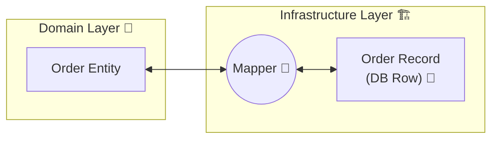
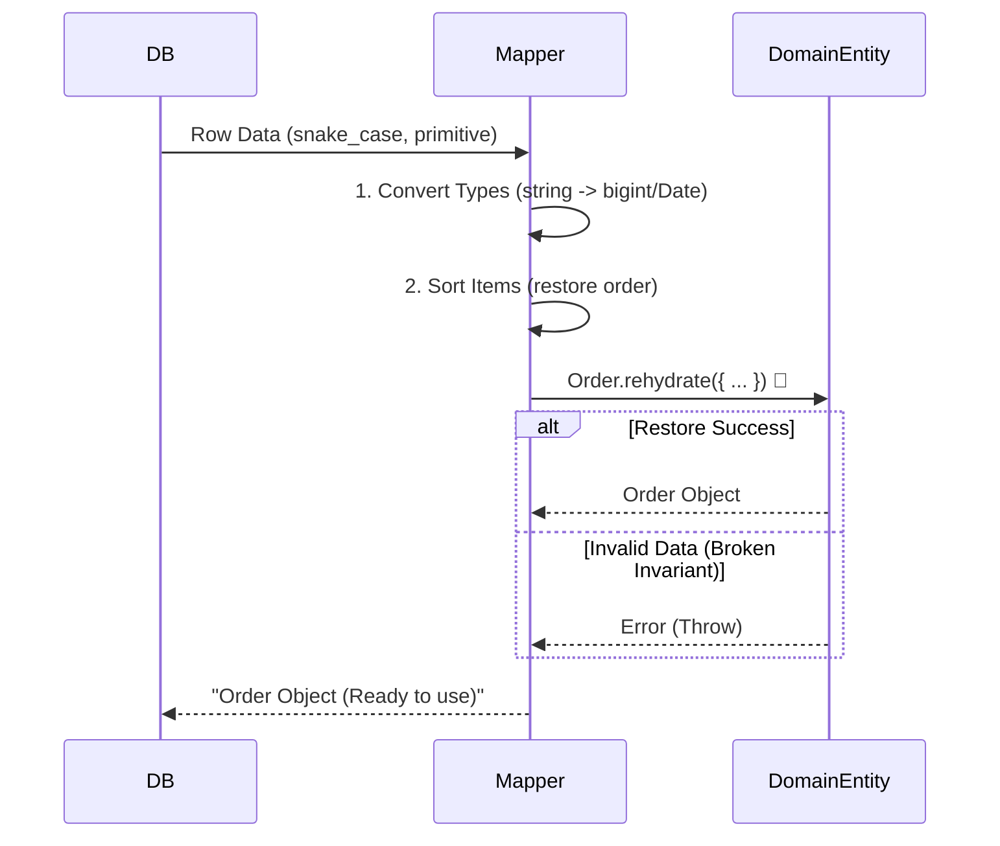

# 第20章：Mapper（変換）入門：Domain ↔ Persistence🔁💾

今日は「**変換（Mapper）**」を、ちゃんと“設計として”扱えるようになる回だよ〜！😊🫶
地味だけど、ここを丁寧にすると **あとでバグが激減**するやつです🔥

ちなみに今の時点（2026年1月）だと、TypeScript は **5.9 系**のリリースノートが更新されてて、テストは **Vitest 4** が現役だよ〜🧪✨ ([TypeScript][1])
（Node は v24 が Active LTS のブランチとして案内されてるよ📌）([Node.js][2])

---

## 1) まずイメージ！Mapperってどこにいるの？🗺️✨


ドメイン（あなたの世界のルール）を、DBの形に合わせてねじ曲げたくない…！😵‍💫
そこで「翻訳係」= **Mapper** が入るよ💁‍♀️💕



* **Domain**：美しいルールの世界💎（不変条件・VO・Entity）
* **Persistence(Record)**：保存しやすい形💾（snake_case、数値はint、NULLあり…とか）
* **Mapper**：その間で「事故なく」変換する翻訳家🌉✨

---

## 2) Mapperが無いと何が起きるの？😱（よくある地獄）

### 🧨地雷あるある

* `null` が混ざってドメインが壊れる😇
* `Date` のタイムゾーンでズレる🕰️💥
* 金額の小数で誤差（Number）→ 集計がズレる💰😵
* `snake_case` と `camelCase` ぐちゃぐちゃ🌀
* DBの都合がドメインに染み出して「設計が腐る」🧟‍♀️

Mapperを作ると👇

* 「DBの変な形」は **Mapperが全部受け止める**🛡️✨
* Domain はずっと **綺麗なまま**保てる💎

---

## 3) この章のゴール🎯✨

できるようになること👇😊

* ✅ Domain → Record へ安全に変換できる
* ✅ Record → Domain へ復元（rehydrate）できる
* ✅ 変換のテストが書ける（しかも壊れにくい）🧪✨
* ✅ 「変換バグあるある」を事前に潰せる💣➡️🧯

---

## 4) 実装で学ぼう！ミニ題材：注文 Order 🛒✨

### Domain 側（ルールの世界）💎

* `Email`：作る時に検証して、無効値を作らない📧✅
* `Money`：円は `bigint` で安全に（Number誤差回避）💰🔒
* `Order`：DBを知らない。Recordも知らない。ルールだけ👑✨

---

## 5) サンプル実装（Domain / Record / Mapper / Test）🧩🧪

### 5-1. Domain（Email / Money / Order など）💎

```ts
// domain/valueObjects.ts
export class Email {
  private constructor(private readonly value: string) {}

  static create(raw: string): Email {
    // 超簡易（本番はもう少し厳密でもOK）
    if (!raw.includes("@")) throw new Error("Invalid email");
    return new Email(raw.trim().toLowerCase());
  }

  toString(): string {
    return this.value;
  }
}

export class MoneyYen {
  private constructor(private readonly yen: bigint) {}

  static of(yen: bigint): MoneyYen {
    if (yen < 0n) throw new Error("Money must be >= 0");
    return new MoneyYen(yen);
  }

  add(other: MoneyYen): MoneyYen {
    return MoneyYen.of(this.yen + other.yen);
  }

  toYenBigInt(): bigint {
    return this.yen;
  }
}
```

```ts
// domain/order.ts
import { Email, MoneyYen } from "./valueObjects.js";

export type OrderStatus = "Draft" | "Submitted" | "Paid" | "Cancelled";

export class OrderLineItem {
  private constructor(
    public readonly lineNo: number,
    public readonly productId: string,
    public readonly quantity: number,
    public readonly unitPrice: MoneyYen
  ) {
    if (lineNo <= 0) throw new Error("lineNo must be >= 1");
    if (!productId) throw new Error("productId required");
    if (!Number.isInteger(quantity) || quantity <= 0) throw new Error("quantity must be positive int");
  }

  static create(args: {
    lineNo: number;
    productId: string;
    quantity: number;
    unitPrice: MoneyYen;
  }): OrderLineItem {
    return new OrderLineItem(args.lineNo, args.productId, args.quantity, args.unitPrice);
  }
}

export class Order {
  private constructor(
    public readonly id: string,
    public readonly customerEmail: Email,
    public readonly status: OrderStatus,
    public readonly createdAt: Date,
    public readonly updatedAt: Date,
    public readonly version: number,
    private readonly items: OrderLineItem[]
  ) {
    if (!id) throw new Error("id required");
    if (version < 0) throw new Error("version must be >= 0");
    if (items.length === 0) throw new Error("Order must have at least 1 item");
  }

  static rehydrate(args: {
    id: string;
    customerEmail: Email;
    status: OrderStatus;
    createdAt: Date;
    updatedAt: Date;
    version: number;
    items: OrderLineItem[];
  }): Order {
    // DBから復元でも、不変条件はここで守る✅
    return new Order(
      args.id,
      args.customerEmail,
      args.status,
      args.createdAt,
      args.updatedAt,
      args.version,
      args.items
    );
  }

  getItems(): readonly OrderLineItem[] {
    return this.items;
  }
}
```

---

### 5-2. Persistence（Record：DBの行っぽい形）💾

ここは **DB都合が強い**世界！🐍（snake_case だし、bigintはstringで持つ…とか）

```ts
// persistence/records.ts
export type OrderRow = {
  id: string;
  customer_email: string;
  status: "draft" | "submitted" | "paid" | "cancelled";
  created_at_iso: string; // ISO文字列
  updated_at_iso: string; // ISO文字列
  version: number;
};

export type OrderItemRow = {
  order_id: string;
  line_no: number;
  product_id: string;
  quantity: number;
  unit_price_yen: string; // bigint を文字列で
};
```

---

### 5-3. Mapper（翻訳係）🌉✨

ポイントはこれ👇

* ✅ **変換は純粋関数（副作用なし）**に近づける
* ✅ 変換時に **型変換・命名差・単位差** を吸収する
* ✅ おかしなデータなら Domain を作らず落とす（データ破損として扱う）🧯

```ts
// persistence/orderMapper.ts
import { Order, OrderLineItem, OrderStatus } from "../domain/order.js";
import { Email, MoneyYen } from "../domain/valueObjects.js";
import { OrderItemRow, OrderRow } from "./records.js";

function toDomainStatus(s: OrderRow["status"]): OrderStatus {
  switch (s) {
    case "draft":
      return "Draft";
    case "submitted":
      return "Submitted";
    case "paid":
      return "Paid";
    case "cancelled":
      return "Cancelled";
  }
}

function toRowStatus(s: OrderStatus): OrderRow["status"] {
  switch (s) {
    case "Draft":
      return "draft";
    case "Submitted":
      return "submitted";
    case "Paid":
      return "paid";
    case "Cancelled":
      return "cancelled";
  }
}

export class OrderMapper {
  static toRows(order: Order): { orderRow: OrderRow; itemRows: OrderItemRow[] } {
    const orderRow: OrderRow = {
      id: order.id,
      customer_email: order.customerEmail.toString(),
      status: toRowStatus(order.status),
      created_at_iso: order.createdAt.toISOString(),
      updated_at_iso: order.updatedAt.toISOString(),
      version: order.version,
    };

    const itemRows: OrderItemRow[] = order.getItems().map((it) => ({
      order_id: order.id,
      line_no: it.lineNo,
      product_id: it.productId,
      quantity: it.quantity,
      unit_price_yen: it.unitPrice.toYenBigInt().toString(), // bigint -> string
    }));

    return { orderRow, itemRows };
  }

  static fromRows(orderRow: OrderRow, itemRows: OrderItemRow[]): Order {
    // ここで「DBの変な形」をDomainに入れる前に吸収する✨
    const email = Email.create(orderRow.customer_email);

    const createdAt = new Date(orderRow.created_at_iso);
    const updatedAt = new Date(orderRow.updated_at_iso);

    if (Number.isNaN(createdAt.getTime())) throw new Error("Invalid created_at_iso");
    if (Number.isNaN(updatedAt.getTime())) throw new Error("Invalid updated_at_iso");

    const items = itemRows
      .slice()
      .sort((a, b) => a.line_no - b.line_no) // DBが順序保証しない前提で安全に
      .map((r) =>
        OrderLineItem.create({
          lineNo: r.line_no,
          productId: r.product_id,
          quantity: r.quantity,
          unitPrice: MoneyYen.of(BigInt(r.unit_price_yen)),
        })
      );

    return Order.rehydrate({
      id: orderRow.id,
      customerEmail: email,
      status: toDomainStatus(orderRow.status),
      createdAt,
      updatedAt,
      version: orderRow.version,
      items,
    });
  }
}
```



---

### 5-4. テスト（Vitest 4）🧪✨

狙いは「**往復しても壊れない**」こと！🔁✅
Vitest 4 が現行で案内されてるよ🧁 ([Vitest][3])

```ts
// persistence/orderMapper.test.ts
import { describe, it, expect } from "vitest";
import { Order, OrderLineItem } from "../domain/order.js";
import { Email, MoneyYen } from "../domain/valueObjects.js";
import { OrderMapper } from "./orderMapper.js";

describe("OrderMapper", () => {
  it("Domain -> Rows -> Domain の往復で情報が保たれる", () => {
    const order = Order.rehydrate({
      id: "order-001",
      customerEmail: Email.create("TEST@Example.com"),
      status: "Submitted",
      createdAt: new Date("2026-01-20T10:00:00.000Z"),
      updatedAt: new Date("2026-01-21T10:00:00.000Z"),
      version: 3,
      items: [
        OrderLineItem.create({
          lineNo: 2,
          productId: "p-200",
          quantity: 1,
          unitPrice: MoneyYen.of(1500n),
        }),
        OrderLineItem.create({
          lineNo: 1,
          productId: "p-100",
          quantity: 2,
          unitPrice: MoneyYen.of(500n),
        }),
      ],
    });

    const { orderRow, itemRows } = OrderMapper.toRows(order);
    const restored = OrderMapper.fromRows(orderRow, itemRows);

    expect(restored.id).toBe("order-001");
    expect(restored.customerEmail.toString()).toBe("test@example.com"); // 正規化される
    expect(restored.status).toBe("Submitted");
    expect(restored.version).toBe(3);

    const items = restored.getItems();
    expect(items.length).toBe(2);
    expect(items[0].lineNo).toBe(1); // sortで順序が安定
    expect(items[0].productId).toBe("p-100");
  });

  it("壊れた日付が来たら落とす（データ破損扱い）", () => {
    const badRow = {
      id: "order-002",
      customer_email: "a@b.com",
      status: "draft",
      created_at_iso: "not-a-date",
      updated_at_iso: "2026-01-21T10:00:00.000Z",
      version: 0,
    } as const;

    expect(() => OrderMapper.fromRows(badRow, [])).toThrow();
  });
});
```

---

## 6) 変換バグを潰すチェックリスト✅💣➡️🧯

Mapperを書くときは、ここだけ見て〜！🥰🧷

* ✅ **命名差**：`customer_email` ↔ `customerEmail`
* ✅ **型変換**：`"1500"` ↔ `1500n`（bigint）
* ✅ **単位**：円/銭、kg/g、秒/ms…（ズレると死ぬ😇）
* ✅ **順序**：DBは順番保証しないことが多い（sortしよ）
* ✅ **NULL/欠損**：Domainに入れる前に「落とす or 補う」を決める
* ✅ **バージョン**：楽観ロック用 `version` は Mapper で落とさない

---

## 7) 日付まわり補足🕰️✨（ちょい重要！）

`Date` はクセ強で事故りやすいけど、現実ではまだ普通に使われるよね🥺
最近は **Temporal** っていう新しい日時APIが進んでいて、**Stage 3**（かなり安定）として公開されてるよ📌 ([TC39][4])

この教材ではまず安全運用として👇

* **DBには ISO文字列（UTC）で保存**：`toISOString()` ✅
* Domainへは `new Date(iso)` で復元し、**Invalid Date を弾く**🧯

（Temporalを使う設計も将来的にアリだよ〜って温度感でOK😊）

---

## 8) 演習（ハンズオン）🧩🔥

### 演習1：項目追加しても壊れないMapperにしよう🧁

* `OrderRow` に `note: string` を追加（DB都合：NULLになるかも）
* Domain 側は `note` を持たない方針にする
  👉 Mapper で **捨てる/ログる/別テーブル** どれが良い？を考えて実装✨

### 演習2：単位差バグをわざと入れて直す😈➡️😇

* `unit_price_yen` を「円」じゃなく「銭」だと思い込むバグを入れる
* テストが落ちるのを確認→正しい変換に修正🧪

### 演習3：往復テストを1本追加🧪

* 「アイテム3つ」「順不同」「メール大文字混在」ケースで
  **Rows → Domain → Rows** が安定することをチェック✅

---

## 9) 小テスト（サクッと）📝✨

### Q1. Mapperの主な役割は？

A. ドメインロジックを増やす
B. DBの都合をドメインに持ち込む
C. DomainとRecordの変換で“歪み”を吸収する

👉 **答え：C** 🎉（翻訳係だよ〜🌉）

### Q2. DBから取った `itemRows` を sort する理由は？

👉 **答え**：DBが順序保証しないことがあるから。Domain側の安定のため😊✅

### Q3. `Money` を `number` で持つと起きがちな事故は？

👉 **答え**：小数誤差で合計がズレる（特に通貨/税/割引）😵💰

### Q4. `created_at_iso` が壊れてたら Domain を作る？

👉 **答え**：作らない！データ破損として落とす🧯（無効状態は入れない）

### Q5. Mapperはどこに置くのが自然？

👉 **答え**：永続化寄り（Repository実装側の近く）。Domainは汚さない🧼✨

---

## 10) AIプロンプト集🤖💞（そのままコピペOK）

* 「この `OrderRow` と `Order` の差分を整理して、Mapperの変換ルールを箇条書きにして😊」
* 「`MoneyYen(bigint)` を DB へ保存する安全な表現（string/int）案を3つ出して、メリデメも🙏」
* 「Mapperの往復テスト（round-trip）をVitestで追加して。順序が崩れても安定するようにして🧪✨」
* 「このMapperに潜むバグ候補（null/単位/タイムゾーン/enum）を洗い出して、テスト観点にして💣➡️✅」
* 「RepositoryとMapperの責務が混ざってないかレビューして、分割案も出して🧼」

---

## まとめ🎀✨

Mapperは「地味な翻訳」なんだけど、ここが強いと👇

* ドメインがずっと綺麗💎
* DB変更に強い💪
* 変換バグをテストで封じ込めできる🧪🛡️

次の第21章（ACL）では、**外部APIの歪み**も同じ発想で「翻訳して守る」よ〜🌉✨
（Mapperの親戚みたいな感じ😊🫶）

必要なら、この章のサンプルを「あなたの題材（注文／サークル会計）」に合わせて、Record設計から一緒に作り直すよ〜！🥳💕

[1]: https://www.typescriptlang.org/docs/handbook/release-notes/typescript-5-9.html?utm_source=chatgpt.com "Documentation - TypeScript 5.9"
[2]: https://nodejs.org/en/about/previous-releases?utm_source=chatgpt.com "Node.js Releases"
[3]: https://vitest.dev/blog/vitest-4?utm_source=chatgpt.com "Vitest 4.0 is out!"
[4]: https://tc39.es/proposal-temporal/?utm_source=chatgpt.com "Temporal"
