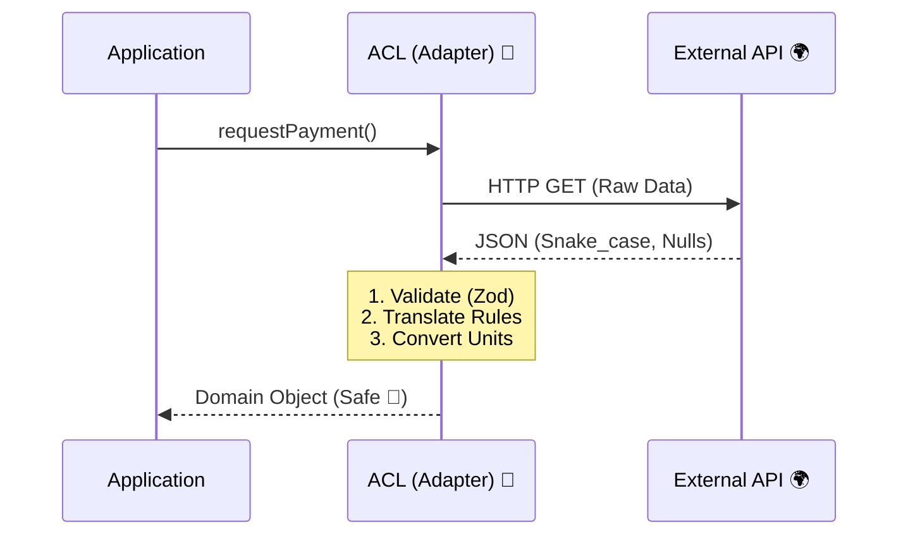
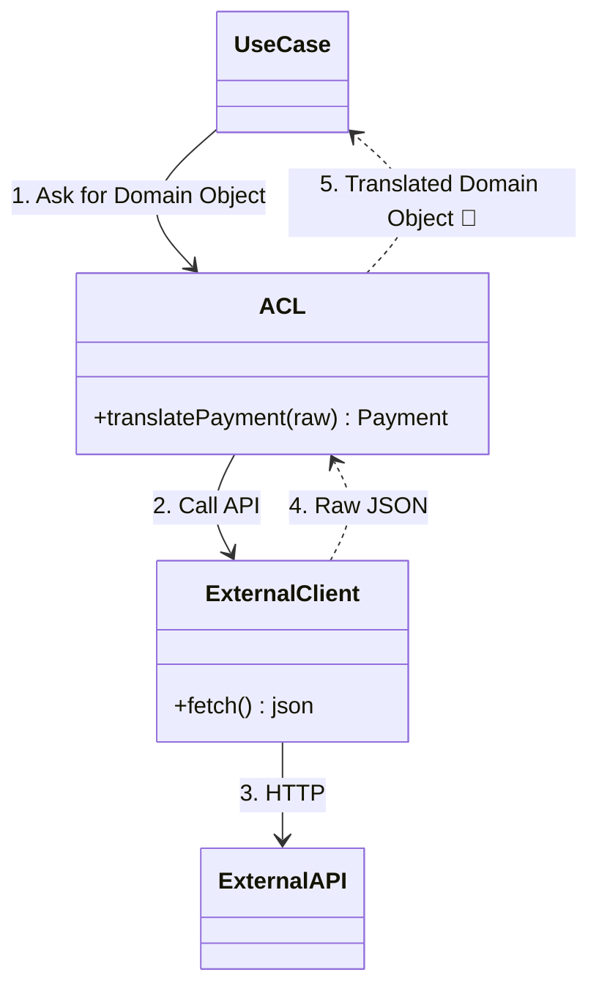

# 第21章：ACL（外部APIの歪みを入れない翻訳層）🌉🧼

こみやんまさん、ここまで来たらもう“実務っぽさ”かなり出てきたよ〜！🎀✨
この章は **外部APIのクセ（命名・単位・欠損・謎ステータス…）を、ドメインに持ち込まないための防波堤**を作ります🌊🧱

---

## 1) この章のゴール 🎯✨

* 外部APIのレスポンスを **そのままドメインに入れない理由**が説明できる🗣️💡
* **ACL（翻訳層）**を置いて、外部の歪みを吸収できる🌉🧼
* 「外部が変わっても、ドメインは守る」設計とテストができる🛡️🧪

---

## 2) ACLってなに？（超やさしく）🧸🌉


**ACL（Anti-Corruption Layer）**は、

> 外部システムのモデル（言葉・型・ルール）と、自分のドメインモデルの間に置く「翻訳＆防波堤」
> です🙂✨

外部の都合がそのまま入ると、ドメインの言葉が崩れていって…気づいたらコードが外部仕様まみれになります😭💦
だから「翻訳係」を置いて、**混ざらないようにする**のがACLだよ〜🌉🧼
（定義としても「2つのドメインモデル間を翻訳する層」と説明されます）([microservices.io][1])

---

## 3) Mapper（第20章）との違いは？🤔🔁


* **Mapper（前章）**：自分のDB都合 ↔ ドメイン（Record変換）💾🔁
* **ACL（今回）**：他人（外部API）の都合 ↔ ドメイン（翻訳＆吸収）🌍🔁

イメージはこう👇

* Mapper：**自分の倉庫に入れるための梱包変え**📦
* ACL：**海外のクセ強パッケージを、国内ルールに直してから入れる**🌏➡️🇯🇵✨

---

## 4) 外部APIの「歪み」あるある大全 😇⚠️


外部ってだいたいこういうの持ってくるよね…ってやつ🧯

* 命名が `snake_case` だったり、略語まみれ（`amt`, `st`）😵‍💫
* 金額が **cents（最小通貨単位）**で来る💰➡️🪙
* 日付が文字列で、タイムゾーンが不明（`"2026-01-01T00:00:00"` だけ）🕰️❓
* null/欠損が普通に来る（しかも仕様に書いてない）🫠
* ステータスが数値コード（`1=OK`, `7=???`）🧩
* 仕様がしれっと増える／変わる（後方互換ないことも）🥲

だからこそ「翻訳係」＝ACLが必要なんだよ〜🌉🧼

---

## 5) 置き場所（どこに作る？）🏠🧩


ドメインを守るために、ACLは **外側（infra）** に置くのが基本🙂✨
ドメイン層は「自分の言葉」だけで生きるのが理想だよ🧠💎



---

## 6) ハンズオン：架空の決済サービス “PayFast” を翻訳する 💳⚡


### 今回やりたいこと 🧩

外部APIのレスポンス（クセ強）👇 を受け取って…

* 金額 `amount_cents` を **Money** に
* ステータス `status_code` を **PaymentStatus** に
* 日付 `paid_at` を **Date** に
  …って感じで **ドメイン型に翻訳**します🌉✨

---

## 7) 実装の全体像（フォルダ案）📁✨

```text
src/
  domain/
    value/
      Money.ts
      PaymentId.ts
    PaymentStatus.ts
    Payment.ts
  infra/
    external/
      payfast/
        PayFastDto.ts        // 外部DTO + zodで検証
        PayFastClient.ts     // fetchするだけ
        PayFastAcl.ts        // 🌉 翻訳の本体
    SyncPaymentStatus.ts     // ユースケース
```




---

## 8) まずはドメイン側（受け入れ先）💎🛡️


### Money（最小限）

* **centsを受け取らない**（外部都合はACLで止める）
* ドメイン内は「円」など“人間の単位”で扱う🙂✨

```ts
// src/domain/value/Money.ts
export class Money {
  private constructor(
    private readonly amount: number,
    public readonly currency: "JPY" | "USD"
  ) {
    if (!Number.isFinite(amount)) throw new Error("amount must be finite");
    if (amount < 0) throw new Error("amount must be >= 0");
  }

  static of(amount: number, currency: "JPY" | "USD") {
    // 例: 小数禁止など、ルールがあるならここで守る
    return new Money(amount, currency);
  }

  get value(): number {
    return this.amount;
  }
}
```

### PaymentStatus

```ts
// src/domain/PaymentStatus.ts
export type PaymentStatus = "Pending" | "Paid" | "Failed" | "Cancelled";
```

---

## 9) 外部DTOは “unknown → 検証 → 確定” が安全 ✅🧪


外部は信用しない！😇💥
なので **`unknown` を zod で検証してから**扱います。

最近は zod v4 が安定版として案内されています([Zod][2])（なので例もzodでいくよ〜💎）

```ts
// src/infra/external/payfast/PayFastDto.ts
import { z } from "zod";

export const PayFastPaymentSchema = z.object({
  id: z.string(),
  status_code: z.number(), // 例: 10=paid, 20=pending, 90=failed...
  amount_cents: z.number().int().nonnegative(),
  currency: z.string().optional(), // たまに欠ける想定😇
  paid_at: z.string().nullable().optional(), // ISOっぽい文字列
});

export type PayFastPaymentDto = z.infer<typeof PayFastPaymentSchema>;
```

---

## 10) 外部APIを叩くクライアント（薄く！）📡✨

クライアントは「通信だけ」担当にして、**変換ロジックを入れない**のがコツ🙂
（Nodeのリリース状況は公式でも更新されていて、LTSが複数走ってるのが分かるよ〜）([Node.js][3])

```ts
// src/infra/external/payfast/PayFastClient.ts
export class PayFastClient {
  constructor(private readonly baseUrl: string, private readonly apiKey: string) {}

  async fetchPayment(paymentId: string): Promise<unknown> {
    const res = await fetch(`${this.baseUrl}/payments/${paymentId}`, {
      headers: { Authorization: `Bearer ${this.apiKey}` },
    });

    if (!res.ok) {
      throw new Error(`PayFast API error: ${res.status}`);
    }
    return await res.json(); // unknownとして扱う
  }
}
```

---

## 11) 🌉 ACL本体：翻訳ルールを全部ここへ！🧼✨


ポイントはここ👇

* **命名の違い**を吸収（`status_code` → `PaymentStatus`）
* **単位変換**（cents → 通貨の“普通の金額”）
* **欠損の扱い**（currencyが無いときの方針）
* **未知のステータス**が来たときの方針（落とす/保留/ログ）

```ts
// src/infra/external/payfast/PayFastAcl.ts
import { PayFastPaymentSchema } from "./PayFastDto";
import { Money } from "../../../domain/value/Money";
import type { PaymentStatus } from "../../../domain/PaymentStatus";

export type PaymentSnapshot = {
  id: string;
  status: PaymentStatus;
  money: Money;
  paidAt: Date | null;
};

export class PayFastAcl {
  translatePayment(raw: unknown): PaymentSnapshot {
    const dto = PayFastPaymentSchema.parse(raw); // ✅ unknown→確定

    const status = this.translateStatus(dto.status_code);

    // currency欠損がある世界線…😇（方針を決める！）
    const currency = (dto.currency ?? "JPY") as "JPY" | "USD";

    // cents → 通常金額へ（ここでは 100 cents = 1 unit と仮定）
    const amount = dto.amount_cents / 100;

    const money = Money.of(amount, currency);

    const paidAt = dto.paid_at ? new Date(dto.paid_at) : null;
    if (dto.paid_at && Number.isNaN(paidAt.getTime())) {
      // 日付が壊れてたらどうする？：ここも方針！
      throw new Error("Invalid paid_at from PayFast");
    }

    return {
      id: dto.id,
      status,
      money,
      paidAt,
    };
  }

  private translateStatus(code: number): PaymentStatus {
    switch (code) {
      case 10:
        return "Paid";
      case 20:
        return "Pending";
      case 90:
        return "Failed";
      case 99:
        return "Cancelled";
      default:
        // 未知コードは「保留」に倒す（または例外でもOK）
        return "Pending";
    }
  }
}
```

> ✅ コツ：**外部コードの数値や命名を、ドメインに漏らさない**
> ドメイン内で `status_code` とか言い始めたら、もう侵食されてるサインだよ〜😭🧼

---

## 12) UseCaseからの使い方（ドメインが守られてる感）🧩✨

```ts
// src/application/SyncPaymentStatus.ts
import { PayFastClient } from "../infra/external/payfast/PayFastClient";
import { PayFastAcl } from "../infra/external/payfast/PayFastAcl";

export class SyncPaymentStatus {
  constructor(
    private readonly client: PayFastClient,
    private readonly acl: PayFastAcl
  ) {}

  async run(paymentId: string) {
    const raw = await this.client.fetchPayment(paymentId);
    const snapshot = this.acl.translatePayment(raw);

    // ここで snapshot を使ってドメインを更新する（Repositoryは前章までのノリで）
    return snapshot;
  }
}
```

UseCase側は「PayFastのクセ」を一切知らなくてOK🙆‍♀️✨
**これがACLの勝ちポイント**です🌉🏆

---

## 13) テストが超だいじ！翻訳はバグりやすい🧪💥

ACLは「地味だけど事故りやすい」場所ランキング上位😇
なので **翻訳の例（サンプルレスポンス）を固定してテスト**しよう！

```ts
// tests/PayFastAcl.test.ts
import { PayFastAcl } from "../src/infra/external/payfast/PayFastAcl";

test("translate paid payment", () => {
  const acl = new PayFastAcl();

  const raw = {
    id: "pf_123",
    status_code: 10,
    amount_cents: 12345,
    currency: "JPY",
    paid_at: "2026-01-20T10:00:00.000Z",
  };

  const snap = acl.translatePayment(raw);

  expect(snap.id).toBe("pf_123");
  expect(snap.status).toBe("Paid");
  expect(snap.money.value).toBe(123.45);
  expect(snap.money.currency).toBe("JPY");
  expect(snap.paidAt?.toISOString()).toBe("2026-01-20T10:00:00.000Z");
});

test("unknown status becomes Pending", () => {
  const acl = new PayFastAcl();

  const raw = {
    id: "pf_999",
    status_code: 777,
    amount_cents: 0,
    currency: "JPY",
    paid_at: null,
  };

  const snap = acl.translatePayment(raw);
  expect(snap.status).toBe("Pending");
});
```

---

## 14) 演習（手を動かすよ〜！）🏃‍♀️💨✨

### 演習1：未知ステータス方針を変えてみよう 🔀😈

今は未知コードを `Pending` に倒してるけど、次のどれかに変えてみてね👇

* A：例外を投げる（外部仕様変更を即検知）💥
* B：`Unknown` をドメインに追加（ただし侵食に注意！）🧩
* C：ログ出して `Pending`（現場っぽい）🪵🙂

👉 それぞれ「メリット/デメリット」を3行でメモ📝✨

### 演習2：通貨が欠けた時のルールを設計しよう 💱😵

`currency` が無い時、今は `"JPY"` にしてるけど…ほんとに安全？

* 例外にする
* 設定値（環境設定）から決める
* レスポンスの別フィールドから推測する
  など、方針を決めてACLに実装してね🧠✨

### 演習3：日付が “ローカル時刻文字列” だったら？🕰️💥

`"2026-01-20 10:00:00"` みたいなのが来たら、`new Date()` だと事故ることあるよね😇

* タイムゾーンを固定する
* API提供側にISOで返してもらう交渉（理想）
* ACL側でパース処理を用意する
  どれで行くか決めて、テストも追加！🧪✨

---

## 15) 小テスト（5問）📘✨

**Q1**：ACLの一番の目的は？
A. 外部APIのレスポンスをそのままEntityに入れる
B. 外部の都合がドメインに侵食しないように翻訳する
C. DBのテーブル設計をドメインに合わせる

**Q2**：外部レスポンスはまず何として扱うのが安全？
A. `any`
B. `unknown`
C. `object`

**Q3**：`amount_cents` をドメインに残したままにすると起きやすい事故は？
A. 単位の混在による計算ミス
B. 速度が遅くなる
C. 画像が表示されない

**Q4**：ACLに入れていいロジックはどれ？
A. ドメインの不変条件そのもの（全部ここで）
B. 外部ステータスコード→ドメインステータスへの変換
C. Entityのビジネスルール（割引条件など）

**Q5**：MapperとACLの違いとして近いのは？
A. Mapper=他人都合、ACL=自分都合
B. Mapper=自分都合、ACL=他人都合
C. どっちも同じ

✅ **答え**：Q1=B / Q2=B / Q3=A / Q4=B / Q5=B 🎉💮

---

## 16) AIプロンプト集（そのままコピペOK）🤖💕

* 「この外部APIレスポンスの危険ポイント（欠損/単位/命名/日付）を洗い出して、ACLでの吸収案を出して」
* 「status_code のマッピング方針を3案（厳格/現実/柔軟）で提案して。メリデメ付きで」
* 「unknown→zod検証→ドメイン翻訳 のテンプレをTypeScriptで作って」
* 「ACLのテスト観点を列挙して。境界値と異常系も入れて」
* 「外部APIの仕様変更に強い設計（Adapter/Facade/ポート）を、この構成に合わせて提案して」

---

## 17) まとめ（この章で得た“強さ”）💪✨

* 外部のクセは **ACLで止める**🌉🧼
* ドメインは「自分の言葉」と「自分のルール」だけで生きる💎🛡️
* ACLは壊れやすいから **サンプル固定＋テスト**が超大事🧪🔥
* “外部が変わっても中は平和” を作れると、保守がラク〜になるよ🙂🌈

---

次の第22章は **テスト戦略（VO・Entity・境界・変換）** だね🧪🍰
この章のACLテストを“土台”にして、テストを気持ちよく整理していこう〜！🎀✨

[1]: https://microservices.io/patterns/refactoring/anti-corruption-layer.html?utm_source=chatgpt.com "Pattern: Anti-corruption layer"
[2]: https://zod.dev/v4?utm_source=chatgpt.com "Release notes"
[3]: https://nodejs.org/en/about/previous-releases?utm_source=chatgpt.com "Node.js Releases"
