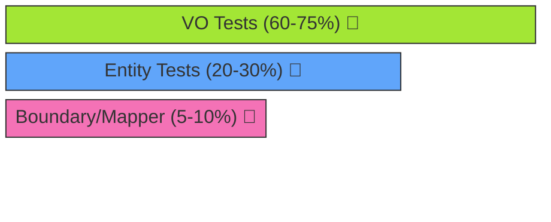
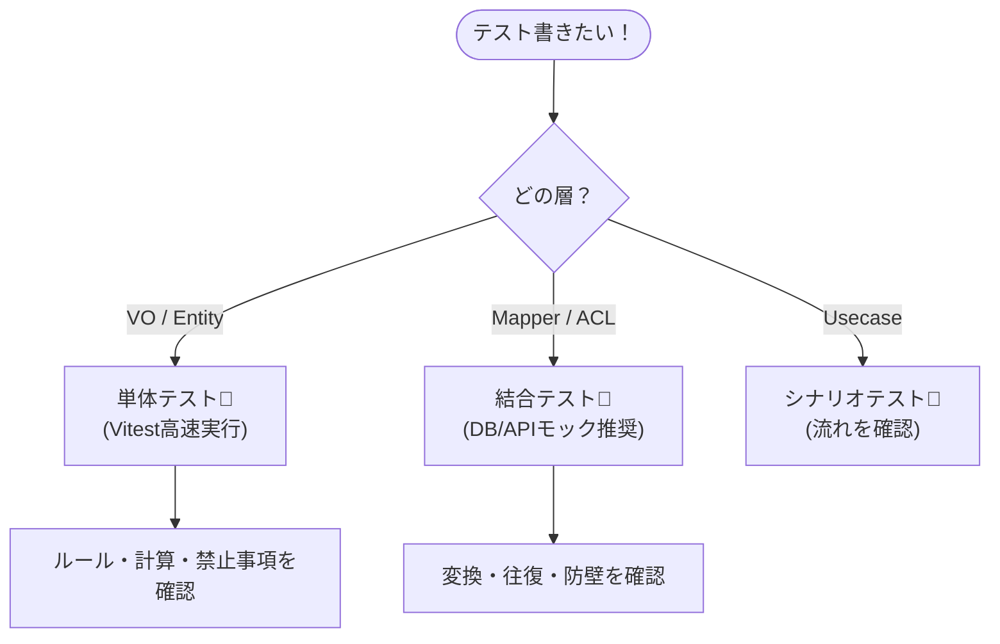

# 第22章：テスト戦略（VO・Entity・境界・変換）🧪🍰

この章は「1人開発でも壊れない守り」を作る回だよ〜！😊✨
テストって“バグ取り”に見えるけど、ほんとは **設計（ルール）を守らせるための安全ベルト**なんだ🛡️💕

---

## 1) 今日のゴール🎯✨

読み終わったら、こうなれるよ👇

* **VOは「単体テストが最強」**って体感できる💎✅
* **Entityは「ルール（ふるまい）」中心にテスト**できる🪪🧱
* **境界（DTO→ドメイン）**で“変な入力”を止められる🚪⚠️
* **Mapper（Domain↔Persistence）**で「変換ミス」を潰せる🔁💾
* どの粒度で、どれだけテストを書くべきか迷わない🗺️😊

---

## 2) 2026年のテスト環境、どれが今っぽい？🧰✨


結論：**TypeScriptなら「Vitest」中心がかなり扱いやすい**よ〜！⚡️
VitestはVite由来で高速＆設定が軽め、TSとも相性が良いのが強み💨 ([Vitest][1])

* Vitest 4 系が現行メジャーで、4.0.x が安定ライン（2026年1月時点でも更新が続いてる）🧪✨ ([Vitest][2])
* Node.js は **v24 が Active LTS**、v25 が Current（最新機能）という位置づけだよ📌 ([Node.js][3])
* TypeScript は npm の latest が **5.9.3**（2026年1月時点）📦 ([npm][4])
* Jest は **30 系が安定版**（Jest 30）として案内されてるよ🃏 ([Jest][5])

> もちろん Jest 派も多いけど、TS＋今どき構成だと **Vitest のほうが「詰まりポイント少なめ」**になりやすいよ☺️
> （とくに変換・ESM周りで悩みたくない人向き！）

---

## 3) テストは「4段ケーキ」🍰🧪（この章の本題！）

このロードマップの“4段”は超いい整理👏✨
おすすめはこう👇（割合は目安だよ〜）

### 🍰テストの4段（粒度）

1. **VOテスト（いちばん多く）**：60〜75% 💎✅
2. **Entityテスト（ルール中心）**：20〜30% 🪪🧱
3. **境界テスト（DTO→ドメイン）**：5〜10% 🚪⚠️
4. **Mapperテスト（Domain↔Record）**：5〜10% 🔁💾




### なんでこの配分？🤔💭

* VOは「入力→検証→値」みたいに **純度が高い**からテストが軽い＆強い💎
* Entityは「状態遷移」「不変条件」など **バグの温床**になりやすい🪪💥
* 境界と変換は **地味に事故る**（null、単位、丸め、命名ズレ）ので最低限押さえる🔁😇




---

## 4) “良いテスト”の最低ルール3つ🧠✨


### ① テスト名は「仕様の日本語」っぽく📝💕


* ❌ `shouldWork()`
* ✅ `無効なEmailは作れない()`
* ✅ `支払い済みはキャンセルできない()`

### ② 形はこれでOK（AAA）🧁

* Arrange（準備）
* Act（実行）
* Assert（確認）

### ③ “実装”じゃなく“ルール”を見る👀✨

* ❌ private変数の中身を覗く
* ✅ 「この入力ならOK」「この状態ならNG」を確認する

---

## 5) 実例でいくよ！🧪✨（VO → Entity → 境界 → Mapper）

ここからは “雰囲気が伝わる最小例” でまとめるね😊
（全部コピペできる形に寄せてるよ〜）

---

### 5-1) VO：Email（作れない状態を作らない）📧🚫


#### Email VO（例）

```ts
export class Email {
  private constructor(private readonly value: string) {}

  public static create(raw: string): Email {
    const v = raw.trim();

    // 超シンプル判定（学習用）：
    // 実務はもう少し厳密にするけど、まずは「無効を作らない」を体験しよ🙂
    const ok = /^[^\s@]+@[^\s@]+\.[^\s@]+$/.test(v);
    if (!ok) throw new Error("InvalidEmail");

    return new Email(v);
  }

  public toString(): string {
    return this.value;
  }

  public equals(other: Email): boolean {
    return this.value === other.value;
  }
}
```

#### Email のテスト（テーブル駆動）🧪✨

```ts
import { describe, it, expect } from "vitest";
import { Email } from "./Email";

describe("Email", () => {
  it("有効なEmailは作れる", () => {
    const email = Email.create("a@example.com");
    expect(email.toString()).toBe("a@example.com");
  });

  it("無効なEmailは作れない", () => {
    const badList = ["", "a@", "@b.com", "a@b", "a b@c.com"];

    for (const raw of badList) {
      expect(() => Email.create(raw)).toThrowError("InvalidEmail");
    }
  });

  it("等価性：同じ値ならtrue", () => {
    const a = Email.create("a@example.com");
    const b = Email.create("a@example.com");
    expect(a.equals(b)).toBe(true);
  });
});
```

✅ ここでのポイント

* **VOは“生成できた時点で正しい”**のが気持ちいい💎✨
* テストも軽い！だからたくさん書ける🧪💨

---

### 5-2) Entity：Order（ルール＆状態遷移をテスト）🪪🚦


#### OrderStatus（状態）

```ts
export type OrderStatus = "Draft" | "Submitted" | "Paid" | "Cancelled";
```

#### Order Entity（例）

```ts
export class Order {
  private status: OrderStatus;

  private constructor(
    private readonly id: string,
    status: OrderStatus
  ) {
    this.status = status;
  }

  public static create(id: string): Order {
    return new Order(id, "Draft");
  }

  public submit(): void {
    if (this.status !== "Draft") throw new Error("CannotSubmit");
    this.status = "Submitted";
  }

  public pay(): void {
    if (this.status !== "Submitted") throw new Error("CannotPay");
    this.status = "Paid";
  }

  public cancel(): void {
    // 例：支払い済みはキャンセル不可、みたいなルール
    if (this.status === "Paid") throw new Error("CannotCancelPaid");
    this.status = "Cancelled";
  }

  public getStatus(): OrderStatus {
    return this.status;
  }
}
```

#### Entityテスト（“ルールだけ”を見る）🧪✨

```ts
import { describe, it, expect } from "vitest";
import { Order } from "./Order";

describe("Order", () => {
  it("作成直後はDraft", () => {
    const order = Order.create("o-1");
    expect(order.getStatus()).toBe("Draft");
  });

  it("Draftはsubmitできる", () => {
    const order = Order.create("o-1");
    order.submit();
    expect(order.getStatus()).toBe("Submitted");
  });

  it("Submitted以外はpayできない", () => {
    const order = Order.create("o-1");
    expect(() => order.pay()).toThrowError("CannotPay");
  });

  it("Paidはcancelできない（ルール）", () => {
    const order = Order.create("o-1");
    order.submit();
    order.pay();
    expect(() => order.cancel()).toThrowError("CannotCancelPaid");
  });
});
```

✅ ここでのポイント

* Entityのテストは **「状態遷移＋禁止ルール」**がメイン🚦🚫
* getterで中身を覗くのはOKだけど、**“内部実装に依存しすぎない”**ようにね🙂

---

### 5-3) 境界：DTO→ドメイン（変な入力を止める）🚪⚠️


境界ではよくこうなる👇

* 入力は string / number / null 混ざりがち😇
* ドメインは「作れない状態を作らない」ので、変換が必要🔁

#### Result型（超ミニ）

```ts
export type Result<T> =
  | { ok: true; value: T }
  | { ok: false; error: string };

export const Ok = <T>(value: T): Result<T> => ({ ok: true, value });
export const Err = (error: string): Result<never> => ({ ok: false, error });
```

#### DTO→Order（例）

```ts
import { Order } from "../domain/Order";
import { Result, Ok, Err } from "./Result";

export type CreateOrderDto = {
  id: string;
  action: "submit" | "stayDraft";
};

export function createOrderFromDto(dto: CreateOrderDto): Result<Order> {
  if (!dto.id?.trim()) return Err("ValidationError: id is required");

  const order = Order.create(dto.id.trim());

  if (dto.action === "submit") {
    order.submit();
  }

  return Ok(order);
}
```

#### 境界テスト（入力の守り）🧪🧯

```ts
import { describe, it, expect } from "vitest";
import { createOrderFromDto } from "./createOrderFromDto";

describe("createOrderFromDto", () => {
  it("idが空なら失敗する", () => {
    const r = createOrderFromDto({ id: "", action: "stayDraft" });
    expect(r.ok).toBe(false);
    if (!r.ok) expect(r.error).toContain("id is required");
  });

  it("submit指定ならSubmittedになる", () => {
    const r = createOrderFromDto({ id: "o-1", action: "submit" });
    expect(r.ok).toBe(true);
    if (r.ok) expect(r.value.getStatus()).toBe("Submitted");
  });
});
```

✅ ここでのポイント

* 境界は「入力が汚い」前提で守る場所🚪🧼
* ここを薄くしておくと、ドメインが綺麗なまま保てる✨

---

### 5-4) Mapper：Domain ↔ Record（変換事故を潰す）🔁💾


Mapperでありがち事故👇😇

* `money` が **円なのかドルなのか**
* `Date` が **ISO文字列**なのか数値なのか
* `status` の命名がズレる（`PAID` vs `Paid`）

#### Record型（例）

```ts
import type { OrderStatus } from "../domain/OrderStatus";

export type OrderRecord = {
  id: string;
  status: OrderStatus; // 例では同じにしてる（まずは最小でOK）
};
```

#### Mapper（例：往復できることを重視）

```ts
import { Order } from "../domain/Order";
import type { OrderRecord } from "./OrderRecord";

export const OrderMapper = {
  toRecord(order: Order): OrderRecord {
    return {
      id: (order as any).id ?? "unknown", // 学習用に簡略化（本来はid getter推奨）
      status: order.getStatus(),
    };
  },

  fromRecord(r: OrderRecord): Order {
    const order = Order.create(r.id);

    // statusを復元（最小例）
    if (r.status === "Submitted") order.submit();
    if (r.status === "Paid") {
      order.submit();
      order.pay();
    }
    if (r.status === "Cancelled") order.cancel();

    return order;
  },
};
```

> ※ここは学習用に雑に見せたよ！
> 実務では `id` は getter 用意したり、復元専用のファクトリを作ったりするのが綺麗😊✨

#### Mapperテスト（Round-trip）🧪🔁

```ts
import { describe, it, expect } from "vitest";
import { Order } from "../domain/Order";
import { OrderMapper } from "./OrderMapper";

describe("OrderMapper", () => {
  it("Domain → Record → Domain で同じ状態に戻る", () => {
    const order = Order.create("o-1");
    order.submit();
    order.pay();

    const record = OrderMapper.toRecord(order);
    const restored = OrderMapper.fromRecord(record);

    expect(restored.getStatus()).toBe("Paid");
  });
});
```

✅ ここでのポイント

* Mapperは「地味だけど事故る」ので、**往復テストが超効く**🔁✨

---

## 6) この章の演習（やってみよ〜！）🎒🧪

### 演習A：VOテストを増やす💎

* Email の OK / NG を **20個**に増やす📧✨
* 「前後スペースがある」ケースも入れてね🙂

### 演習B：Entityの状態遷移を網羅する🚦

* `Draft → Cancelled` はOK？
* `Cancelled → Submit` はOK？（たぶんNGだよね？）
* ルールを決めてテストを書こう📝🧪

### 演習C：境界の“変な入力”を増やす🚪⚠️

* `id: "   "`（空白だけ）
* `action` が想定外（型で防げても、境界で守る練習として）

### 演習D：Mapperの事故パターンを作って潰す🔁💾

* `status` を `"PAID"` みたいに外部表現にして、Mapperで翻訳する
* 翻訳ミスがあるとテストで落ちるようにする🧨✅

---

## 7) 小テスト（5問）🎓✨

1. VOテストが“最強”な理由、いちばん近いのはどれ？
   A. DB接続が速いから
   B. **状態を持たず小さく決定的で、テストが軽いから**
   C. 画面が派手だから

2. Entityテストで見るべき中心は？
   A. private変数の中身
   B. **ルール（禁止・許可）と状態遷移**
   C. console.log の出力

3. 境界（DTO→ドメイン）の役割は？
   A. UIを作る
   B. **汚い入力を綺麗にしてドメインに入れる**
   C. 画像を生成する

4. Mapperでやりがちな事故は？（複数OK）
   A. 単位のズレ
   B. null/欠損の扱い
   C. 命名や列のズレ
   → **全部ある！**😇

5. テスト名のおすすめは？
   A. shouldWork
   B. test1
   C. **「支払い済みはキャンセルできない」**

---

## 8) AIプロンプト集（そのまま使えるやつ）🤖✨

### VO向け💎

* 「このVOの不変条件から、OK/NGのテストケースを20個ずつ作って。境界値も混ぜてね」
* 「このVOの equals のテスト観点を箇条書きで出して」

### Entity向け🪪🚦

* 「この状態遷移の“抜けケース”を10個出して。特に禁止遷移を中心に」
* 「このEntityのテスト名を日本語で“仕様っぽく”リネームして」

### 境界向け🚪⚠️

* 「DTOにありがちな汚い入力（空白、null、桁違い、未知値）を例で出して」
* 「ValidationError と SystemError の切り分け案を出して」

### Mapper向け🔁💾

* 「変換で事故るパターン（単位、丸め、時刻、列名）を列挙して、テストで検知する方法も」
* 「Domain→Record→Domain の round-trip テストを雛形で書いて」

---

## 9) 仕上げチェックリスト✅✨（これで“壊れにくい”になる！）

* [ ] VOは「作れない状態を作らない」＋テストが十分💎🧪
* [ ] Entityは「状態遷移」「禁止ルール」のテストがある🚦🚫
* [ ] 境界は「変な入力」を止めてる🚪🧯
* [ ] Mapperは「往復テスト」で変換事故を検知できる🔁✅
* [ ] テスト名が仕様っぽくて、見れば意図が分かる📝💕

---

次の章（第23章）は「リファクタ演習」だよね🔧✨
もしよければ、今のミニ題材に合わせて **“演習用のダメ実装（Entityにベタ書き）→VO化して直す”** の教材セットも、そのまま作っていけるよ😊🎀

[1]: https://vitest.dev/?utm_source=chatgpt.com "Vitest | Next Generation testing framework"
[2]: https://vitest.dev/blog/vitest-4?utm_source=chatgpt.com "Vitest 4.0 is out!"
[3]: https://nodejs.org/en/about/previous-releases?utm_source=chatgpt.com "Node.js Releases"
[4]: https://www.npmjs.com/package/typescript?utm_source=chatgpt.com "typescript"
[5]: https://jestjs.io/versions?utm_source=chatgpt.com "Jest Versions"
