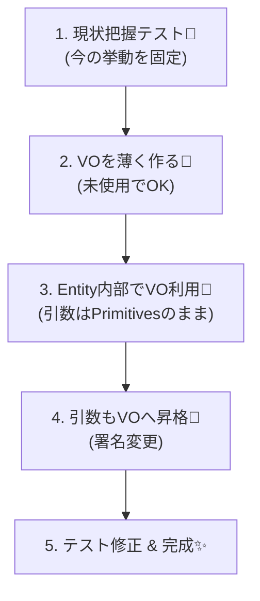

# 第23章：リファクタ演習（Entity→VO化でバグを減らす）🔧✨

この章は「既に動いてるコード」を、**壊さずに・安全に・ちょっとずつ**良くする練習だよ〜！🧸🛡️  
主役はこれ👇  
- **プリミティブ地獄（string/number/Dateの寄せ集め）**を  
- **Value Object（VO）**に移して、**バグを減らす**✨

---

## 0. まず“最新”メモ（いまの相場感）🗞️✨

- TypeScript は npm の `typescript` パッケージ最新が **5.9.3**（2025-09-30公開）だよ 📦✨  
- 次の大きな流れとして **TypeScript 6.0 は「橋渡し」的な位置づけ**で、TypeScript 7（ネイティブ移行）へ寄せる方針が公式ブログで語られてるよ 🧭  
- Node は **v24 が Active LTS**（安定運用寄りでおすすめ）✨  
- ESLint は **v10 がRC**に入ってきてる（移行するなら破壊的変更チェック大事）⚠️  
- テストは Vitest の **v4 系**が今の主流ラインだよ 🧪  

（ここは「最新を調べたよ〜」の証拠メモだけ！本編は設計と手順がメインだよ🙂）

---

## 1. 今日のお題：レガシーOrderをVO化するよ🛒💥➡️💎


ありがちな“動くけど怖い”やつを用意するね…！😇  
**Order が string/number/Date を抱えすぎ**てて、バリデーションもあちこちに散らばってる状態。

### レガシーコード（Before）😵‍💫
````ts
// src/domain/Order.ts
export type OrderStatus = "Draft" | "Submitted" | "Paid" | "Cancelled";

export class Order {
  constructor(
    public readonly id: string,
    public email: string,          // ← Emailのルールが散らばる
    public postalCode: string,     // ← "123-4567" か "1234567" かブレる
    public amountYen: number,      // ← -100 も入る、丸めもブレる
    public startAt: Date,          // ← start <= end を守れてない
    public endAt: Date,
    public status: OrderStatus = "Draft",
  ) {}

  submit() {
    if (!this.email.includes("@")) throw new Error("invalid email");
    if (this.amountYen <= 0) throw new Error("amount must be positive");
    if (this.startAt > this.endAt) throw new Error("invalid period");
    if (this.status !== "Draft") throw new Error("cannot submit");
    this.status = "Submitted";
  }

  pay(paidAmountYen: number) {
    if (this.status !== "Submitted") throw new Error("cannot pay");
    if (paidAmountYen !== this.amountYen) throw new Error("amount mismatch"); // ←通貨/丸め/手数料で死ぬ
    this.status = "Paid";
  }

  changeAddress(postalCode: string) {
    // バリデーションが中途半端（7桁のみOKにしたいのに…）
    if (postalCode.length < 7) throw new Error("too short");
    this.postalCode = postalCode;
  }
}
````

---

## 2. ゴール：どんな姿になったら勝ち？🏁✨


VO化後はこうなるのが理想だよ👇💎

```txt
Order (Entity) 🪪
  - id (OrderId) 🆔
  - email (Email) 📧  ← VOが自分で検証
  - address (Address) 🏠 ← PostalCodeを内包
  - total (Money) 💰   ← 計算/丸め/比較をVOに閉じ込める
  - period (Period) 📅 ← start<=end をVOで保証
  - status (Status) 🚦 ← 状態遷移はOrderの責務
```

ポイントはこれ！🌟

* **Orderの責務**：状態遷移・業務イベント（submit/pay/changeAddress）
* **VOの責務**：値の正しさ・形式・計算・等価性（Email/Money/PostalCode/Period）

---

## 3. いちばん大事：リファクタの鉄則3つ🛡️✨

### ✅ 鉄則A：小さく刻む（1コミット1安全）🧩


「VOを全部一気に入れる！」は事故りやすい😇
**最小変更 → テスト → コミット**のリズムでいくよ🎵

### ✅ 鉄則B：テストを“盾”にする🧪🛡️

既存の挙動が分からないときは、先に**キャラクタライゼーションテスト**（現状把握テスト）を書くよ！

### ✅ 鉄則C：外（DTO/API）を急に変えない🚪

中（ドメイン）を整える章だから、入力は一旦そのままにして
**境界で変換**する方向へ寄せていく（第17〜21章の流れと相性◎）🙂

---

## 4. 手順：Entity→VO化リファクタ（王道ルート）🗺️✨

ここからがメインだよ〜！🧸💪
（Vitest想定で書くね🧪）




---

### Step 1：現状把握テストを書く🧪🔍


「今の仕様って何？」を固定するよ。
**“正しいかどうか”じゃなく、“今こう動いてる”を記録**するイメージ📸

```ts
// test/order.characterization.test.ts
import { describe, it, expect } from "vitest";
import { Order } from "../src/domain/Order";

describe("Order characterization", () => {
  it("submit: Draft -> Submitted", () => {
    const order = new Order(
      "o1",
      "a@b.com",
      "1234567",
      1000,
      new Date("2026-01-01"),
      new Date("2026-01-10"),
      "Draft",
    );
    order.submit();
    expect(order.status).toBe("Submitted");
  });

  it("changeAddress: accepts 7+ length string (legacy behavior)", () => {
    const order = new Order(
      "o1",
      "a@b.com",
      "1234567",
      1000,
      new Date("2026-01-01"),
      new Date("2026-01-10"),
      "Draft",
    );
    order.changeAddress("12-34567"); // 変だけど通っちゃうのが現状
    expect(order.postalCode).toBe("12-34567");
  });
});
```

👉 ここがポイント💡

* 変な挙動でも、**今の現実**ならいったん記録
* あとでVO導入で仕様を締めるときに「どこが変わったか」が分かる✨

---

### Step 2：VOを“薄く”導入（まず型だけ差し込む）💎🧩


いきなり全面置き換えじゃなくて、まず **Money / PostalCode / Period / Email** を“最小”で作るよ。
（この章では「完璧VO」より **導入手順**が主役🙂）

#### Email（最小）

```ts
// src/domain/vo/Email.ts
export class Email {
  private constructor(private readonly value: string) {}

  static create(raw: string): Email {
    if (!raw.includes("@")) throw new Error("invalid email");
    return new Email(raw);
  }

  toString() {
    return this.value;
  }

  equals(other: Email) {
    return this.value === other.value;
  }
}
```

#### PostalCode（最小：7桁に正規化）

```ts
// src/domain/vo/PostalCode.ts
export class PostalCode {
  private constructor(private readonly digits7: string) {}

  static create(raw: string): PostalCode {
    const digits = raw.replace(/[^0-9]/g, "");
    if (digits.length !== 7) throw new Error("invalid postal code");
    return new PostalCode(digits);
  }

  format() {
    return `${this.digits7.slice(0, 3)}-${this.digits7.slice(3)}`;
  }

  toDigits() {
    return this.digits7;
  }

  equals(other: PostalCode) {
    return this.digits7 === other.digits7;
  }
}
```

#### Money（最小：JPY固定の例）

```ts
// src/domain/vo/Money.ts
export class Money {
  private constructor(private readonly yen: number) {}

  static yen(amount: number): Money {
    if (!Number.isInteger(amount)) throw new Error("money must be integer yen");
    if (amount <= 0) throw new Error("money must be positive");
    return new Money(amount);
  }

  equals(other: Money) {
    return this.yen === other.yen;
  }

  toNumber() {
    return this.yen;
  }
}
```

#### Period（最小）

```ts
// src/domain/vo/Period.ts
export class Period {
  private constructor(public readonly start: Date, public readonly end: Date) {}

  static create(start: Date, end: Date): Period {
    if (start.getTime() > end.getTime()) throw new Error("invalid period");
    return new Period(new Date(start), new Date(end));
  }
}
```

---

### Step 3：Order内部だけVO化（外の形は一旦そのまま）🪪➡️💎


いきなりコンストラクタの引数を全部VOにすると、呼び出し側が大炎上🔥
だからまずは **Orderの中でVOを使う**ところからいくよ🙂

#### 改修ポイント（例）

* `submit()` の中のバリデーションを VO に移す
* `pay()` の比較を Money に寄せる
* `changeAddress()` を PostalCode に寄せる
* `startAt/endAt` を Period に寄せる（保持は後で）

#### まず“変換して検証するだけ”のリファクタ

```ts
// src/domain/Order.ts
import { Email } from "./vo/Email";
import { Money } from "./vo/Money";
import { Period } from "./vo/Period";
import { PostalCode } from "./vo/PostalCode";

export type OrderStatus = "Draft" | "Submitted" | "Paid" | "Cancelled";

export class Order {
  constructor(
    public readonly id: string,
    public email: string,
    public postalCode: string,
    public amountYen: number,
    public startAt: Date,
    public endAt: Date,
    public status: OrderStatus = "Draft",
  ) {}

  submit() {
    // ✅ “VOを作れるか”で検証（バリデーションはVOの責務へ）
    Email.create(this.email);
    Money.yen(this.amountYen);
    Period.create(this.startAt, this.endAt);

    if (this.status !== "Draft") throw new Error("cannot submit");
    this.status = "Submitted";
  }

  pay(paidAmountYen: number) {
    if (this.status !== "Submitted") throw new Error("cannot pay");

    const expected = Money.yen(this.amountYen);
    const paid = Money.yen(paidAmountYen);

    if (!paid.equals(expected)) throw new Error("amount mismatch");
    this.status = "Paid";
  }

  changeAddress(postalCode: string) {
    // ✅ ここで「7桁」へ寄せる（仕様が変わるのでテストも更新が必要）
    const pc = PostalCode.create(postalCode);
    this.postalCode = pc.toDigits(); // 内部表現を統一
  }
}
```

✨この時点で起きること

* `changeAddress("12-34567")` は **今度は落ちる**（7桁にならないから）
* つまりテストが教えてくれる：「仕様が変わったよ！」📣

---

### Step 4：テストを更新して“仕様変更”を明文化する🧪📝

キャラクタライゼーションテストは「現状固定」だったけど、
ここからは「こうしたい！」に寄せていいよ🙂🎀

```ts
// test/order.test.ts
import { describe, it, expect } from "vitest";
import { Order } from "../src/domain/Order";

describe("Order", () => {
  it("changeAddress: normalizes to 7 digits", () => {
    const order = new Order(
      "o1",
      "a@b.com",
      "1234567",
      1000,
      new Date("2026-01-01"),
      new Date("2026-01-10"),
      "Draft",
    );

    order.changeAddress("123-4567");
    expect(order.postalCode).toBe("1234567");
  });

  it("changeAddress: rejects invalid", () => {
    const order = new Order(
      "o1",
      "a@b.com",
      "1234567",
      1000,
      new Date("2026-01-01"),
      new Date("2026-01-10"),
      "Draft",
    );

    expect(() => order.changeAddress("12-34567")).toThrow();
  });
});
```

---

### Step 5：いよいよ“プロパティの型”をVOに置き換える（段階的）💎➡️🧱


ここが本番の「Replace Primitive with Object」だよ✨
でも一気にやらず、**1フィールドずつ**いくのがコツ🙂

#### 5-A) Moneyから置き換える（比較が楽になる）💰

```ts
// src/domain/Order.ts
import { Email } from "./vo/Email";
import { Money } from "./vo/Money";
import { Period } from "./vo/Period";
import { PostalCode } from "./vo/PostalCode";

export type OrderStatus = "Draft" | "Submitted" | "Paid" | "Cancelled";

export class Order {
  constructor(
    public readonly id: string,
    public email: Email,
    public postalCode: PostalCode,
    public total: Money,
    public period: Period,
    public status: OrderStatus = "Draft",
  ) {}

  static create(params: {
    id: string;
    email: string;
    postalCode: string;
    amountYen: number;
    startAt: Date;
    endAt: Date;
  }): Order {
    return new Order(
      params.id,
      Email.create(params.email),
      PostalCode.create(params.postalCode),
      Money.yen(params.amountYen),
      Period.create(params.startAt, params.endAt),
      "Draft",
    );
  }

  submit() {
    if (this.status !== "Draft") throw new Error("cannot submit");
    this.status = "Submitted";
  }

  pay(paidAmountYen: number) {
    if (this.status !== "Submitted") throw new Error("cannot pay");
    const paid = Money.yen(paidAmountYen);
    if (!paid.equals(this.total)) throw new Error("amount mismatch");
    this.status = "Paid";
  }

  changeAddress(postalCode: string) {
    this.postalCode = PostalCode.create(postalCode);
  }
}
```

ここで超気持ちいいところ😍

* `submit()` から **バリデーションが消えた**
* 「作れた時点で正しい」へ寄せられた（無効状態を作りにくい）🛡️

テスト側は `Order.create(...)` を使うように直すだけでOKになりやすいよ🧪✨

---

## 5. よくある“事故”と回避テク🍰⚠️

### 事故①：VO化したのに、DTOにVOが漏れてくる😇

✅ 回避：**境界（DTO→Domain変換）**で `Email.create(dto.email)` する
（この章は中を整える章だけど、意識だけは持っておくと強いよ💪）

### 事故②：例外だらけで呼び出し側がつらい😭

✅ 回避：章が進んだら `Result` 型（成功/失敗）に寄せる（第17章の流れ）⚠️✨
今章はまず「VOの導入手順」を体に覚えさせよ〜！

### 事故③：一気に全部置換してコンフリクト祭り🎆

✅ 回避：

* **Money → PostalCode → Period → Email** みたいに1個ずつ
* 1個終わるたびにテストが通る状態へ🧪✅

---

## 6. 演習（手を動かすコーナー）✍️🎀

### 演習1：Address VO を作って、Orderからstringを追い出してね🏠✨


* `Address` が `PostalCode` を持つ
* `Address.create(postalCodeRaw)` みたいに入口を作る
* `Order.changeAddress()` は `Address` 差し替えにする

ヒント🧠

```ts
export class Address {
  private constructor(public readonly postalCode: PostalCode) {}
  static create(postalCodeRaw: string): Address {
    return new Address(PostalCode.create(postalCodeRaw));
  }
}
```

### 演習2：`pay()` を「手数料」対応にしてみよ〜💳✨

例：支払い額が `total + fee` でもOKにしたい

* `fee` も `Money` にする
* 比較が `Money` の演算で書けるようにする（`add` を実装してもOK）

### 演習3：テストを「状態遷移」中心に整理してね🚦🧪

* `Draft -> Submitted -> Paid`
* 変な順番は落ちる
* 例外メッセージは固定しすぎない（壊れやすいから）🙂

---

## 7. 小テスト（サクッと確認）📝✨

1. `postalCode: string` のままだと、どんなバグが起きやすい？📮
2. 「キャラクタライゼーションテスト」って何のために書くの？📸
3. VOを導入したのに `submit()` にバリデーションが残ってる。何がイヤ？😵‍💫
4. 一気に全部VO化しない方がいい理由は？🧩
5. `Order.create()` みたいな factory を用意する良さは？🚪✨

（答え合わせしたくなったら「回答つきで！」って言ってね🙂🎀）

---

## 8. AIプロンプト集（Copilot/Codex向け）🤖✨

そのままコピペで使えるよ〜🧸💕

### ✅ “壊さない”リファクタ依頼

* 「このクラスをVO化したい。**既存テストを維持**しつつ、**1フィールドずつ**置き換える手順で差分案を出して」
* 「Replace Primitive with Object をやりたい。**最初はOrder内部でVOを使うだけ**にして、段階移行のコミット順を提案して」

### ✅ テスト強化

* 「このクラスのキャラクタライゼーションテストを追加して。今の挙動を固定する目的で、**境界値**を多めに」
* 「状態遷移のテストを表（状態×イベント）っぽく整理して」

### ✅ 危険ポイント洗い出し

* 「このVO導入で、DTOやDB層にVOが漏れそうな箇所を指摘して」
* 「変更の影響範囲（呼び出し側、テスト、mapper）を箇条書きで」

---

## 9. できたら勝ち！チェックリスト✅🏁

* [ ] `Order` から `string/number/Date` が減って、VOが増えた💎
* [ ] バリデーションが **VOのcreate** に集まった🛡️
* [ ] `submit/pay/changeAddress` が “イベント” っぽくスッキリした🚦
* [ ] テストが「仕様（ルール）」を説明してる🧪📘
* [ ] 変更が怖くなくなった（テストが守ってくれる）💪✨

---

必要なら、次のメッセージで
✅「この章の完成形のフォルダ構成（src/domain/vo など）」📁✨
✅「Order + Address + Money + Period を使ったミニプロジェクト用の差分一式」🧩
も、まるっと作るよ〜！😊🎀

