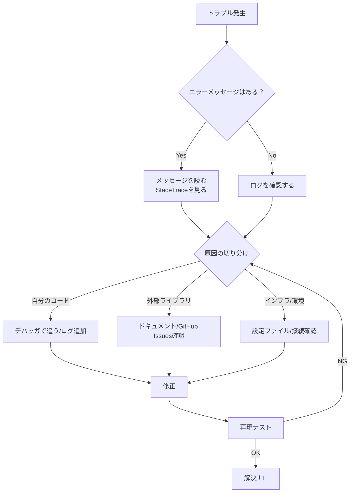

# 第02章：2026環境の準備（Windows + VS）🪟🛠️

（エラーモデリング学習用の“実験場”を最短で作るよ〜😊✨）

---

## 0) この章でできるようになること 🎯✨

この章のゴールはこれだけ👇

* ✅ **Visual Studio 2026**（安定版）でC#をすぐ動かせる
* ✅ **.NET 10（LTS）**で Console / Minimal Web API を起動できる ([Microsoft][1])
* ✅ **Copilot（またはAI拡張）**を“教材向けの安全運転ルール”で使える ([Microsoft Learn][2])

最後に「動いた！」のスクショ撮れたら勝ち🏆📸✨

---

## 1) まず押さえる：今どきの“正解セット” 📦✨


本章は、基本この組み合わせで進めるよ👇

* **Visual Studio 2026（Stable）**：例）18.2.0（2026-01-13リリース） ([Microsoft Learn][3])
* **.NET 10（LTS）**：2025-11-11 リリース、2026-01-13時点で 10.0.2 パッチ ([Microsoft][1])
* **C# 14**：.NET 10世代の言語機能 ([Microsoft Learn][4])
* **GitHub Copilot（VS内）**：VS 17.8以降で利用スタートの案内 ([Microsoft Learn][2])

> ちなみに：Visual Studio 2026は「VS2022と並行インストールOK」な流れで案内されてるよ〜😊 ([Visual Studio][5])

---

## 2) Visual Studio 2026 の入れ方（最短ルート）🚀🧁

### 2-1. インストールで選ぶもの（ここだけ外さないで🙏）

インストーラーの「ワークロード」で、まずはこの2つだけでOK✨

* ✅ **.NET デスクトップ開発**（Consoleなど）
* ✅ **ASP.NET と Web 開発**（Web APIなど）

あとから増やせるから、最初は軽めが正義😆🧡

---

## 3) .NET 10 が入ってるか確認しよ 🔎✨

Visual Studio を入れたら、まず **ターミナルで確認**するのが早いよ〜！

（PowerShellでもOK）

```powershell
dotnet --info
dotnet --list-sdks
```

目安：`.NET SDK 10.0.xxx` が見えたらOK ✅
.NET 10 は LTS で、2026-01-13時点の最新パッチが 10.0.2 だよ ([Microsoft][1])

---

## 4) 演習①：Consoleアプリを作って動かす 🧪🖥️

### 4-1. Visual Studio で作る（いちばん簡単）

1. **新しいプロジェクト作成**
2. **Console App**（C#）を選ぶ
3. フレームワークは **.NET 10** を選ぶ（表示されてなければSDK入ってない可能性🥺）

Program.cs をこれにする👇（“動作確認だけ”ね✨）

```csharp
Console.WriteLine("Hello from Error Modeling Lab! 🧁✨");
Console.WriteLine($".NET: {Environment.Version}");
Console.WriteLine($"OS: {Environment.OSVersion}");
```

実行して、表示が出たらOK〜！🎉

---

## 5) 演習②：最小のWeb APIを作って動かす 🌐🧪

### 5-1. Visual Studio で作る（テンプレで一瞬✨）

1. 新しいプロジェクト作成
2. **ASP.NET Core Web API** を選ぶ
3. フレームワーク **.NET 10**
4. 起動（F5でもCtrl+F5でもOK）

起動できたら、ブラウザで `/swagger` が出るはず！（テンプレ次第で表示）
出たら勝ち🏆✨

> もし HTTPS 証明書の警告が出ても、開発中はよくあるよ〜（後で整える）😆🔐

---

## 6) VS Code でもやる（やりやすい人向け）🧑‍💻✨

「軽く触りたい」「差分が見やすい」ならVS Codeもアリだよ〜！

* VS CodeのC#環境は **C# Dev Kit** が基本セットになってる ([Visual Studio Code][6])
* Dev Kit は「ソリューション管理」「テスト発見」も面倒見てくれる方向 ([Visual Studio Code][7])

### 6-1. まずはCLIで作る（確実に動く）

```powershell
mkdir ErrorModelingLab
cd ErrorModelingLab

dotnet new console -n ConsolePlayground
dotnet new webapi -n ApiPlayground

dotnet run --project ConsolePlayground
dotnet run --project ApiPlayground
```

---


## 7) AI拡張の使い方ルール（教材モード）🤖🧁✨

AIって便利だけど、**使い方の型**を最初に決めると事故らないよ〜！🚗💨

### 7-1. “3つだけ”守るルール ✅✅✅

1. **生成したら必ず説明させる**（理解が本体！）
2. **差分を小さく**（一気に大量変更しない）
3. **秘密を貼らない**（APIキー・接続文字列とか絶対🙅‍♀️）

CopilotはVS 17.8以降で案内されてるよ ([Microsoft Learn][2])
VS 2026のリリースノートでもCopilot機能の案内が続いてるよ ([Microsoft Learn][8])

### 7-2. すぐ使える“魔法のお願いテンプレ”🪄💬

（コピペして使ってOKだよ〜😊）

* 💬「このプロジェクトの目的（Console/Web API）を初心者向けに説明して。5行で！」
* 💬「いまのコードを変更せずに、“どこが入り口か”だけ教えて」
* 💬「このテンプレのファイル一覧を、役割つきで表にして」
* 💬「変更案を出すときは *最小差分* で。理由も書いて」

---

## 8) よくある詰まりポイント（秒で直す）🧯✨

### トラブルシューティングの基本フロー🕵️‍♀️🛠️




### A) 「.NET 10 が選べない」🥺

* `dotnet --list-sdks` に 10.0 が出てるか確認
* 出てなければ .NET 10 SDK が入ってない可能性が高いよ（VS側に同梱される構成もある） ([Microsoft][1])

### B) 「Web API起動したけどアクセスできない」🌐💦

* だいたい **ポート違い** or **HTTPS警告**
* 出力ログに `Now listening on: ...` が出てるから、それを開けばOK🙆‍♀️

### C) 「Copilotが出てこない」🤖❓

* VS側は “Copilotのバッジからサインイン” って手順になってるよ ([Microsoft Learn][2])

---

## 9) ミニ演習（この章の“提出物”）📮✨

次の3つを満たしたら、この章クリアだよ〜！🎓💕

* ✅ Console が起動してメッセージ表示できた（スクショ📸）
* ✅ Web API が起動して応答できた（スクショ📸）
* ✅ AIに「このテンプレの入り口どこ？」って聞いて、説明を読んだ（メモ📝）

---

## まとめ：この章の成果物 🎁✨

ここまでで、あなたのPCには

* 「試せるConsole」🖥️
* 「試せるWeb API」🌐
* 「AIで雛形→自分で理解する」🤖👀

…っていう **エラーモデリング用の“実験場”**ができたよ〜！🥳🧪✨

---

次の第3章では、わざと例外を起こして🔍「どこから来たの？」を追いかける練習に入るよ〜🧯💨
（スタックトレースが“怖くなくなる”回だよ😆💕）

[1]: https://dotnet.microsoft.com/en-us/platform/support/policy/dotnet-core?utm_source=chatgpt.com "NET and .NET Core official support policy"
[2]: https://learn.microsoft.com/en-us/visualstudio/ide/visual-studio-github-copilot-get-started?view=visualstudio&utm_source=chatgpt.com "Get Started with GitHub Copilot - Visual Studio (Windows)"
[3]: https://learn.microsoft.com/en-us/visualstudio/releases/2026/release-history?utm_source=chatgpt.com "Visual Studio Release History"
[4]: https://learn.microsoft.com/en-us/dotnet/csharp/whats-new/csharp-14?utm_source=chatgpt.com "What's new in C# 14"
[5]: https://visualstudio.microsoft.com/insiders/?utm_source=chatgpt.com "Visual Studio 2026 Insiders - Faster, smarter IDE - Microsoft"
[6]: https://code.visualstudio.com/docs/languages/csharp?utm_source=chatgpt.com "Installing C# support"
[7]: https://code.visualstudio.com/docs/languages/dotnet?utm_source=chatgpt.com "Using .NET in Visual Studio Code"
[8]: https://learn.microsoft.com/en-us/visualstudio/releases/2026/release-notes?utm_source=chatgpt.com "Visual Studio 2026 Release Notes"
