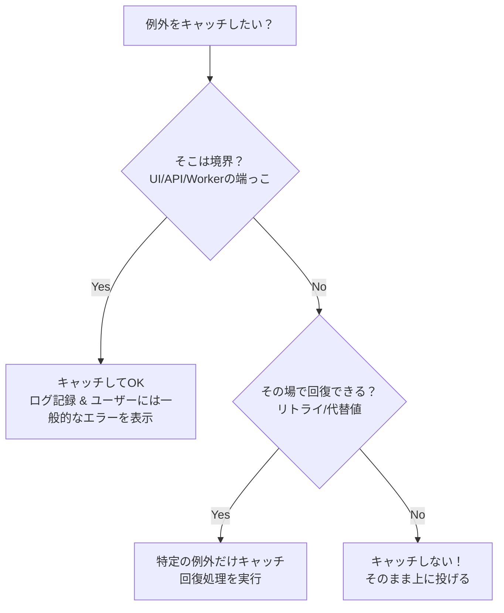

# 第04章：例外の“やっちゃダメ集”🙅‍♀️💥

この章は「**例外で事故りがちな書き方を、先に潰す**」回だよ〜😊✨
（ここで避けられると、後の Result型や例外境界がめちゃくちゃ楽になるよ🎁🚪）

> ちなみに、2026の最新環境（Visual Studio 2026 + .NET 10 + C# 14）前提でOKだよ🛠️✨ ([Microsoft Learn][1])

---

## 4-1. やっちゃダメ①：例外の握りつぶし😇🗑️（何もせず隠す）


### ❌ ダメな例（静かに失敗して“原因不明”になる💣）

```csharp
try
{
    SaveOrder(order);
}
catch
{
    // 何もしない（握りつぶし）
}
```

これ、あとで絶対こうなるよ👇😭

* 「保存された？されてない？」が分からない
* ログもない、画面にも出ない、**デバッグ地獄**🌀

### ✅ まずはこうする（最低限：記録して、上に渡す🧯）

```csharp
try
{
    SaveOrder(order);
}
catch (Exception ex)
{
    logger.LogError(ex, "SaveOrder failed. OrderId={OrderId}", order.Id);
    throw; // ← ここ大事（スタックトレース保持）
}
```

`throw;` は元のスタックトレースを保持してくれるよ🔍✨（`throw ex;`は後で説明！） ([Microsoft Learn][2])

---

### 4-2) 例外をキャッチしていい基準🕵️‍♀️✅



## 4-2. やっちゃダメ②：広すぎcatch🙅‍♀️🕸️（catch(Exception) を乱用）

### ❌ ダメな例（“何でも捕まえる”は危ない⚠️）

```csharp
try
{
    DoSomething();
}
catch (Exception ex)
{
    // とりあえず握る or 適当に返す
    return;
}
```

なぜ危ないの？😵‍💫

* 本来止めるべきバグ（不変条件違反とか）まで隠しちゃう
* 予想外の問題を「なかったこと」にして、被害が広がる💥

Microsoftの静的解析ルールでも **「一般的な例外型をcatchしないで」** って出るくらい定番の地雷だよ💣（CA1031） ([Microsoft Learn][3])


### ✅ 基本の改善：**捕まえるのは“想定してる例外だけ”**🎯

```csharp
try
{
    CallExternalApi();
}
catch (HttpRequestException ex)
{
    logger.LogWarning(ex, "Network error");
    throw;
}
catch (TimeoutException ex)
{
    logger.LogWarning(ex, "Timeout");
    throw;
}
```

> 「じゃあ catch(Exception) は完全に禁止？」
> **“アプリの一番外側（入口）”ならアリ**になりやすいよ😊
> 例：APIのグローバル例外ハンドラ、GUIアプリの最上位、ConsoleのMainなど。
> ただしそこでやるのは「**ログして、ユーザーに優しく伝えて、落とすor変換**」みたいな整理が基本だよ🧾✨（この辺は後の“例外境界”でガッチリやる！🚪）

---

## 4-3. やっちゃダメ③：情報欠落throw📉💥（原因が消える投げ方）

ここが一番もったいないやつ😭


### ❌ ダメ：`throw ex;`（スタックトレースがリセットされる🧨）

```csharp
catch (Exception ex)
{
    logger.LogError(ex, "failed");
    throw ex; // ← ダメ！
}
```

これ、**例外の発生源が見えなくなる**ことがあるの…🫠
静的解析でも「スタック情報を保持して再throwしてね（CA2200）」って言われるよ📌 ([Microsoft Learn][4])

### ✅ 正解：`throw;`（元の情報を保持✨）

```csharp
catch (Exception ex)
{
    logger.LogError(ex, "failed");
    throw; // ← これ！
}
```

### ❌ ついでにダメ：雑なラップで原因を捨てる🗑️

```csharp
catch (Exception ex)
{
    throw new Exception("注文の保存に失敗しました"); // 原因(ex)が消える…
}
```


### ✅ ラップするなら“原因をつなぐ”🔗

```csharp
catch (Exception ex)
{
    throw new InvalidOperationException("注文の保存に失敗しました", ex);
}
```

---

## 4-4. おまけ：初心者が踏みやすい地雷リスト💣🧠

Microsoftのガイドでも「例外はこう扱うといいよ」がまとまってるので、超重要だけ拾うね😊 ([Microsoft Learn][5])


* ❌ **例外で通常フロー制御**（if の代わりに例外）
  ✅ まずは `if` / 事前チェックで回避🌱


* ❌ **例外メッセージだけログ**（ex を渡さない）
  ✅ `logger.LogError(ex, "...")` で例外まるごと渡す🔎
* ❌ **catchして状態が中途半端なまま続行**
  ✅ ロールバック/後片付け/再throw を意識🧹

---

## 4-5. ミニ演習✍️✨（悪い例を“改善案”に直そう）

題材：推し活グッズ購入管理🛍️💖（在庫を引いて保存する、みたいな処理）

### 問1：握りつぶしを直してね🧯

```csharp
try
{
    repository.Save(order);
}
catch
{
}
```

✅ 例（回答の一つ）

```csharp
try
{
    repository.Save(order);
}
catch (Exception ex)
{
    logger.LogError(ex, "Save failed. OrderId={OrderId}", order.Id);
    throw;
}
```

### 問2：広すぎcatchを直してね🎯

```csharp
try
{
    client.Post(order);
}
catch (Exception ex)
{
    logger.LogInformation("failed");
    throw;
}
```

✅ 例（回答の一つ）

```csharp
try
{
    client.Post(order);
}
catch (HttpRequestException ex)
{
    logger.LogWarning(ex, "Network error while posting order. OrderId={OrderId}", order.Id);
    throw;
}
catch (TimeoutException ex)
{
    logger.LogWarning(ex, "Timeout while posting order. OrderId={OrderId}", order.Id);
    throw;
}
```

### 問3：情報欠落throwを直してね🔍

```csharp
catch (Exception ex)
{
    throw ex;
}
```

✅ 正解

```csharp
catch (Exception ex)
{
    throw;
}
```

---

## 4-6. AI活用🤖✨（Copilot / Codex の使い方：章の型）

「直す案」を出させるだけじゃなくて、**理由を説明させる**のがコツだよ😊🧠

* 💬 プロンプト例①
  「この catch は何が危険？“起こりうる事故”を3つ挙げて、改善コードも出して」

* 💬 プロンプト例②
  「`throw ex;` がダメな理由を、スタックトレース視点で説明して。`throw;`との違いも」

* 💬 プロンプト例③
  「この try/catch を“想定している例外だけ捕まえる”形に直して。候補の例外型も提案して」

---


## 4-7. 今日の成果物（1枚）📄✨：「例外やっちゃダメチェックリスト」✅

* [ ] catch で **握りつぶしてない**（ログ or 伝播）
* [ ] catch(Exception) を **乱用してない**（狙った型だけ） ([Microsoft Learn][3])
* [ ] 再throwは **`throw;`**（`throw ex;` しない） ([Microsoft Learn][2])
* [ ] ラップするなら **inner exception を残す**🔗
* [ ] ログは **ex付きで出す**（メッセだけにしない）🔎

---

次の第5章で、いよいよ超重要な分岐！🚦✨
**「想定内の失敗」** と **「想定外の異常」** を分けるよ〜😊💖

[1]: https://learn.microsoft.com/en-us/dotnet/csharp/whats-new/csharp-14?utm_source=chatgpt.com "What's new in C# 14"
[2]: https://learn.microsoft.com/ja-jp/dotnet/csharp/language-reference/statements/exception-handling-statements?utm_source=chatgpt.com "例外処理ステートメント - throw、try、catch、finally - C# ..."
[3]: https://learn.microsoft.com/ja-jp/dotnet/fundamentals/code-analysis/quality-rules/ca1031?utm_source=chatgpt.com "CA1031: 一般的な例外の種類はキャッチしません (コード分析)"
[4]: https://learn.microsoft.com/en-us/dotnet/fundamentals/code-analysis/quality-rules/ca2200?utm_source=chatgpt.com "CA2200: Rethrow to preserve stack details (code analysis)"
[5]: https://learn.microsoft.com/en-us/dotnet/standard/exceptions/best-practices-for-exceptions?utm_source=chatgpt.com "Best practices for exceptions - .NET"
