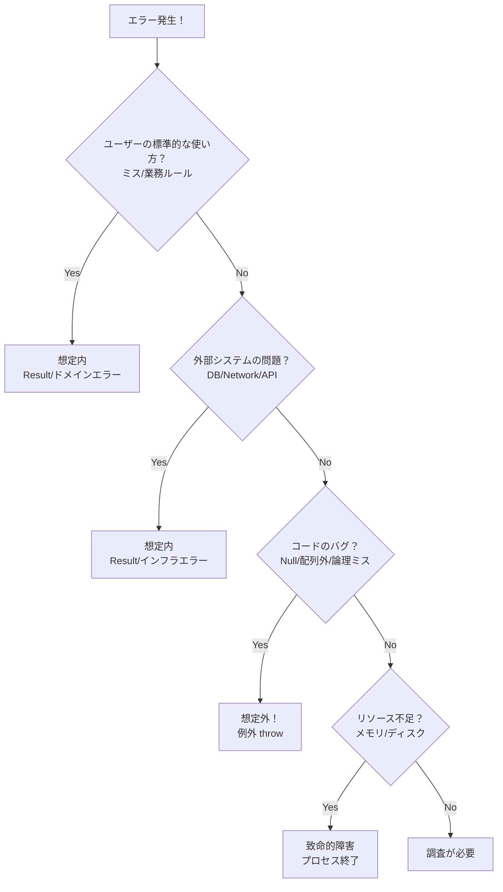

# 第05章：「想定内の失敗」と「想定外の異常」を分ける🚦

この章はほんと大事…！ここがブレると、後ろの **Result型** も **例外境界** も全部グラグラしちゃうの🥺🧱
逆にここが決まると、エラー設計がスッと楽になるよ〜😊💖

---

## 1. 今日のゴール🎯✨

章が終わったら、こう言える状態になろう👇

* ✅ 「これは**想定内**だから Result（戻り値）で返す」🎁
* ✅ 「これは**想定外**だから例外で落として、ログで調査」⚡
* ✅ 迷ったときの“判断質問”を持ってる🧠🔎

ちなみに 2026 世代の .NET は **.NET 10 / C# 14** が前提になる想定だよ（Microsoft Learn の更新も 2025/11 で揃ってるよ）📚✨ ([Microsoft Learn][1])

---

## 2. まず結論！失敗は2種類だけ覚えて💡🚦


### ✅ 想定内の失敗（Expected failure）🎁

**「普通に起こりうる」** 失敗。
ユーザーが入力をミスったり、業務ルールに合わなかったり、外部I/Oが一時的に失敗したり…みたいなやつ。

* ユーザーに **やさしく説明できる** 💬🎀
* 呼び出し側が **分岐して処理できる** 🔀✨
* “よく起きる条件”は **例外で表現しない**（例外は重くなりがち）🧯💦 ([Microsoft Learn][2])


### ❌ 想定外の異常（Unexpected abnormality）⚡

**「起きたらおかしい」** 異常。つまりバグ候補🧨

* 不変条件が破れてる
* null参照、配列範囲外、ありえない状態遷移
* “到達しないはずの分岐に来た”

これは **例外でFail Fast** して、ログやデバッガで一気に原因へ🏃‍♀️💨

---

## 3. 判断に迷ったら、この5問だけやってみて📝🧠

### 3) 5つの質問で白黒ハッキリさせる！⚖️🕵️‍♀️




### 🚦判断質問チェックリスト（超実用）

1. **ユーザーが普通に使ってても起きうる？** 👩‍💻
   → YESなら想定内の可能性が高い

2. **ユーザーに“次の行動”を案内できる？** 🧭
   （例：「この項目を修正してね」「少し待って再試行してね」）
   → できるなら想定内

3. **発生頻度が高い（起こりがち）？** 🔁
   → 高いなら想定内（例外で制御しない方が自然） ([Microsoft Learn][2])

4. **起きた瞬間に“開発者が調査すべき事故”？** 🧑‍🚒
   → YESなら想定外

5. **同じ入力・同じ状態で再現する？** 🎯
   → 再現しない・環境依存・ランダムっぽいなら、想定外（またはインフラ）として扱ってログ重視

---


## 4. 具体例で感覚をつかもう🌰✨（超あるある）

### ✅ 想定内の例（Resultで扱いたい候補）🎁

* 入力が空、形式が違う（メール形式じゃない等）✉️❌
* 数量が0以下、上限超え 📦❌
* 在庫不足、期限切れ、予算超え 🛍️💔
* 既に存在する（重複登録）🧾⚠️
* 外部APIが一時的に落ちた／タイムアウト ⏳🌩️（＝ユーザーに「再試行」を案内できる）

.NET の例外ガイドでも「よくある条件は例外を避ける」が推されてるよ🧠✨ ([Microsoft Learn][2])

### ❌ 想定外の例（例外でFail Fast）⚡

* 「数量は常に正」と決めたのに負の値が来た
* あり得ない状態（例：購入完了なのに在庫が減ってない）
* null参照・IndexOutOfRange など
* switch の default に来た（到達しない前提なのに…）

---


## 5. コードの“雰囲気”だけ先に見よっか😊💻

> この章では Result 型をまだ実装しないけど、「想定内は分岐できる形で返す」感じだけ掴もう〜🎀

### ✅ 想定内：分岐できる形で返す（まずはTry〜の感覚）

```csharp
if (!int.TryParse(inputQuantity, out var quantity))
{
    // 想定内：入力ミス
    return "数量は数字で入力してね";
}

if (quantity <= 0)
{
    // 想定内：業務ルール
    return "数量は1以上にしてね";
}

// OKなら続行
```

### ❌ 想定外：ここに来たらおかしいので例外⚡

```csharp
// 不変条件：「確定済み注文は必ず OrderId を持つ」
if (order.IsConfirmed && order.OrderId is null)
{
    throw new InvalidOperationException("Confirmed order must have OrderId.");
}
```

---

## 6. ミニ演習：20個を「想定内/想定外」に分類しよう📌📝✨

### 👇問題（まずは直感でOK！）

1. メールアドレスが `aaa` だった
2. 数量が `-3` だった
3. 住所が未入力
4. DB接続がタイムアウトした
5. 外部APIが 503 を返した
6. 在庫が足りない
7. 既に同じメールで会員登録済み
8. クレカ決済が「限度額」になった
9. `null` 参照例外が出た
10. 配列範囲外アクセスが出た
11. 「購入確定」なのに「支払い状態が未設定」
12. 画像アップロードがサイズ上限超え
13. CSVの列数が足りない（ユーザーアップロード）
14. Redis が落ちてた
15. キャンセル要求（ユーザーがキャンセル押した）
16. リトライしても直らないDNSエラー
17. `switch` の default に到達（到達しない設計のはず）
18. 日付が「未来」だとダメなのに未来日が入力された
19. 同時購入で楽観ロックが失敗した
20. ランダムにだけ起きる `ObjectDisposedException`

---

### ✅解答の目安（この章の基準でOK）🧠✨

* **想定内**：1,2,3,4,5,6,7,8,12,13,14,15,16,18,19
* **想定外**：9,10,11,17,20

#### 💡ちょい解説（迷いどころだけ）

* 4/5/14/16（インフラ系）も「起きうる」ので **想定内として“扱える形”にする**のが強い💪（後でインフラエラー分類やリトライ方針に繋がるよ）🌩️
* 11/17 は「設計上起きないはず」＝ **バグ候補** なので想定外⚡
* 20 は発生条件が複雑で、コード側の扱いミスの可能性が高いので想定外寄り（ログ最優先）🧯

---

## 7. AI活用（迷いどころの固め方）🤖🫶✨

### ✅おすすめプロンプト（コピペOK）

* 「次の失敗ケースを **想定内/想定外** に分類して。理由は“判断質問5つ”に沿って説明して」
* 「この想定内エラーを、ユーザーにやさしい日本語で1文にして（責めない、次の行動が分かる）」
* 「想定外（バグ候補）としてログに残すなら、最低限どんな情報が必要？」

※ AI は“案出し”が得意だけど、最終判断はあなたが握るのが超大事だよ🤝✨（ここが設計力になる！）

---

## 8. デバッグ小技：想定外を見つけるには「例外で止める」🔧🧠

想定外の例外は、**投げられた瞬間に止める**と超早く直せるよ⚡
Visual Studio の **[例外設定]** で、どの例外で中断するか選べる（Debug > Windows > Exception Settings）🪟🛠️ ([Microsoft Learn][3])

---


## 9. この章の「成果物（1枚）」📄✨

**「想定内/想定外 判定シート」** を作ろう😊
項目はこんな感じでOK👇

* 失敗例
* 想定内/想定外
* ユーザーに案内できる次の行動
* 開発者向け（ログに必要な情報）
* （後の章用メモ）ドメイン/インフラ/バグっぽさ

---

## 10. 次章へのつながり🌈✨

次の第6章で、この判断をさらに強くするために
**「ドメイン／インフラ／バグ」** の3分類という“地図”を作るよ🗺️🧩

そして第10章以降で、想定外は **例外境界** でまとめて捕まえる流れへ🚪🧯
ASP.NET Core でも例外の全体処理（ミドルウェア/ハンドラ）でまとめる考え方が整理されてるよ📚✨ ([Microsoft Learn][4])

---

続けていけるなら、次は **第6章（3分類の地図づくり）** を “授業でそのまま読める台本＋演習コード付き” で作るよ😊📚✨

[1]: https://learn.microsoft.com/en-us/dotnet/core/whats-new/dotnet-10/overview?utm_source=chatgpt.com "What's new in .NET 10"
[2]: https://learn.microsoft.com/en-us/dotnet/standard/exceptions/best-practices-for-exceptions?utm_source=chatgpt.com "Best practices for exceptions - .NET"
[3]: https://learn.microsoft.com/ja-jp/visualstudio/debugger/managing-exceptions-with-the-debugger?view=visualstudio&utm_source=chatgpt.com "Visual Studio でデバッガーで例外を管理する"
[4]: https://learn.microsoft.com/en-us/aspnet/core/fundamentals/error-handling?view=aspnetcore-10.0&utm_source=chatgpt.com "Handle errors in ASP.NET Core"
