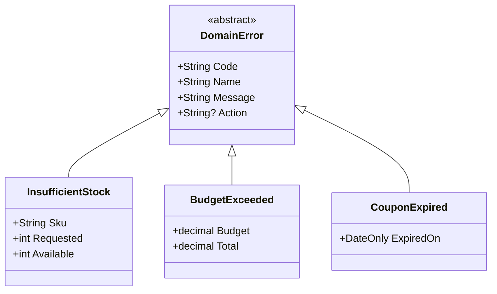

# 第07章：ドメインエラー入門（業務ルール違反）💗

この章は「ユーザーに優しい失敗」をちゃんと設計できるようになるのがゴールだよ😊✨
（例：在庫不足📦、期限切れ⌛、予算超え💸 など）

---

## 1) ドメインエラーってなに？💡💗


**ドメインエラー＝「業務ルール的にダメです🙅‍♀️」の失敗**だよ✨
システムが壊れたわけじゃなくて、**仕様どおりに止めてあげる失敗**。

たとえば👇

* 在庫が足りない📦❌
* 期限が切れている⌛❌
* 予算を超える💸❌
* その状態では操作できない（発送済みはキャンセル不可🚚❌）
* 1人1回まで、などの制限に引っかかる🧍‍♀️🔒

ここがポイント👇
**「想定内の失敗」なので、怖がるものじゃなくて“設計しておくもの”**だよ😊🎀

> ちなみに例外は、.NETのガイドでも「例外処理のベストプラクティス」を示していて、基本は“本当に例外的な状況”に使う設計が推奨されるよ🧯（読み物として一度目を通すと良い） ([Microsoft Learn][1])

---

## 2) ドメインエラーの「いい設計」って？🫶✨


ドメインエラーは、**ユーザーが次の行動を決められる情報**を持ってるのが理想だよ😊🌸

### ✅ いいドメインエラーの条件（チェックリスト）✅✅

* **何がダメか**が分かる（理由）🧠
* **どうすれば良いか**が分かる（次のアクション）🪜
* **内部事情を漏らさない**（DBとか例外名とか出さない🙅‍♀️）🕵️‍♀️❌
* **コード（識別子）が固定**（ログ・API・テストで追える）🏷️🔎
* **表示文言はやさしい日本語**（責めない・短い・具体的）💬🎀

---

## 3) 「入力エラー」と「ドメインエラー」ってどう違うの？🤔🧩

迷いやすいから、ざっくりルールでOKだよ😊✨

### 🍀 迷ったらこの2問！


1. **ユーザーが入力を直せば解決する？**
   　→ はい ✅：入力エラー寄り（空欄、形式違い、桁数など）✍️
   　→ いいえ ❌：次へ

2. **業務ルールに引っかかって止めてる？**
   　→ はい ✅：ドメインエラー（在庫、期限、予算、状態遷移など）💗
   　→ いいえ ❌：インフラ/バグの可能性（DB死んだ、通信失敗、想定外状態）🌩️⚡

※このロードマップでは最終的に **3分類（ドメイン/インフラ/バグ）** に戻ってこれるのが強みだよ🧭✨

---

## 4) ドメインエラーの「型」を先に決めよう🏷️🧷


この章では、後でResult型に載せる前提で
**まず “ドメインエラーの形（データ構造）” を揃える**よ😊✨

### 🧾 最小テンプレ（おすすめ）

* `Code`：機械的な識別子（例：`PUR-001`）🏷️
* `Name`：開発者向けの名前（例：`Purchase.BudgetExceeded`）👩‍💻
* `Message`：画面に出す短い文（例：「予算を超えちゃうよ🥺」）💬
* `Params`：具体情報（例：requested/available）🔢
* `Action`：次に何をしてほしい？（例：「数量を減らしてね」）🪜

---

## 5) 命名ルール（おすすめの型）🏷️✨


### ✅ 名前（開発者向け）

**`<文脈>.<理由>`** がすごく読みやすいよ😊

例👇

* `Inventory.InsufficientStock` 📦
* `Purchase.BudgetExceeded` 💸
* `Coupon.Expired` ⌛
* `Order.CannotCancelAfterShipped` 🚚

### ✅ コード（識別子）

**短く・固定・増やせる**のが大事✨
例👇

* `INV-001`（在庫系）📦
* `PUR-001`（購入系）🛍️
* `CPN-001`（クーポン系）🎟️

> .NET 10 は 2025/11/11 に公開されたLTSで、2026/1/13時点でもパッチが出ているよ（開発環境の最新前提としては自然な線） ([Microsoft][2])
> Visual Studio 2026 も 2026/1/13 の更新が案内されてるよ🛠️ ([Microsoft Learn][3])
> C# 14 の新機能は Microsoft Learn にまとまってるよ📚 ([Microsoft Learn][4])

---

## 6) まずは“ドメインエラー型”を作る（最小実装）🧷✨





※ここでは Result 型はまだ作らず、**エラーの型だけ先に整える**よ😊
（後の章で Result に載せ替えると、気持ちよく繋がる✨）

```csharp
public abstract record DomainError(
    string Code,
    string Name,
    string Message,
    string? Action = null
);

public sealed record InsufficientStock(
    string Sku,
    int Requested,
    int Available
) : DomainError(
    Code: "INV-001",
    Name: "Inventory.InsufficientStock",
    Message: "在庫が足りないみたい🥺 数量を減らしてね。",
    Action: "数量を減らす / 別の商品を選ぶ"
);

public sealed record BudgetExceeded(
    decimal Budget,
    decimal Total
) : DomainError(
    Code: "PUR-001",
    Name: "Purchase.BudgetExceeded",
    Message: "予算を超えちゃうよ🥺 合計金額を見直してね。",
    Action: "数量を減らす / 予算を増やす"
);

public sealed record CouponExpired(
    DateOnly ExpiredOn
) : DomainError(
    Code: "CPN-001",
    Name: "Coupon.Expired",
    Message: "このクーポン、期限が切れてるみたい🥲",
    Action: "別のクーポンを使う"
);
```

### 使う側の超シンプル例（この章の範囲）✨


「成功なら `null`、失敗なら `DomainError` を返す」でも十分練習になるよ😊

```csharp
public static DomainError? ValidatePurchase(
    int requested,
    int available,
    decimal budget,
    decimal total,
    DateOnly? couponExpiredOn,
    DateOnly today
)
{
    if (requested > available)
        return new InsufficientStock("OSH-001", requested, available);

    if (total > budget)
        return new BudgetExceeded(budget, total);

    if (couponExpiredOn is not null && couponExpiredOn < today)
        return new CouponExpired(couponExpiredOn.Value);

    return null; // OK ✅
}
```

---

## 7) ミニ演習：ドメインエラーを10個作って命名しよう🏷️💗（超大事！）

題材：推し活グッズ購入管理🛍️💖（在庫・予算・購入）

### ✅ お題（10個）

下の「状況」を **ドメインエラーとして**
`Code / Name / Message / Action` を埋めてみてね😊✨

1. 在庫が足りない📦
2. 購入上限（1人3個まで）を超えた🔒
3. 予約受付期間外📅
4. クーポン期限切れ⌛
5. クーポン対象外商品🎟️❌
6. 予算超え💸
7. 発送済みなのでキャンセル不可🚚
8. 支払い方法がその商品に使えない💳❌
9. 年齢制限により購入不可🔞
10. 同じ注文を二重に送ってそう（重複購入防止）🧾🧾

### ✨ 例（2つだけ回答例）

```text
INV-001 / Inventory.InsufficientStock
Message: 在庫が足りないみたい🥺 数量を減らしてね。
Action : 数量を減らす / 入荷通知を待つ

ORD-003 / Order.CannotCancelAfterShipped
Message: もう発送手配が進んでるみたい🥲 キャンセルできないよ。
Action : 受取後に返品手続きを案内する
```

---

## 8) AI活用（命名＆文言づくりがめちゃ強い🤖✨）


### 🧠 命名案を10個出させるプロンプト例

```text
「在庫不足」をドメインエラーとして扱います。
開発者向けName候補を10個、短く一貫した命名で提案して。
形式は <Context>.<Reason> で、Contextは Inventory / Purchase / Order のいずれかで。
```

### 💬 “やさしい日本語”に直させるプロンプト例

```text
このエラー文言を、責めない・短い・具体的に直して。
ユーザーが次に何をすればいいかも1行で添えて。

文言：在庫不足です。処理を中断しました。
```

### ✅ 抜け漏れチェック役にするプロンプト例

```text
推し活グッズ購入のドメインエラーを10個作りました。
「よくある業務ルール違反」で漏れてそうなものがあれば指摘して。
インフラエラー（通信/DB）やバグ系が混ざってたらそれも教えて。
```

---

## 9) まとめ（この章のコア）💗✨

* ドメインエラーは「業務ルール的にダメ🙅‍♀️」の **想定内の失敗**😊
* **コード＋名前＋やさしい文言＋次アクション** を揃えると強い🏷️💬🪜
* ここで作ったドメインエラーが、後で **Result型🎁** と **API設計🧾** と **ログ🔎** に全部つながるよ✨

---

次の章（第8章）では、**インフラエラー（DB/ネット/外部API）🌩️** をやるよ😊
「リトライしていい？だめ？🔁🙅‍♀️」の判断ができるようになろうね✨

[1]: https://learn.microsoft.com/en-us/dotnet/standard/exceptions/best-practices-for-exceptions?utm_source=chatgpt.com "Best practices for exceptions - .NET"
[2]: https://dotnet.microsoft.com/en-us/platform/support/policy/dotnet-core?utm_source=chatgpt.com "NET and .NET Core official support policy"
[3]: https://learn.microsoft.com/en-us/visualstudio/releases/2026/release-notes?utm_source=chatgpt.com "Visual Studio 2026 Release Notes"
[4]: https://learn.microsoft.com/en-us/dotnet/csharp/whats-new/csharp-14?utm_source=chatgpt.com "What's new in C# 14"
