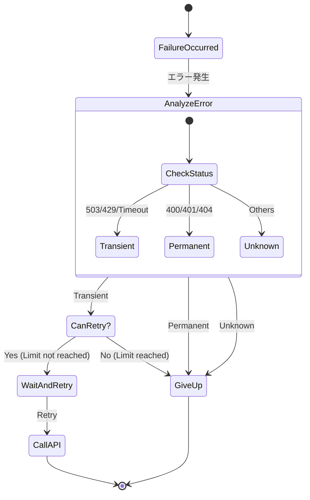

# 第08章：インフラエラー入門（DB/ネット/外部API）🌩️

この章は「本番運用で起きがちな失敗」を、ビビらず整理できるようになる回だよ😊✨
キーワードは **Transient（一時的）** と **Permanent（恒久的）** ！🔁🚫

---

## 8.1 インフラエラーってなに？🏗️🌐

**インフラエラー**は、ざっくり言うとこう👇

* **自分の業務ルール（ドメイン）** じゃなくて
* **外の世界（DB / ネット / 外部API / ファイル / OS）** で起きる失敗

例：

* DB接続できない🗄️💥
* 外部APIが 503 返してくる🌧️
* DNSが引けない📡
* タイムアウトした⌛

ポイントはね👇
**「ユーザーが悪い」でも「仕様違反」でもないのに、起きる」**ってこと😇
だから、設計として“起きても大丈夫”にしていくよ💪✨

---

## 8.2 2種類に分けるのが最強：Transient / Permanent 🔁🚫


### ✅ Transient（一時的）＝“時間が解決するかも”

* 一瞬ネットが不安定📶
* 相手が混んでる（429 / 503）🚦
* DBが一時的に忙しい🗄️💦

👉 基本方針：**条件つきでリトライ検討**🔁✨

### 🚫 Permanent（恒久的）＝“待っても直らない”

* APIキー間違い（401/403）🔑❌
* URLが間違い（404）🗺️❌
* リクエストが壊れてる（400）📦💥

👉 基本方針：**リトライしない**（直すべき）🛑

> この「回復性（resilience）」の考え方は .NET の公式ドキュメントでも整理されていて、`Microsoft.Extensions.Resilience` / `Microsoft.Extensions.Http.Resilience` が Polly ベースで提供されてるよ📦✨（古い `Microsoft.Extensions.Http.Polly` は非推奨だよ〜） ([Microsoft Learn][1])

---

## 8.3 まず覚える“判断の軸”3つ📌🧠

インフラ失敗を見たら、この3つだけ先に考えると迷子になりにくいよ😊

### 軸A：相手が「忙しい/落ちてる」？🌀

* 429 / 503 / 504
* タイムアウト
* 接続拒否・一時的な通信エラー

→ **Transient寄り**🔁

### 軸B：「認証/契約/入力」ミス？🧾

* 401/403（権限）
* 400（形式）
* APIキー無効

→ **Permanent寄り**🚫

### 軸C：「操作の性質」はリトライ安全？⚠️

* **GET（参照）**：比較的リトライしやすい😊
* **POST（購入・送金）**：雑にリトライすると二重処理の危険😱
  → “冪等性（idempotency）”がないなら慎重に！🛡️

（冪等性は後半章で丁寧にやるよ👍）

---

## 8.4 代表例：HTTP（外部API）でよくあるパターン🌐📮

### ① 429 Too Many Requests 🚦

* レート制限で弾かれた状態
* **Retry-After** ヘッダーがあれば、それに従うのが基本👀

→ **Transient**（待てば通る）🔁

### ② 503 Service Unavailable 🌧️ / 504 Gateway Timeout ⏳

* サービスが落ち気味 or 中継が死んでる

→ **Transient寄り**🔁（回数制限つきで）

### ③ 401/403 🔑❌

* 認証・権限ミス

→ **Permanent**🚫（設定直す）

---

## 8.5 代表例：DBでよくあるパターン🗄️⚡

* **接続失敗**（一瞬ネット切れ）📶
* **タイムアウト**（DB混雑）⌛
* **デッドロック**（競合）🔒💥

→ 多くは **Transient寄り**だけど、
「クエリが重すぎる」みたいな設計問題も混ざるよ😵‍💫
だから **“リトライしても直らないなら改善対象”** って覚え方が安全👍✨

---

## 8.6 リトライ判断表（これを作るのが本章の成果物）📋✨




まずはこのテンプレを埋めるだけでOK😊
（ExcelでもMarkdownでもどっちでも🙆‍♀️）

| 失敗の例     | Transient? | リトライOK? | 待ち方           | ユーザー表示                | ログに残す                |
| -------- | ---------: | ------: | ------------- | --------------------- | -------------------- |
| HTTP 429 |          ✅ |       ✅ | Retry-After優先 | 「混み合ってます。少し待って再試行してね」 | status / retry-after |
| HTTP 503 |          ✅ |       ✅ | 指数バックオフ       | 「一時的に利用できません」         | status / endpoint    |
| HTTP 401 |         🚫 |      🚫 | —             | 「設定に問題があります」          | status / auth系       |
| DNS失敗    |        ✅寄り |       ✅ | 短めで数回         | 「通信に失敗しました」           | host / exception     |
| 入力が400   |         🚫 |      🚫 | —             | 「入力が不正です」             | request要約            |

**指数バックオフ**ってのは「1回目はちょい待ち、2回目はもっと待ち…」って伸ばすやつだよ⌛➡️⌛⌛➡️⌛⌛⌛
（＋ランダム揺れ“ジッター”を足すと、みんな同時再試行しにくくて優秀✨）

---

## 8.7 ちょい実装：まずは“分類だけ”できるようになろう🧩🪄

この章では **「例外を握りつぶす」んじゃなくて**
**「分類して、上に判断材料を渡す」** ができれば勝ち🏆✨

```csharp
public enum InfraFailureKind
{
    Timeout,
    Network,
    RateLimited,
    ServiceUnavailable,
    Unauthorized,
    NotFound,
    BadRequest,
    Unknown,
}

public sealed record InfraFailure(
    InfraFailureKind Kind,
    string Message,
    bool Retryable,
    TimeSpan? SuggestedWait = null
);
```

### HTTPレスポンスから分類する例（超ミニ）🌐

```csharp
using System.Net;

public static InfraFailure FromHttp(HttpStatusCode statusCode, TimeSpan? retryAfter = null)
{
    return statusCode switch
    {
        HttpStatusCode.TooManyRequests =>
            new(InfraFailureKind.RateLimited, "Rate limited (429).", Retryable: true, SuggestedWait: retryAfter),

        HttpStatusCode.ServiceUnavailable =>
            new(InfraFailureKind.ServiceUnavailable, "Service unavailable (503).", Retryable: true),

        HttpStatusCode.GatewayTimeout =>
            new(InfraFailureKind.Timeout, "Gateway timeout (504).", Retryable: true),

        HttpStatusCode.Unauthorized or HttpStatusCode.Forbidden =>
            new(InfraFailureKind.Unauthorized, "Unauthorized/Forbidden.", Retryable: false),

        HttpStatusCode.NotFound =>
            new(InfraFailureKind.NotFound, "Not found (404).", Retryable: false),

        HttpStatusCode.BadRequest =>
            new(InfraFailureKind.BadRequest, "Bad request (400).", Retryable: false),

        _ =>
            new(InfraFailureKind.Unknown, $"Unexpected status: {(int)statusCode}", Retryable: false),
    };
}
```

> 「実際にリトライを安全に組む」段階になると、.NET では `Microsoft.Extensions.Http.Resilience` の **`AddStandardResilienceHandler`** みたいな“標準の回復性ハンドラ”が使えるよ（複数戦略が良い感じに組み合わさる） ([Microsoft Learn][2])

（今は“分類”が主役だから、ここでは紹介だけね😊）

---

## 8.8 ミニ演習：リトライしていい？だめ？🔁🚫（表を埋めよう✍️）

次のケースを **Transient/Permanent** と **リトライOK/NG** に分けて、理由も一言で👇✨

1. 外部APIが **429** を返した（Retry-After: 10秒）🚦
2. 外部APIが **401** を返した🔑❌
3. 外部APIが **503** を返した🌧️
4. ネットワークが一瞬切れて `HttpRequestException` 📡
5. DBがタイムアウト⌛
6. 送金APIの **POST** がタイムアウト（結果不明）💸😨

### 目安の回答（超要点）✅

* 1. Transient / OK（10秒待つ）
* 2. Permanent / NG（設定ミス）
* 3. Transient寄り / OK（回数制限つき）
* 4. Transient寄り / OK（短めで数回）
* 5. Transient寄り / OK（ただし改善も疑う）
* 6. **超注意**：操作が危険（重複の可能性）→ “安全策がある時だけ”😱🛡️

---

## 8.9 AI活用（Copilot / Codex）🤖💡：この章で強い使い方

### ✅ 使うと強い（案出し・漏れチェック）

* 「HTTPステータスコード 429/503/504 は一般的にどう扱う？」
* 「Transientになりやすい失敗パターンを列挙して」
* 「このエラー一覧、分類漏れない？」✅

### ⚠️ 気をつける（最終判断は自分）

* “安全にリトライできるか” は **操作の意味（GET/POST）** で変わるから、ここは自分の責任で決めよ〜🙂🛡️

コピペ用プロンプト例👇✨

* 「次の失敗を Transient / Permanent に分類して、推奨アクション（リトライ有無・待ち方）も付けて：…」

---

## まとめ🎀✨

* インフラエラーは **外の世界の失敗**🌐
* まず **Transient / Permanent** に分けると強い🔁🚫
* “リトライしていいか”は **ステータス**＋**操作の意味（GET/POST）** で決める🧠
* この章の成果物は **リトライ判断表**📋✨

次章（第9章）は、逆に「ここに来たらバグ！」っていう **不変条件**と **Fail Fast** をやって、設計の芯を作るよ⚡🧱

[1]: https://learn.microsoft.com/ja-jp/dotnet/core/resilience/ "回復性のあるアプリ開発の概要 - .NET | Microsoft Learn"
[2]: https://learn.microsoft.com/en-us/dotnet/core/resilience/http-resilience "Build resilient HTTP apps: Key development patterns - .NET | Microsoft Learn"
